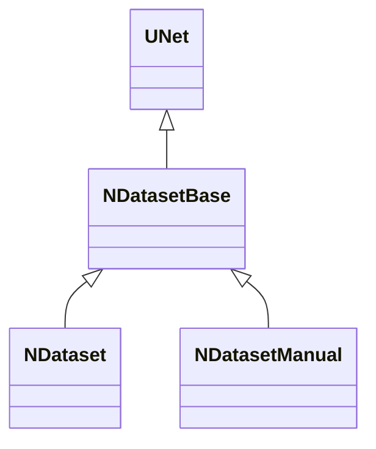

# NDatasetBase — общая база датасетов

## RU

### Назначение

**Класс**: `NDatasetBase` — абстрактная база для компонентов датасета спайков.  
**Регистрация**: **не регистрируется** в Storage (только листья `NDataset`, `NDatasetManual`).

Пайплайн: `MatrixData` (ISI-пачки) → размеры / расписание → дочерние `NPulseGeneratorTransit` → цикл пачка → `Delay` → повтор.

### Иерархия

### Контракт сборки

1. **`PrepareDataset()`** — заполнить или проверить `MatrixData` / `MatrixClasses`.
2. **`ApplyFromMatrices()`** — `NumSamples`/`NumFeatures`/`NumClasses` из широкой `MatrixData` и `MaxSpikesPerFeature`.
3. **`SyncGenerators()`** — `Generator1..N` по `NumFeatures`.

### Данные и время

- `MatrixData`: `NumSamples × (NumFeatures × MaxSpikesPerFeature)`, `col = f*M + s`.
- Значение `≥ 0` — ISI (сек); `s=0` от единого старта сэмпла; далее между спайками; `-1` — пропуск.
- Единый `SampleStartTime` для всех фич; one-shot на генераторах.
- После пачки пауза **`Delay`**, затем повтор **того же `Iteration`**.

### Свойства

**Parameters:** `PulseGeneratorClassName`, `Delay`, `Iteration`, `MaxSpikesPerFeature`.

**States:** `MatrixData`, `MatrixClasses`, `NumFeatures`, `NumSamples`, `NumClasses`, `StateGeneration`, `TimeGeneration`, `OperatingTime`, `ResetDelay`.

### См. также

- [`NDataset`](NDataset.md)
- [`NDatasetManual`](NDatasetManual.md)

---

## EN

**Class**: `NDatasetBase` — shared spike-dataset base. Wide `MatrixData` ISI trains; burst → `Delay` → repeat same `Iteration`.
