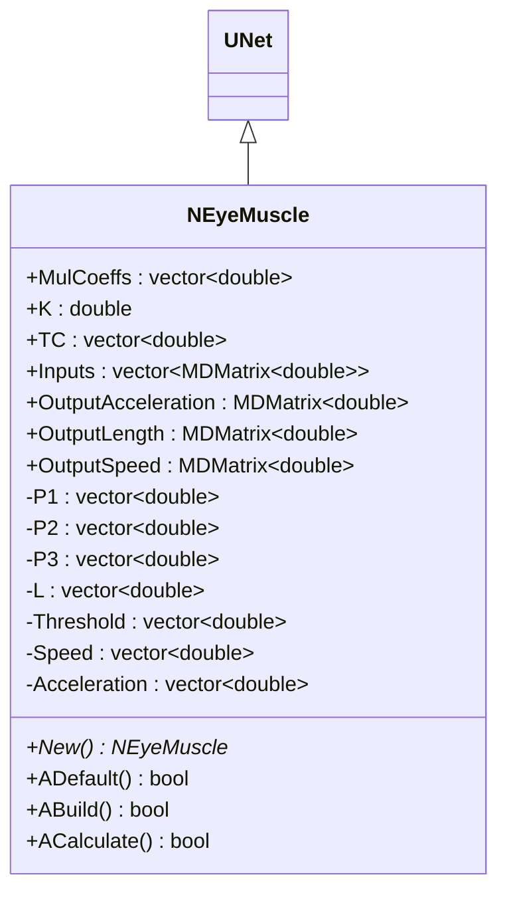
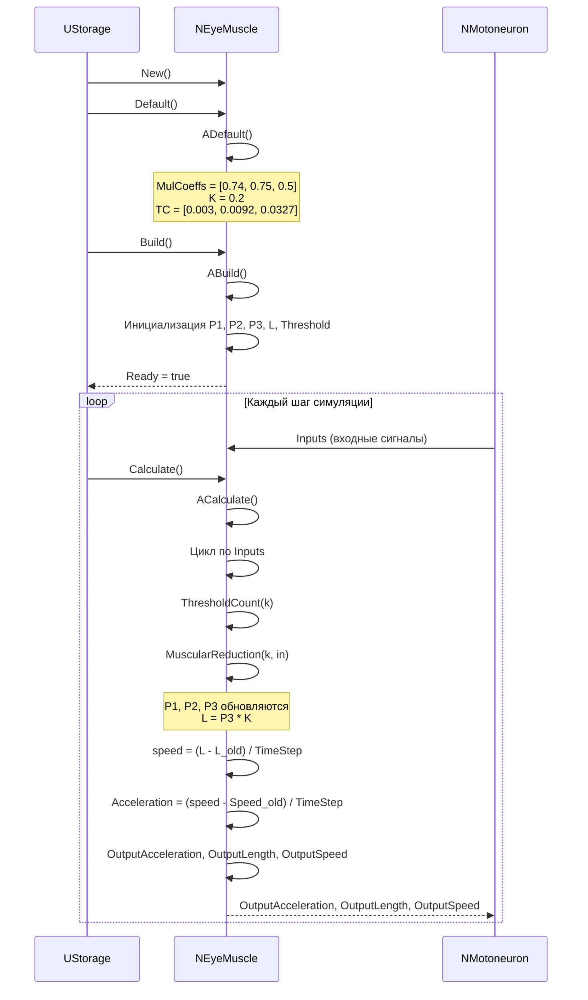
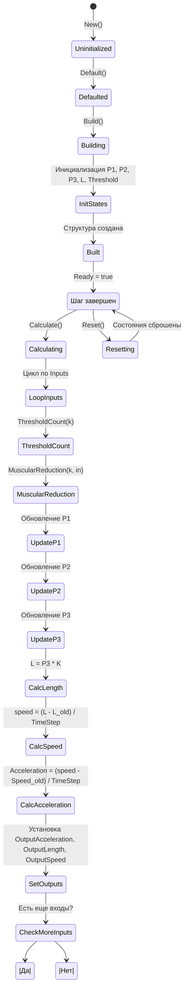
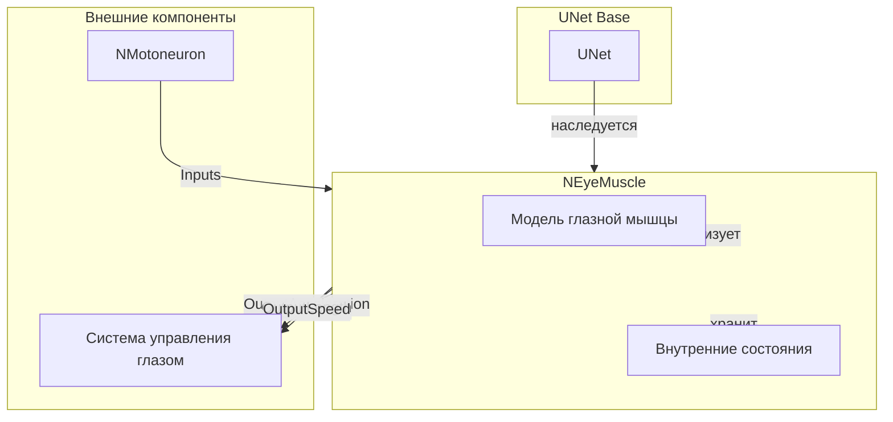
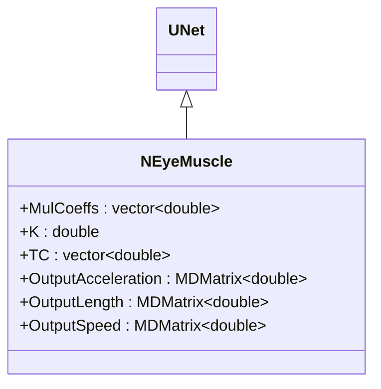
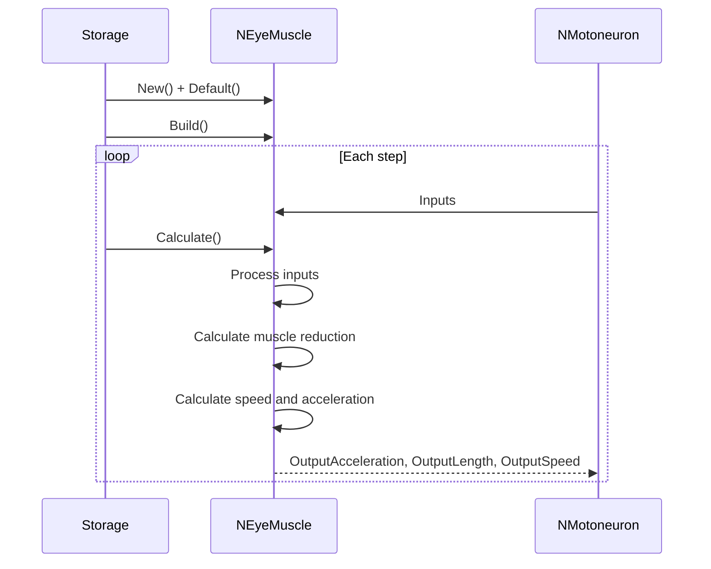
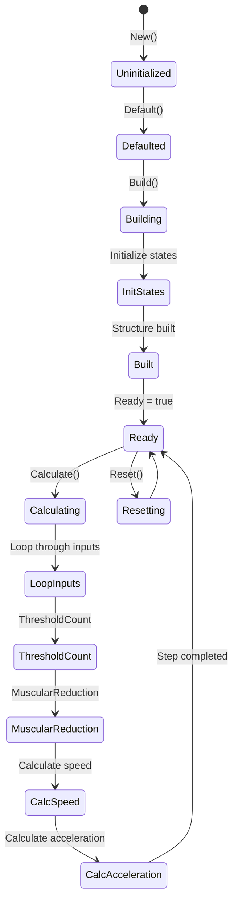
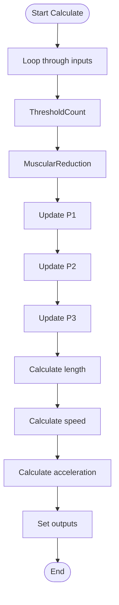
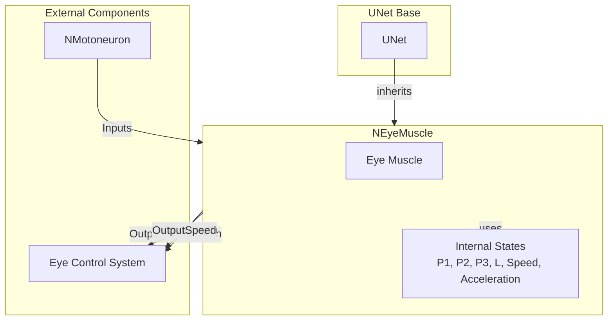

# NEyeMuscle — глазная мышца

## RU

### Назначение

**Класс**: `NEyeMuscle` — компонент для моделирования глазной мышцы.  
**Регистрация**: `NPulseLibrary.cpp` → `UploadClass("NEyeMuscle", ...)`.  
**Storage-инстансы**: `ClassName = "NEyeMuscle"` в `Bin/Configs/*/Model_*.xml`.

`NEyeMuscle` реализует модель глазной мышцы, которая обрабатывает входные сигналы и генерирует выходные сигналы для управления движением глаза. Компонент выдает три выходных сигнала: ускорение (`OutputAcceleration`), длина (`OutputLength`), и скорость (`OutputSpeed`).

**Использование:** Моделирование глазных мышц, управление движением глаза

### UML-диаграмма классов



**Иерархия наследования:**
- `UNet` — базовая сеть Rdk Framework
- `NEyeMuscle` — глазная мышца

### UML-диаграмма последовательности



**Жизненный цикл:**
1. **Инициализация**: Установка параметров по умолчанию
2. **Сброс**: Инициализация внутренних состояний (`P1`, `P2`, `P3`, `L`, `Speed`, `Acceleration`, `Threshold`)
3. **Расчет**: Обработка входных сигналов, обновление состояний, вычисление выходных сигналов

### UML-диаграмма состояний



**Состояния:**
- **Uninitialized** — создан, но не инициализирован
- **Defaulted** — параметры установлены по умолчанию
- **Building** — выполняется сборка
- **InitStates** — инициализация внутренних состояний
- **Built** — структура мышцы построена
- **Ready** — готов к выполнению расчетов
- **Calculating** — выполняется расчет мышцы
- **LoopInputs** — цикл по входным сигналам
- **ThresholdCount** — обновление порога
- **MuscularReduction** — расчет мышечного сокращения
- **UpdateP1** — обновление P1
- **UpdateP2** — обновление P2
- **UpdateP3** — обновление P3
- **CalcLength** — вычисление длины
- **CalcSpeed** — вычисление скорости
- **CalcAcceleration** — вычисление ускорения
- **SetOutputs** — установка выходных сигналов
- **CheckMoreInputs** — проверка наличия еще входов
- **Resetting** — выполняется сброс состояний

### UML-диаграмма активности

```mermaid
flowchart TD
    Start([Start Calculate]) --> ResizeOutputs[Resize OutputAcceleration, OutputLength, OutputSpeed]
    ResizeOutputs --> LoopInputs[Цикл по Inputs i = 0..size-1]
    LoopInputs --> LoopCols[Цикл по столбцам j = 0..cols-1]
    LoopCols --> GetInput[in = Inputs[i](0,j)]
    LoopCols --> ThresholdCount[ThresholdCount(k)]
    GetInput --> ThresholdCount
    ThresholdCount --> ApplyThreshold[in *= Threshold[k]]
    ApplyThreshold --> MuscularReduction[MuscularReduction(k, in)]
    MuscularReduction --> UpdateP1[P1[k] = P1[k] + (in - P3[k]*MulCoeffs[2] - P1[k]*MulCoeffs[0])/(TC[0]*TimeStep)]
    UpdateP1 --> UpdateP2[P2[k] = P2[k] + (P1[k] - P2[k]*MulCoeffs[1])/(TC[1]*TimeStep)]
    UpdateP2 --> UpdateP3[P3[k] = P3[k] + P2[k]/(TC[2]*TimeStep)]
    UpdateP3 --> CalcLength[L[k] = P3[k] * K]
    CalcLength --> CalcSpeed[speed = (L[k] - L_old[k]) / TimeStep]
    CalcSpeed --> CalcAcceleration[Acceleration[k] = (speed - Speed[k]) / TimeStep]
    CalcAcceleration --> UpdateSpeed[Speed[k] = speed]
    UpdateSpeed --> UpdateLength[L[k] = leng]
    UpdateLength --> SetOutputs[OutputAcceleration(0,k) = Acceleration[k]<br/>OutputLength(0,k) = L[k]<br/>OutputSpeed(0,k) = Speed[k]]
    SetOutputs --> IncrementK[k++]
    IncrementK --> CheckMoreCols{Еще столбцы?}
    CheckMoreCols -->|Да| LoopCols
    CheckMoreCols -->|Нет| CheckMoreInputs{Еще входы?}
    CheckMoreInputs -->|Да| LoopInputs
    CheckMoreInputs -->|Нет| End([End])
```

**Алгоритм расчета:**
1. Изменение размеров выходных матриц
2. Цикл по всем входным сигналам
3. Для каждого входа:
   - Обновление порога (`ThresholdCount`)
   - Применение порога к входному сигналу
   - Расчет мышечного сокращения (`MuscularReduction`): обновление P1, P2, P3
   - Вычисление длины: `L = P3 * K`
   - Вычисление скорости: `speed = (L - L_old) / TimeStep`
   - Вычисление ускорения: `Acceleration = (speed - Speed_old) / TimeStep`
   - Установка выходных сигналов

### UML-диаграмма компонентов



**Зависимости:**
- **Базовый класс**: `UNet`
- **Внутренние компоненты**: модель глазной мышцы, внутренние состояния (`P1`, `P2`, `P3`, `L`, `Speed`, `Acceleration`, `Threshold`)
- **Внешние компоненты**: мотонейрон (источник входных сигналов), система управления глазом (получатель выходных сигналов)

### Свойства

#### Параметры (ptPubParameter)

- **`MulCoeffs`** (vector<double>) — коэффициенты умножения (3 элемента). Значение по умолчанию: [0.74, 0.75, 0.5]

- **`K`** (double) — параметр модели. Значение по умолчанию: 0.2

- **`TC`** (vector<double>) — временные константы (3 элемента). Значение по умолчанию: [0.003, 0.0092, 0.0327]

#### Входные свойства (ptInput | ptPubState)

- **`Inputs`** (vector<MDMatrix<double>>) — вектор входных сигналов. Значение по умолчанию: зависит от реализации

#### Выходные свойства (ptOutput | ptPubState)

- **`OutputAcceleration`** (MDMatrix<double>) — выходной сигнал ускорения. Значение по умолчанию: 0.0

- **`OutputLength`** (MDMatrix<double>) — выходной сигнал длины. Значение по умолчанию: 0.0

- **`OutputSpeed`** (MDMatrix<double>) — выходной сигнал скорости. Значение по умолчанию: 0.0

### Методы

- **`ACalculate()`** → `bool` — выполняет расчет глазной мышцы:
  1. Обрабатывает входные сигналы
  2. Обновляет внутренние состояния (`P1`, `P2`, `P3`, `L`, `Speed`, `Acceleration`)
  3. Вычисляет выходные сигналы (ускорение, длина, скорость)

### Использование в конфигурациях

`NEyeMuscle` используется в экспериментах с глазными мышцами:

- **Управление глазом**: `Bin/Configs/!OldConfigs/OldExperiments/EyeRetina/`

**Типичные значения параметров:**
- **MulCoeffs**: [0.74, 0.75, 0.5] (коэффициенты умножения)
- **K**: 0.2 (параметр модели)
- **TC**: [0.003, 0.0092, 0.0327] (временные константы в секундах)

**Выходные сигналы:**
- **OutputAcceleration**: ускорение движения глаза
- **OutputLength**: длина мышцы
- **OutputSpeed**: скорость движения глаза

### См. также

- [`NMuscle`](NMuscle.md) — мышца
- [`NMotoneuron`](NMotoneuron.md) — мотонейрон (источник входных сигналов)
- [Architecture.md](../Architecture.md) — архитектура библиотеки

---

## EN

### Purpose

**Class**: `NEyeMuscle` — component for modeling eye muscle.  
**Registration**: `NPulseLibrary.cpp` → `UploadClass("NEyeMuscle", ...)`.  
**Instances**: `ClassName = "NEyeMuscle"` in `Bin/Configs/*/Model_*.xml`.

`NEyeMuscle` implements eye muscle model that processes input signals and generates output signals for eye movement control. Component outputs three signals: acceleration (`OutputAcceleration`), length (`OutputLength`), and speed (`OutputSpeed`).

**Usage:** Eye muscle modeling, eye movement control

### UML Class Diagram



### UML Sequence Diagram



### UML State Diagram



### UML Activity Diagram



### UML Component Diagram



### Properties

- `MulCoeffs` — вектор коэффициентов умножения (3 элемента: [0.74, 0.75, 0.5])
- `K` — коэффициент для расчета длины (0.2)
- `TC` — вектор временных констант (3 элемента: [0.003, 0.0092, 0.0327])
- `Inputs` — вектор входных сигналов
- `OutputAcceleration` — выходной сигнал ускорения
- `OutputLength` — выходной сигнал длины
- `OutputSpeed` — выходной сигнал скорости

### Methods

- `ADefault()` — установка параметров по умолчанию
- `ABuild()` — сборка структуры глазной мышцы (инициализация состояний)
- `ACalculate()` — выполнение шага расчета глазной мышцы
- `ThresholdCount(k)` — подсчет порога для входа k
- `MuscularReduction(k, in)` — функция мышечного сокращения для входа k

### Usage in configurations

`NEyeMuscle` is used for eye muscle modeling:

- **Eye muscle modeling**: `Bin/Configs/*/Model_*.xml` (where eye muscle modeling is required)
- **Eye movement control**: experiments with eye movement control
- **Oculomotor system**: modeling oculomotor system with eye muscles

**Features:**
- Three outputs: provides acceleration, length, and speed outputs
- Eye-specific parameters: optimized for eye muscle dynamics
- Flexible inputs: supports multiple input signals
- Efficient computation: optimized for real-time eye muscle simulation

**Typical parameter values:**
- **MulCoeffs**: [0.74, 0.75, 0.5] (multiplication coefficients)
- **K**: 0.2 (length calculation coefficient)
- **TC**: [0.003, 0.0092, 0.0327] (time constants in seconds)

### See Also

- [`NMuscle`](NMuscle.md) — muscle
- [`NMotoneuron`](NMotoneuron.md) — motor neuron (input source)
- [Architecture.md](../Architecture.md) — library architecture
