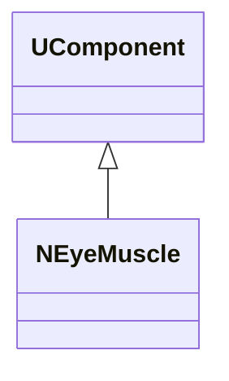
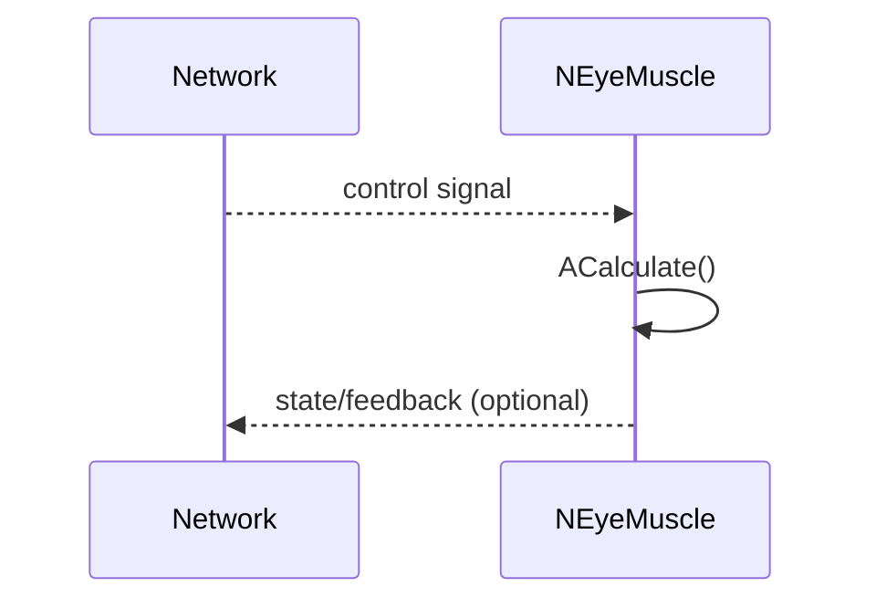
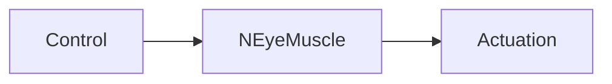
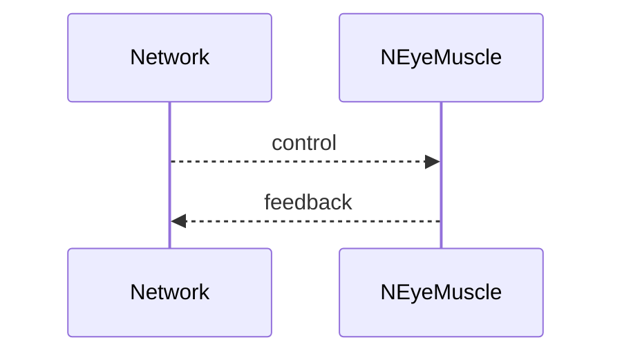

## NEyeMuscle — глазная мышца (Nmsdk-PulseLib)

**Класс**: `NEyeMuscle` — эффекторная компонента для управления «мышцей глаза».  
**Регистрация**: `NPulseLibrary.cpp` → `UploadClass("NEyeMuscle", ...)`.  
**Storage**: `ClassName = "NEyeMuscle"`.

### Lifecycle
- **ADefault**: параметры управления.
- **ABuild**: подключение входов активности.
- **AReset**: сброс состояния.
- **ACalculate**: преобразование активности в управляющее воздействие.

### I/O
- Вход: активность/управляющий сигнал.
- Выход: воздействие на «мышцу» (поворот/позиция).



Пояснение: диаграмма классов показывает место компонента в иерархии и ключевые связи.



Пояснение: диаграмма последовательности показывает типовой сценарий взаимодействия и порядок вызовов.



Пояснение: блок-схема показывает поток данных/сигналов (входы → компонент → выходы).

### Config snippet

```ini
[Component]
ClassName = NEyeMuscle
Name = EyeMuscle1
```

---

## NEyeMuscle — eye muscle effector (EN)

Effector converting control signals into eye-muscle actuation.


Description: this class diagram shows the component position in the type hierarchy and key relations.



Description: this sequence diagram shows a typical runtime interaction and call order.


Description: this flowchart shows the data/signal flow (inputs → component → outputs).
