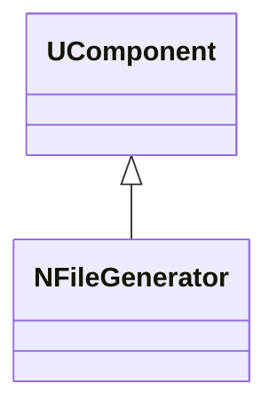
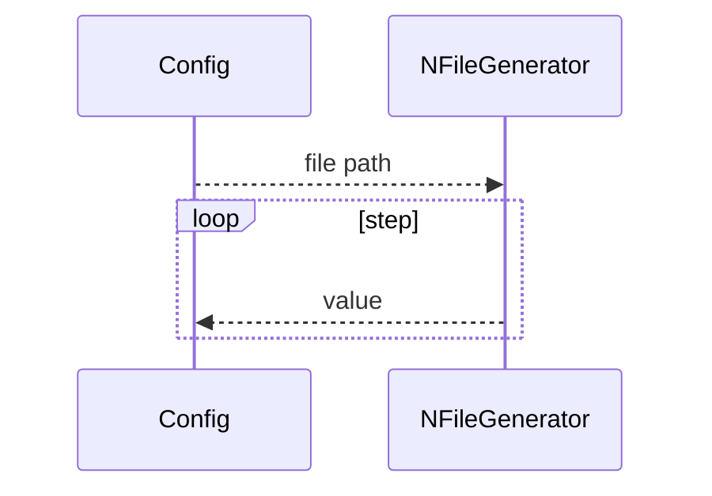
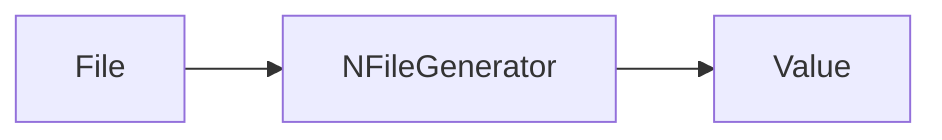
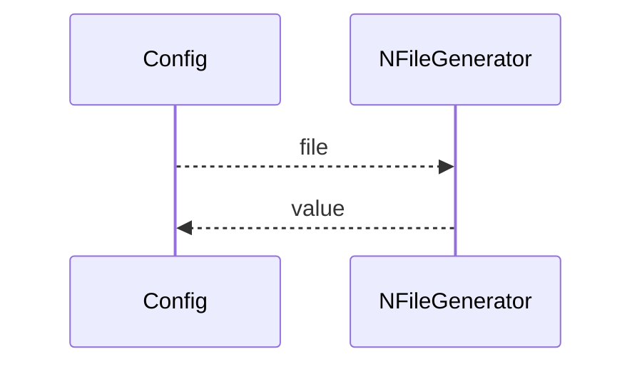

## NFileGenerator — генератор из файла (Nmsdk-PulseLib)

**Класс**: `NFileGenerator` — генерирует сигналы/токи из файлового источника.  
**Регистрация**: `NPulseLibrary.cpp` → `UploadClass("NFileGenerator", ...)`.  
**Storage**: `ClassName = "NFileGenerator"`.

### Lifecycle
- **ADefault**: путь/формат.
- **ABuild**: загрузка/подготовка данных.
- **AReset**: сброс индекса.
- **ACalculate**: выдача следующего значения из файла.

### I/O
- Вход: (опционально) управление индексом.
- Выход: значение/ток/сигнал.



Пояснение: диаграмма классов показывает место компонента в иерархии и ключевые связи.



Пояснение: диаграмма последовательности показывает типовой сценарий взаимодействия и порядок вызовов.



Пояснение: блок-схема показывает поток данных/сигналов (входы → компонент → выходы).

### Config snippet

```ini
[Component]
ClassName = NFileGenerator
Name = FileGen1
```

---

## NFileGenerator — file-based generator (EN)

Outputs values from a file source.


Description: this class diagram shows the component position in the type hierarchy and key relations.



Description: this sequence diagram shows a typical runtime interaction and call order.


Description: this flowchart shows the data/signal flow (inputs → component → outputs).
