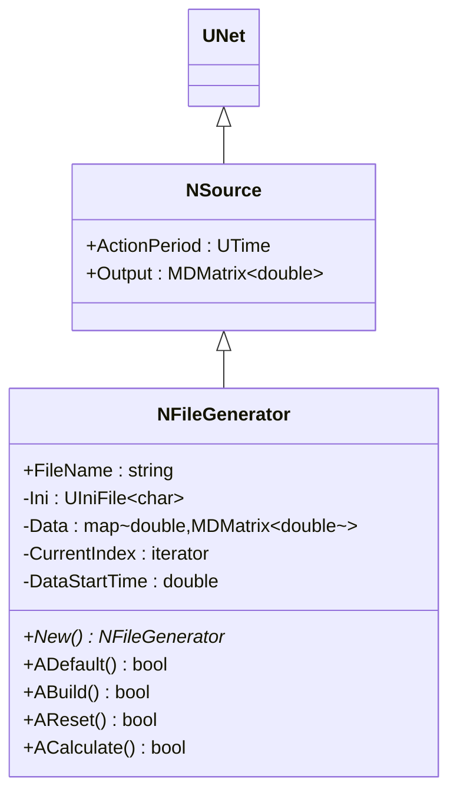
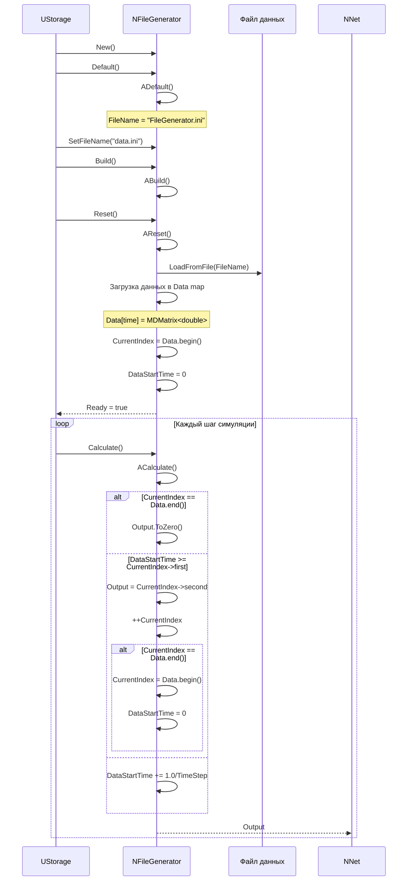
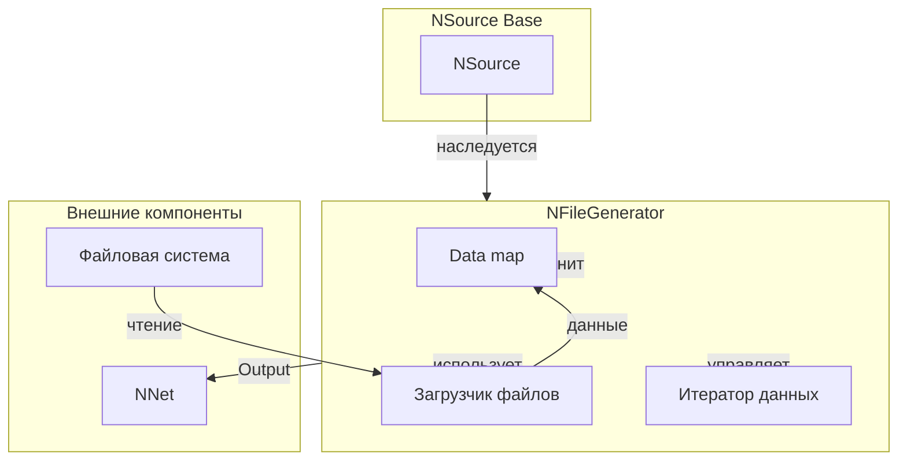
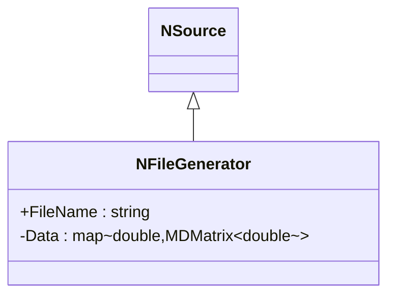
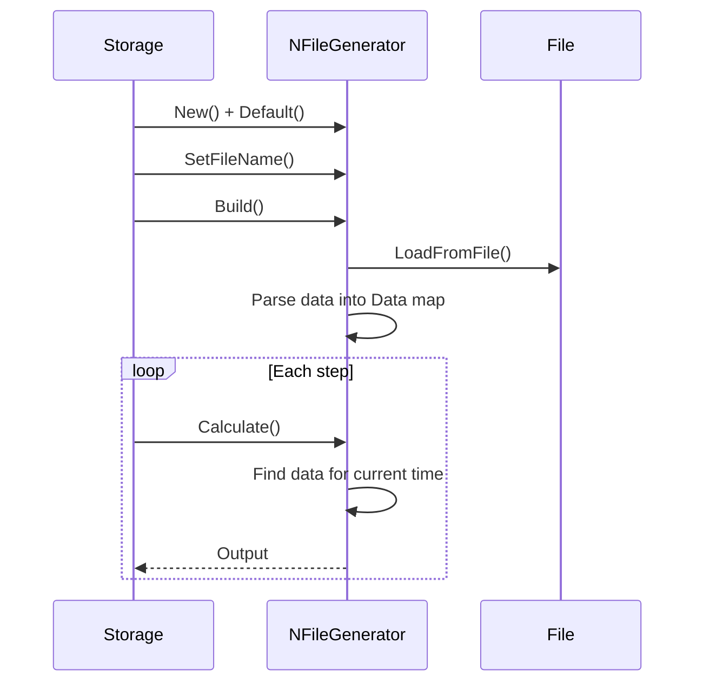
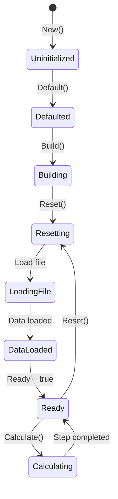
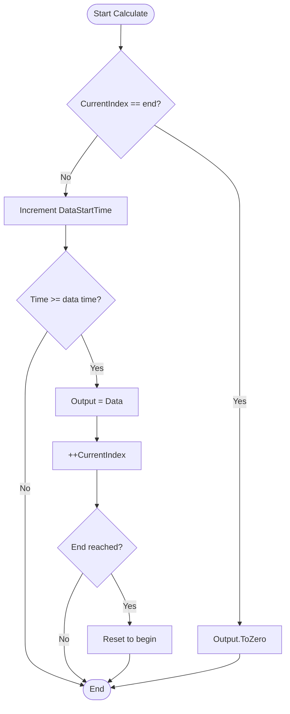
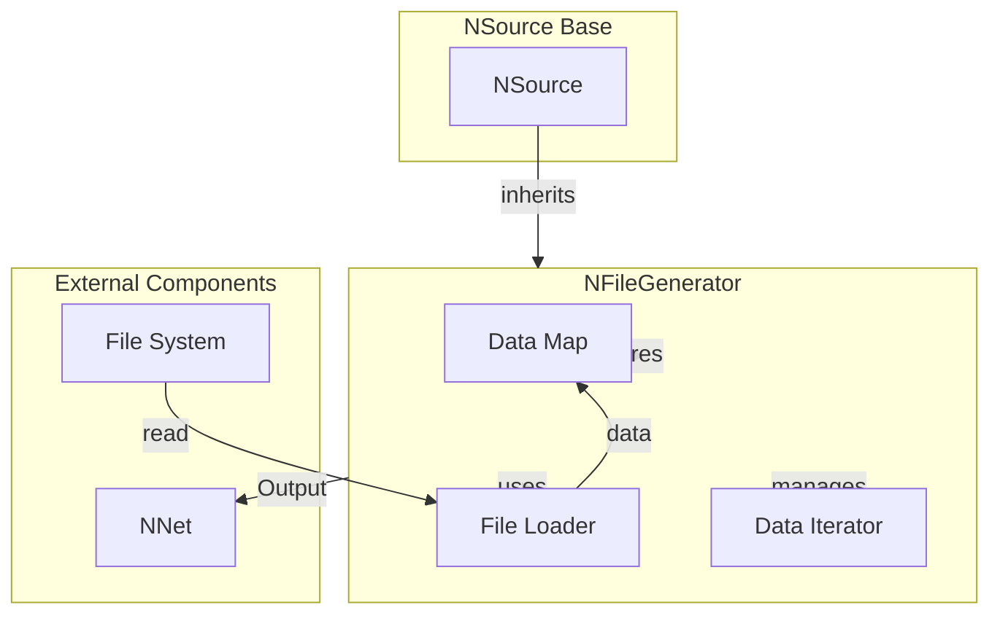

# NFileGenerator — генератор из файла

## RU

### Назначение

**Класс**: `NFileGenerator` — генератор сигналов из файла.  
**Регистрация**: `NPulseLibrary.cpp` → `UploadClass("NFileGenerator", ...)`.  
**Storage-инстансы**: `ClassName = "NFileGenerator"` в `Bin/Configs/*/Model_*.xml`.

`NFileGenerator` реализует генератор сигналов, который читает данные из файла и выдает их как выходной сигнал. Наследуется от `NSource` и использует файл для хранения временных рядов данных. Данные загружаются в структуру `Data` (map<double, MDMatrix<double>>), где ключ — время, значение — данные.

**Использование:** Генерация сигналов из файлов, воспроизведение записанных данных

### UML-диаграмма классов



**Иерархия наследования:**
- `UNet` — базовая сеть Rdk Framework
- `NSource` — базовый источник сигналов
- `NFileGenerator` — генератор из файла

### UML-диаграмма последовательности



**Жизненный цикл:**
1. **Инициализация**: Установка имени файла по умолчанию
2. **Сброс**: Загрузка данных из файла в структуру `Data` (map<double, MDMatrix<double>>)
3. **Расчет**: Поиск данных для текущего времени, выдача выходного сигнала
4. **Циклическое воспроизведение**: При достижении конца данных возврат к началу

### UML-диаграмма состояний

```mermaid
stateDiagram-v2
    [*] --> Uninitialized: New()
    Uninitialized --> Defaulted: Default()
    Note over Defaulted: FileName = "FileGenerator.ini"
    Defaulted --> FileSet: SetFileName()
    FileSet --> Building: Build()
    Building --> Resetting: Reset()
    Resetting --> LoadingFile: Загрузка файла
    LoadingFile --> ParsingData: Парсинг данных
    ParsingData --> DataLoaded: Данные загружены в Data
    DataLoaded --> Ready: Ready = true
    Ready --> Calculating: Calculate()
    Calculating --> CheckIndex{CurrentIndex == end?}
    CheckIndex -->|Да| OutputZero: Output.ToZero()
    CheckIndex -->|Нет| CheckTime{DataStartTime >= time?}
    CheckTime -->|Да| OutputData: Output = Data[time]
    CheckTime -->|Нет| IncrementTime: DataStartTime += step
    OutputData --> CheckEnd{CurrentIndex == end?}
    CheckEnd -->|Да| ResetIndex: CurrentIndex = begin()
    CheckEnd -->|Нет| Ready: Шаг завершен
    OutputZero --> Ready
    IncrementTime --> Ready
    ResetIndex --> Ready
    Ready --> Resetting: Reset()
    Resetting --> LoadingFile
```

**Состояния:**
- **Uninitialized** — создан, но не инициализирован
- **Defaulted** — параметры установлены по умолчанию
- **FileSet** — имя файла установлено
- **Building** — выполняется сборка
- **Resetting** — выполняется сброс
- **LoadingFile** — загрузка файла
- **ParsingData** — парсинг данных из файла
- **DataLoaded** — данные загружены в структуру `Data`
- **Ready** — готов к выполнению расчетов
- **Calculating** — выполняется расчет генератора
- **CheckIndex** — проверка позиции итератора
- **OutputZero** — выходной сигнал обнулен (конец данных)
- **CheckTime** — проверка времени для выдачи данных
- **OutputData** — выдача данных как выходной сигнал
- **IncrementTime** — увеличение счетчика времени
- **CheckEnd** — проверка достижения конца данных
- **ResetIndex** — сброс итератора к началу (циклическое воспроизведение)

### UML-диаграмма активности

```mermaid
flowchart TD
    Start([Start Calculate]) --> CheckIndex{CurrentIndex == Data.end()?}
    CheckIndex -->|Да| SetZero[Output.ToZero]
    CheckIndex -->|Нет| IncrementTime[DataStartTime += 1.0/TimeStep]
    IncrementTime --> CheckTime{DataStartTime >= CurrentIndex->first?}
    CheckTime -->|Да| SetOutput[Output = CurrentIndex->second]
    CheckTime -->|Нет| End([End])
    SetOutput --> IncrementIndex[++CurrentIndex]
    IncrementIndex --> CheckEnd{CurrentIndex == Data.end()?}
    CheckEnd -->|Да| ResetIndex[CurrentIndex = Data.begin<br/>DataStartTime = 0]
    CheckEnd -->|Нет| End
    ResetIndex --> End
    SetZero --> End
```

**Алгоритм расчета:**
1. Проверка позиции итератора: если достигнут конец данных, выходной сигнал обнуляется
2. Увеличение счетчика времени: `DataStartTime += 1.0/TimeStep`
3. Проверка времени: если `DataStartTime >= CurrentIndex->first`, выдается соответствующий выходной сигнал
4. Переход к следующему элементу данных: `++CurrentIndex`
5. Циклическое воспроизведение: при достижении конца данных возврат к началу

### UML-диаграмма компонентов



**Зависимости:**
- **Базовый класс**: `NSource`
- **Внутренние компоненты**: загрузчик файлов (`UIniFile`), структура данных (`Data`), итератор (`CurrentIndex`)
- **Внешние компоненты**: файловая система (источник данных), сеть (получатель выходных сигналов)

### Свойства

#### Параметры (ptPubParameter)

- **`FileName`** (string) — путь к файлу с данными. Файл должен содержать временные ряды данных в формате, поддерживаемом `UIniFile`. Значение по умолчанию: зависит от реализации

#### Внутренние состояния

- **`Data`** (map<double, MDMatrix<double>>) — карта данных, где ключ — время, значение — данные для этого времени

- **`CurrentIndex`** (iterator) — итератор текущей позиции в данных

- **`DataStartTime`** (double) — время начала данных

### Методы

- **`ABuild()`** → `bool` — строит структуру генератора. Загружает данные из файла в структуру `Data`.

- **`ACalculate()`** → `bool` — выполняет расчет генератора на одном шаге:
  1. Определяет текущее время
  2. Находит соответствующие данные в `Data`
  3. Выдает данные как выходной сигнал `Output`

### Примеры использования

#### Пример 1: Создание генератора в коде C++

```cpp
// Создание генератора из файла
auto generator = storage->CreateComponent<NFileGenerator>();
generator->SetName("FileGen");

// Инициализация
generator->Default();

// Настройка параметров
generator->FileName = "data.txt";

// Сборка (загружает данные из файла)
generator->Build();
```

### Использование в конфигурациях

`NFileGenerator` используется в экспериментах с воспроизведением записанных данных:

- **Воспроизведение данных**: `Bin/Configs/!OldConfigs/*/Model_*.xml` (где требуется загрузка данных из файлов)

**Типичные значения параметров:**
- **FileName**: путь к файлу с данными в формате INI (секции — время, переменные — данные)

**Формат файла:**
```
[0.0]
Data = 1.0 2.0 3.0

[0.1]
Data = 1.5 2.5 3.5

[0.2]
Data = 2.0 3.0 4.0
```

### См. также

- [`NSource`](NSource.md) — базовый источник сигналов
- [`NPulseGenerator`](NPulseGenerator.md) — генератор импульсов
- [`NSinusGenerator`](NSinusGenerator.md) — синусоидальный генератор
- [Architecture.md](../Architecture.md) — архитектура библиотеки

---

## EN

### Purpose

**Class**: `NFileGenerator` — file-based signal generator.  
**Registration**: `NPulseLibrary.cpp` → `UploadClass("NFileGenerator", ...)`.  
**Instances**: `ClassName = "NFileGenerator"` in `Bin/Configs/*/Model_*.xml`.

`NFileGenerator` implements signal generator that reads data from file and outputs it as signal. Inherits from `NSource` and uses file to store time series data.

**Usage:** Generating signals from files, replaying recorded data

### UML Class Diagram



### UML Sequence Diagram



### UML State Diagram



### UML Activity Diagram



### UML Component Diagram



### Usage in configurations

`NFileGenerator` is used in recorded data replay experiments:

- **Data replay**: `Bin/Configs/!OldConfigs/*/Model_*.xml` (where data loading from files is required)

**Typical parameter values:**
- **FileName**: path to data file in INI format (sections — time, variables — data)

**File format:**
```
[0.0]
Data = 1.0 2.0 3.0

[0.1]
Data = 1.5 2.5 3.5

[0.2]
Data = 2.0 3.0 4.0
```

**Features:**
- Loads time series data from file
- Supports cyclic replay (returns to beginning when data ends)
- Uses map structure for efficient time-based data lookup

### See Also

- [`NSource`](NSource.md) — base signal source
- [`NPulseGenerator`](NPulseGenerator.md) — pulse generator
- [`NSinusGenerator`](NSinusGenerator.md) — sinusoidal generator
- [Architecture.md](../Architecture.md) — library architecture
