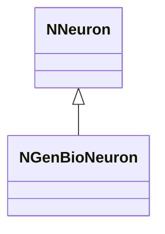
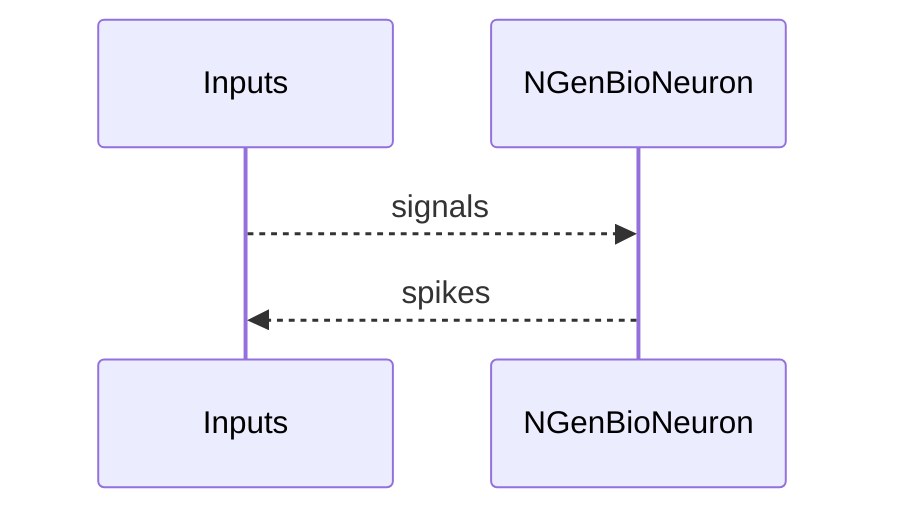

## NGenBioNeuron — био-генерирующий нейрон

**Класс**: `NGenBioNeuron` — биологически ориентированный генерирующий нейрон.
**Регистрация**: `NPulseLibrary.cpp` → `UploadClass("NGenBioNeuron", ...)`.
**Storage**: `ClassName = "NGenBioNeuron"`.

### Lifecycle
- **ADefault**: био-параметры.
- **ABuild**: подключение каналов/синапсов.
- **AReset**: сброс состояния.
- **ACalculate**: расчёт био-модели/спайков.

### I/O
- Вход: токи/сигналы.
- Выход: спайк/активность.



Пояснение: диаграмма классов показывает место компонента в иерархии и ключевые связи.



Пояснение: диаграмма последовательности показывает типовой сценарий взаимодействия и порядок вызовов.


Пояснение: блок-схема показывает поток данных/сигналов (входы → компонент → выходы).

## Источники

См. [Literature-References.md](../Literature-References.md): **26**, **29**, **30**.

### Config snippet

```ini
[Component]
ClassName = NGenBioNeuron
Name = GenBio1
```

---

## NGenBioNeuron — bio-generative neuron (EN)

Bio-inspired neuron generating spikes.


Description: this class diagram shows the component position in the type hierarchy and key relations.


Description: this sequence diagram shows a typical runtime interaction and call order.


Description: this flowchart shows the data/signal flow (inputs → component → outputs).

### References

See [Literature-References.md](../Literature-References.md): **26**, **29**, **30**.
