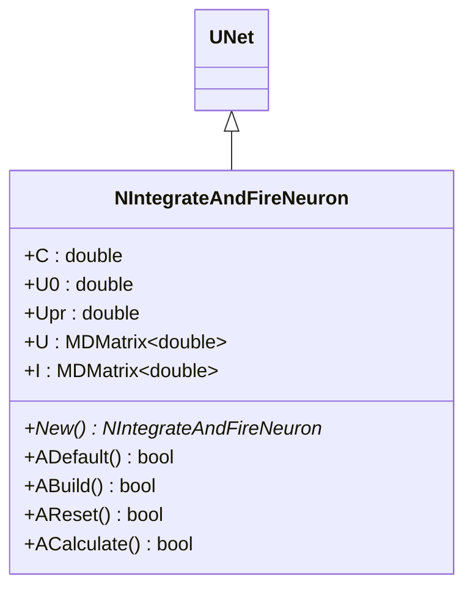
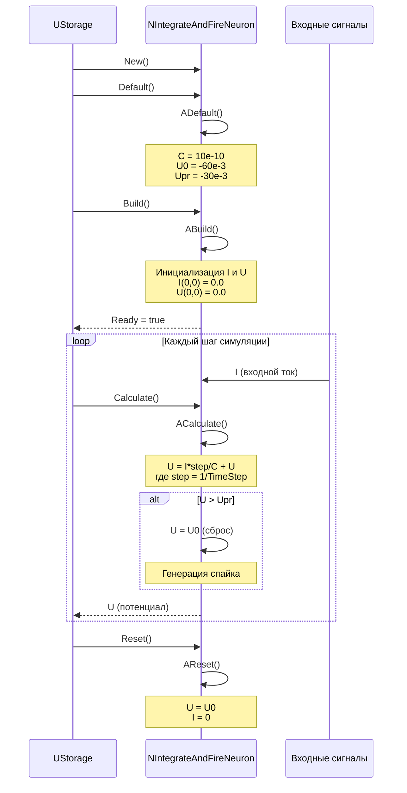
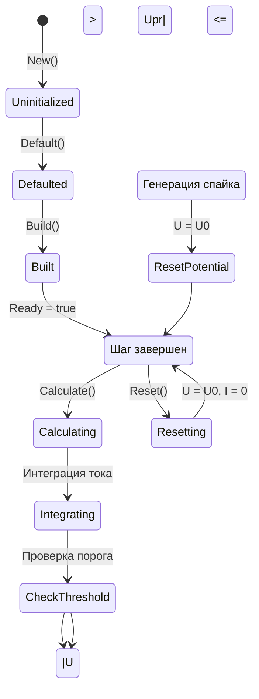
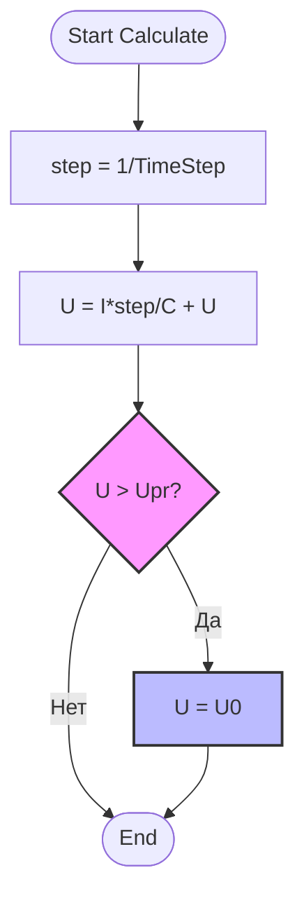
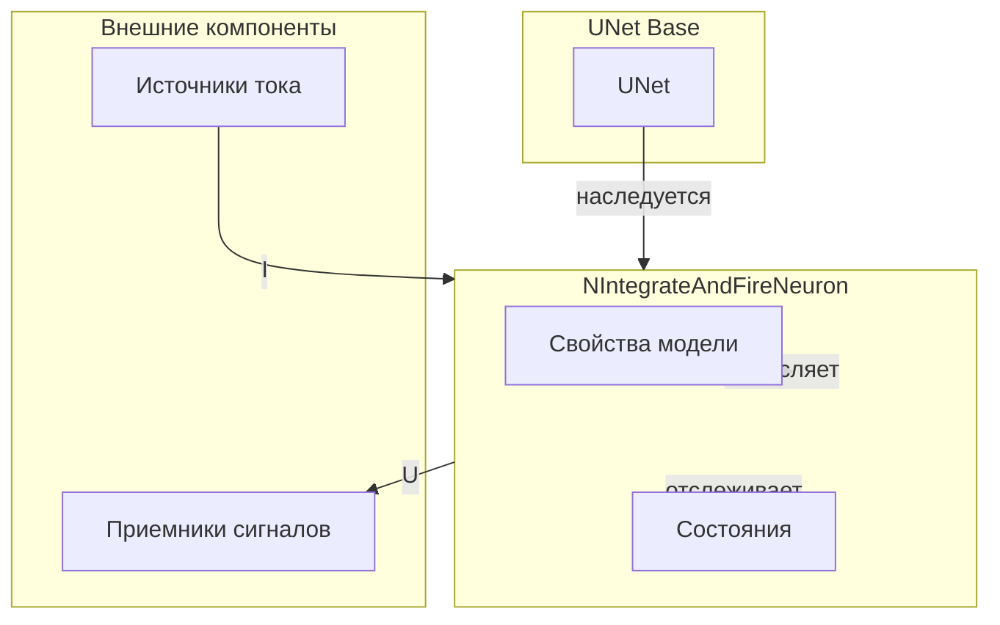
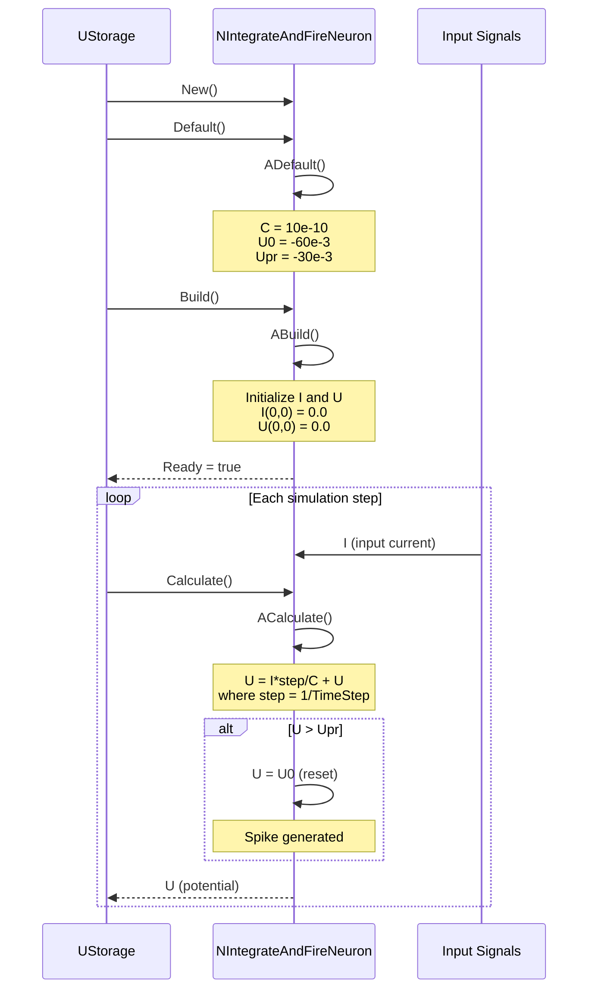
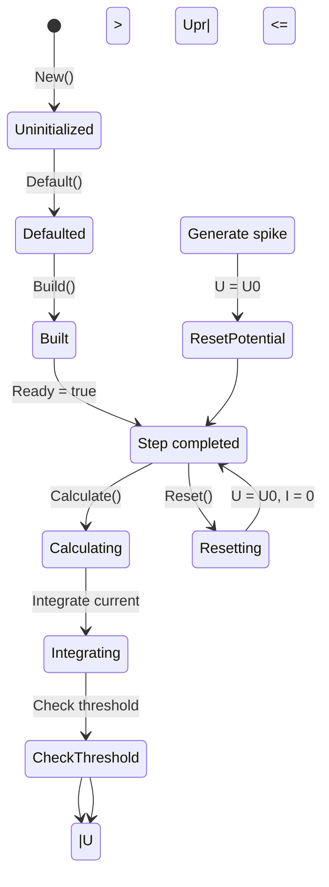
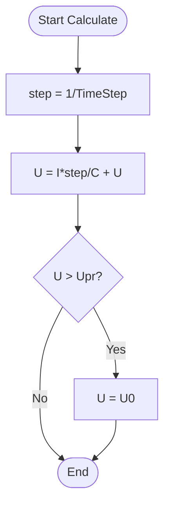
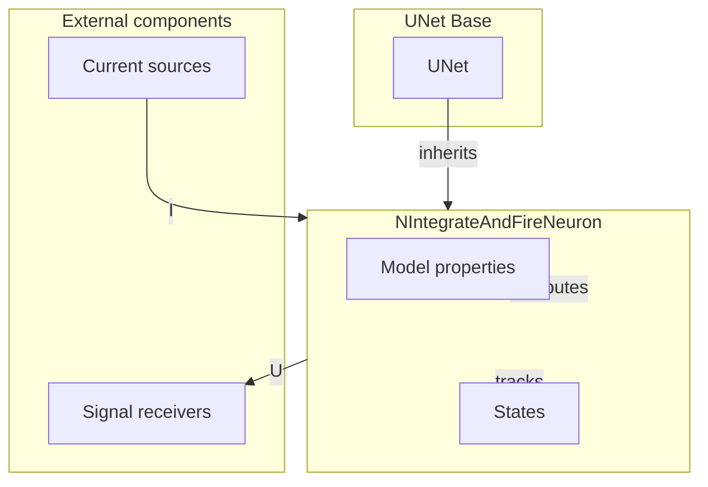

# NIntegrateAndFireNeuron — нейрон IaF (модель integrate-and-fire)

**Каталог компонентов:** [Component-Catalog.md](../Component-Catalog.md).

## RU

### Назначение

**Класс**: `NIntegrateAndFireNeuron` — модель нейрона integrate-and-fire (IaF).
**Регистрация**: `NPulseLibrary.cpp` → `UploadClass("NIntegrateAndFireNeuron", ...)`.
**Storage-инстансы**: `ClassName = "NIntegrateAndFireNeuron"` в `Bin/Configs/*/Model_*.xml`.

`NIntegrateAndFireNeuron` реализует простую модель нейрона integrate-and-fire, которая интегрирует входной ток и генерирует спайк при достижении порогового потенциала. Наследуется от `UNet` и предоставляет упрощенную модель нейрона без сложной динамики мембраны.

**Использование:** `Bin/Configs/SpikeSamples/NM-Neurons/LIF-Neuron/`, `Bin/Configs/SpikeSamples/STDP/STDP-Simple-01/`; моделирование простых нейронных сетей, тестирование алгоритмов, базовые эксперименты с импульсными нейронами

### UML-диаграмма классов



**Иерархия наследования:**
- `UNet` (Rdk) — базовый класс для сетей компонентов
- `NIntegrateAndFireNeuron` — нейрон модели integrate-and-fire

**Ключевые свойства:**
- **C** (double) — емкость мембраны (по умолчанию: 10e-10)
- **U0** (double) — начальный потенциал мембраны (по умолчанию: -60e-3)
- **Upr** (double) — пороговый потенциал для генерации спайка (по умолчанию: -30e-3)
- **U** (MDMatrix<double>) — текущий потенциал мембраны (выход)
- **I** (MDMatrix<double>) — входной ток (вход)

### UML-диаграмма последовательности



**Жизненный цикл:**
1. **Инициализация**: Установка параметров модели (C, U0, Upr)
2. **Сборка**: Инициализация матриц I и U
3. **Расчет**: Интеграция тока и проверка порога
4. **Сброс**: Восстановление начального потенциала

### UML-диаграмма состояний



**Состояния:**
- **Uninitialized** — создан, но не инициализирован
- **Defaulted** — параметры установлены по умолчанию
- **Built** — структура нейрона построена
- **Ready** — готов к выполнению расчетов
- **Calculating** — выполняется расчет нейрона
- **Integrating** — интегрирование входного тока
- **CheckThreshold** — проверка достижения порога
- **Spiking** — генерация спайка (сброс потенциала)
- **Resetting** — выполняется сброс состояний

### UML-диаграмма активности



**Алгоритм расчета:**
1. Вычисление шага интегрирования: `step = 1/TimeStep`
2. Интеграция тока: `U = I*step/C + U`
3. Проверка порога: если `U > Upr`, то `U = U0` (генерация спайка)
4. Возврат обновленного потенциала

### UML-диаграмма компонентов



**Зависимости:**
- **Базовый класс**: `UNet`
- **Внешние компоненты**: источники тока (источники `I`), приемники сигналов (получатели `U`)

### Свойства

#### Параметры (ptPubParameter)

- **`C`** (double) — емкость мембраны. Определяет скорость изменения потенциала при заданном токе. Значение по умолчанию: `10e-10` (10 пФ)

- **`U0`** (double) — начальный потенциал мембраны. Значение потенциала после генерации спайка или при сбросе. Значение по умолчанию: `-60e-3` (-60 мВ)

- **`Upr`** (double) — пороговый потенциал для генерации спайка. При достижении этого значения потенциал сбрасывается до `U0`. Значение по умолчанию: `-30e-3` (-30 мВ)

#### Входные свойства (ptInput | ptPubState)

- **`I`** (MDMatrix<double>) — входной ток. Подключается к источникам тока или выходным сигналам других компонентов. Размер матрицы: 1x1

#### Выходные свойства (ptOutput | ptPubState)

- **`U`** (MDMatrix<double>) — текущий потенциал мембраны. Выходной сигнал нейрона, который может использоваться другими компонентами. Размер матрицы: 1x1

### Методы

#### Публичные методы

- **`New()`** → `NIntegrateAndFireNeuron*` — создает новый экземпляр класса. Используется системой Rdk для создания компонентов.

#### Защищенные методы жизненного цикла

- **`ADefault()`** → `bool` — инициализирует параметры по умолчанию. Устанавливает `C = 10e-10`, `U0 = -60e-3`, `Upr = -30e-3`.

- **`ABuild()`** → `bool` — строит структуру нейрона. Инициализирует матрицы `I` и `U` размером 1x1 нулевыми значениями.

- **`AReset()`** → `bool` — сбрасывает состояния нейрона. Устанавливает `U(0,0) = U0` и `I(0,0) = 0`.

- **`ACalculate()`** → `bool` — выполняет расчет нейрона на одном шаге. Интегрирует входной ток: `U = I*step/C + U`, где `step = 1/TimeStep`. Если `U > Upr`, сбрасывает потенциал: `U = U0`.

### Примеры использования

#### Пример 1: Создание нейрона в коде C++

```cpp
// Создание нейрона
auto neuron = storage->CreateComponent<NIntegrateAndFireNeuron>();
neuron->SetName("IaFNeuron1");

// Инициализация
neuron->Default();

// Настройка параметров
neuron->C = 10e-10;      // Емкость мембраны
neuron->U0 = -60e-3;     // Начальный потенциал
neuron->Upr = -30e-3;    // Пороговый потенциал

// Сборка
neuron->Build();

// Использование
for (int step = 0; step < 1000; step++) {
    // Установка входного тока (например, от другого компонента)
    // neuron->I(0, 0) = inputCurrent;

    neuron->Calculate();
    double potential = neuron->U(0, 0);
    std::cout << "Step " << step << ": Potential = " << potential << std::endl;
}
```

#### Пример 2: Конфигурация XML

```xml
<IaFNeuron1 Class="NIntegrateAndFireNeuron">
    <Parameters>
        <C>1e-9</C>
        <U0>-60e-3</U0>
        <Upr>-30e-3</Upr>
    </Parameters>
</IaFNeuron1>
```

### Использование в конфигурациях

`NIntegrateAndFireNeuron` используется в экспериментах с простыми моделями нейронов:

- Базовые эксперименты с импульсными нейронами
- Тестирование алгоритмов обучения
- Моделирование простых нейронных сетей

**Типичные значения параметров:**
- **C**: 10e-10 - 1e-9 (10 пФ - 1 нФ)
- **U0**: -70e-3 - -50e-3 (-70 мВ - -50 мВ)
- **Upr**: -40e-3 - -20e-3 (-40 мВ - -20 мВ)

## Источники

См. [Literature-References.md](../Literature-References.md): **25**, **29**, **30**.

### См. также

- [`NPulseNeuronIzhikevich`](NPulseNeuronIzhikevich.md) — нейрон модели Ижикевича (более сложная модель)
- [`NPulseNeuronIaF`](NPulseNeuronIaF.md) — импульсный нейрон IaF с мембраной и каналами
- [`NNeuron`](NNeuron.md) — базовый нейрон
- [Architecture.md](../Architecture.md) — архитектура библиотеки

---

## EN

### Purpose

**Class**: `NIntegrateAndFireNeuron` — integrate-and-fire (IaF) neuron model.
**Registration**: `NPulseLibrary.cpp` → `UploadClass("NIntegrateAndFireNeuron", ...)`.
**Instances**: `ClassName = "NIntegrateAndFireNeuron"` in `Bin/Configs/*/Model_*.xml`.

`NIntegrateAndFireNeuron` implements a simple integrate-and-fire neuron model that integrates input current and generates a spike when threshold potential is reached. It inherits from `UNet` and provides a simplified neuron model without complex membrane dynamics.

**Usage:** Modeling simple neural networks, testing algorithms, basic experiments with spiking neurons

### UML Class Diagram


**Inheritance hierarchy:**
- `UNet` (Rdk) — base class for component networks
- `NIntegrateAndFireNeuron` — integrate-and-fire neuron model

**Key properties:**
- **C** (double) — membrane capacitance (default: 10e-10)
- **U0** (double) — initial membrane potential (default: -60e-3)
- **Upr** (double) — threshold potential for spike generation (default: -30e-3)
- **U** (MDMatrix<double>) — current membrane potential (output)
- **I** (MDMatrix<double>) — input current (input)

### UML Sequence Diagram



### UML State Diagram



### UML Activity Diagram



### UML Component Diagram



### Properties

#### Parameters (ptPubParameter)

- **`C`** (double) — membrane capacitance. Determines the rate of potential change for a given current. Default value: `10e-10` (10 pF)

- **`U0`** (double) — initial membrane potential. Potential value after spike generation or reset. Default value: `-60e-3` (-60 mV)

- **`Upr`** (double) — threshold potential for spike generation. When this value is reached, potential is reset to `U0`. Default value: `-30e-3` (-30 mV)

#### Input Properties (ptInput | ptPubState)

- **`I`** (MDMatrix<double>) — input current. Connected to current sources or output signals from other components. Matrix size: 1x1

#### Output Properties (ptOutput | ptPubState)

- **`U`** (MDMatrix<double>) — current membrane potential. Neuron output signal that can be used by other components. Matrix size: 1x1

### Methods

#### Public Methods

- **`New()`** → `NIntegrateAndFireNeuron*` — creates a new instance of the class. Used by the Rdk system to create components.

#### Protected Lifecycle Methods

- **`ADefault()`** → `bool` — initializes default parameters. Sets `C = 10e-10`, `U0 = -60e-3`, `Upr = -30e-3`.

- **`ABuild()`** → `bool` — builds neuron structure. Initializes `I` and `U` matrices with size 1x1 and zero values.

- **`AReset()`** → `bool` — resets neuron states. Sets `U(0,0) = U0` and `I(0,0) = 0`.

- **`ACalculate()`** → `bool` — performs neuron calculation for one step. Integrates input current: `U = I*step/C + U`, where `step = 1/TimeStep`. If `U > Upr`, resets potential: `U = U0`.

### Usage Examples

#### Example 1: Creating Neuron in C++ Code

```cpp
// Create neuron
auto neuron = storage->CreateComponent<NIntegrateAndFireNeuron>();
neuron->SetName("IaFNeuron1");

// Initialize
neuron->Default();

// Configure parameters
neuron->C = 10e-10;      // Membrane capacitance
neuron->U0 = -60e-3;     // Initial potential
neuron->Upr = -30e-3;    // Threshold potential

// Build
neuron->Build();

// Use
for (int step = 0; step < 1000; step++) {
    neuron->Calculate();
    double potential = neuron->U(0, 0);
    std::cout << "Step " << step << ": Potential = " << potential << std::endl;
}
```

### References

See [Literature-References.md](../Literature-References.md): **25**, **29**, **30**.

### See Also

- [`NPulseNeuronIzhikevich`](NPulseNeuronIzhikevich.md) — Izhikevich model neuron (more complex model)
- [`NPulseNeuronIaF`](NPulseNeuronIaF.md) — spiking IaF neuron with membrane and channels
- [`NNeuron`](NNeuron.md) — base neuron
- [Architecture.md](../Architecture.md) — library architecture
