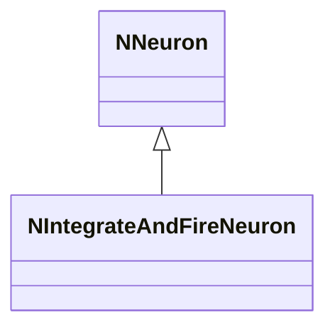
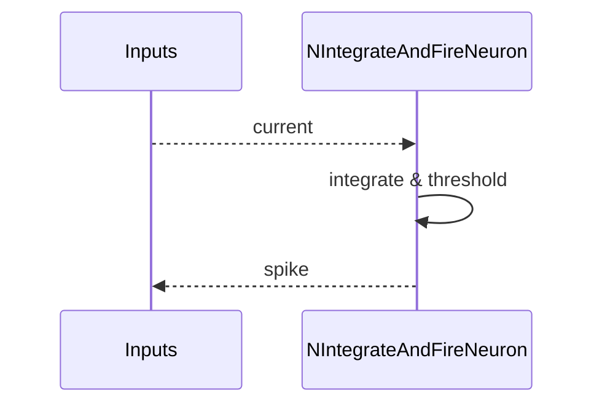
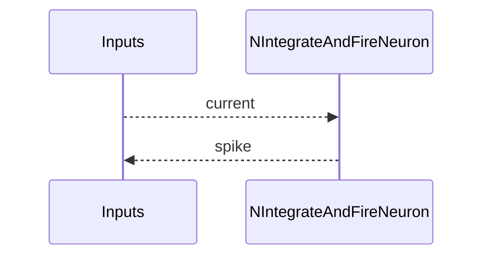

## NIntegrateAndFireNeuron — нейрон IaF (Nmsdk-PulseLib)

**Класс**: `NIntegrateAndFireNeuron` — модель integrate-and-fire.  
**Регистрация**: `NPulseLibrary.cpp` → `UploadClass("NIntegrateAndFireNeuron", ...)`.  
**Storage**: `ClassName = "NIntegrateAndFireNeuron"`.

### Lifecycle
- **ADefault**: параметры мембраны/порогов.
- **ABuild**: подключение каналов/синапсов.
- **AReset**: сброс потенциала.
- **ACalculate**: интеграция тока, проверка порога, генерация спайка.

### I/O
- Вход: ток/спайки от пресинаптических элементов.
- Выход: спайк/потенциал.



Пояснение: диаграмма классов показывает место компонента в иерархии и ключевые связи.



Пояснение: диаграмма последовательности показывает типовой сценарий взаимодействия и порядок вызовов.


Пояснение: блок-схема показывает поток данных/сигналов (входы → компонент → выходы).

### Config snippet

```ini
[Component]
ClassName = NIntegrateAndFireNeuron
Name = IaF1
```

---

## NIntegrateAndFireNeuron — integrate-and-fire neuron (EN)

Integrates input current, fires spike on threshold.


Description: this class diagram shows the component position in the type hierarchy and key relations.



Description: this sequence diagram shows a typical runtime interaction and call order.


Description: this flowchart shows the data/signal flow (inputs → component → outputs).
