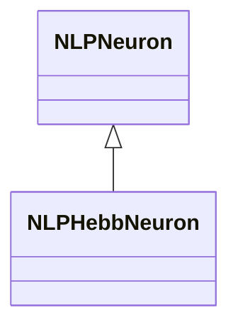
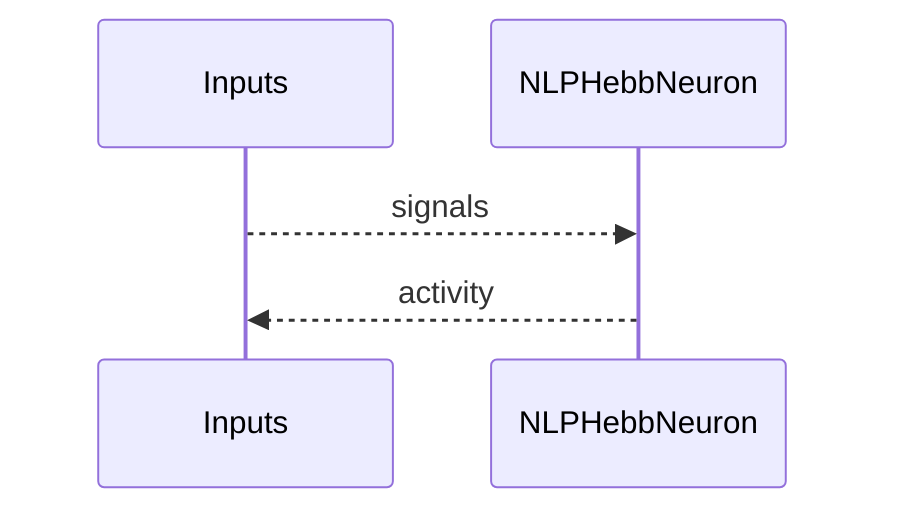
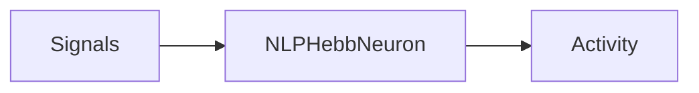

## NLPHebbNeuron — LP нейрон с Hebb-пластичностью

**Класс**: `NLPHebbNeuron` — LP-модель с Hebb-правилом.  
**Регистрация**: `NPulseLibrary.cpp` → `UploadClass("NLPHebbNeuron", ...)`.  
**Storage**: `ClassName = "NLPHebbNeuron"`.

### Lifecycle
- **ADefault**: параметры LP + Hebb.
- **ABuild**: подключение входов/синапсов.
- **AReset**: сброс состояний/весов (если нужно).
- **ACalculate**: LP-активация + Hebb-обновление.

### I/O
- Вход: сигналы/токи.
- Выход: активность/спайк.



Пояснение: диаграмма классов показывает место компонента в иерархии и ключевые связи.



Пояснение: диаграмма последовательности показывает типовой сценарий взаимодействия и порядок вызовов.



Пояснение: блок-схема показывает поток данных/сигналов (входы → компонент → выходы).

### Config snippet

```ini
[Component]
ClassName = NLPHebbNeuron
Name = LPHebb1
```

---

## NLPHebbNeuron — LP neuron with Hebbian plasticity (EN)

LP neuron variant applying Hebbian updates.


Description: this class diagram shows the component position in the type hierarchy and key relations.


Description: this sequence diagram shows a typical runtime interaction and call order.


Description: this flowchart shows the data/signal flow (inputs → component → outputs).
