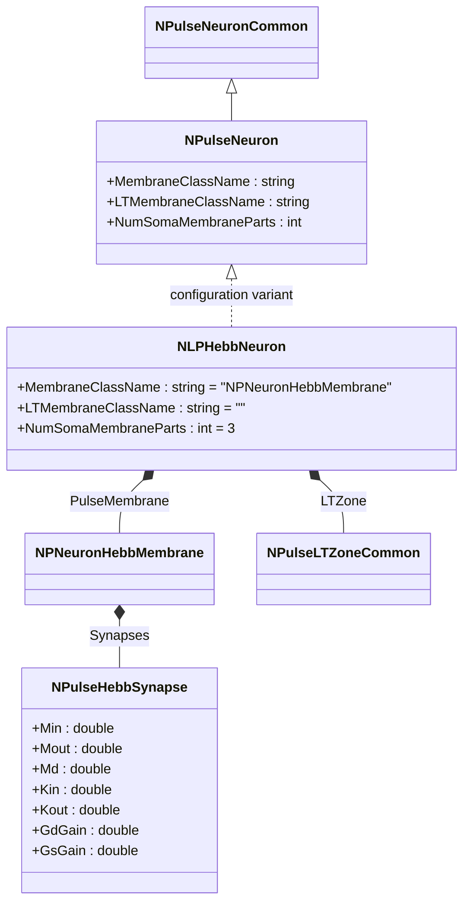
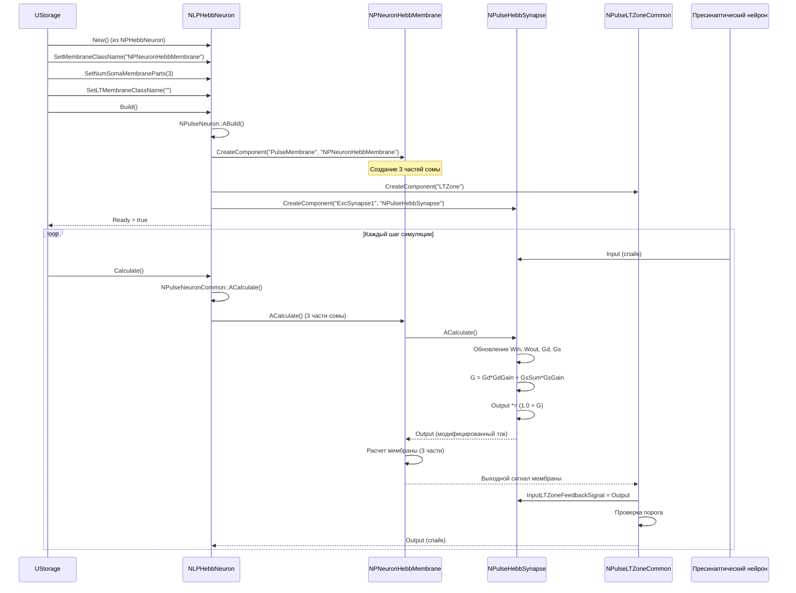
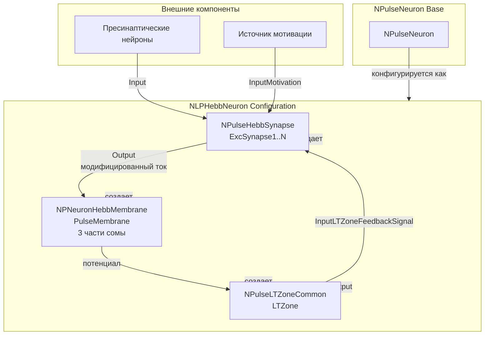
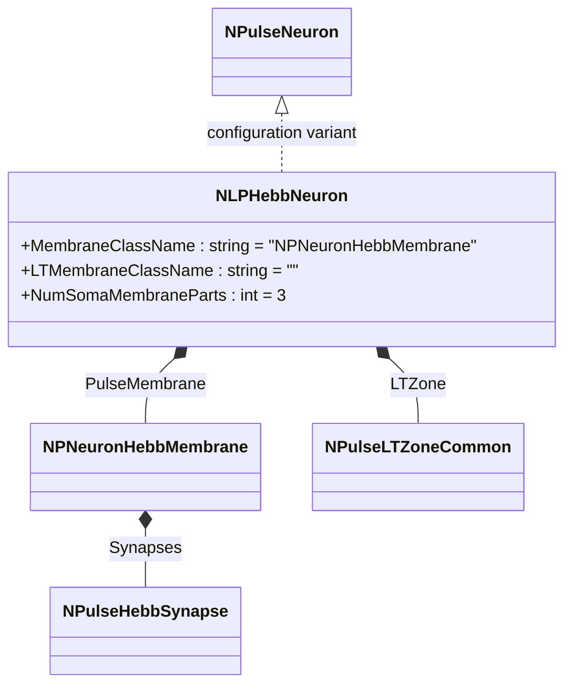
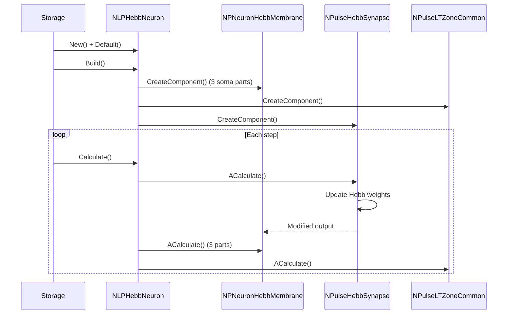
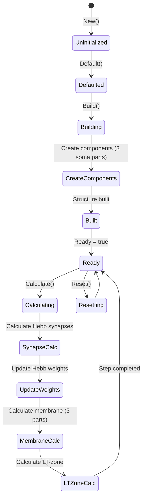
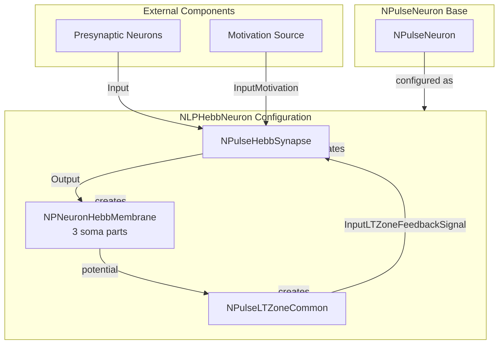

# NLPHebbNeuron — крупный импульсный нейрон с синапсами Хебба

## RU

### Назначение

**Класс**: `NLPHebbNeuron` — конфигурационный вариант крупного импульсного нейрона с синапсами Хебба.  
**Аббревиатура**: `Hebb` — **Hebb**ian (геббовская пластичность, обучение по правилу Хебба).  
**Регистрация**: `NPulseLibrary.cpp` → `UploadClass("NLPHebbNeuron", ...)`.  
**Storage-инстансы**: `ClassName = "NLPHebbNeuron"` в `Bin/Configs/*/Model_*.xml`.

`NLPHebbNeuron` является конфигурационным вариантом базового класса `NPulseNeuron` с мембраной, поддерживающей синапсы Хебба. Создается из `NPHebbNeuron` с настройками:
- `LTMembraneClassName = ""` — без LT-мембраны
- `NumSomaMembraneParts = 3` — три части сомы
- `MembraneClassName = "NPNeuronHebbMembrane"` — мембрана с поддержкой синапсов Хебба

Синапсы Хебба (`NPulseHebbSynapse`) реализуют механизм обучения Хебба с множественными выходами и мотивационными сигналами.

**Использование:** Моделирование крупных нейронов с обучением Хебба, эксперименты с пластичностью синапсов

### UML-диаграмма классов



**Иерархия наследования:**
- `NPulseNeuronCommon` — общий импульсный нейрон
- `NPulseNeuron` — импульсный нейрон с параметрами структурирования
- `NLPHebbNeuron` — конфигурационный вариант с синапсами Хебба

**Внутренняя структура:**
- **PulseMembrane** (`NPNeuronHebbMembrane`) — мембрана с поддержкой синапсов Хебба (3 части сомы)
- **Synapses** (`NPulseHebbSynapse[]`) — синапсы Хебба с механизмом обучения
- **LTZone** (`NPulseLTZoneCommon`) — стандартная LT-зона

### UML-диаграмма последовательности



**Жизненный цикл:**
1. **Создание**: `NLPHebbNeuron` создается из `NPHebbNeuron` с настройкой параметров
2. **Настройка**: Устанавливается мембрана с поддержкой синапсов Хебба, три части сомы
3. **Сборка**: Автоматически создается структура нейрона с мембраной (3 части) и синапсами Хебба
4. **Расчет**: На каждом шаге рассчитываются синапсы Хебба (обновление весов), мембрана (3 части) и LT-зона

### UML-диаграмма состояний

```mermaid
stateDiagram-v2
    [*] --> Uninitialized: New()
    Uninitialized --> Defaulted: Default()
    Defaulted --> Configuring: Настройка Hebb параметров
    Configuring --> SetHebbParams: SetMembraneClassName("NPNeuronHebbMembrane")<br/>SetNumSomaMembraneParts(3)
    SetHebbParams --> Building: Build()
    Building --> BuildBase: NPulseNeuron::ABuild()
    BuildBase --> CreateMembrane: Создание NPNeuronHebbMembrane (3 части)
    CreateMembrane --> CreateLTZone: Создание NPulseLTZoneCommon
    CreateLTZone --> CreateSynapses: Создание NPulseHebbSynapse
    CreateSynapses --> Built: Структура создана
    Built --> Ready: Ready = true
    Ready --> Calculating: Calculate()
    Calculating --> SynapseCalc: Расчет синапсов Хебба
    SynapseCalc --> UpdateHebbWeights: Обновление весов Хебба
    UpdateHebbWeights --> MembraneCalc: Расчет мембраны (3 части)
    MembraneCalc --> LTZoneCalc: Расчет LT-зоны
    LTZoneCalc --> Ready: Шаг завершен
    Ready --> Resetting: Reset()
    Resetting --> Ready: Состояния сброшены
```

**Состояния:**
- **Uninitialized** — создан, но не инициализирован
- **Defaulted** — параметры установлены по умолчанию
- **Configuring** — настройка параметров для Hebb-нейрона
- **SetHebbParams** — установка параметров (мембрана с поддержкой Хебба, три части сомы)
- **Building** — выполняется сборка структуры
- **BuildBase** — сборка базовой структуры нейрона
- **CreateMembrane** — создание мембраны с тремя частями сомы
- **CreateLTZone** — создание LT-зоны
- **CreateSynapses** — создание синапсов Хебба
- **Built** — структура нейрона построена
- **Ready** — готов к выполнению расчетов
- **Calculating** — выполняется расчет нейрона
- **SynapseCalc** — расчет синапсов Хебба
- **UpdateHebbWeights** — обновление весов по правилу Хебба
- **MembraneCalc** — расчет мембраны (три части сомы)
- **LTZoneCalc** — расчет LT-зоны
- **Resetting** — выполняется сброс состояний

### UML-диаграмма активности

```mermaid
flowchart TD
    Start([Start Calculate]) --> CallBase[NPulseNeuronCommon::ACalculate]
    CallBase --> LoopSynapses[Цикл по синапсам]
    LoopSynapses --> CalcSynapse[Расчет NPulseHebbSynapse]
    CalcSynapse --> UpdateWin[Win += Kin*input - Min*Win]
    UpdateWin --> UpdateWout[Wout += Kout*ltzoneoutput - Mout*Wout]
    UpdateWout --> UpdateGd[Gd += Win*Wout - Md*Gd]
    UpdateGd --> UpdateGs[Gs[i] += motivation[i]*Gd - Ms[i]*Gs[i]]
    UpdateGs --> CalcG[G = Gd*GdGain + GsSum*GsGain]
    CalcG --> ModifyOutput[Output *= 1.0 + G]
    ModifyOutput --> CheckMoreSynapses{Есть еще синапсы?}
    CheckMoreSynapses -->|Да| LoopSynapses
    CheckMoreSynapses -->|Нет| CalcMembrane[Расчет мембраны (3 части сомы)]
    CalcMembrane --> CalcLTZone[Расчет LT-зоны]
    CalcLTZone --> End([End])
```

**Алгоритм расчета:**
1. Вызов базового расчета нейрона
2. Для каждого синапса Хебба:
   - Обновление пресинаптической активности (`Win`)
   - Обновление постсинаптической активности (`Wout`)
   - Обновление корреляции (`Gd`)
   - Обновление мотивационных компонентов (`Gs`)
   - Вычисление общего влияния (`G`)
   - Модификация выходного тока (`Output *= 1.0 + G`)
3. Расчет мембраны с тремя частями сомы и модифицированными токами
4. Расчет LT-зоны

### UML-диаграмма компонентов



**Зависимости:**
- **Базовый класс**: `NPulseNeuron` (конфигурационный вариант)
- **Внутренние компоненты**: `NPNeuronHebbMembrane` (мембрана с 3 частями сомы), `NPulseLTZoneCommon` (LT-зона), `NPulseHebbSynapse` (синапсы)
- **Внешние компоненты**: пресинаптические нейроны, источник мотивации

### Свойства

`NLPHebbNeuron` использует все свойства базового класса `NPulseNeuron` с параметрами:
- `MembraneClassName = "NPNeuronHebbMembrane"` — мембрана с поддержкой синапсов Хебба
- `LTMembraneClassName = ""` — без LT-мембраны
- `NumSomaMembraneParts = 3` — три части сомы

**Параметры синапсов Хебба (в NPulseHebbSynapse):**
- `Min` (double) — константа забывания пресинаптической активности
- `Mout` (double) — константа забывания постсинаптической активности
- `Md` (double) — константа забывания корреляции
- `Kin` (double) — коэффициент пресинаптической активности
- `Kout` (double) — коэффициент постсинаптической активности
- `GdGain` (double) — коэффициент усиления корреляционного компонента
- `GsGain` (double) — коэффициент усиления мотивационного компонента

### Методы

`NLPHebbNeuron` использует все методы базового класса `NPulseNeuron`.

### Примеры использования

#### Пример 1: Создание крупного Hebb-нейрона в коде C++

```cpp
// Создание крупного нейрона с синапсами Хебба
auto neuron = storage->CreateComponent("NLPHebbNeuron");
neuron->SetName("LPHebbNeuron");

// Инициализация (использует параметры по умолчанию)
neuron->Default();

// Сборка (автоматически создает NPNeuronHebbMembrane с 3 частями сомы, NPulseLTZoneCommon, NPulseHebbSynapse)
neuron->Build();

// Использование
for (int step = 0; step < 1000; step++) {
    neuron->Calculate();
    // Веса синапсов Хебба обновляются автоматически
}
```

#### Пример 2: Конфигурация XML

```xml
<LPHebbNeuron1 Class="NLPHebbNeuron">
    <Parameters>
        <!-- Параметры наследуются от NPulseNeuron -->
    </Parameters>
</LPHebbNeuron1>
```

### Использование в конфигурациях

`NLPHebbNeuron` используется в экспериментах с обучением Хебба для крупных нейронов:

- **Обучение Хебба**: `Bin/Configs/!OldConfigs/*/Model_*.xml` (где используется обучение Хебба для крупных нейронов)
- **Пластичность синапсов**: эксперименты с адаптацией синаптических весов в крупных нейронах

**Типичные значения параметров:**
- **MembraneClassName**: "NPNeuronHebbMembrane" (мембрана с поддержкой Хебба)
- **NumSomaMembraneParts**: 3 (три части сомы для крупных нейронов)
- **LTMembraneClassName**: "" (без LT-мембраны)

**Особенности:**
- Три части сомы: крупные нейроны имеют более сложную структуру с тремя частями сомы
- Обучение Хебба: синапсы автоматически обновляют веса на основе корреляции пре- и постсинаптической активности
- Мотивационные сигналы: поддержка мотивационных входов для модуляции обучения

### См. также

- [`NPulseNeuron`](NPulseNeuron.md) — импульсный нейрон с параметрами структурирования
- [`NLPNeuron`](NLPNeuron.md) — базовый LP-нейрон
- [`NPulseHebbSynapse`](NPulseHebbSynapse.md) — синапс Хебба
- [`NPNeuronHebbMembrane`](NPNeuronHebbMembrane.md) — мембрана с поддержкой синапсов Хебба
- [`NSPHebbNeuron`](NSPHebbNeuron.md) — мелкий нейрон с синапсами Хебба
- [Architecture.md](../Architecture.md) — архитектура библиотеки

---

## EN

### Purpose

**Class**: `NLPHebbNeuron` — configuration variant of large spiking neuron with Hebbian synapses.  
**Registration**: `NPulseLibrary.cpp` → `UploadClass("NLPHebbNeuron", ...)`.  
**Instances**: `ClassName = "NLPHebbNeuron"` in `Bin/Configs/*/Model_*.xml`.

`NLPHebbNeuron` is a configuration variant of the base class `NPulseNeuron` with membrane supporting Hebbian synapses. Created from `NPHebbNeuron` with settings:
- `LTMembraneClassName = ""` — without LT-membrane
- `NumSomaMembraneParts = 3` — three soma parts
- `MembraneClassName = "NPNeuronHebbMembrane"` — membrane with Hebbian synapse support

Hebbian synapses (`NPulseHebbSynapse`) implement Hebbian learning mechanism with multiple outputs and motivational signals.

**Usage:** Modeling large neurons with Hebbian learning, experiments with synaptic plasticity

### UML Class Diagram



### UML Sequence Diagram



### UML State Diagram



### UML Activity Diagram

```mermaid
flowchart TD
    Start([Start Calculate]) --> LoopSynapses[Loop through synapses]
    LoopSynapses --> UpdateWin[Update Win]
    UpdateWin --> UpdateWout[Update Wout]
    UpdateWout --> UpdateGd[Update Gd]
    UpdateGd --> UpdateGs[Update Gs]
    UpdateGs --> CalcG[Calculate G]
    CalcG --> ModifyOutput[Modify Output]
    ModifyOutput --> CheckMore{More synapses?}
    CheckMore -->|Yes| LoopSynapses
    CheckMore -->|No| CalcMembrane[Calculate membrane (3 soma parts)]
    CalcMembrane --> CalcLTZone[Calculate LT-zone]
    CalcLTZone --> End([End])
```

### UML Component Diagram



### Properties

`NLPHebbNeuron` uses all properties of base class `NPulseNeuron` with parameters:
- `MembraneClassName = "NPNeuronHebbMembrane"` — membrane with Hebbian synapse support
- `LTMembraneClassName = ""` — without LT-membrane
- `NumSomaMembraneParts = 3` — three soma parts

### Methods

`NLPHebbNeuron` uses all methods of base class `NPulseNeuron`.

### Usage in configurations

`NLPHebbNeuron` is used in Hebbian learning experiments for large neurons:

- **Hebbian learning**: `Bin/Configs/!OldConfigs/*/Model_*.xml` (where Hebbian learning is used for large neurons)
- **Synaptic plasticity**: experiments with synaptic weight adaptation in large neurons

**Typical parameter values:**
- **MembraneClassName**: "NPNeuronHebbMembrane" (membrane with Hebb support)
- **NumSomaMembraneParts**: 3 (three soma parts for large neurons)
- **LTMembraneClassName**: "" (without LT-membrane)

**Features:**
- Three soma parts: large neurons have more complex structure with three soma parts
- Hebbian learning: synapses automatically update weights based on pre- and postsynaptic activity correlation
- Motivational signals: support for motivational inputs to modulate learning

### See Also

- [`NPulseNeuron`](NPulseNeuron.md) — spiking neuron with structuring parameters
- [`NLPNeuron`](NLPNeuron.md) — base LP-neuron
- [`NPulseHebbSynapse`](NPulseHebbSynapse.md) — Hebbian synapse
- [`NPNeuronHebbMembrane`](NPNeuronHebbMembrane.md) — membrane with Hebbian synapse support
- [`NSPHebbNeuron`](NSPHebbNeuron.md) — small neuron with Hebbian synapses
- [Architecture.md](../Architecture.md) — library architecture
