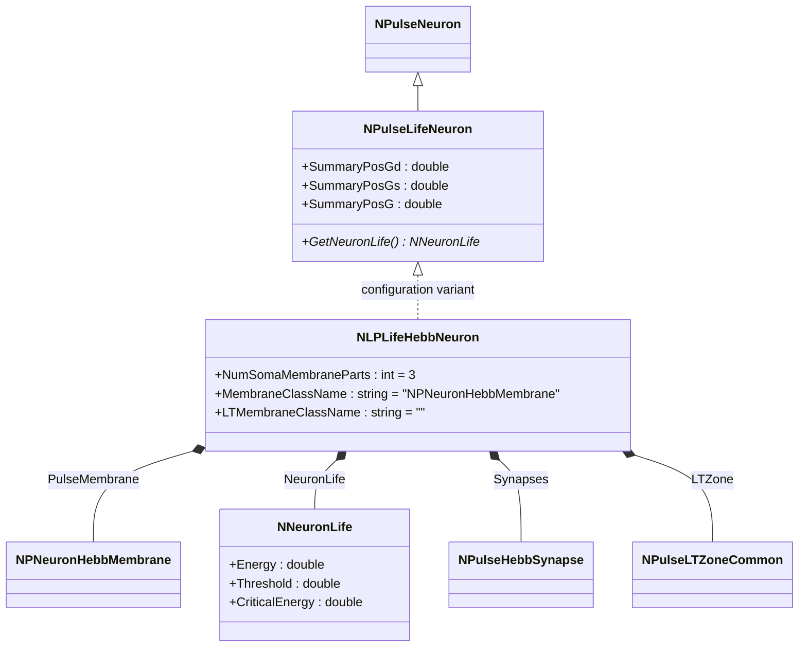
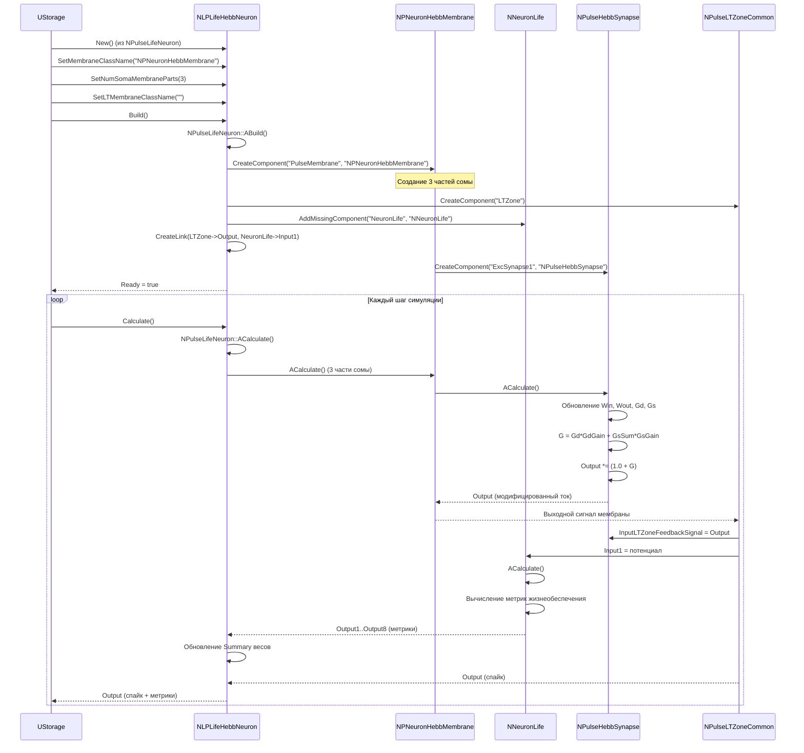
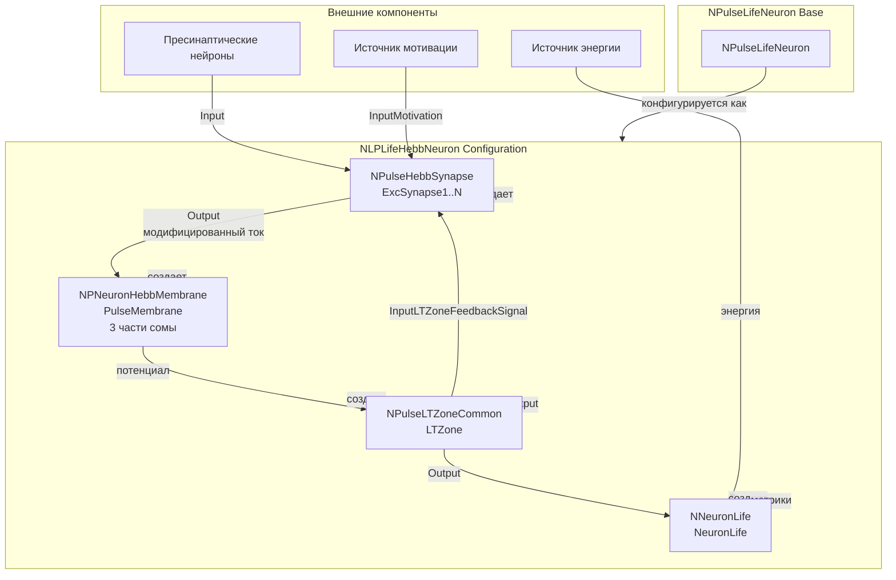
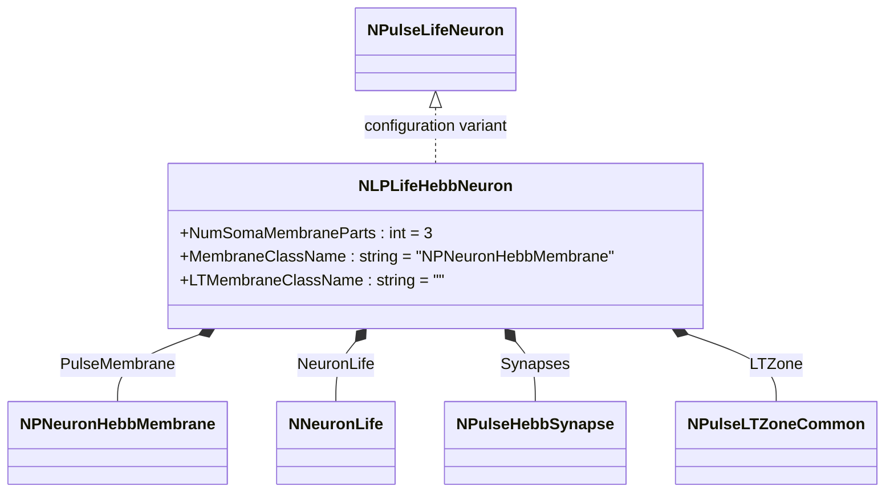
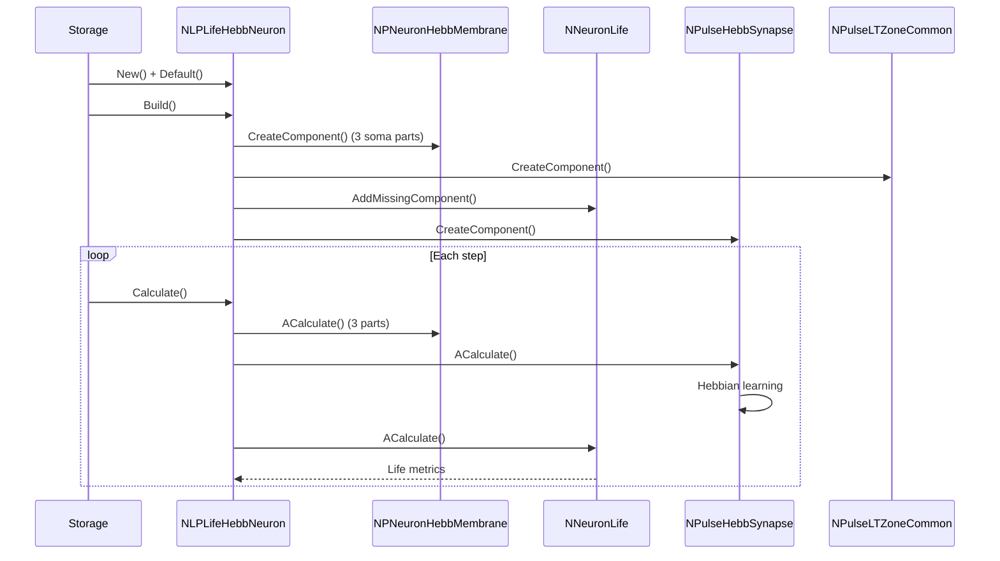
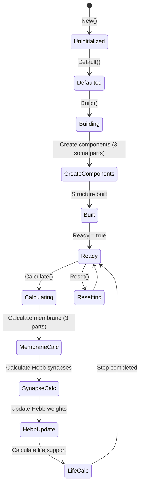
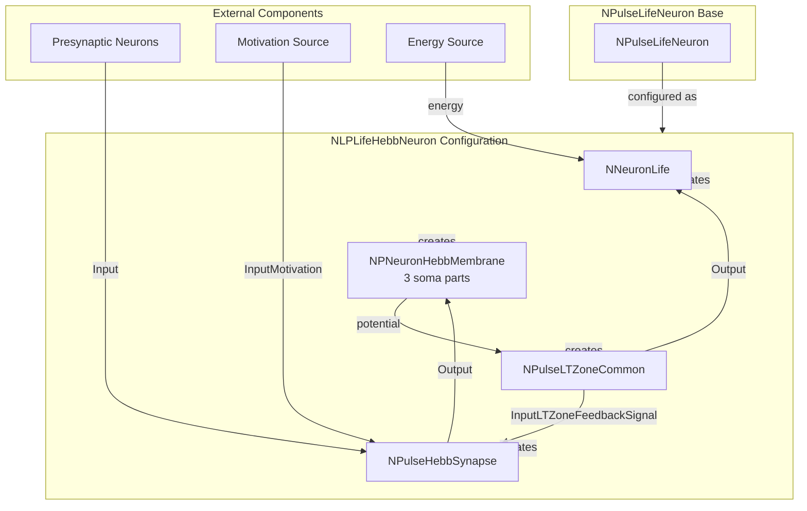

# NLPLifeHebbNeuron — крупный живой импульсный нейрон с синапсами Хебба

## RU

### Назначение

**Класс**: `NLPLifeHebbNeuron` — конфигурационный вариант крупного живого импульсного нейрона с синапсами Хебба и поддержкой жизнеобеспечения.
**Регистрация**: `NPulseLibrary.cpp` → `UploadClass("NLPLifeHebbNeuron", ...)`.
**Storage-инстансы**: `ClassName = "NLPLifeHebbNeuron"` в `Bin/Configs/*/Model_*.xml`.

`NLPLifeHebbNeuron` является конфигурационным вариантом базового класса `NPulseLifeNeuron` с мембраной, поддерживающей синапсы Хебба. Создается из `NPulseLifeNeuron` с настройками:
- `NumSomaMembraneParts = 3` — три части сомы
- `LTMembraneClassName = ""` — без LT-мембраны
- `MembraneClassName = "NPNeuronHebbMembrane"` — мембрана с поддержкой синапсов Хебба

Комбинирует возможности живых нейронов (жизнеобеспечение) и синапсов Хебба (обучение) для крупных нейронов.

**Использование:** Моделирование крупных живых нейронов с обучением Хебба, эксперименты с пластичностью и жизнеобеспечением

### UML-диаграмма классов



**Иерархия наследования:**
- `NPulseNeuron` — импульсный нейрон
- `NPulseLifeNeuron` — живой импульсный нейрон
- `NLPLifeHebbNeuron` — конфигурационный вариант с синапсами Хебба

**Внутренняя структура:**
- **PulseMembrane** (`NPNeuronHebbMembrane`) — мембрана с поддержкой синапсов Хебба (3 части сомы)
- **NeuronLife** (`NNeuronLife`) — модель жизнеобеспечения
- **Synapses** (`NPulseHebbSynapse[]`) — синапсы Хебба
- **LTZone** (`NPulseLTZoneCommon`) — стандартная LT-зона

### UML-диаграмма последовательности



**Жизненный цикл:**
1. **Создание**: `NLPLifeHebbNeuron` создается из `NPulseLifeNeuron` с настройкой параметров
2. **Настройка**: Устанавливается мембрана с поддержкой синапсов Хебба, три части сомы
3. **Сборка**: Автоматически создается структура нейрона с мембраной (3 части), LT-зоной, моделью жизнеобеспечения и синапсами Хебба
4. **Расчет**: На каждом шаге рассчитываются синапсы Хебба (обновление весов), мембрана (3 части), LT-зона и модель жизнеобеспечения

### UML-диаграмма состояний

```mermaid
stateDiagram-v2
    [*] --> Uninitialized: New()
    Uninitialized --> Defaulted: Default()
    Defaulted --> Configuring: Настройка Hebb + Life параметров
    Configuring --> SetParams: SetMembraneClassName("NPNeuronHebbMembrane")<br/>SetNumSomaMembraneParts(3)
    SetParams --> Building: Build()
    Building --> BuildBase: NPulseLifeNeuron::ABuild()
    BuildBase --> CreateMembrane: Создание NPNeuronHebbMembrane (3 части)
    CreateMembrane --> CreateLTZone: Создание NPulseLTZoneCommon
    CreateLTZone --> CreateLife: Создание NNeuronLife
    CreateLife --> LinkLife: CreateLink(LTZone->Output, NeuronLife->Input1)
    LinkLife --> CreateSynapses: Создание NPulseHebbSynapse
    CreateSynapses --> Built: Структура создана
    Built --> Ready: Ready = true
    Ready --> Calculating: Calculate()
    Calculating --> MembraneCalc: Расчет мембраны (3 части)
    MembraneCalc --> SynapseCalc: Расчет синапсов Хебба
    SynapseCalc --> HebbUpdate: Обновление весов Хебба
    HebbUpdate --> LifeCalc: Расчет жизнеобеспечения
    LifeCalc --> UpdateSummary: Обновление Summary весов
    UpdateSummary --> Ready: Шаг завершен
    Ready --> Resetting: Reset()
    Resetting --> Ready: Состояния сброшены
```

**Состояния:**
- **Uninitialized** — создан, но не инициализирован
- **Defaulted** — параметры установлены по умолчанию
- **Configuring** — настройка параметров для Hebb + Life нейрона
- **SetParams** — установка параметров (мембрана с поддержкой Хебба, три части сомы)
- **Building** — выполняется сборка структуры
- **BuildBase** — сборка базовой структуры нейрона
- **CreateMembrane** — создание мембраны с тремя частями сомы
- **CreateLTZone** — создание LT-зоны
- **CreateLife** — создание модели жизнеобеспечения
- **LinkLife** — связывание LT-зоны с моделью жизнеобеспечения
- **CreateSynapses** — создание синапсов Хебба
- **Built** — структура нейрона построена
- **Ready** — готов к выполнению расчетов
- **Calculating** — выполняется расчет нейрона
- **MembraneCalc** — расчет мембраны (три части сомы)
- **SynapseCalc** — расчет синапсов Хебба
- **HebbUpdate** — обновление весов по правилу Хебба
- **LifeCalc** — расчет жизнеобеспечения
- **UpdateSummary** — обновление суммарных весов
- **Resetting** — выполняется сброс состояний

### UML-диаграмма активности

```mermaid
flowchart TD
    Start([Start Calculate]) --> CallBase[NPulseLifeNeuron::ACalculate]
    CallBase --> CalcMembrane[Расчет мембраны (3 части сомы)]
    CalcMembrane --> LoopSynapses[Цикл по синапсам]
    LoopSynapses --> CalcSynapse[Расчет NPulseHebbSynapse]
    CalcSynapse --> UpdateWin[Win += Kin*input - Min*Win]
    UpdateWin --> UpdateWout[Wout += Kout*ltzoneoutput - Mout*Wout]
    UpdateWout --> UpdateGd[Gd += Win*Wout - Md*Gd]
    UpdateGd --> UpdateGs[Gs[i] += motivation[i]*Gd - Ms[i]*Gs[i]]
    UpdateGs --> CalcG[G = Gd*GdGain + GsSum*GsGain]
    CalcG --> ModifyOutput[Output *= 1.0 + G]
    ModifyOutput --> CheckMoreSynapses{Есть еще синапсы?}
    CheckMoreSynapses -->|Да| LoopSynapses
    CheckMoreSynapses -->|Нет| CalcLTZone[Расчет LT-зоны]
    CalcLTZone --> UpdateLifeInput[Обновление NeuronLife->Input1]
    UpdateLifeInput --> CalcLife[Расчет жизнеобеспечения]
    CalcLife --> CalcWearOut[ACalcWearOut]
    CalcWearOut --> CalcEnergy[ACalcEnergy]
    CalcEnergy --> CalcFeel[ACalcFeel]
    CalcFeel --> CalcThresholds[ACalcThresholdLife]
    CalcThresholds --> UpdateSummary[Обновление Summary весов]
    UpdateSummary --> End([End])
```

**Алгоритм расчета:**
1. Вызов базового расчета нейрона (`NPulseLifeNeuron::ACalculate`)
2. Расчет мембраны с тремя частями сомы
3. Для каждого синапса Хебба:
   - Обновление пресинаптической активности (`Win`)
   - Обновление постсинаптической активности (`Wout`)
   - Обновление корреляции (`Gd`)
   - Обновление мотивационных компонентов (`Gs`)
   - Вычисление общего влияния (`G`)
   - Модификация выходного тока (`Output *= 1.0 + G`)
4. Расчет LT-зоны
5. Обновление входов модели жизнеобеспечения
6. Расчет метрик жизнеобеспечения (износ, энергия, чувство, пороги)
7. Обновление суммарных весов и выходов

### UML-диаграмма компонентов



**Зависимости:**
- **Базовый класс**: `NPulseLifeNeuron` (конфигурационный вариант)
- **Внутренние компоненты**: `NPNeuronHebbMembrane` (мембрана с 3 частями сомы), `NPulseLTZoneCommon` (LT-зона), `NNeuronLife` (модель жизнеобеспечения), `NPulseHebbSynapse` (синапсы)
- **Внешние компоненты**: пресинаптические нейроны, источник мотивации, источник энергии

### Свойства

`NLPLifeHebbNeuron` использует все свойства базового класса `NPulseLifeNeuron` с параметрами:
- `NumSomaMembraneParts = 3` — три части сомы
- `MembraneClassName = "NPNeuronHebbMembrane"` — мембрана с поддержкой синапсов Хебба
- `LTMembraneClassName = ""` — без LT-мембраны

**Наследуемые свойства от NPulseLifeNeuron:**
- `SummaryPosGd`, `SummaryPosGs`, `SummaryPosG` (double) — суммарные положительные веса
- `SummaryNegGd`, `SummaryNegGs`, `SummaryNegG` (double) — суммарные отрицательные веса
- `OutputSummaryPosGd`, `OutputSummaryPosGs`, `OutputSummaryPosG` (MDMatrix<double>) — выходные сигналы положительных весов
- `OutputSummaryNegGd`, `OutputSummaryNegGs`, `OutputSummaryNegG` (MDMatrix<double>) — выходные сигналы отрицательных весов
- Все нормализованные выходы (`*Norm`)

**Параметры жизнеобеспечения (в NeuronLife):**
- `Energy` (double) — текущая энергия нейрона
- `Threshold` (double) — порог жизнедеятельности
- `CriticalEnergy` (double) — критический уровень энергии
- `WearOut` (double) — износ нейрона
- `Feel` (double) — чувство нейрона

**Параметры синапсов Хебба (в NPulseHebbSynapse):**
- `Min`, `Mout`, `Md` (double) — константы забывания
- `Kin`, `Kout` (double) — коэффициенты активности
- `GdGain`, `GsGain` (double) — коэффициенты усиления

### Методы

`NLPLifeHebbNeuron` использует все методы базового класса `NPulseLifeNeuron`:
- `GetNeuronLife()` → `NNeuronLife*` — получение модели жизнеобеспечения

### Примеры использования

#### Пример 1: Создание крупного живого Hebb-нейрона в коде C++

```cpp
// Создание крупного живого нейрона с синапсами Хебба
auto neuron = storage->CreateComponent("NLPLifeHebbNeuron");
neuron->SetName("LPLifeHebbNeuron");

// Инициализация (использует параметры по умолчанию)
neuron->Default();

// Сборка (автоматически создает NPNeuronHebbMembrane с 3 частями сомы, NPulseLTZoneCommon, NNeuronLife, NPulseHebbSynapse)
neuron->Build();

// Получение модели жизнеобеспечения
auto neuronLife = neuron->GetNeuronLife();
if (neuronLife) {
    // Настройка параметров жизнеобеспечения
    neuronLife->Threshold = 0.001;
    neuronLife->CriticalEnergy = 0.5;
}

// Использование
for (int step = 0; step < 1000; step++) {
    neuron->Calculate();
    // Веса синапсов Хебба и метрики жизнеобеспечения обновляются автоматически
}
```

#### Пример 2: Конфигурация XML

```xml
<LPLifeHebbNeuron1 Class="NLPLifeHebbNeuron">
    <Parameters>
        <!-- Параметры наследуются от NPulseLifeNeuron -->
    </Parameters>
</LPLifeHebbNeuron1>
```

### Использование в конфигурациях

`NLPLifeHebbNeuron` используется в экспериментах с крупными живыми нейронами и обучением Хебба:

- **Обучение Хебба + жизнеобеспечение**: `Bin/Configs/!OldConfigs/*/Model_*.xml` (где используется комбинация обучения Хебба и жизнеобеспечения для крупных нейронов)
- **Пластичность и жизнедеятельность**: эксперименты с адаптацией синаптических весов и метриками жизнеобеспечения

**Типичные значения параметров:**
- **NumSomaMembraneParts**: 3 (три части сомы для крупных нейронов)
- **MembraneClassName**: "NPNeuronHebbMembrane" (мембрана с поддержкой Хебба)
- **LTMembraneClassName**: "" (без LT-мембраны)

**Особенности:**
- Три части сомы: крупные нейроны имеют более сложную структуру с тремя частями сомы
- Обучение Хебба: синапсы автоматически обновляют веса на основе корреляции пре- и постсинаптической активности
- Модель жизнеобеспечения: автоматически создается и связывается с LT-зоной
- Комбинированная функциональность: объединяет возможности обучения Хебба и жизнеобеспечения

## Источники

См. [Literature-References.md](../Literature-References.md): **neuromodeler.ru** (жизнеобеспечение), **15**.

### См. также

- [`NPulseLifeNeuron`](NPLifeNeuron.md) — живой импульсный нейрон (базовый класс)
- [`NLPNeuron`](NLPNeuron.md) — базовый LP-нейрон
- [`NLPHebbNeuron`](NLPHebbNeuron.md) — крупный нейрон с синапсами Хебба
- [`NLPLifeNeuron`](NLPLifeNeuron.md) — крупный живой нейрон
- [`NSPLifeHebbNeuron`](NSPLifeHebbNeuron.md) — мелкий живой нейрон с синапсами Хебба
- [`NPulseHebbSynapse`](NPulseHebbSynapse.md) — синапс Хебба
- [`NNeuronLife`](NNeuronLife.md) — модель жизнеобеспечения
- [Architecture.md](../Architecture.md) — архитектура библиотеки

---

## EN

### Purpose

**Class**: `NLPLifeHebbNeuron` — configuration variant of large living spiking neuron with Hebbian synapses and life support.
**Registration**: `NPulseLibrary.cpp` → `UploadClass("NLPLifeHebbNeuron", ...)`.
**Instances**: `ClassName = "NLPLifeHebbNeuron"` in `Bin/Configs/*/Model_*.xml`.

`NLPLifeHebbNeuron` is a configuration variant of the base class `NPulseLifeNeuron` with membrane supporting Hebbian synapses. Created from `NPulseLifeNeuron` with settings:
- `NumSomaMembraneParts = 3` — three soma parts
- `LTMembraneClassName = ""` — without LT-membrane
- `MembraneClassName = "NPNeuronHebbMembrane"` — membrane with Hebbian synapse support

Combines capabilities of living neurons (life support) and Hebbian synapses (learning) for large neurons.

**Usage:** Modeling large living neurons with Hebbian learning, experiments with plasticity and life support

### UML Class Diagram



### UML Sequence Diagram



### UML State Diagram



### UML Activity Diagram

```mermaid
flowchart TD
    Start([Start Calculate]) --> CalcMembrane[Calculate membrane (3 soma parts)]
    CalcMembrane --> CalcSynapses[Calculate Hebb synapses]
    CalcSynapses --> CalcHebb[Calculate Hebbian learning]
    CalcHebb --> UpdateWeights[Update synapse weights]
    UpdateWeights --> CalcLife[Calculate life support]
    CalcLife --> UpdateSummary[Update summary weights]
    UpdateSummary --> End([End])
```

### UML Component Diagram



### Properties

`NLPLifeHebbNeuron` uses all properties of base class `NPulseLifeNeuron` with parameters:
- `NumSomaMembraneParts = 3` — three soma parts
- `MembraneClassName = "NPNeuronHebbMembrane"` — membrane with Hebbian synapse support
- `LTMembraneClassName = ""` — without LT-membrane

### Methods

`NLPLifeHebbNeuron` uses all methods of base class `NPulseLifeNeuron`:
- `GetNeuronLife()` → `NNeuronLife*` — get life support model

### Usage in configurations

`NLPLifeHebbNeuron` is used in experiments with large living neurons and Hebbian learning:

- **Hebbian learning + life support**: `Bin/Configs/!OldConfigs/*/Model_*.xml` (where combination of Hebbian learning and life support is used for large neurons)
- **Plasticity and life metrics**: experiments with synaptic weight adaptation and life support metrics

**Typical parameter values:**
- **NumSomaMembraneParts**: 3 (three soma parts for large neurons)
- **MembraneClassName**: "NPNeuronHebbMembrane" (membrane with Hebb support)
- **LTMembraneClassName**: "" (without LT-membrane)

**Features:**
- Three soma parts: large neurons have more complex structure with three soma parts
- Hebbian learning: synapses automatically update weights based on pre- and postsynaptic activity correlation
- Life support model: automatically created and linked with LT-zone
- Combined functionality: combines capabilities of Hebbian learning and life support

### References

See [Literature-References.md](../Literature-References.md): **neuromodeler.ru** (life support), **15**.

### See Also

- [`NPulseLifeNeuron`](NPLifeNeuron.md) — living spiking neuron (base class)
- [`NLPNeuron`](NLPNeuron.md) — base LP-neuron
- [`NLPHebbNeuron`](NLPHebbNeuron.md) — large neuron with Hebbian synapses
- [`NLPLifeNeuron`](NLPLifeNeuron.md) — large living neuron
- [`NSPLifeHebbNeuron`](NSPLifeHebbNeuron.md) — small living neuron with Hebbian synapses
- [`NPulseHebbSynapse`](NPulseHebbSynapse.md) — Hebbian synapse
- [`NNeuronLife`](NNeuronLife.md) — life support model
- [Architecture.md](../Architecture.md) — library architecture
