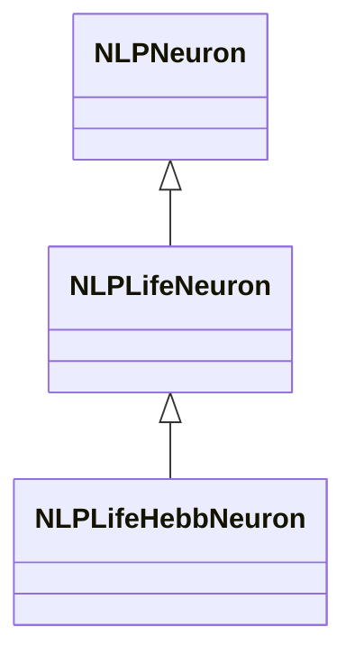
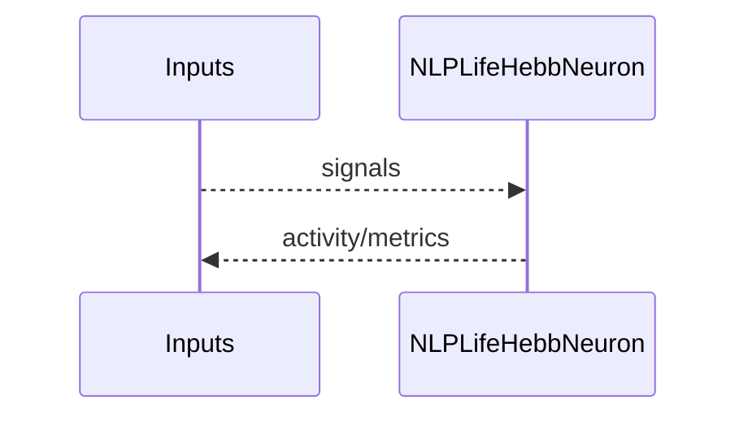
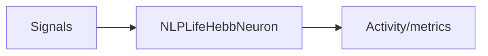

## NLPLifeHebbNeuron — LP Life нейрон с Hebb

**Класс**: `NLPLifeHebbNeuron` — LP-нейрон с «жизненным» расширением и Hebb-пластичностью.  
**Регистрация**: `NPulseLibrary.cpp` → `UploadClass("NLPLifeHebbNeuron", ...)`.  
**Storage**: `ClassName = "NLPLifeHebbNeuron"`.

### Lifecycle
- **ADefault**: параметры Life/LP/Hebb.
- **ABuild**: подключение входов/синапсов.
- **AReset**: сброс состояния/метрик.
- **ACalculate**: шаг LP Life с Hebb-обновлением.

### I/O
- Вход: сигналы/токи.
- Выход: активность/спайк/метрики.



Пояснение: диаграмма классов показывает место компонента в иерархии и ключевые связи.



Пояснение: диаграмма последовательности показывает типовой сценарий взаимодействия и порядок вызовов.



Пояснение: блок-схема показывает поток данных/сигналов (входы → компонент → выходы).

### Config snippet

```ini
[Component]
ClassName = NLPLifeHebbNeuron
Name = LPLifeHebb1
```

---

## NLPLifeHebbNeuron — LP Life neuron with Hebb (EN)

LP Life neuron variant with Hebbian plasticity.


Description: this class diagram shows the component position in the type hierarchy and key relations.


Description: this sequence diagram shows a typical runtime interaction and call order.


Description: this flowchart shows the data/signal flow (inputs → component → outputs).
