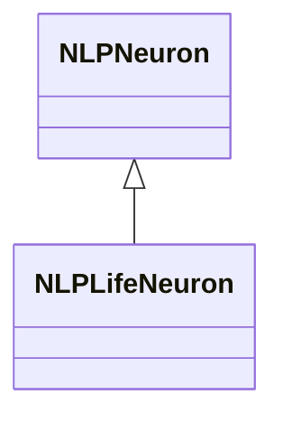
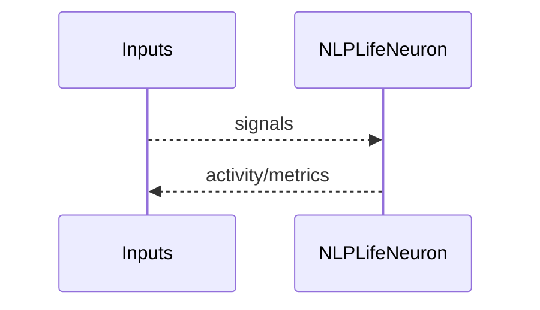
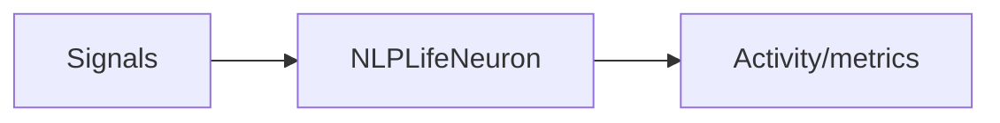

## NLPLifeNeuron — LP Life нейрон

**Класс**: `NLPLifeNeuron` — LP-нейрон с расширением Life (метрики/жизненность).  
**Регистрация**: `NPulseLibrary.cpp` → `UploadClass("NLPLifeNeuron", ...)`.  
**Storage**: `ClassName = "NLPLifeNeuron"`.

### Lifecycle
- **ADefault**: параметры LP/Life.
- **ABuild**: подключение входов/синапсов.
- **AReset**: сброс состояния/метрик Life.
- **ACalculate**: шаг LP-модели + обновление метрик Life.

### I/O
- Вход: сигналы/токи.
- Выход: активность/метрики.



Пояснение: диаграмма классов показывает место компонента в иерархии и ключевые связи.



Пояснение: диаграмма последовательности показывает типовой сценарий взаимодействия и порядок вызовов.



Пояснение: блок-схема показывает поток данных/сигналов (входы → компонент → выходы).

### Config snippet

```ini
[Component]
ClassName = NLPLifeNeuron
Name = LPLife1
```

---

## NLPLifeNeuron — LP Life neuron (EN)

LP neuron with Life metrics/behaviour.


Description: this class diagram shows the component position in the type hierarchy and key relations.


Description: this sequence diagram shows a typical runtime interaction and call order.


Description: this flowchart shows the data/signal flow (inputs → component → outputs).
