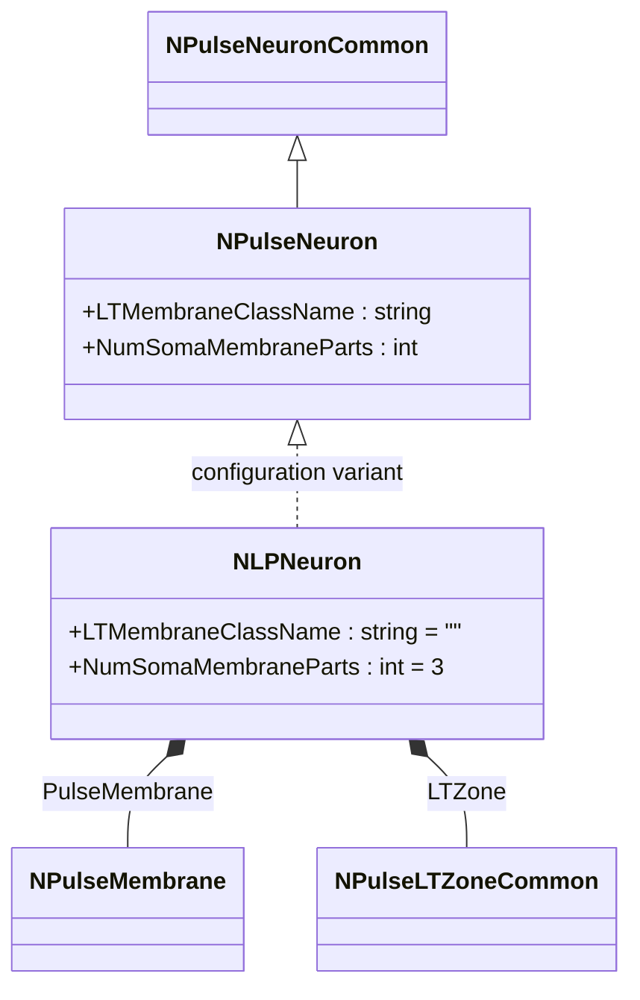
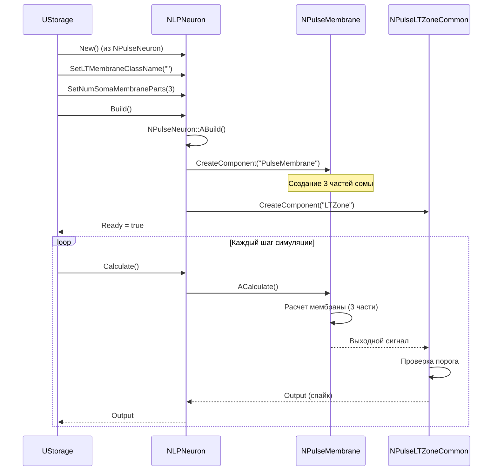
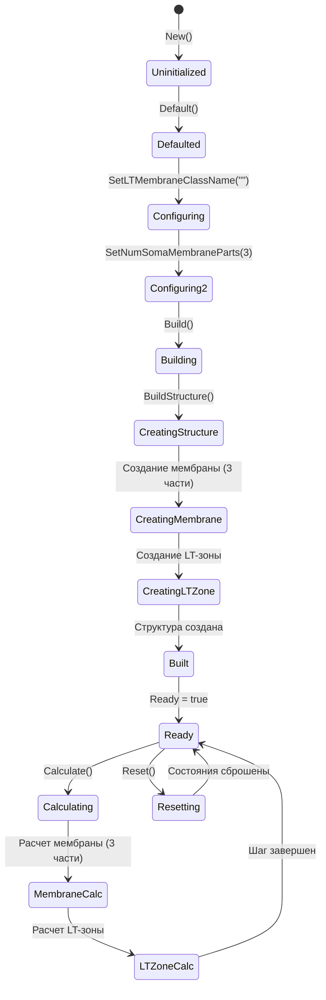
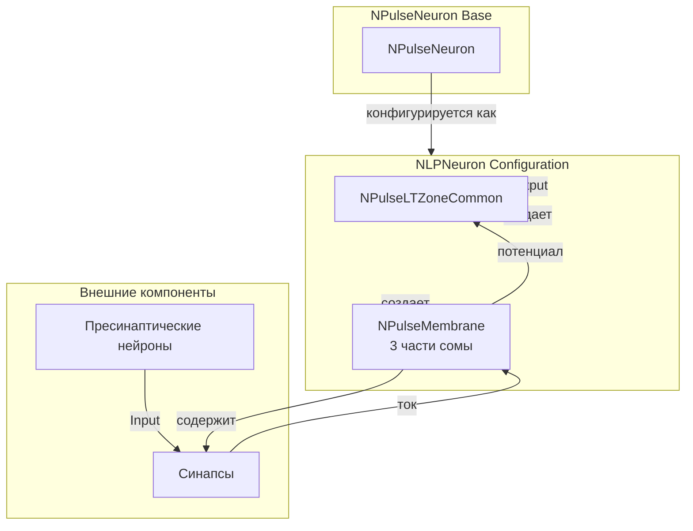
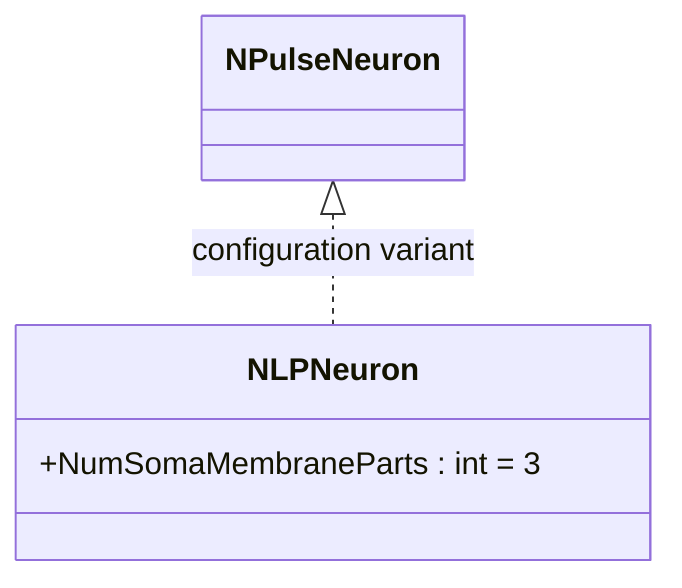
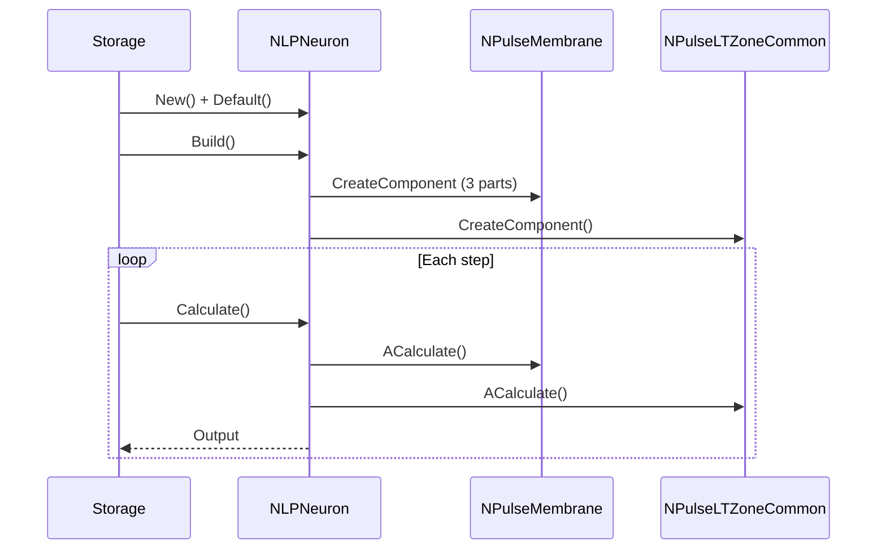
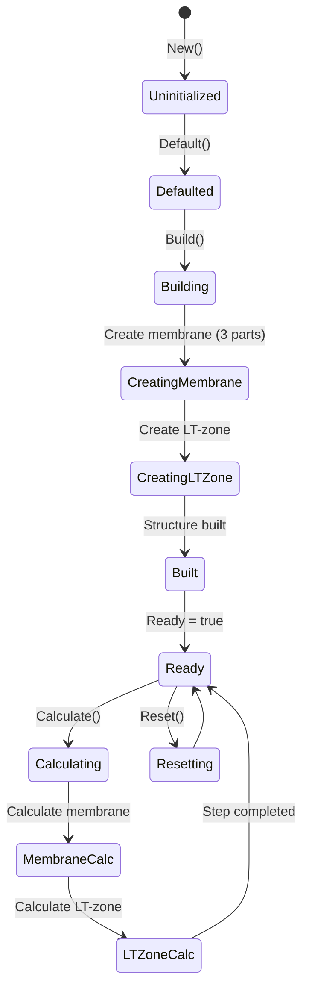
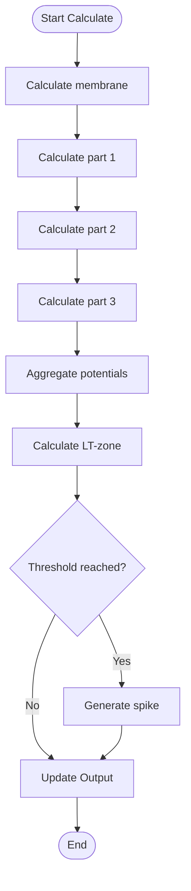
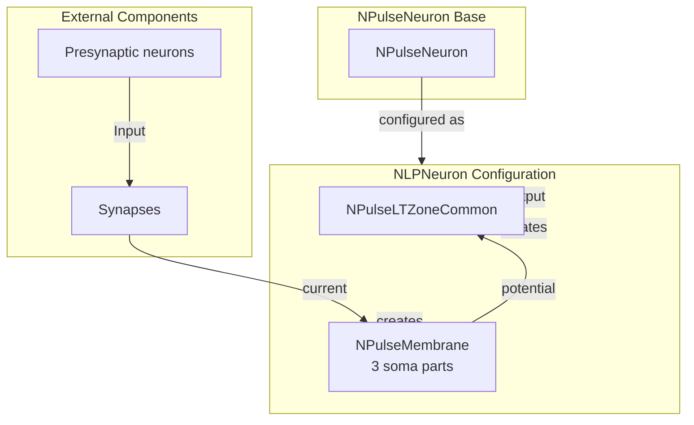

# NLPNeuron — крупный импульсный нейрон (LP-нейрон)

## RU

### Назначение

**Класс**: `NLPNeuron` — конфигурационный вариант крупного импульсного нейрона (Large Pulse Neuron).  
**Регистрация**: `NPulseLibrary.cpp` → `UploadClass("NLPNeuron", ...)`.  
**Storage-инстансы**: `ClassName = "NLPNeuron"` в `Bin/Configs/*/Model_*.xml`.

`NLPNeuron` является конфигурационным вариантом базового класса `NPulseNeuron` с предустановленными параметрами для крупных нейронов. Создается из `NPulseNeuron` с настройками:
- `LTMembraneClassName = ""` — без LT-мембраны
- `NumSomaMembraneParts = 3` — три части сомы

LP-нейроны (Large Pulse Neurons) — это крупные нейроны с расширенной структурой, используемые для более сложных экспериментов и сетей.

**Использование:** Сложные эксперименты, крупные нейронные сети, моделирование крупных нейронов

### UML-диаграмма классов



**Иерархия наследования:**
- `NPulseNeuronCommon` — общий импульсный нейрон
- `NPulseNeuron` — импульсный нейрон с параметрами структурирования
- `NLPNeuron` — конфигурационный вариант для крупных нейронов

**Внутренняя структура:**
- **PulseMembrane** (`NPulseMembrane`) — стандартная мембрана (3 части сомы)
- **LTZone** (`NPulseLTZoneCommon`) — стандартная LT-зона
- Без LT-мембраны (LTMembraneClassName = "")

### UML-диаграмма последовательности



**Жизненный цикл:**
1. **Создание**: `NLPNeuron` создается из `NPulseNeuron` с настройкой параметров
2. **Настройка**: Устанавливается отсутствие LT-мембраны, три части сомы
3. **Сборка**: Автоматически создается структура нейрона с расширенной мембраной
4. **Расчет**: На каждом шаге рассчитываются мембрана (3 части) и LT-зона

### UML-диаграмма состояний



**Состояния:**
- **Uninitialized** — создан, но не инициализирован
- **Defaulted** — параметры установлены по умолчанию
- **Configuring** — настройка параметров структуры
- **Building** — выполняется сборка
- **CreatingStructure** — создание структуры нейрона
- **CreatingMembrane** — создание мембраны с 3 частями сомы
- **CreatingLTZone** — создание LT-зоны
- **Built** — структура нейрона построена
- **Ready** — готов к выполнению расчетов
- **Calculating** — выполняется расчет нейрона
- **MembraneCalc** — расчет мембраны (3 части)
- **LTZoneCalc** — расчет LT-зоны
- **Resetting** — выполняется сброс состояний

### UML-диаграмма активности

```mermaid
flowchart TD
    Start([Start Calculate]) --> CallBase[NPulseNeuronCommon::ACalculate]
    CallBase --> CalcMembrane[Расчет мембраны (3 части)]
    CalcMembrane --> CalcMembranePart1[Расчет части 1 сомы]
    CalcMembranePart1 --> CalcMembranePart2[Расчет части 2 сомы]
    CalcMembranePart2 --> CalcMembranePart3[Расчет части 3 сомы]
    CalcMembranePart3 --> AggregateMembrane[Агрегация потенциалов]
    AggregateMembrane --> CalcLTZone[Расчет LT-зоны]
    CalcLTZone --> CheckThreshold{Порог достигнут?}
    CheckThreshold -->|Да| GenerateSpike[Генерация спайка]
    CheckThreshold -->|Нет| UpdateOutput[Обновление Output]
    GenerateSpike --> UpdateOutput
    UpdateOutput --> End([End])
```

**Алгоритм расчета:**
1. Вызов базового расчета (`NPulseNeuronCommon::ACalculate()`)
2. Расчет мембраны: последовательный расчет 3 частей сомы
3. Агрегация потенциалов от всех частей мембраны
4. Расчет LT-зоны: проверка порога генерации спайка
5. Генерация спайка при достижении порога
6. Обновление выходного сигнала нейрона

### UML-диаграмма компонентов



**Зависимости:**
- **Базовый класс**: `NPulseNeuron` (конфигурационный вариант)
- **Внутренние компоненты**: `NPulseMembrane` (мембрана с 3 частями сомы), `NPulseLTZoneCommon` (LT-зона)
- **Внешние компоненты**: синапсы, пресинаптические нейроны

### Свойства

`NLPNeuron` использует все свойства базового класса `NPulseNeuron` с параметрами:
- `LTMembraneClassName = ""`
- `NumSomaMembraneParts = 3`

### Методы

`NLPNeuron` использует все методы базового класса `NPulseNeuron`.

### Использование в конфигурациях

`NLPNeuron` используется в экспериментах с крупными нейронами:

- **Крупные нейронные сети**: `Bin/Configs/!OldConfigs/*/Model_*.xml` (где требуется расширенная структура нейронов)

**Типичные значения параметров:**
- **LTMembraneClassName**: "" (без LT-мембраны)
- **NumSomaMembraneParts**: 3 (три части сомы для расширенной структуры)
- **MembraneClassName**: "NPulseMembrane" (стандартная мембрана)
- **LTZoneClassName**: "NPulseLTZoneCommon" (стандартная LT-зона)

### См. также

- [`NPulseNeuron`](NPulseNeuron.md) — импульсный нейрон с параметрами структурирования
- [`NSPNeuron`](NSPNeuron.md) — мелкий импульсный нейрон (SP-нейрон)
- [`NLPLifeNeuron`](NLPLifeNeuron.md) — крупный живой нейрон
- [`NLPHebbNeuron`](NLPHebbNeuron.md) — крупный нейрон с синапсами Хебба
- [Architecture.md](../Architecture.md) — архитектура библиотеки

---

## EN

### Purpose

**Class**: `NLPNeuron` — configuration variant of large spiking neuron (Large Pulse Neuron).  
**Registration**: `NPulseLibrary.cpp` → `UploadClass("NLPNeuron", ...)`.  
**Instances**: `ClassName = "NLPNeuron"` in `Bin/Configs/*/Model_*.xml`.

`NLPNeuron` is a configuration variant of the base class `NPulseNeuron` with preset parameters for large neurons. Created from `NPulseNeuron` with settings:
- `LTMembraneClassName = ""` — without LT-membrane
- `NumSomaMembraneParts = 3` — three soma parts

LP-neurons (Large Pulse Neurons) are large neurons with extended structure, used for more complex experiments and networks.

**Usage:** Complex experiments, large neural networks, modeling large neurons

### UML Class Diagram



### UML Sequence Diagram



### UML State Diagram



### UML Activity Diagram



### UML Component Diagram



### Properties

`NLPNeuron` uses all properties of base class `NPulseNeuron` with parameters:
- `LTMembraneClassName = ""` — without LT-membrane
- `NumSomaMembraneParts = 3` — three soma parts

### Methods

`NLPNeuron` uses all methods of base class `NPulseNeuron`.

### Usage in configurations

`NLPNeuron` is used in large neuron experiments:

- **Large neural networks**: `Bin/Configs/!OldConfigs/*/Model_*.xml` (where extended neuron structure is required)

**Typical parameter values:**
- **LTMembraneClassName**: "" (without LT-membrane)
- **NumSomaMembraneParts**: 3 (three soma parts for extended structure)
- **MembraneClassName**: "NPulseMembrane" (standard membrane)
- **LTZoneClassName**: "NPulseLTZoneCommon" (standard LT-zone)

**Features:**
- Extended structure: three soma parts for more complex calculations
- Large neurons: suitable for complex experiments and networks
- Configuration variant: created from `NPulseNeuron` with preset parameters

### See Also

- [`NPulseNeuron`](NPulseNeuron.md) — spiking neuron with structuring parameters
- [`NSPNeuron`](NSPNeuron.md) — small spiking neuron (SP-neuron)
- [`NLPLifeNeuron`](NLPLifeNeuron.md) — large living neuron
- [`NLPHebbNeuron`](NLPHebbNeuron.md) — large neuron with Hebbian synapses
- [Architecture.md](../Architecture.md) — library architecture
