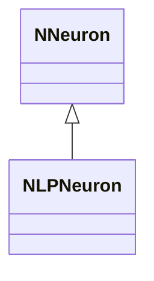
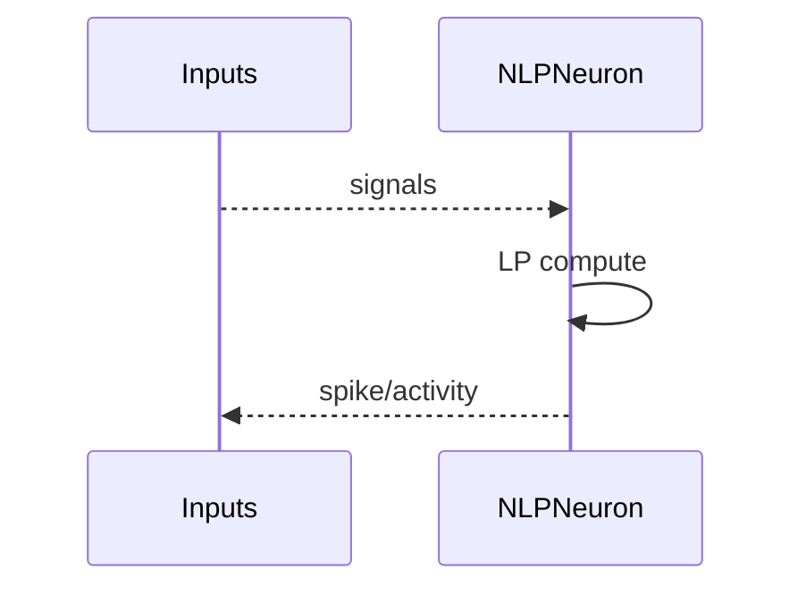
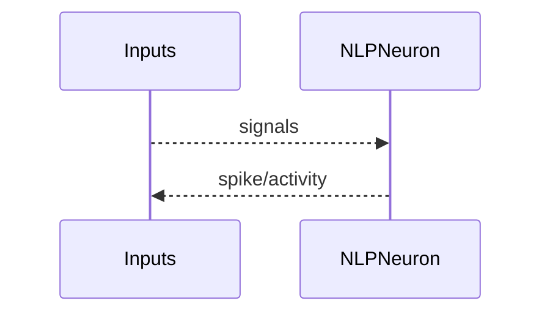

## NLPNeuron — нейрон LP (Nmsdk-PulseLib)

**Класс**: `NLPNeuron` — вариант нейрона с LP-механизмом.  
**Регистрация**: `NPulseLibrary.cpp` → `UploadClass("NLPNeuron", ...)`.  
**Storage**: `ClassName = "NLPNeuron"`.

### Lifecycle
- **ADefault**: параметры LP.
- **ABuild**: подключение входов/выходов.
- **AReset**: сброс.
- **ACalculate**: расчёт активации по LP-модели.

### I/O
- Вход: токи/спайки.
- Выход: активация/спайк.



Пояснение: диаграмма классов показывает место компонента в иерархии и ключевые связи.



Пояснение: диаграмма последовательности показывает типовой сценарий взаимодействия и порядок вызовов.


Пояснение: блок-схема показывает поток данных/сигналов (входы → компонент → выходы).

### Config snippet

```ini
[Component]
ClassName = NLPNeuron
Name = LPNeuron1
```

---

## NLPNeuron — LP neuron (EN)

LP-model neuron computing activity/spikes from inputs.


Description: this class diagram shows the component position in the type hierarchy and key relations.



Description: this sequence diagram shows a typical runtime interaction and call order.


Description: this flowchart shows the data/signal flow (inputs → component → outputs).
