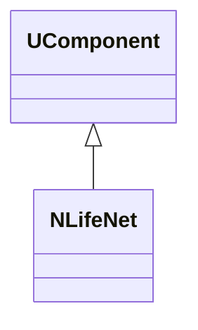
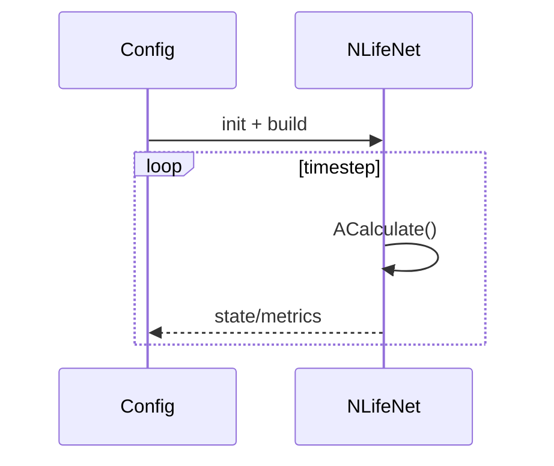
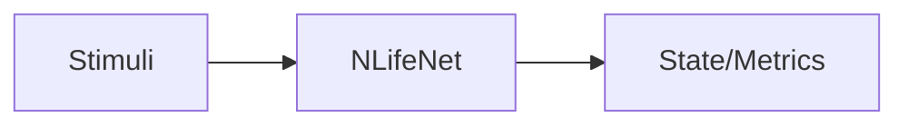
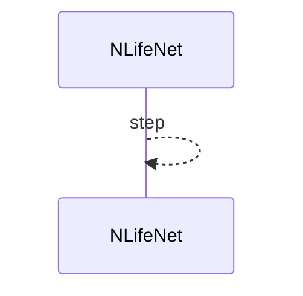

## NLifeNet — сетевая модель Life (Nmsdk-PulseLib)

**Класс**: `NLifeNet` — сеть с жизненным циклом/метриками.  
**Регистрация**: `NPulseLibrary.cpp` → `UploadClass("NLifeNet", ...)`.  
**Storage**: `ClassName = "NLifeNet"`.

### Lifecycle
- **ADefault**: параметры «жизненности»/метрик.
- **ABuild**: сборка узлов/связей.
- **AReset**: сброс состояния.
- **ACalculate**: шаг симуляции с учётом правил Life.

### I/O
- Вход: стимулы/начальные состояния.
- Выход: состояние/метрики сети.



Пояснение: диаграмма классов показывает место компонента в иерархии и ключевые связи.



Пояснение: диаграмма последовательности показывает типовой сценарий взаимодействия и порядок вызовов.



Пояснение: блок-схема показывает поток данных/сигналов (входы → компонент → выходы).

### Config snippet

```ini
[Component]
ClassName = NLifeNet
Name = LifeNet1
```

---

## NLifeNet — life-like network (EN)

Life-cycle aware network producing state/metrics.


Description: this class diagram shows the component position in the type hierarchy and key relations.



Description: this sequence diagram shows a typical runtime interaction and call order.


Description: this flowchart shows the data/signal flow (inputs → component → outputs).
