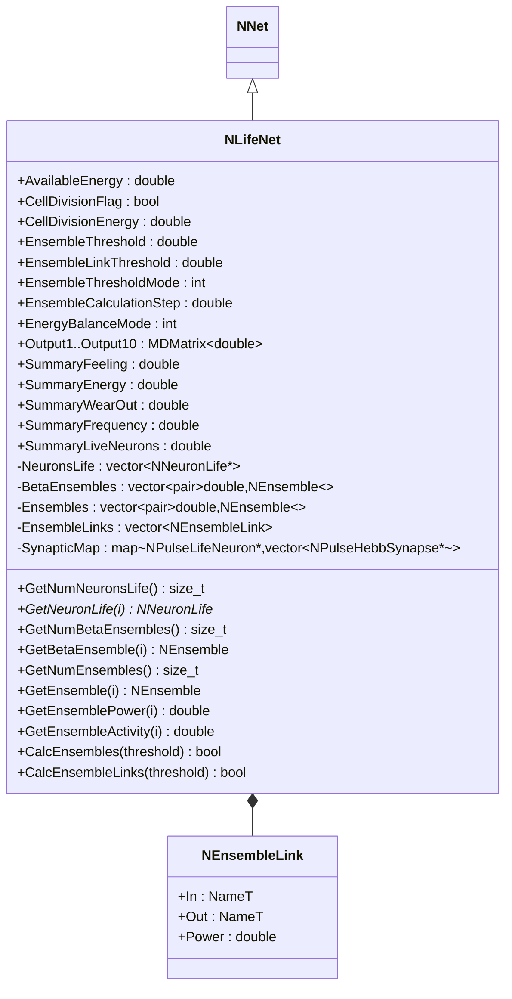
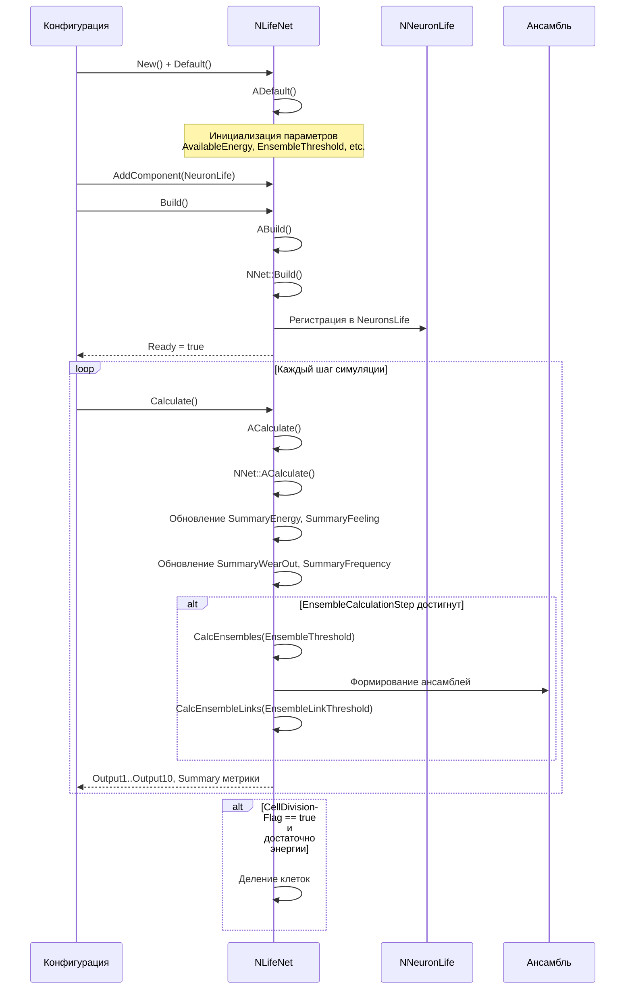
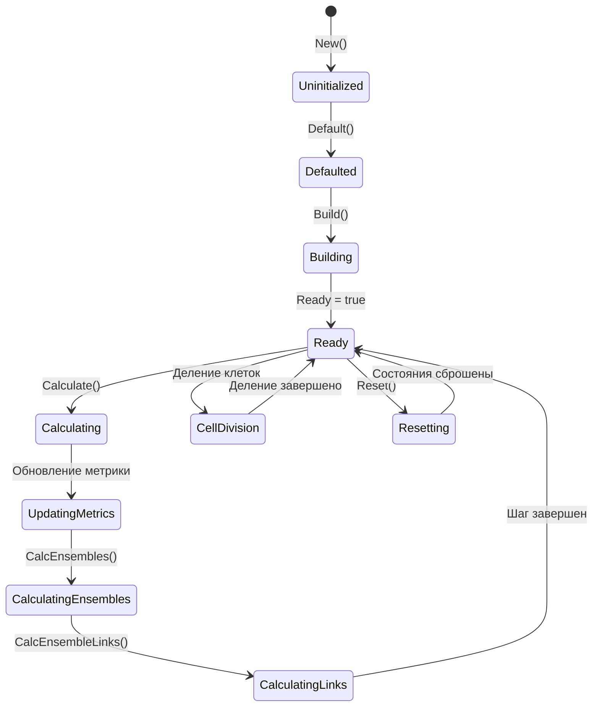
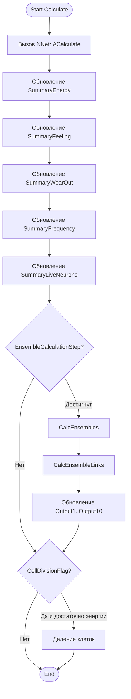
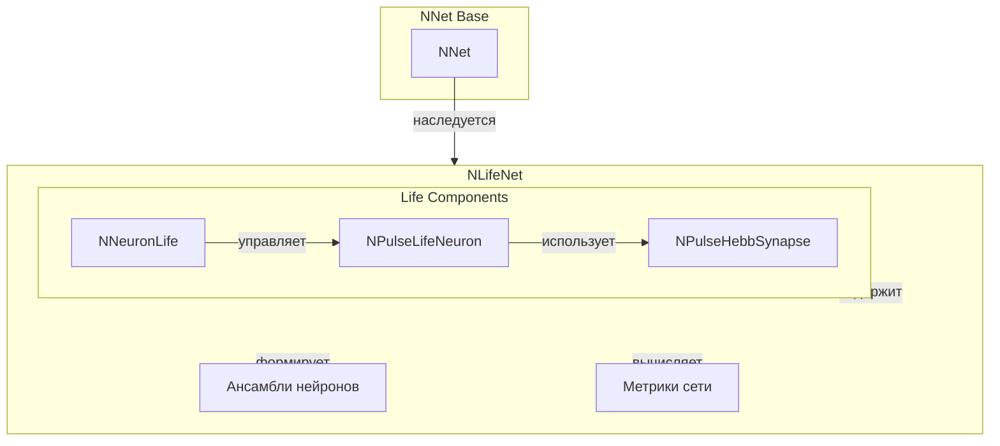
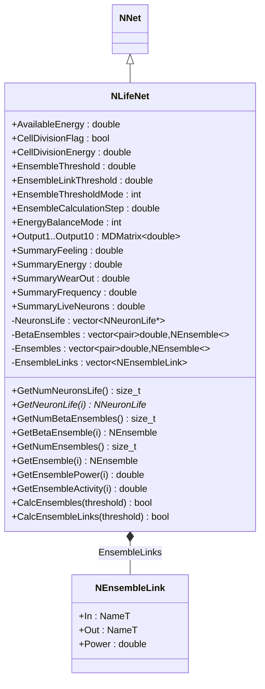
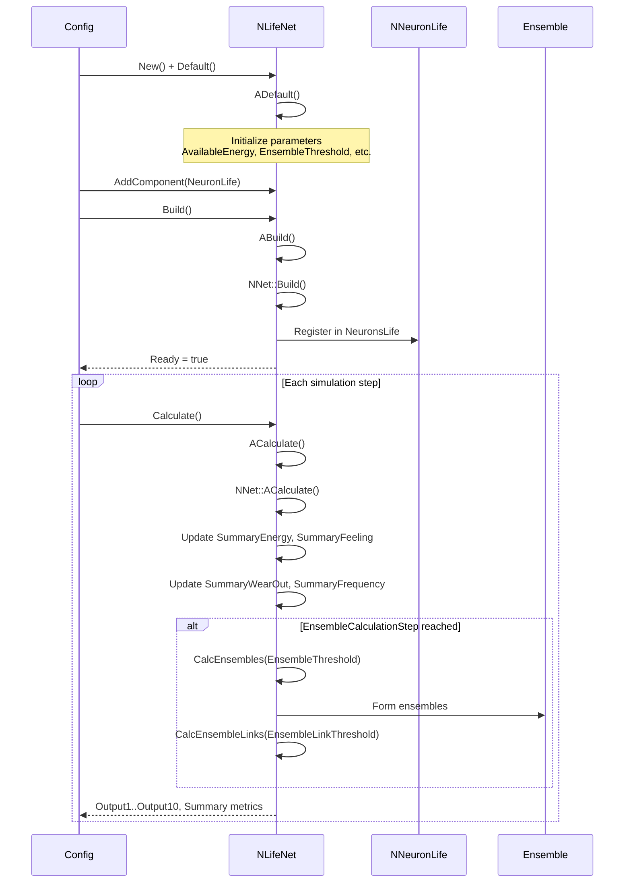
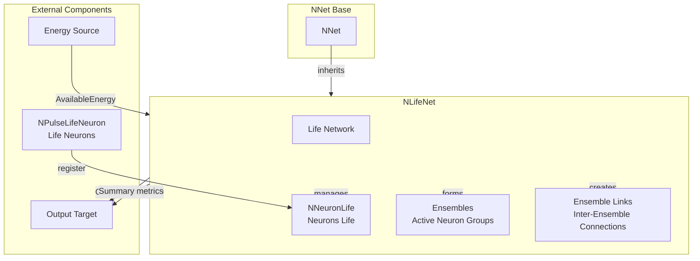

# NLifeNet — сетевая модель Life (Nmsdk-PulseLib)

**Каталог компонентов:** [Component-Catalog.md](../Component-Catalog.md).

## RU

### Назначение

**Класс**: `NLifeNet` — сеть с жизненным циклом/метриками нейронов.
**Регистрация**: `NPulseLibrary.cpp` → `UploadClass("NLifeNet", ...)`.
**Storage**: `ClassName = "NLifeNet"`.

`NLifeNet` расширяет `NNet` функциональностью управления жизненным циклом нейронов. Сеть отслеживает энергетический баланс, износ нейронов, формирует ансамбли активных нейронов и управляет делением клеток. Используется для моделирования биологически инспирированных сетей с адаптивной структурой. В нейроморфных системах [A] такие сети поддерживают структурную адаптацию (деление клеток, ансамбли), параметрическую адаптацию и связаны с механизмами моторной памяти и управления движением по траектории.

### UML-диаграмма классов



**Иерархия наследования:**
- `NNet` — базовая сеть
- `NLifeNet` — сеть с жизненным циклом нейронов

**Ключевые свойства:**
- Параметры жизненного цикла: `AvailableEnergy`, `CellDivisionFlag`, `CellDivisionEnergy`
- Параметры ансамблей: `EnsembleThreshold`, `EnsembleLinkThreshold`, `EnsembleThresholdMode`
- Выходные метрики: `Output1`-`Output10`, `SummaryFeeling`, `SummaryEnergy`, `SummaryWearOut`, `SummaryFrequency`, `SummaryLiveNeurons`

### UML-диаграмма последовательности



**Жизненный цикл:**
1. **Инициализация**: Установка параметров жизненного цикла и ансамблей
2. **Сборка**: Регистрация компонентов `NNeuronLife` в векторе `NeuronsLife`
3. **Расчет**: На каждом шаге обновляются метрики сети и формируются ансамбли
4. **Деление клеток**: При достаточной энергии может происходить деление нейронов

### UML-диаграмма состояний



**Состояния:**
- **Uninitialized** — создан, но не инициализирован
- **Defaulted** — параметры установлены по умолчанию
- **Building** — структура сети строится, регистрируются нейроны с жизненным циклом
- **Ready** — готов к выполнению расчетов
- **Calculating** — выполняется расчет сети
- **UpdatingMetrics** — обновление суммарных метрик (энергия, износ, частота)
- **CalculatingEnsembles** — расчет ансамблей активных нейронов
- **CalculatingLinks** — расчет связей между ансамблями
- **CellDivision** — деление клеток (если включено и достаточно энергии)

### UML-диаграмма активности



**Алгоритм расчета:**
1. Вызов базового расчета сети (`NNet::ACalculate()`)
2. Обновление суммарных метрик сети
3. Периодический расчет ансамблей и их связей
4. Обновление выходных свойств
5. Деление клеток (если включено)

### UML-диаграмма компонентов



**Зависимости:**
- **Базовый класс**: `NNet`
- **Компоненты с жизненным циклом**: `NNeuronLife`, `NPulseLifeNeuron`, `NPulseHebbSynapse`
- **Структуры данных**: `NEnsemble` (вектор нейронов), `NEnsembleLink` (связь между ансамблями)

### Свойства

#### Параметры (ptPubParameter)

- **`AvailableEnergy`** (double) — доступная энергия в сети. Используется для деления клеток и поддержания жизнедеятельности нейронов.

- **`CellDivisionFlag`** (bool) — флаг разрешения деления клеток. Если `true`, нейроны могут делиться при достаточной энергии.

- **`CellDivisionEnergy`** (double) — энергия, необходимая для деления клетки.

- **`EnsembleThreshold`** (double) — порог для формирования ансамблей нейронов. Нейроны с активностью выше порога объединяются в ансамбли.

- **`EnsembleLinkThreshold`** (double) — порог для создания связей между ансамблями.

- **`EnsembleThresholdMode`** (int) — режим расчета порога ансамблей:
  - 0 — абсолютный порог
  - 1 — относительный порог (Gs)
  - 2 — относительный порог (Gs и другие метрики)

- **`EnsembleCalculationStep`** (double) — шаг расчета ансамблей. Ансамбли пересчитываются каждые N шагов симуляции.

- **`EnergyBalanceMode`** (int) — режим энергетического баланса:
  - 0 — без баланса
  - 1 — с балансом энергии

#### Выходные свойства (ptOutput | ptPubState)

- **`Output1` - `Output10`** (MDMatrix<double>) — выходные данные ансамблей (до 10 ансамблей).

- **`SummaryFeeling`** (double) — суммарное "ощущение" сети (сумма ощущений всех нейронов).

- **`SummaryEnergy`** (double) — суммарная энергия всех нейронов в сети.

- **`SummaryWearOut`** (double) — суммарный износ нейронов.

- **`SummaryFrequency`** (double) — суммарная частота спайков нейронов.

- **`SummaryLiveNeurons`** (double) — количество живых нейронов в сети.

### Методы

#### Публичные методы доступа к ансамблям

- **`GetNumNeuronsLife()`** → `size_t` — возвращает количество систем жизнеобеспечения нейронов.

- **`GetNeuronLife(size_t i)`** → `NNeuronLife*` — возвращает систему жизнеобеспечения нейрона по индексу.

- **`GetNumBetaEnsembles()`** → `size_t` — возвращает количество бета-ансамблей (промежуточных ансамблей).

- **`GetBetaEnsemble(size_t i)`** → `const NEnsemble&` — возвращает бета-ансамбль по индексу.

- **`GetBetaEnsemblePower(size_t i)`** → `double` — возвращает мощность бета-ансамбля.

- **`GetNumEnsembles()`** → `size_t` — возвращает количество финальных ансамблей.

- **`GetEnsemble(size_t i)`** → `const NEnsemble&` — возвращает ансамбль по индексу.

- **`GetEnsemblePower(size_t i)`** → `double` — возвращает мощность ансамбля.

- **`GetEnsembleName(size_t i)`** → `NameT` — возвращает имя ансамбля (составлено из имен нейронов).

- **`GetEnsembleActivity(size_t i)`** → `double` — возвращает абсолютную активность ансамбля (средняя частота нейронов).

- **`GetRelativeEnsembleActivity(size_t i)`** → `double` — возвращает относительную активность ансамбля.

- **`GetNumEnsembleLinks()`** → `size_t` — возвращает количество связей между ансамблями.

- **`GetEnsembleLink(size_t i)`** → `const NEnsembleLink&` — возвращает связь между ансамблями по индексу.

#### Защищенные методы

- **`CalcEnsembles(double threshold)`** → `bool` — вычисляет ансамбли нейронов с заданным порогом. Формирует бета-ансамбли и финальные ансамбли.

- **`CalcEnsembleLinks(double threshold)`** → `bool` — вычисляет связи между ансамблями с заданным порогом.

### Примеры использования

#### Пример 1: Создание сети с жизненным циклом

```cpp
// Создание сети
auto lifeNet = storage->CreateComponent<NLifeNet>();
lifeNet->SetName("LifeNetwork");

// Инициализация
lifeNet->Default();

// Настройка параметров жизненного цикла
lifeNet->AvailableEnergy = 1000.0;
lifeNet->CellDivisionFlag = true;
lifeNet->CellDivisionEnergy = 100.0;
lifeNet->EnsembleThreshold = 0.5;
lifeNet->EnsembleLinkThreshold = 0.3;
lifeNet->EnsembleCalculationStep = 10.0;

// Добавление нейронов с жизненным циклом
auto neuronLife = storage->CreateComponent<NNeuronLife>();
lifeNet->AddComponent(neuronLife);

// Сборка сети
lifeNet->Build();

// Использование
for (int step = 0; step < 1000; step++) {
    lifeNet->Calculate();

    // Периодический вывод метрик
    if (step % 100 == 0) {
        std::cout << "Energy: " << lifeNet->SummaryEnergy << std::endl;
        std::cout << "Live neurons: " << lifeNet->SummaryLiveNeurons << std::endl;
        std::cout << "Ensembles: " << lifeNet->GetNumEnsembles() << std::endl;
    }
}
```

#### Пример 2: Конфигурация XML

```xml
<Model Class="NLifeNet">
    <Parameters>
        <AvailableEnergy>1000.0</AvailableEnergy>
        <CellDivisionFlag>1</CellDivisionFlag>
        <CellDivisionEnergy>100.0</CellDivisionEnergy>
        <EnsembleThreshold>0.5</EnsembleThreshold>
        <EnsembleLinkThreshold>0.3</EnsembleLinkThreshold>
        <EnsembleThresholdMode>1</EnsembleThresholdMode>
        <EnsembleCalculationStep>10.0</EnsembleCalculationStep>
        <EnergyBalanceMode>1</EnergyBalanceMode>
    </Parameters>
    <Components>
        <NeuronLife1 Class="NNeuronLife">
            <!-- Параметры жизненного цикла нейрона -->
        </NeuronLife1>
    </Components>
</Model>
```

### Использование в конфигурациях

`NLifeNet` используется в экспериментах с жизненным циклом нейронов:

- Эксперименты с адаптивной структурой сети
- Моделирование эволюции нейронных ансамблей
- Исследования энергетического баланса в нейросетях

## Источники

См. [Literature-References.md](../Literature-References.md): **[A]** (структурная адаптация, моторная память); **neuromodeler.ru** (жизнеобеспечение, ансамбли), **15**.

### См. также

- [`NNet`](NNet.md) — базовая сеть
- [`NNeuronLife`](NNeuronLife.md) — система жизнеобеспечения нейрона
- [`NPulseLifeNeuron`](NPLifeNeuron.md) — нейрон с жизненным циклом
- [Architecture.md](../Architecture.md) — архитектура библиотеки

---

## EN

### Purpose

**Class**: `NLifeNet` — network with neuron lifecycle/metrics.
**Registration**: `NPulseLibrary.cpp` → `UploadClass("NLifeNet", ...)`.
**Storage**: `ClassName = "NLifeNet"`.

`NLifeNet` extends `NNet` with neuron lifecycle management functionality. The network tracks energy balance, neuron wear, forms ensembles of active neurons, and manages cell division. Used for modeling biologically inspired networks with adaptive structure. In neuromorphic systems [A], such networks support structural adaptation (cell division, ensembles), parametric adaptation, and relate to motor memory and trajectory control mechanisms.

### UML Class Diagram



**Inheritance hierarchy:**
- `NNet` — base network
- `NLifeNet` — network with neuron lifecycle

**Key properties:**
- Lifecycle parameters: `AvailableEnergy`, `CellDivisionFlag`, `CellDivisionEnergy`
- Ensemble parameters: `EnsembleThreshold`, `EnsembleLinkThreshold`, `EnsembleThresholdMode`
- Output metrics: `Output1`-`Output10`, `SummaryFeeling`, `SummaryEnergy`, `SummaryWearOut`, `SummaryFrequency`, `SummaryLiveNeurons`

### UML Sequence Diagram



### UML State Diagram

```mermaid
stateDiagram-v2
    [*] --> Uninitialized: New()
    Uninitialized --> Defaulted: Default()
    Defaulted --> Building: AddComponent()
    Building --> Built: Build()
    Built --> Ready: Ready = true
    Ready --> Calculating: Calculate()
    Calculating --> UpdateMetrics: Update summary metrics
    UpdateMetrics --> CheckEnsembleStep{EnsembleCalculationStep?}
    CheckEnsembleStep -->|Reached| CalcEnsembles: CalcEnsembles()
    CheckEnsembleStep -->|Not reached| Ready: Step completed
    CalcEnsembles --> CalcLinks: CalcEnsembleLinks()
    CalcLinks --> Ready: Step completed
    Ready --> Resetting: Reset()
    Resetting --> Ready: States reset
```

### UML Activity Diagram

```mermaid
flowchart TD
    Start([Start Calculate]) --> CalcBase[Call NNet::ACalculate]
    CalcBase --> UpdateEnergy[Update SummaryEnergy]
    UpdateEnergy --> UpdateFeeling[Update SummaryFeeling]
    UpdateFeeling --> UpdateWearOut[Update SummaryWearOut]
    UpdateWearOut --> UpdateFrequency[Update SummaryFrequency]
    UpdateFrequency --> CheckEnsembleStep{EnsembleCalculationStep reached?}
    CheckEnsembleStep -->|Yes| CalcEnsembles[CalcEnsembles(threshold)]
    CheckEnsembleStep -->|No| End([End])
    CalcEnsembles --> CalcLinks[CalcEnsembleLinks(threshold)]
    CalcLinks --> End
```

### UML Component Diagram



### Properties

- `AvailableEnergy` — available energy for network
- `CellDivisionFlag` — flag for cell division
- `CellDivisionEnergy` — energy required for cell division
- `EnsembleThreshold` — threshold for ensemble formation
- `EnsembleLinkThreshold` — threshold for ensemble link formation
- `EnsembleThresholdMode` — mode for ensemble threshold calculation (0 — absolute, 1 — relative to Gs, 2 — relative to Gs average)
- `EnsembleCalculationStep` — step for ensemble calculation (0 — every step)
- `EnergyBalanceMode` — energy balance mode (0 — disabled, 1 — enabled)
- `Output1`-`Output10` — output signals (network activity metrics)
- `SummaryFeeling` — summary feeling metric
- `SummaryEnergy` — summary energy metric
- `SummaryWearOut` — summary wear out metric
- `SummaryFrequency` — summary frequency metric
- `SummaryLiveNeurons` — summary live neurons count

### Methods

- `GetNumNeuronsLife()` — get number of neurons with life support
- `GetNeuronLife(i)` — get neuron life support by index
- `GetNumBetaEnsembles()` — get number of beta ensembles
- `GetBetaEnsemble(i)` — get beta ensemble by index
- `GetNumEnsembles()` — get number of ensembles
- `GetEnsemble(i)` — get ensemble by index
- `GetEnsemblePower(i)` — get ensemble power by index
- `GetEnsembleActivity(i)` — get ensemble activity by index
- `CalcEnsembles(threshold)` — calculate ensembles with given threshold
- `CalcEnsembleLinks(threshold)` — calculate ensemble links with given threshold
- `ADefault()` — initialize default parameters
- `ABuild()` — build network structure
- `ACalculate()` — perform one simulation step

### Usage in configurations

`NLifeNet` is used for modeling biologically inspired networks with adaptive structure:

- **Life support modeling**: `Bin/Configs/*/Model_*.xml` (where neuron lifecycle modeling is required)
- **Ensemble formation**: experiments with ensemble formation and inter-ensemble connections
- **Energy management**: experiments with energy balance and cell division

**Features:**
- Lifecycle management: tracks energy, wear out, and other neuron metrics
- Ensemble formation: forms ensembles of active neurons
- Inter-ensemble links: creates links between ensembles
- Energy balance: manages energy distribution among neurons
- Cell division: supports cell division when energy is available

**Typical parameter values:**
- **AvailableEnergy**: 100-10000 (available energy for network)
- **EnsembleThreshold**: 0.1-1.0 (threshold for ensemble formation)
- **EnsembleLinkThreshold**: 0.1-1.0 (threshold for ensemble link formation)
- **EnsembleCalculationStep**: 0.0 (calculate every step) or >0 (calculate at intervals)

### References

See [Literature-References.md](../Literature-References.md): **[A]** (structural adaptation, motor memory); **neuromodeler.ru** (life support, ensembles), **15**.

### See Also

- [`NNet`](NNet.md) — base network
- [`NNeuronLife`](NNeuronLife.md) — neuron lifecycle system
- [Architecture.md](../Architecture.md) — library architecture
