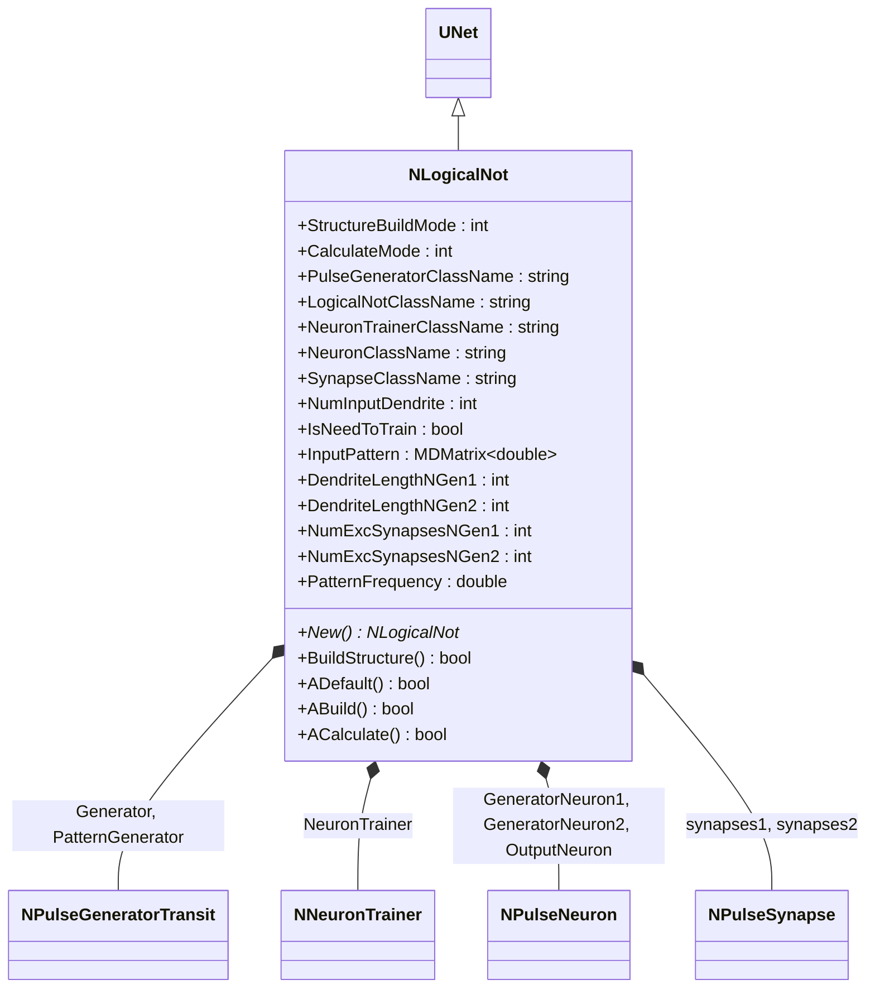
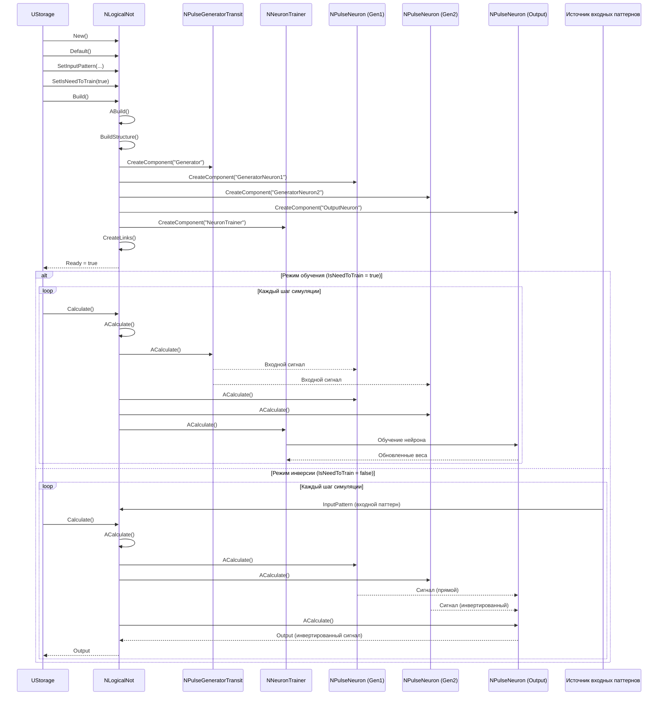
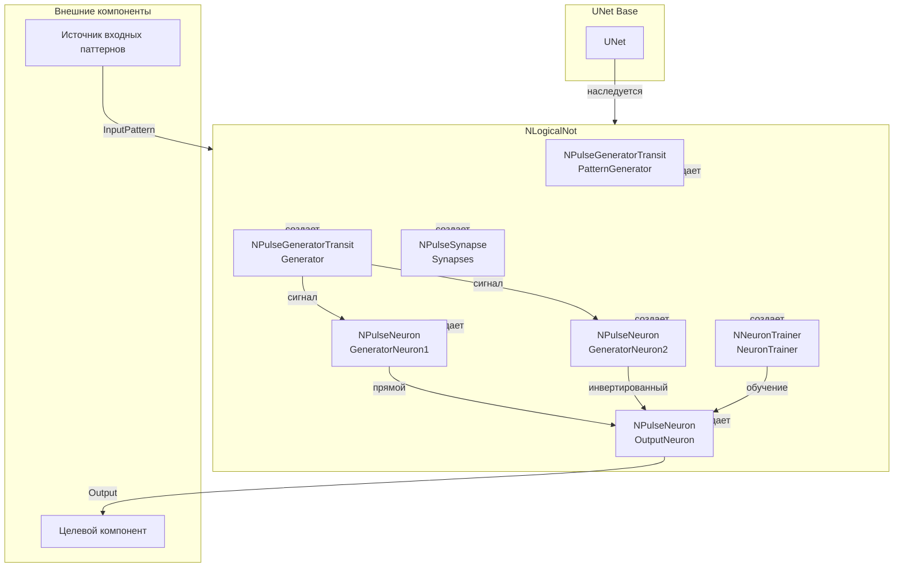
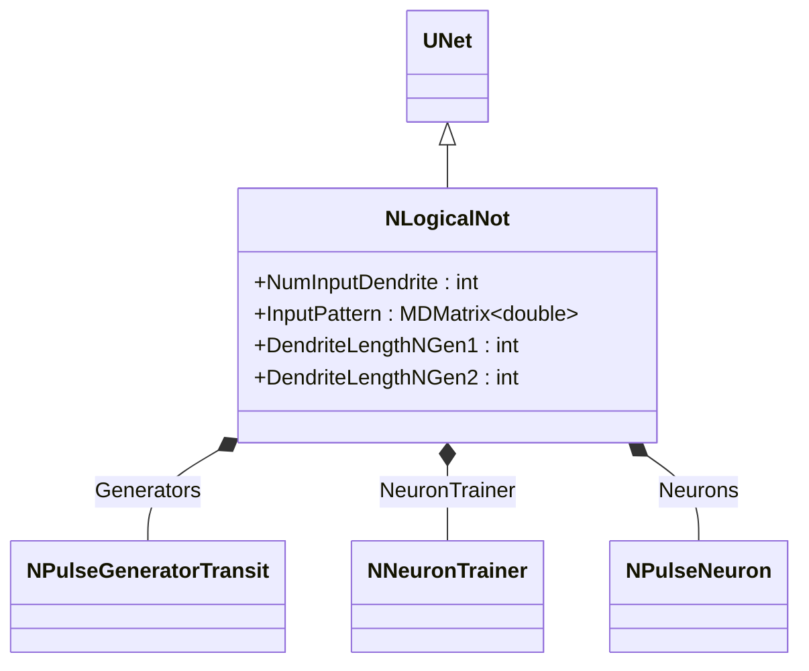
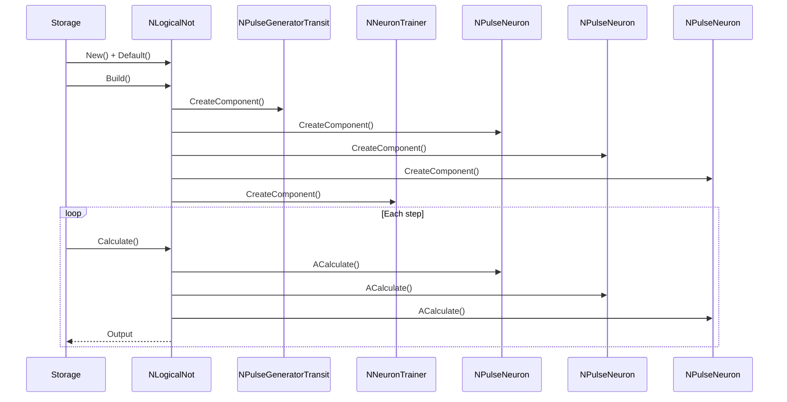
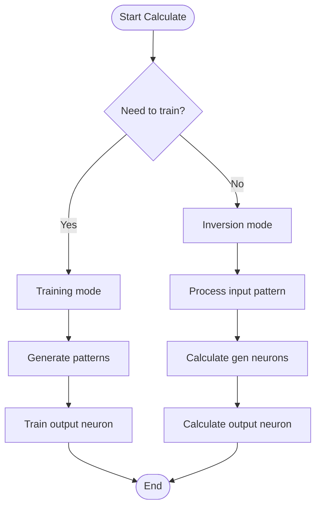
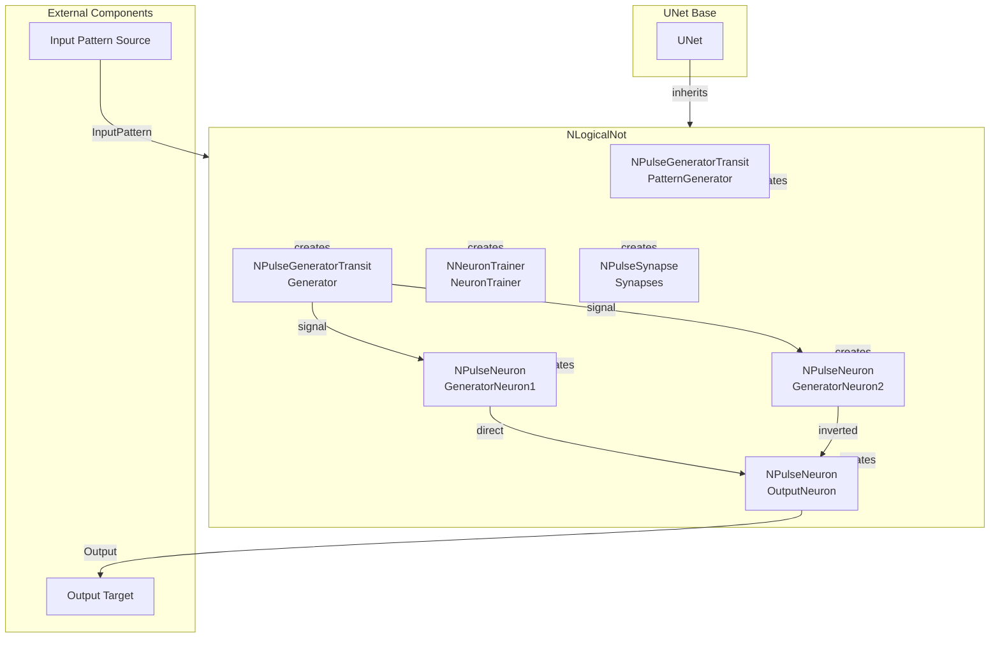

# NLogicalNot — логическое НЕ

## RU

### Назначение

**Класс**: `NLogicalNot` — компонент для реализации логической операции НЕ (инверсии) на основе нейронных сетей.  
**Регистрация**: `NPulseLibrary.cpp` → `UploadClass("NLogicalNot", ...)`.  
**Storage-инстансы**: `ClassName = "NLogicalNot"` в `Bin/Configs/*/Model_*.xml`.

`NLogicalNot` реализует логическое НЕ, создавая структуру нейронов для инверсии входного сигнала. Компонент автоматически строит структуру нейронов, обучает их и выполняет логическую инверсию входного паттерна (`InputPattern`).

**Использование:** Логическая инверсия сигналов, моделирование логических операций

### UML-диаграмма классов



**Иерархия наследования:**
- `UNet` — базовая сеть Rdk Framework
- `NLogicalNot` — логическое НЕ

**Связи:**
- Использует генераторы для входных сигналов
- Использует тренер для обучения нейронов
- Использует нейроны для генерации и выхода
- Использует синапсы для связей

**Внутренняя структура:**
- **Generator** (`NPulseGeneratorTransit`) — генератор для входных сигналов
- **PatternGenerator** (`NPulseGeneratorTransit`) — генератор паттернов
- **NeuronTrainer** (`NNeuronTrainer`) — тренер для обучения нейронов
- **GeneratorNeuron1** (`NPulseNeuron`) — первый генераторный нейрон
- **GeneratorNeuron2** (`NPulseNeuron`) — второй генераторный нейрон
- **OutputNeuron** (`NPulseNeuron`) — выходной нейрон
- **Synapses** (`NPulseSynapse`) — синапсы для связей

### UML-диаграмма последовательности



**Жизненный цикл:**
1. **Инициализация**: Установка параметров логического НЕ
2. **Сборка структуры**: Создание генераторов, нейронов, тренера и синапсов
3. **Режим обучения**: Обучение выходного нейрона на инвертированных паттернах
4. **Режим инверсии**: Инверсия входного паттерна через обученный нейрон

### UML-диаграмма состояний

```mermaid
stateDiagram-v2
    [*] --> Uninitialized: New()
    Uninitialized --> Defaulted: Default()
    Defaulted --> Building: Build()
    Building --> CreatingGenerator: Создание Generator
    CreatingGenerator --> CreatingGenNeuron1: Создание GeneratorNeuron1
    CreatingGenNeuron1 --> CreatingGenNeuron2: Создание GeneratorNeuron2
    CreatingGenNeuron2 --> CreatingOutputNeuron: Создание OutputNeuron
    CreatingOutputNeuron --> CreatingTrainer: Создание NeuronTrainer
    CreatingTrainer --> CreatingSynapses: Создание синапсов
    CreatingSynapses --> Linking: Создание связей
    Linking --> Built: Структура построена
    Built --> Ready: Ready = true
    Ready --> Calculating: Calculate()
    Calculating --> CheckMode{IsNeedToTrain?}
    CheckMode -->|Да| Training: Режим обучения
    CheckMode -->|Нет| Inversion: Режим инверсии
    Training --> GeneratePatterns: Генерация обучающих паттернов
    GeneratePatterns --> TrainOutputNeuron: Обучение OutputNeuron
    TrainOutputNeuron --> Ready: Шаг завершен
    Inversion --> ProcessInput: Обработка InputPattern
    ProcessInput --> CalcGenNeurons: Расчет GeneratorNeuron1, GeneratorNeuron2
    CalcGenNeurons --> CalcOutputNeuron: Расчет OutputNeuron
    CalcOutputNeuron --> Ready: Шаг завершен
    Ready --> Resetting: Reset()
    Resetting --> Ready: Состояния сброшены
```

**Состояния:**
- **Uninitialized** — создан, но не инициализирован
- **Defaulted** — параметры установлены по умолчанию
- **Building** — выполняется сборка структуры
- **CreatingGenerator** — создание генератора
- **CreatingGenNeuron1** — создание первого генераторного нейрона
- **CreatingGenNeuron2** — создание второго генераторного нейрона
- **CreatingOutputNeuron** — создание выходного нейрона
- **CreatingTrainer** — создание тренера
- **CreatingSynapses** — создание синапсов
- **Linking** — создание связей между компонентами
- **Built** — структура логического НЕ построена
- **Ready** — готов к выполнению расчетов
- **Calculating** — выполняется расчет логического НЕ
- **Training** — режим обучения
- **GeneratePatterns** — генерация обучающих паттернов
- **TrainOutputNeuron** — обучение выходного нейрона
- **Inversion** — режим инверсии
- **ProcessInput** — обработка входного паттерна
- **CalcGenNeurons** — расчет генераторных нейронов
- **CalcOutputNeuron** — расчет выходного нейрона
- **Resetting** — выполняется сброс состояний

### UML-диаграмма активности

```mermaid
flowchart TD
    Start([Start Calculate]) --> CheckMode{IsNeedToTrain?}
    CheckMode -->|Да| TrainingMode[Режим обучения]
    CheckMode -->|Нет| InversionMode[Режим инверсии]
    
    TrainingMode --> GeneratePatterns[Генерация обучающих паттернов]
    GeneratePatterns --> TrainOutputNeuron[Обучение OutputNeuron]
    TrainOutputNeuron --> End([End])
    
    InversionMode --> ProcessInput[Обработка InputPattern]
    ProcessInput --> CalcGenNeuron1[Расчет GeneratorNeuron1]
    CalcGenNeuron1 --> CalcGenNeuron2[Расчет GeneratorNeuron2]
    CalcGenNeuron2 --> CalcOutputNeuron[Расчет OutputNeuron]
    Note over CalcOutputNeuron: Инверсия входного паттерна<br/>через обученный нейрон
    CalcOutputNeuron --> SetOutput[Output = инвертированный сигнал]
    SetOutput --> End
```

**Алгоритм расчета:**
1. Проверка режима работы: обучение или инверсия
2. **Режим обучения**:
   - Генерация обучающих паттернов
   - Обучение выходного нейрона на инвертированных паттернах
3. **Режим инверсии**:
   - Обработка входного паттерна
   - Расчет генераторных нейронов (прямой и инвертированный сигналы)
   - Расчет выходного нейрона (инверсия через обученный нейрон)

### UML-диаграмма компонентов



**Зависимости:**
- **Базовый класс**: `UNet`
- **Внутренние компоненты**: генераторы (`NPulseGeneratorTransit`), тренер (`NNeuronTrainer`), нейроны (`NPulseNeuron`), синапсы (`NPulseSynapse`)
- **Внешние компоненты**: источник входных паттернов (источник `InputPattern`), целевой компонент (получатель `Output`)

### Свойства

#### Параметры (ptPubParameter)

- **`LogicalNotClassName`** (string) — имя класса модели логического НЕ (модель боли). Значение по умолчанию: зависит от реализации

- **`DendriteLengthNGen1`** (int) — длина дендрита для первого генератора нейрона. Значение по умолчанию: зависит от реализации

- **`DendriteLengthNGen2`** (int) — длина дендрита для второго генератора нейрона. Значение по умолчанию: зависит от реализации

- **`NumExcSynapsesNGen1`** (int) — количество возбуждающих синапсов для первого генератора нейрона. Значение по умолчанию: зависит от реализации

- **`NumExcSynapsesNGen2`** (int) — количество возбуждающих синапсов для второго генератора нейрона. Значение по умолчанию: зависит от реализации

- **`PatternFrequency`** (string) — частота паттерна (если используется UsePatternOutput). Значение по умолчанию: зависит от реализации

**Остальные параметры аналогичны `NClassifier`.**

### Методы

- **`BuildStructure()`** → `bool` — строит структуру логического НЕ:
  1. Создает генераторы нейронов (GeneratorNeuron1, GeneratorNeuron2)
  2. Создает выходной нейрон (OutputNeuron)
  3. Создает тренер для обучения
  4. Настраивает связи между компонентами

- **`ACalculate()`** → `bool` — выполняет расчет логического НЕ:
  1. Если `IsNeedToTrain = true`, выполняет обучение
  2. Если `IsNeedToTrain = false`, выполняет логическую инверсию входного паттерна
  3. Выдает инвертированный сигнал

### Использование в конфигурациях

`NLogicalNot` используется в экспериментах с логическими операциями:

- **Логические операции**: `Bin/Configs/!OldConfigs/*/Model_*.xml` (где требуется логическая инверсия)

**Типичные значения параметров:**
- **StructureBuildMode**: 1 (пересобрать структуру)
- **CalculateMode**: 0 (обычный), 1 (обучение), 2 (инверсия)
- **PulseGeneratorClassName**: "NPulseGeneratorTransit" (генератор импульсов)
- **LogicalNotClassName**: имя класса модели логического НЕ
- **NeuronTrainerClassName**: "NNeuronTrainer" (тренер нейронов)
- **NeuronClassName**: "NPulseNeuron" (импульсный нейрон)
- **SynapseClassName**: "NPulseSynapse" (импульсный синапс)
- **NumInputDendrite**: количество входных дендритов
- **IsNeedToTrain**: true (режим обучения), false (режим инверсии)
- **DendriteLengthNGen1**: длина дендрита для первого генераторного нейрона
- **DendriteLengthNGen2**: длина дендрита для второго генераторного нейрона
- **NumExcSynapsesNGen1**: количество возбуждающих синапсов для первого генераторного нейрона
- **NumExcSynapsesNGen2**: количество возбуждающих синапсов для второго генераторного нейрона

**Особенности:**
- Структура: два генераторных нейрона (прямой и инвертированный сигналы) и один выходной нейрон
- Обучение: выходной нейрон обучается на инвертированных паттернах
- Инверсия: входной паттерн инвертируется через обученный выходной нейрон

### См. также

- [`NSum`](NSum.md) — сумматор
- [`NNeuronTrainer`](NNeuronTrainer.md) — тренер нейронов
- [`NPulseNeuron`](NPulseNeuron.md) — импульсный нейрон
- [Architecture.md](../Architecture.md) — архитектура библиотеки

---

## EN

### Purpose

**Class**: `NLogicalNot` — component for implementing logical NOT (inversion) operation based on neural networks.  
**Registration**: `NPulseLibrary.cpp` → `UploadClass("NLogicalNot", ...)`.  
**Instances**: `ClassName = "NLogicalNot"` in `Bin/Configs/*/Model_*.xml`.

`NLogicalNot` implements logical NOT by creating neuron structure for input signal inversion. Component automatically builds neuron structure, trains them, and performs logical inversion of input pattern (`InputPattern`).

**Usage:** Logical signal inversion, modeling logical operations

### UML Class Diagram



### UML Sequence Diagram



### UML State Diagram

```mermaid
stateDiagram-v2
    [*] --> Uninitialized: New()
    Uninitialized --> Defaulted: Default()
    Defaulted --> Building: Build()
    Building --> CreatingComponents: Create components
    CreatingComponents --> Built: Structure built
    Built --> Ready: Ready = true
    Ready --> Calculating: Calculate()
    Calculating --> CheckMode{Need to train?}
    CheckMode -->|Yes| Training: Training mode
    CheckMode -->|No| Inversion: Inversion mode
    Training --> TrainNeuron: Train output neuron
    TrainNeuron --> Ready: Step completed
    Inversion --> CalcNeurons: Calculate neurons
    CalcNeurons --> Ready: Step completed
    Ready --> Resetting: Reset()
    Resetting --> Ready
```

### UML Activity Diagram



### UML Component Diagram



### Properties

`NLogicalNot` uses properties from base class `UNet` and internal components:

**Internal components:**
- Generator (`NPulseGeneratorTransit`) — signal generator
- PatternGenerator (`NPulseGeneratorTransit`) — pattern generator for training
- NeuronTrainer (`NNeuronTrainer`) — neuron trainer for learning
- GeneratorNeuron1, GeneratorNeuron2 (`NPulseNeuron`) — generator neurons
- OutputNeuron (`NPulseNeuron`) — output neuron for inversion
- Synapses (`NPulseSynapse`) — synapses connecting neurons

**Configuration parameters:**
- `NumInputDendrite` (int) — number of input dendrites
- `IsNeedToTrain` (bool) — training mode flag
- `DendriteLengthNGen1`, `DendriteLengthNGen2` (int) — dendrite lengths for generator neurons
- `NumExcSynapsesNGen1`, `NumExcSynapsesNGen2` (int) — number of excitatory synapses

### Methods

`NLogicalNot` uses methods from base class `UNet` and internal components:

- `ADefault()` → `bool` — initializes default parameters
- `ABuild()` → `bool` — builds logical NOT structure (creates neurons, synapses, trainer)
- `ACalculate()` → `bool` — performs logical NOT calculation:
  - In training mode: trains output neuron on inverted patterns
  - In inversion mode: processes input pattern and generates inverted output

### Usage in configurations

`NLogicalNot` is used in logical inversion experiments:

- **Logical operations**: `Bin/Configs/*/Model_*.xml` (where logical NOT operation is required)
- **Pattern inversion**: Inverting input patterns using trained neural network

**Typical parameter values:**
- **PulseGeneratorClassName**: "NPulseGeneratorTransit" (pulse generator)
- **NeuronTrainerClassName**: "NNeuronTrainer" (neuron trainer)
- **NeuronClassName**: "NPulseNeuron" (spiking neuron)
- **SynapseClassName**: "NPulseSynapse" (spiking synapse)
- **IsNeedToTrain**: true (training mode), false (inversion mode)

**Features:**
- Neural-based inversion: Uses trained neural network for pattern inversion
- Training mode: Trains output neuron on inverted patterns
- Inversion mode: Processes input patterns and generates inverted output
- Generator neurons: Uses two generator neurons (direct and inverted signals)

### See Also

- [`NSum`](NSum.md) — summer
- [`NNeuronTrainer`](NNeuronTrainer.md) — neuron trainer
- [`NPulseNeuron`](NPulseNeuron.md) — spiking neuron
- [Architecture.md](../Architecture.md) — library architecture
