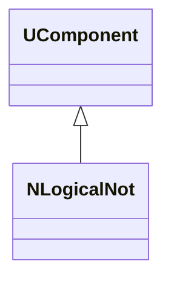
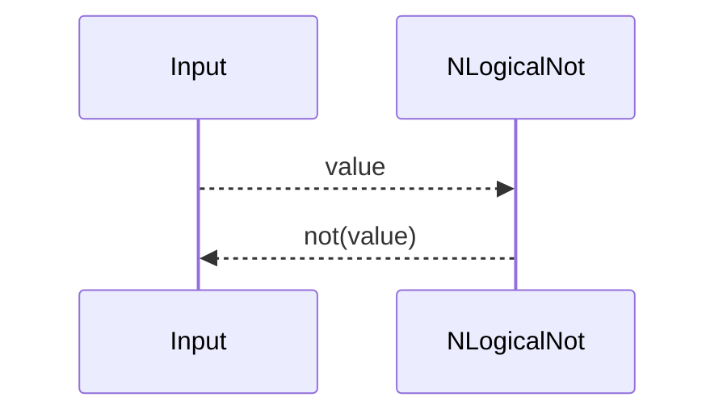
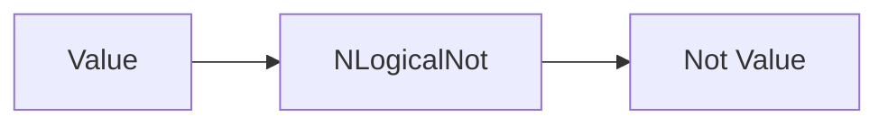

## NLogicalNot — логическое НЕ (Nmsdk-PulseLib)

**Класс**: `NLogicalNot` — логическая инверсия сигнала.  
**Регистрация**: `NPulseLibrary.cpp` → `UploadClass("NLogicalNot", ...)`.  
**Storage**: `ClassName = "NLogicalNot"`.

### Lifecycle
- **ADefault**: параметры инверсии.
- **ABuild**: подключение входа/выхода.
- **AReset**: сброс состояния.
- **ACalculate**: инверсия входного сигнала.

### I/O
- Вход: логический/скалярный сигнал.
- Выход: инвертированный сигнал.



Пояснение: диаграмма классов показывает место компонента в иерархии и ключевые связи.



Пояснение: диаграмма последовательности показывает типовой сценарий взаимодействия и порядок вызовов.



Пояснение: блок-схема показывает поток данных/сигналов (входы → компонент → выходы).

### Config snippet

```ini
[Component]
ClassName = NLogicalNot
Name = Not1
```

---

## NLogicalNot — logical NOT (EN)

Inverts input signal.


Description: this class diagram shows the component position in the type hierarchy and key relations.


Description: this sequence diagram shows a typical runtime interaction and call order.


Description: this flowchart shows the data/signal flow (inputs → component → outputs).
