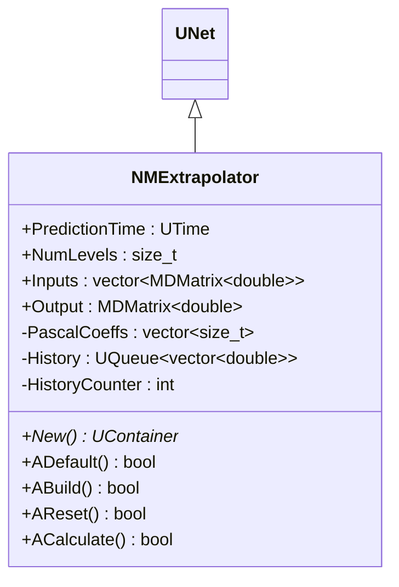
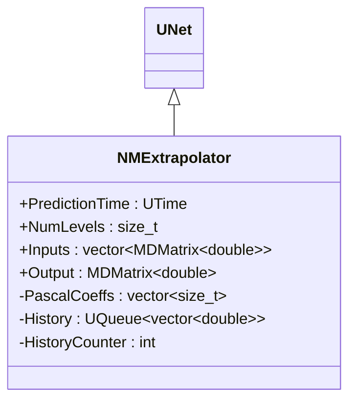
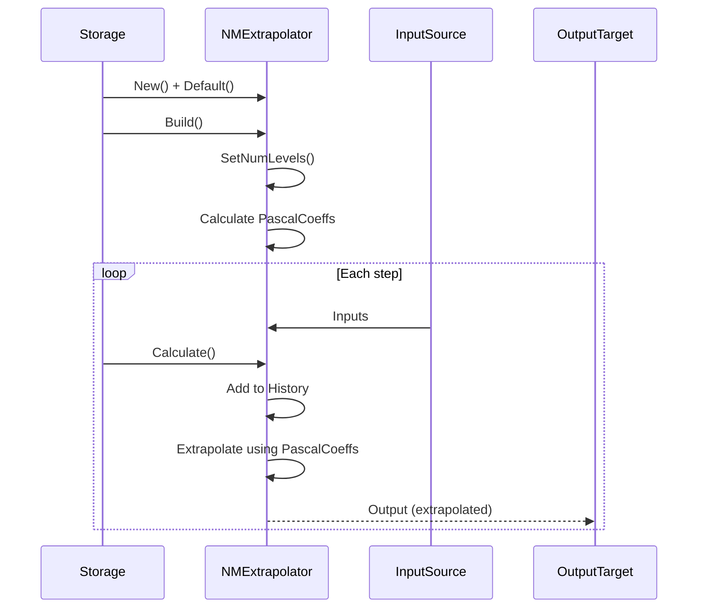
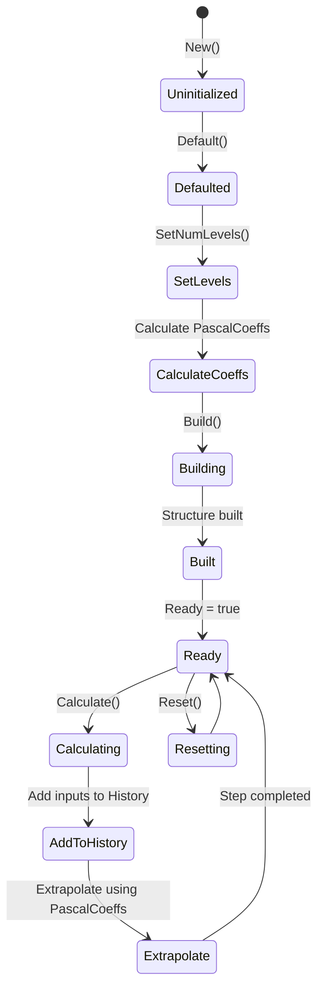
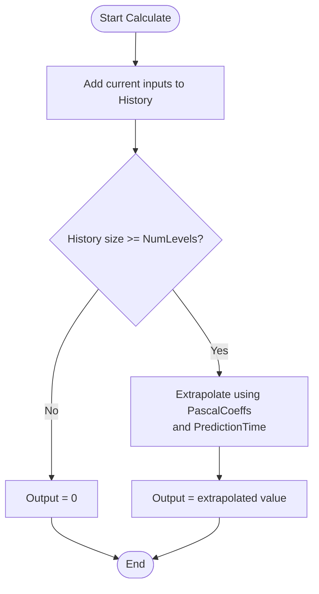
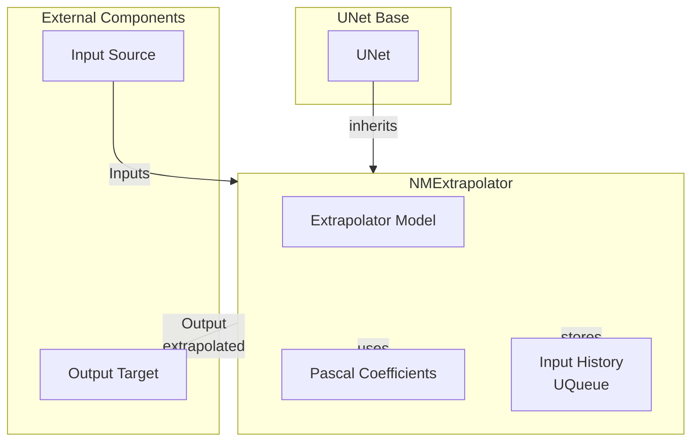

# NMExtrapolator — экстраполятор

## RU

### Назначение

**Класс**: `NMExtrapolator` — компонент для экстраполяции временных рядов с использованием многоуровневой сети.  
**Регистрация**: `NPulseLibrary.cpp` → `UploadClass("NMExtrapolator", ...)`.  
**Storage-инстансы**: `ClassName = "NMExtrapolator"` в `Bin/Configs/*/Model_*.xml`.

`NMExtrapolator` реализует экстраполятор, который использует историю входных сигналов для предсказания будущих значений. Компонент использует многоуровневую сеть с коэффициентами Паскаля (`PascalCoeffs`) для экстраполяции на заданное время вперед (`PredictionTime`).

**Использование:** Экстраполяция временных рядов, предсказание значений

### UML-диаграмма классов

**Иерархия наследования:**
- `UNet` — базовая сеть Rdk Framework
- `NMExtrapolator` — экстраполятор

### Свойства

#### Параметры (ptPubParameter)

- **`PredictionTime`** (UTime) — время прогноза (сек). Определяет, на сколько времени вперед выполняется экстраполяция. Значение по умолчанию: 1.0

- **`NumLevels`** (size_t) — количество уровней сети (должно быть > 1). Используется для расчета коэффициентов Паскаля. Значение по умолчанию: 4

#### Входные свойства (ptInput | ptPubState)

- **`Inputs`** (vector<MDMatrix<double>>) — вектор входных сигналов. Значение по умолчанию: зависит от реализации

#### Выходные свойства (ptOutput | ptPubState)

- **`Output`** (MDMatrix<double>) — выходной сигнал экстраполяции. Значение по умолчанию: 0.0

#### Внутренние состояния

- **`PascalCoeffs`** (vector<size_t>) — коэффициенты Паскаля для экстраполяции. Вычисляются в `SetNumLevels`.

- **`History`** (UQueue<vector<double>>) — очередь истории входных сигналов. Хранит историю для расчета экстраполяции.

- **`HistoryCounter`** (int) — счетчик истории. Начальное значение: 0

### Методы

- **`SetNumLevels(const size_t &value)`** → `bool` — устанавливает количество уровней и вычисляет коэффициенты Паскаля.

- **`ACalculate()`** → `bool` — выполняет расчет экстраполятора:
  1. Добавляет текущие входные сигналы в историю
  2. Использует историю и коэффициенты Паскаля для экстраполяции
  3. Выдает экстраполированные значения как выходной сигнал

## Источники

См. [Literature-References.md](../Literature-References.md): **[A]**, **4**, **25**.

### См. также

- [`NPredictor`](NPredictor.md) — предсказатель
- [`NStatePredictor`](NStatePredictor.md) — предсказатель состояний
- [Architecture.md](../Architecture.md) — архитектура библиотеки

---

## EN

### Purpose

**Class**: `NMExtrapolator` — component for time series extrapolation using multi-level network.  
**Registration**: `NPulseLibrary.cpp` → `UploadClass("NMExtrapolator", ...)`.  
**Instances**: `ClassName = "NMExtrapolator"` in `Bin/Configs/*/Model_*.xml`.

`NMExtrapolator` implements extrapolator that uses input signal history to predict future values. Component uses multi-level network with Pascal coefficients (`PascalCoeffs`) for extrapolation forward in time (`PredictionTime`).

**Usage:** Time series extrapolation, value prediction

### UML Class Diagram

### UML Sequence Diagram

### UML State Diagram

### UML Activity Diagram

### UML Component Diagram

### Properties

`NMExtrapolator` uses the following properties:

**Parameters:**
- `PredictionTime` (UTime) — prediction time (sec). Determines how far forward extrapolation is performed. Default: 1.0
- `NumLevels` (size_t) — number of network levels (must be > 1). Used for Pascal coefficients calculation. Default: 4

**Input properties:**
- `Inputs` (vector<MDMatrix<double>>) — vector of input signals

**Output properties:**
- `Output` (MDMatrix<double>) — extrapolation output signal

**Internal states:**
- `PascalCoeffs` (vector<size_t>) — Pascal coefficients for extrapolation (calculated in `SetNumLevels`)
- `History` (UQueue<vector<double>>) — input signal history queue (stores history for extrapolation calculation)
- `HistoryCounter` (int) — history counter (initial: 0)

### Methods

`NMExtrapolator` uses the following methods:

- `SetNumLevels(value)` → `bool` — sets number of levels and calculates Pascal coefficients
- `ADefault()` → `bool` — initializes default parameters
- `ABuild()` → `bool` — builds extrapolator structure
- `AReset()` → `bool` — resets extrapolator state (clears history)
- `ACalculate()` → `bool` — performs extrapolator calculation:
  1. Adds current input signals to history
  2. Uses history and Pascal coefficients for extrapolation
  3. Outputs extrapolated values as output signal

### Usage in configurations

`NMExtrapolator` is used in time series extrapolation experiments:

- **Time series extrapolation**: `Bin/Configs/*/Model_*.xml` (where time series extrapolation is required)
- **Value prediction**: experiments with predicting future values based on history

**Typical parameter values:**
- **PredictionTime**: 1.0 (1 second forward prediction)
- **NumLevels**: 4 (4 levels for extrapolation)

**Features:**
- Multi-level network: uses multi-level network with Pascal coefficients
- History-based: uses input signal history for extrapolation
- Forward prediction: predicts values forward in time by `PredictionTime`
- Pascal coefficients: uses Pascal triangle coefficients for extrapolation

### References

See [Literature-References.md](../Literature-References.md): **[A]**, **4**, **25**.

### See Also

- [`NPredictor`](NPredictor.md) — predictor
- [`NStatePredictor`](NStatePredictor.md) — state predictor
- [Architecture.md](../Architecture.md) — library architecture
