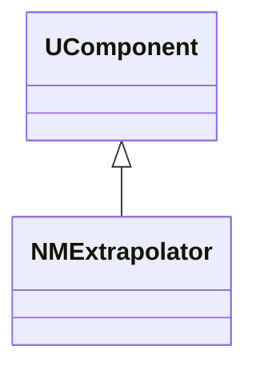
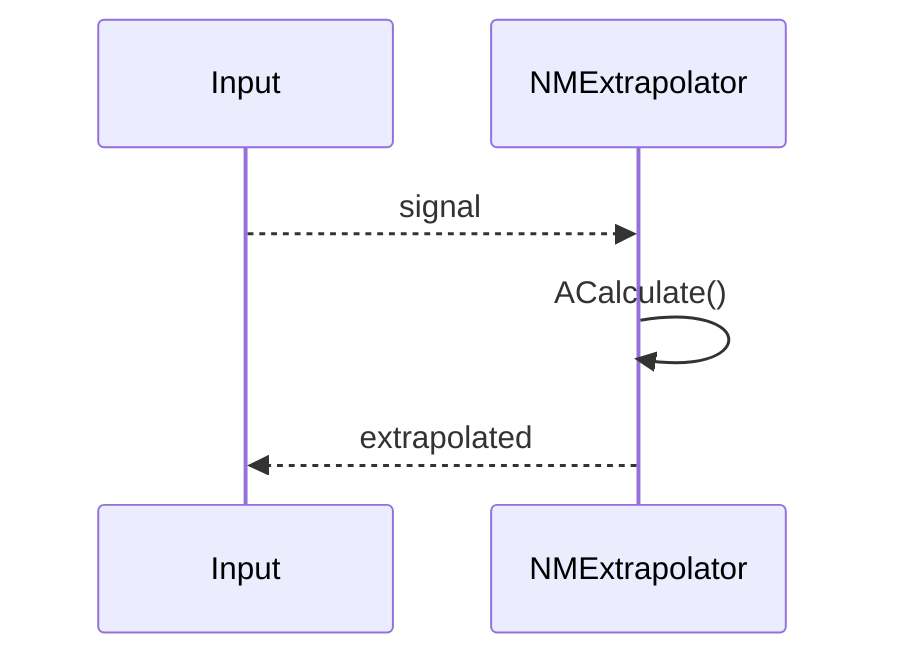
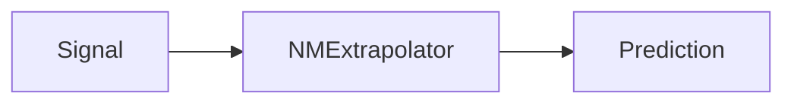
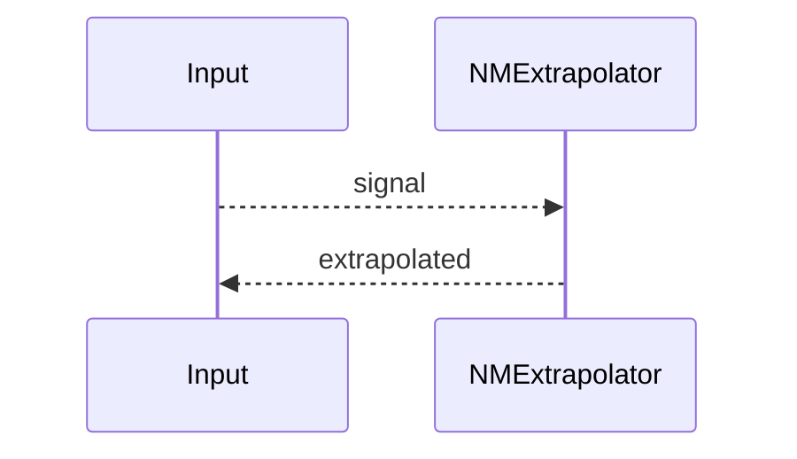

## NMExtrapolator — экстраполятор (Nmsdk-PulseLib)

**Класс**: `NMExtrapolator` — экстраполирует сигнал/состояние вперёд во времени.  
**Регистрация**: `NPulseLibrary.cpp` → `UploadClass("NMExtrapolator", ...)`.  
**Storage**: `ClassName = "NMExtrapolator"`.

### Lifecycle
- **ADefault**: параметры окна/метода.
- **ABuild**: подключение входа.
- **AReset**: сброс накопителей.
- **ACalculate**: вычисление прогноза/экстраполяции.

### I/O
- Вход: временной ряд/сигнал.
- Выход: прогноз/экстраполированное значение.



Пояснение: диаграмма классов показывает место компонента в иерархии и ключевые связи.



Пояснение: диаграмма последовательности показывает типовой сценарий взаимодействия и порядок вызовов.



Пояснение: блок-схема показывает поток данных/сигналов (входы → компонент → выходы).

### Config snippet

```ini
[Component]
ClassName = NMExtrapolator
Name = Extrap1
```

---

## NMExtrapolator — extrapolator (EN)

Extrapolates input signal forward in time.


Description: this class diagram shows the component position in the type hierarchy and key relations.



Description: this sequence diagram shows a typical runtime interaction and call order.


Description: this flowchart shows the data/signal flow (inputs → component → outputs).
