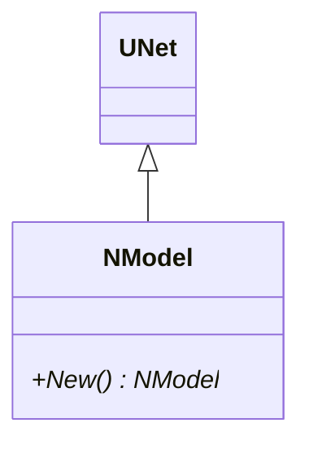
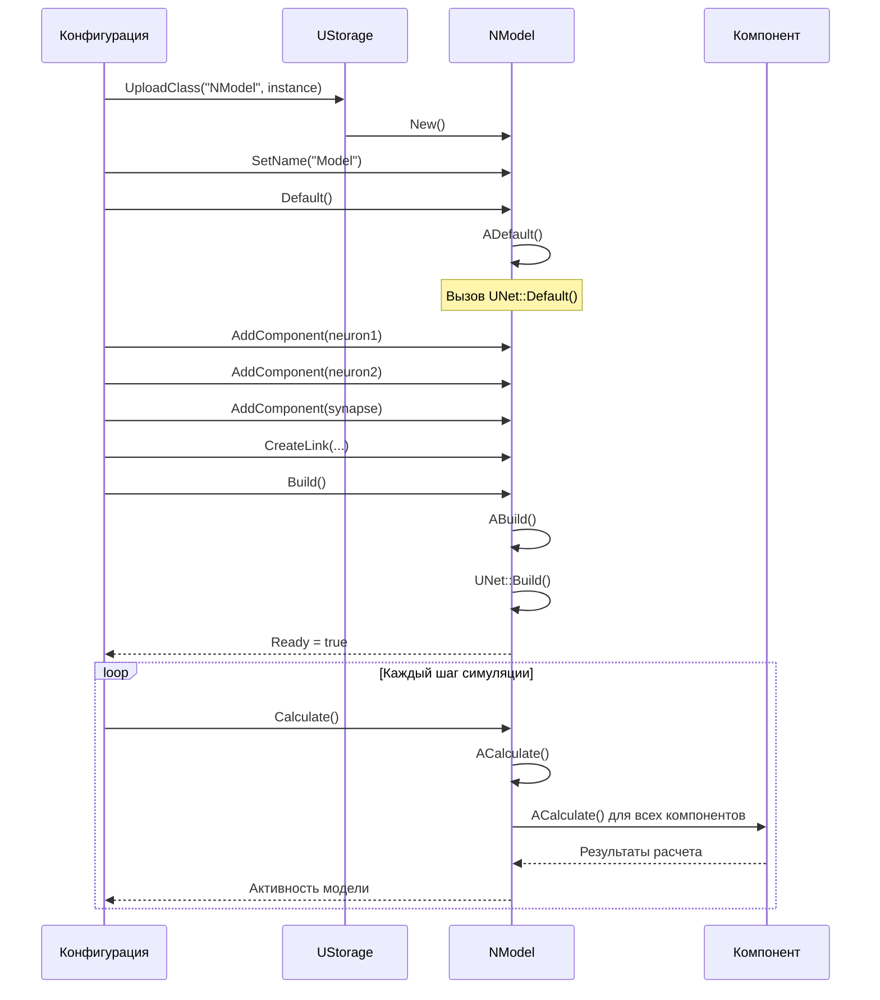
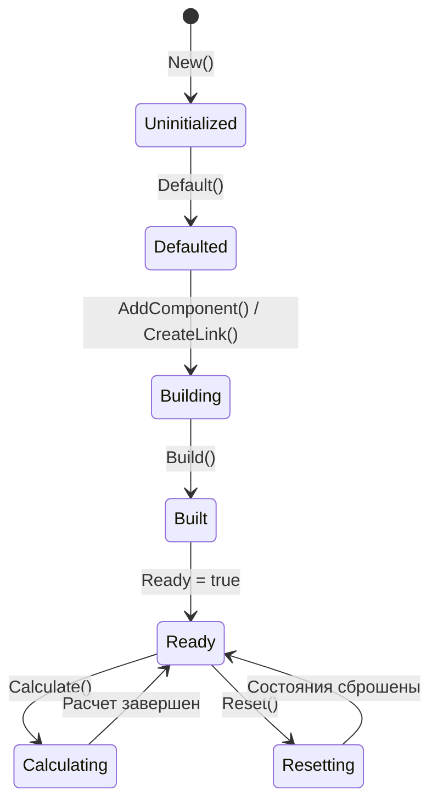
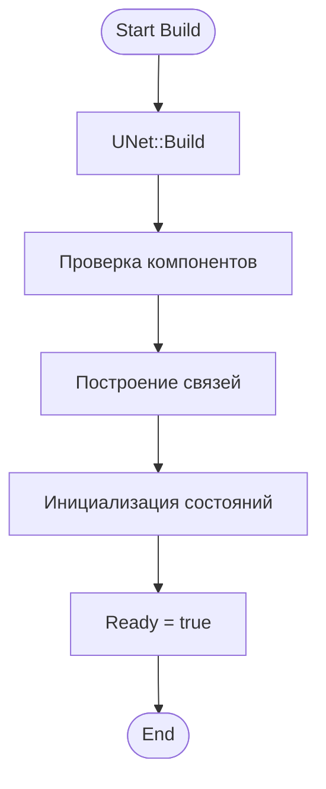
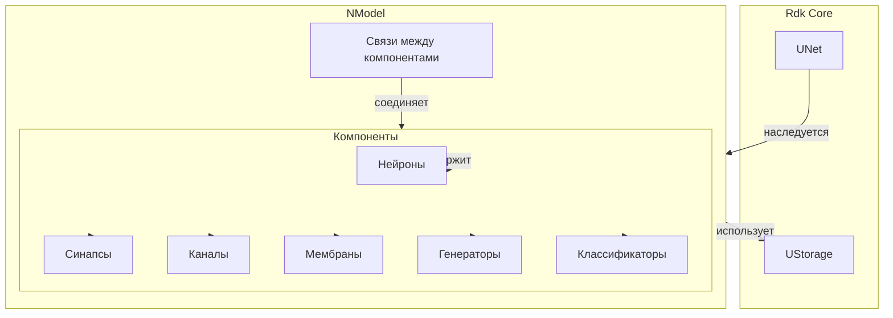
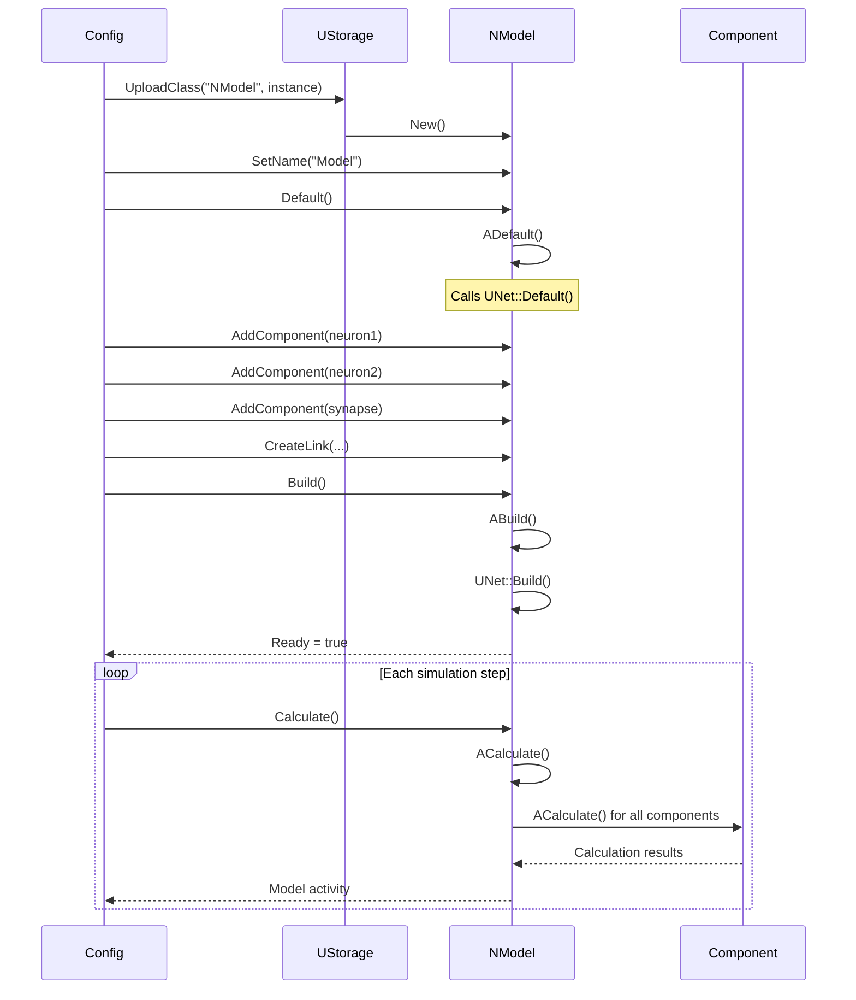
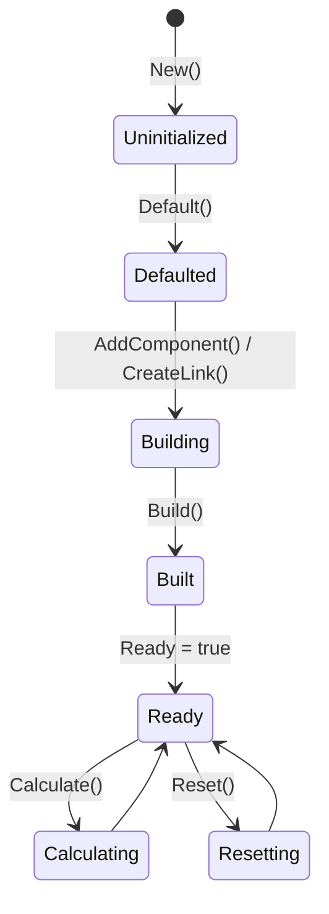
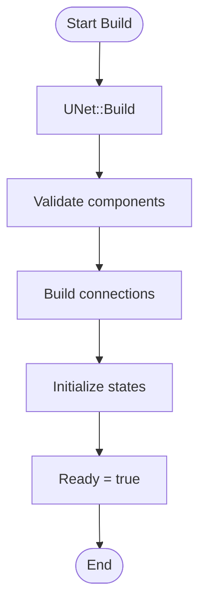
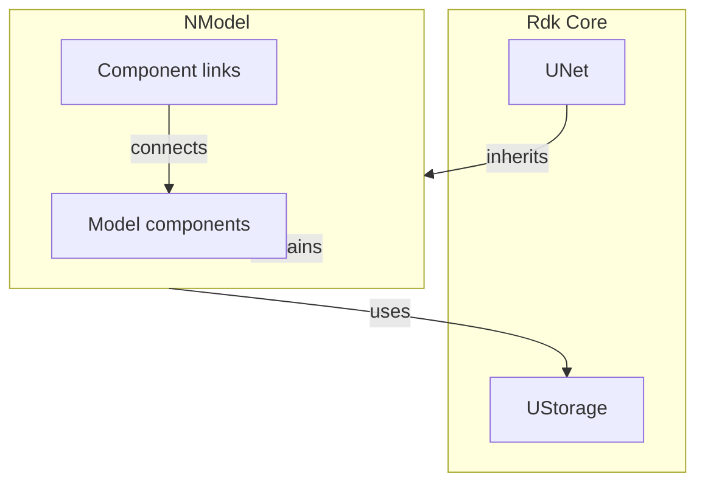

# NModel — модель SNN/контейнер сценария (Nmsdk-PulseLib)

## RU

### Назначение

**Класс**: `NModel` — модель верхнего уровня, которая собирает сеть/сценарий и управляет запуском.  
**Регистрация**: `NPulseLibrary.cpp` → `UploadClass("NModel", ...)`.  
**Storage-инстансы**: `ClassName = "NModel"` в `Bin/Configs/*/Model_*.xml`.

`NModel` является расширенной версией `NNet` и используется как корневой компонент в большинстве конфигурационных проектов. Наследуется от `UNet` и предоставляет базовую функциональность для организации импульсных нейронных сетей без дополнительных параметров структурирования, характерных для `NNet`.

### UML-диаграмма классов



**Иерархия наследования:**
- `UNet` (Rdk) — базовый класс для сетей компонентов
- `NModel` — простая модель сети без дополнительных параметров структурирования

**Отличие от NNet:**
- `NModel` не имеет параметров структурирования (`NetType`, `NumLayers`, `LinksOrganizationMode` и т.д.)
- Используется для ручной организации структуры сети через XML-конфигурации
- Рекомендуется для большинства случаев использования

### UML-диаграмма последовательности



**Жизненный цикл:**
1. **Создание**: `New()` создает новый экземпляр `NModel`
2. **Инициализация**: `Default()` / `ADefault()` вызывает базовый `UNet::Default()`
3. **Добавление компонентов**: Компоненты добавляются вручную через `AddComponent()`
4. **Создание связей**: Связи создаются через `CreateLink()` в XML-конфигурации
5. **Сборка**: `Build()` / `ABuild()` вызывает базовый `UNet::Build()`
6. **Расчет**: `Calculate()` / `ACalculate()` выполняет один шаг симуляции модели

### UML-диаграмма состояний



**Состояния:**
- **Uninitialized** — создан, но не инициализирован
- **Defaulted** — инициализирован базовыми параметрами
- **Building** — добавление компонентов и создание связей
- **Built** — структура модели построена
- **Ready** — готов к выполнению расчетов
- **Calculating** — выполняется расчет модели
- **Resetting** — выполняется сброс состояний

### UML-диаграмма активности



**Алгоритм сборки:**
1. Вызов базового метода `UNet::Build()`
2. Проверка валидности всех компонентов
3. Построение связей между компонентами (из секции `<Links>` в XML)
4. Инициализация состояний компонентов
5. Установка флага готовности

### UML-диаграмма компонентов



**Зависимости:**
- **Rdk Core**: `UNet` (базовый класс), `UStorage` (хранилище компонентов)
- **Внутренние компоненты**: любые компоненты PulseLib (нейроны, синапсы, каналы, мембраны, генераторы, классификаторы и т.д.)

### Свойства

`NModel` не имеет собственных публичных свойств (UProperty). Все свойства наследуются от базового класса `UNet`.

### Методы

#### Публичные методы

- **`New()`** → `NModel*` — создает новый экземпляр класса. Используется системой Rdk для создания компонентов.

**Наследуемые методы от UNet:**
- `AddComponent()` — добавление компонента в модель
- `CreateLink()` — создание связи между компонентами
- `Default()` / `Build()` / `Reset()` / `Calculate()` — методы жизненного цикла

### Примеры использования

#### Пример 1: Создание модели в коде C++

```cpp
// Создание модели
auto model = storage->CreateComponent<NModel>();
model->SetName("MyModel");

// Инициализация
model->Default();

// Добавление компонентов
auto neuron1 = storage->CreateComponent<NPulseNeuronIzhikevich>();
neuron1->SetName("Neuron1");
model->AddComponent(neuron1);

auto neuron2 = storage->CreateComponent<NPulseNeuronIzhikevich>();
neuron2->SetName("Neuron2");
model->AddComponent(neuron2);

auto synapse = storage->CreateComponent<NSynapseStdp>();
synapse->SetName("Synapse1");
synapse->PreNeuron = neuron1;
synapse->PostNeuron = neuron2;
model->AddComponent(synapse);

// Создание связи
model->CreateLink("Neuron1", "Output", "Synapse1", "Input");
model->CreateLink("Synapse1", "Output", "Neuron2", "Input");

// Сборка модели
model->Build();

// Использование
for (int step = 0; step < 1000; step++) {
    model->Calculate();
}
```

#### Пример 2: Конфигурация XML (типичная структура)

```xml
<Model Class="NModel">
    <Parameters>
        <Activity>1</Activity>
    </Parameters>
    <Components>
        <Neuron1 Class="NPulseNeuronIzhikevich">
            <Parameters>
                <A>0.02</A>
                <B>0.2</B>
                <C>-65.0</C>
                <D>8.0</D>
            </Parameters>
        </Neuron1>
        <Neuron2 Class="NPulseNeuronIzhikevich">
            <Parameters>
                <A>0.02</A>
                <B>0.2</B>
                <C>-65.0</C>
                <D>8.0</D>
            </Parameters>
        </Neuron2>
        <Synapse1 Class="NSynapseStdp">
            <Parameters>
                <Weight>0.5</Weight>
                <LearningRate>0.01</LearningRate>
            </Parameters>
        </Synapse1>
    </Components>
    <Links>
        <elem>
            <Item>Neuron1.Output</Item>
            <Connector>Synapse1.Input</Connector>
        </elem>
        <elem>
            <Item>Synapse1.Output</Item>
            <Connector>Neuron2.Input</Connector>
        </elem>
    </Links>
</Model>
```

### Использование в конфигурациях

`NModel` используется как корневой компонент в большинстве конфигурационных проектов в `Bin/Configs`:

- **Когнитивная навигация**: `Bin/Configs/User/CognitiveNavigation/*/Model_*.xml`
- **Эксперименты с нейронами**: `Bin/Configs/!OldConfigs/NM-Neurons/*/Model.xml`
- **STDP-обучение**: `Bin/Configs/!OldConfigs/STDP-Simple-01/Model_*.xml`
- **Классификация**: `Bin/Configs/!OldConfigs/SpikeANPA3/Model_*.xml`

**Преимущества использования NModel:**
- Простота — нет необходимости настраивать параметры структурирования
- Гибкость — полный контроль над структурой сети через XML
- Совместимость — работает со всеми компонентами PulseLib

## Источники

См. [Literature-References.md](../Literature-References.md): **[A]**, **4**, **25**.

### См. также

- [`NNet`](NNet.md) — базовая сеть с параметрами структурирования
- [`NLifeNet`](NLifeNet.md) — сеть с жизненным циклом нейронов
- [Architecture.md](../Architecture.md) — архитектура библиотеки
- [Config-Overview.md](../Config-Overview.md) — описание конфигурационных проектов

---

## EN

### Purpose

**Class**: `NModel` — top-level model that assembles a network/scenario and manages execution.  
**Registration**: `NPulseLibrary.cpp` → `UploadClass("NModel", ...)`.  
**Instances**: `ClassName = "NModel"` in `Bin/Configs/*/Model_*.xml`.

`NModel` is an extended version of `NNet` and is used as the root component in most configuration projects. It inherits from `UNet` and provides basic functionality for organizing spiking neural networks without additional structuring parameters characteristic of `NNet`.

### UML Class Diagram


**Inheritance hierarchy:**
- `UNet` (Rdk) — base class for component networks
- `NModel` — simple network model without additional structuring parameters

**Difference from NNet:**
- `NModel` does not have structuring parameters (`NetType`, `NumLayers`, `LinksOrganizationMode`, etc.)
- Used for manual network structure organization through XML configurations
- Recommended for most use cases

### UML Sequence Diagram



### UML State Diagram



### UML Activity Diagram



### UML Component Diagram



### Properties

`NModel` does not have its own public properties (UProperty). All properties are inherited from the base class `UNet`.

### Methods

#### Public Methods

- **`New()`** → `NModel*` — creates a new instance of the class. Used by the Rdk system to create components.

**Inherited methods from UNet:**
- `AddComponent()` — add component to model
- `CreateLink()` — create link between components
- `Default()` / `Build()` / `Reset()` / `Calculate()` — lifecycle methods

### Usage Examples

#### Example 1: Creating Model in C++ Code

```cpp
// Create model
auto model = storage->CreateComponent<NModel>();
model->SetName("MyModel");

// Initialize
model->Default();

// Add components
auto neuron1 = storage->CreateComponent<NPulseNeuronIzhikevich>();
neuron1->SetName("Neuron1");
model->AddComponent(neuron1);

// Build model
model->Build();

// Use
for (int step = 0; step < 1000; step++) {
    model->Calculate();
}
```

### Usage in configurations

`NModel` is used as the root component in most configuration projects in `Bin/Configs`:

- **Cognitive navigation**: `Bin/Configs/User/CognitiveNavigation/*/Model_*.xml`
- **Neuron experiments**: `Bin/Configs/!OldConfigs/NM-Neurons/*/Model.xml`
- **STDP learning**: `Bin/Configs/!OldConfigs/STDP-Simple-01/Model_*.xml`

### References

See [Literature-References.md](../Literature-References.md): **[A]**, **4**, **25**.

### See Also

- [`NNet`](NNet.md) — base network with structuring parameters
- [`NLifeNet`](NLifeNet.md) — network with neuron lifecycle
- [Architecture.md](../Architecture.md) — library architecture
- [Config-Overview.md](../Config-Overview.md) — configuration projects description
