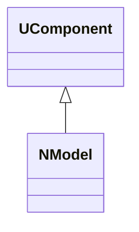
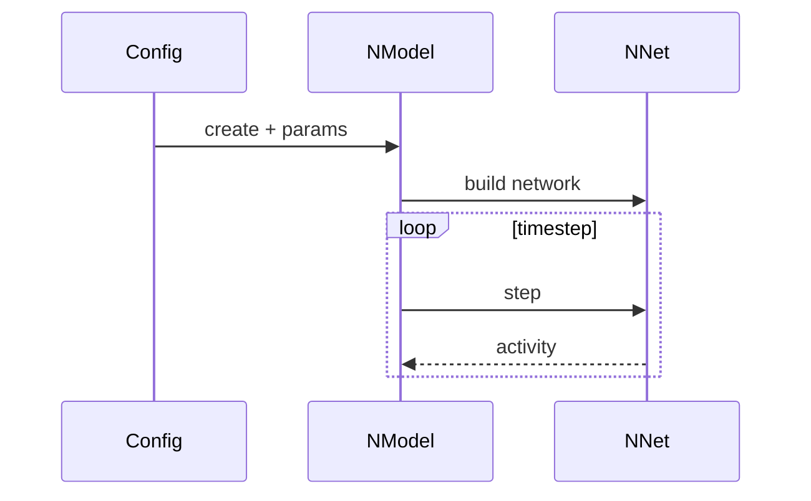
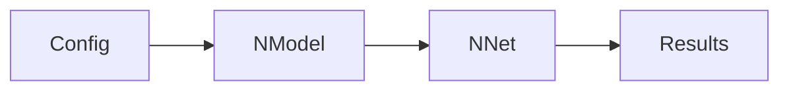
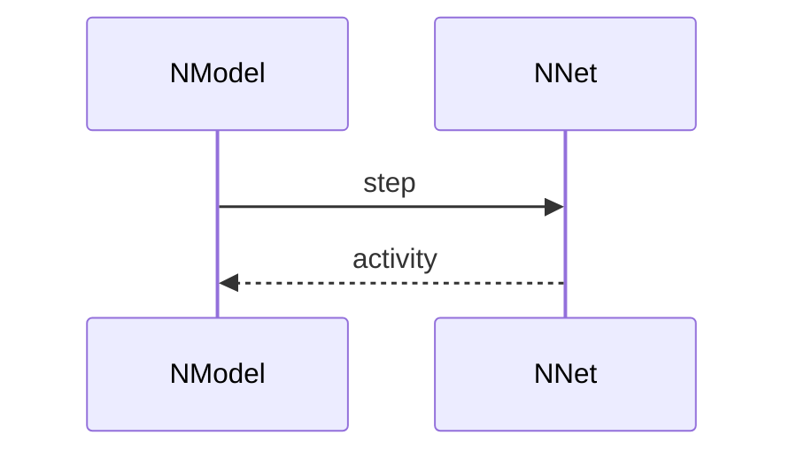

## NModel — модель SNN/контейнер сценария (Nmsdk-PulseLib)

**Класс**: `NModel` — модель верхнего уровня, которая собирает сеть/сценарий и управляет запуском.  
**Регистрация**: `NPulseLibrary.cpp` → `UploadClass("NModel", ...)`.  
**Storage-инстансы**: `ClassName = "NModel"`.

### Lifecycle
- **ADefault**: параметры сценария/модели.
- **ABuild**: построение внутренней сети/подмоделей.
- **AReset**: сброс симуляции.
- **ACalculate**: шаг симуляции/обработки.

### I/O
- Вход: конфигурационные параметры, внешние сигналы.
- Выход: результаты модели (активность, метрики, действия).



Диаграмма фиксирует `NModel` как компонент-обёртку над сетью/сценарием.



Пояснение: диаграмма последовательности показывает типовой сценарий взаимодействия и порядок вызовов.



Пояснение: блок-схема показывает поток данных/сигналов (входы → компонент → выходы).

### Config snippet

```ini
[Component]
ClassName = NModel
Name = Model1
```

---

## NModel — top-level model (EN)

Wraps a network/scenario and runs simulation steps.


Description: this class diagram shows the component position in the type hierarchy and key relations.



Description: this sequence diagram shows a typical runtime interaction and call order.


Description: this flowchart shows the data/signal flow (inputs → component → outputs).
