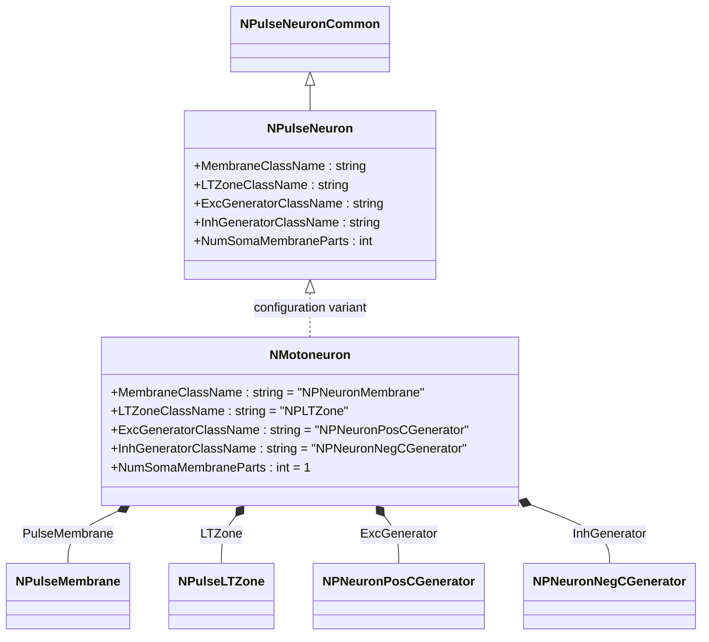
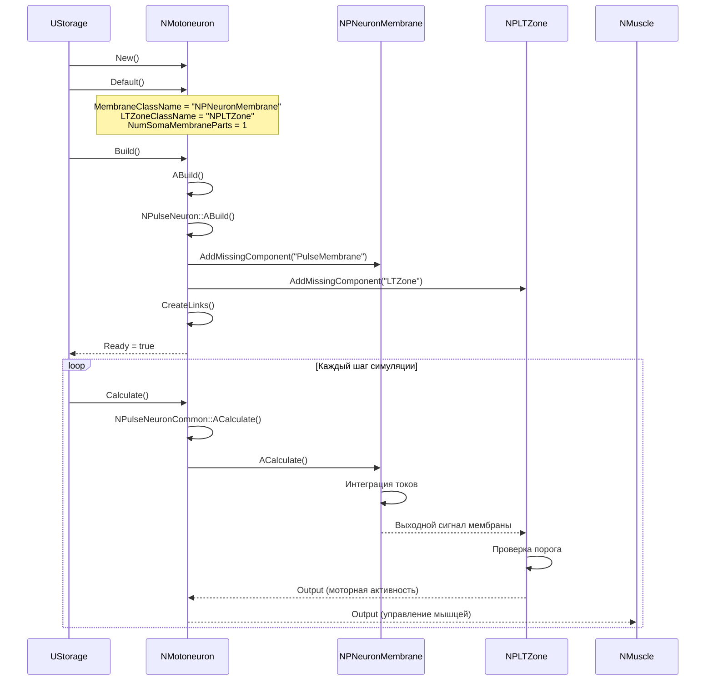
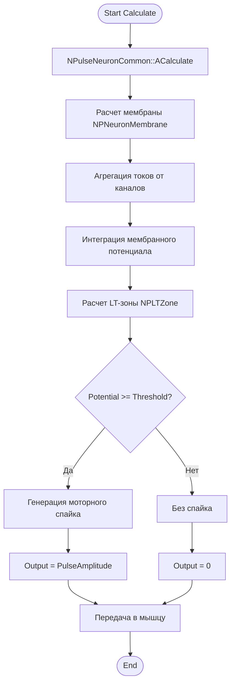
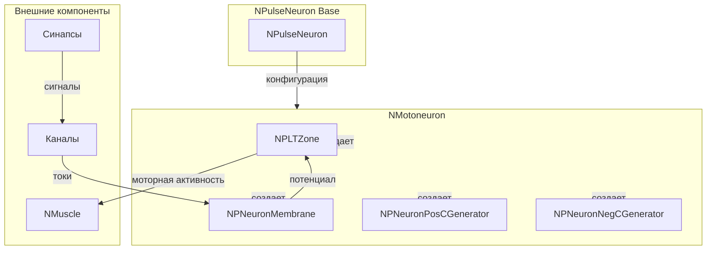
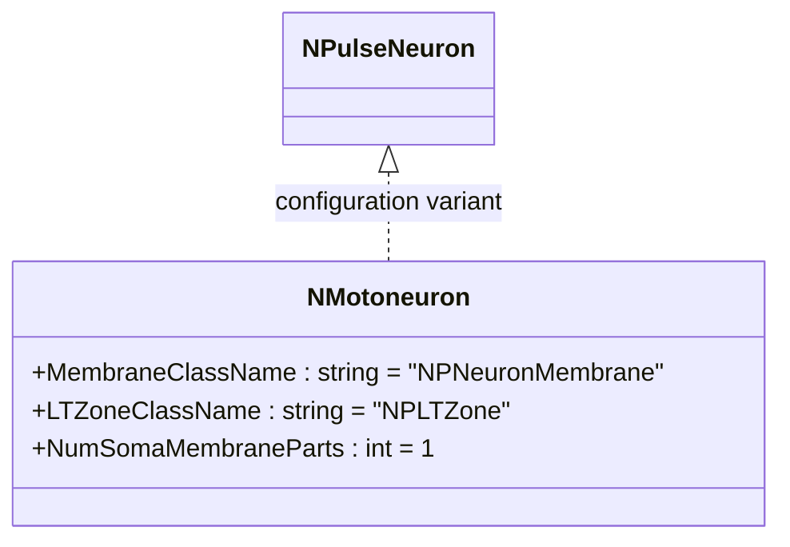
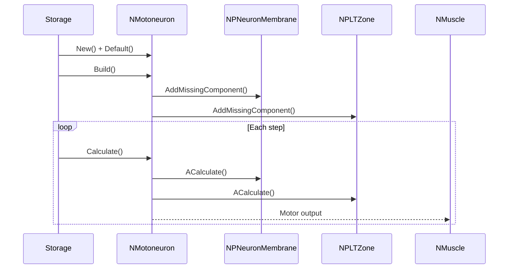
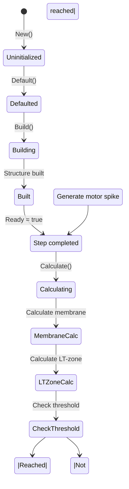
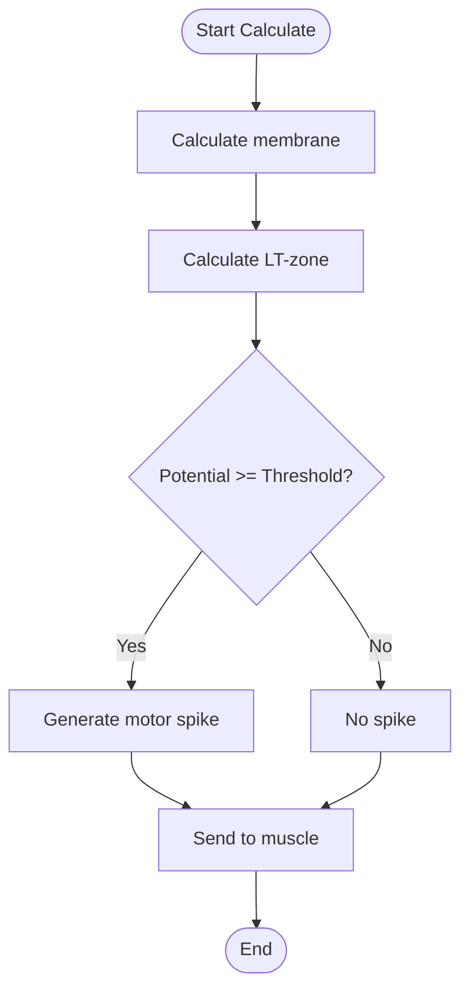
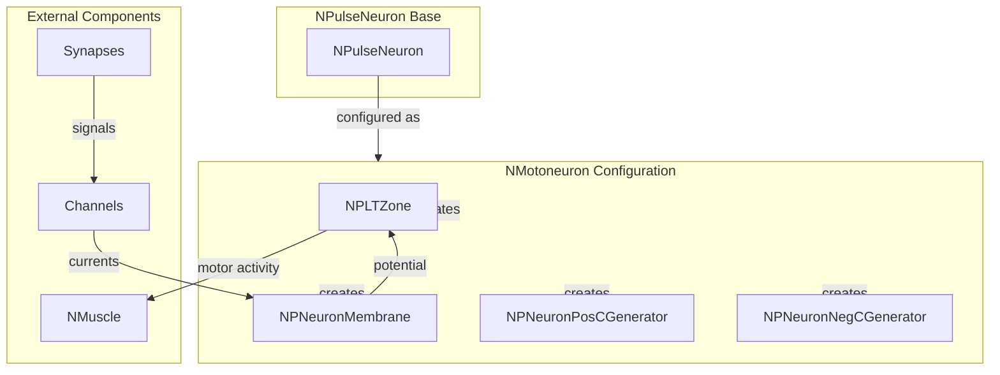

# NMotoneuron — мотонейрон

## RU

### Назначение

**Класс**: `NMotoneuron` — мотонейрон (классический/базовый).  
**Регистрация**: `NPulseLibrary.cpp` → `UploadClass("NMotoneuron", ...)`.  
**Storage-инстансы**: `ClassName = "NMotoneuron"` в `Bin/Configs/*/Model_*.xml`.

`NMotoneuron` является конфигурационным вариантом базового класса `NPulseNeuron` для моделирования мотонейронов (двигательных нейронов). Создается из `NPulseNeuron` с настройками классической структуры нейрона. Мотонейроны преобразуют входные сигналы в моторную активность для управления мышцами и движениями.

**Использование:** Моделирование двигательных систем, управление мышцами (`Bin/Configs/!OldConfigs/OldExperiments/Motoneuron/`)

### UML-диаграмма классов



**Иерархия наследования:**
- `NPulseNeuronCommon` — общий импульсный нейрон
- `NPulseNeuron` — импульсный нейрон с параметрами структурирования
- `NMotoneuron` — мотонейрон (конфигурационный вариант)

**Внутренняя структура:**
- **PulseMembrane** (`NPNeuronMembrane`) — мембрана нейрона
- **LTZone** (`NPLTZone`) — LT-зона для генерации спайков
- **ExcGenerator** (`NPNeuronPosCGenerator`) — возбуждающий генератор
- **InhGenerator** (`NPNeuronNegCGenerator`) — тормозной генератор

### UML-диаграмма последовательности



**Жизненный цикл:**
1. **Инициализация**: Установка параметров структурирования для мотонейрона
2. **Сборка**: Автоматическое создание мембраны и LT-зоны с заданными параметрами
3. **Расчет**: Интеграция токов в мембране, проверка порога в LT-зоне, генерация моторной активности
4. **Выход**: Передача моторной активности мышцам для управления движением

### UML-диаграмма состояний

```mermaid
stateDiagram-v2
    [*] --> Uninitialized: New()
    Uninitialized --> Defaulted: Default()
    Note over Defaulted: Параметры мотонейрона<br/>MembraneClassName, LTZoneClassName
    Defaulted --> Building: Build()
    Building --> CreatingMembrane: Создание мембраны
    CreatingMembrane --> CreatingLTZone: Создание LT-зоны
    CreatingLTZone --> Linking: Создание связей
    Linking --> Built: Структура построена
    Built --> Ready: Ready = true
    Ready --> Calculating: Calculate()
    Calculating --> MembraneCalc: Расчет мембраны
    MembraneCalc --> LTZoneCalc: Расчет LT-зоны
    LTZoneCalc --> CheckThreshold: Проверка порога
    CheckThreshold -->|Порог достигнут| MotorSpike: Генерация моторного спайка
    CheckThreshold -->|Порог не достигнут| Ready: Шаг завершен
    MotorSpike --> Ready
    Ready --> Resetting: Reset()
    Resetting --> Ready: Состояния сброшены
```

**Состояния:**
- **Uninitialized** — создан, но не инициализирован
- **Defaulted** — параметры мотонейрона установлены по умолчанию
- **Building** — выполняется сборка структуры
- **CreatingMembrane** — создание мембраны мотонейрона
- **CreatingLTZone** — создание LT-зоны
- **Linking** — создание связей между компонентами
- **Built** — структура мотонейрона построена
- **Ready** — готов к выполнению расчетов
- **Calculating** — выполняется расчет мотонейрона
- **MembraneCalc** — расчет мембраны (интеграция токов)
- **LTZoneCalc** — расчет LT-зоны
- **CheckThreshold** — проверка достижения порога
- **MotorSpike** — генерация моторного спайка
- **Resetting** — выполняется сброс состояний

### UML-диаграмма активности



**Алгоритм расчета:**
1. Вызов базового расчета (`NPulseNeuronCommon::ACalculate()`)
2. Расчет мембраны (`NPNeuronMembrane`): агрегация токов от каналов, интеграция потенциала
3. Расчет LT-зоны (`NPLTZone`): проверка порога генерации спайка
4. Генерация моторного спайка при достижении порога
5. Передача моторной активности мышцам для управления движением

### UML-диаграмма компонентов



**Зависимости:**
- **Базовый класс**: `NPulseNeuron` (конфигурационный вариант)
- **Внутренние компоненты**: `NPNeuronMembrane` (мембрана), `NPLTZone` (LT-зона), `NPNeuronPosCGenerator` (возбуждающий генератор), `NPNeuronNegCGenerator` (тормозной генератор)
- **Внешние компоненты**: каналы (`NPulseChannel*`), синапсы (`NPulseSynapse*`), мышцы (`NMuscle`)

### Свойства

`NMotoneuron` использует все свойства базового класса `NPulseNeuron` с параметрами:
- `MembraneClassName = "NPNeuronMembrane"` — мембрана нейрона
- `LTZoneClassName = "NPLTZone"` — LT-зона
- `ExcGeneratorClassName = "NPNeuronPosCGenerator"` — возбуждающий генератор
- `InhGeneratorClassName = "NPNeuronNegCGenerator"` — тормозной генератор
- `NumSomaMembraneParts = 1` — количество частей сомы

### Методы

`NMotoneuron` использует все методы базового класса `NPulseNeuron`.

### Примеры использования

#### Пример 1: Создание мотонейрона в коде C++

```cpp
// Создание мотонейрона
auto motoneuron = storage->CreateComponent("NMotoneuron");
motoneuron->SetName("Motoneuron1");

// Инициализация (использует параметры по умолчанию)
motoneuron->Default();

// Сборка
motoneuron->Build();

// Использование
for (int step = 0; step < 1000; step++) {
    motoneuron->Calculate();
    double motorOutput = motoneuron->Output(0, 0);
    // Передача моторной активности мышце
}
```

#### Пример 2: Конфигурация XML

```xml
<Motoneuron1 Class="NMotoneuron">
    <Parameters>
        <!-- Параметры наследуются от NPulseNeuron -->
    </Parameters>
</Motoneuron1>
```

### Использование в конфигурациях

`NMotoneuron` используется в экспериментах с двигательными системами:

- **Мотонейроны**: `Bin/Configs/!OldConfigs/OldExperiments/Motoneuron/`
- **Управление движением**: `Bin/Configs/!OldConfigs/OldExperiments/MotionControl/`

**Типичные значения параметров:**
- **MembraneClassName**: "NPNeuronMembrane" (мембрана нейрона)
- **LTZoneClassName**: "NPLTZone" (LT-зона)
- **NumSomaMembraneParts**: 1 (количество частей сомы)

## Источники

См. [Literature-References.md](../Literature-References.md): **19**, **20**, **21**, **22**, **28**, **31**.

### См. также

- [`NPulseNeuron`](NPulseNeuron.md) — импульсный нейрон с параметрами структурирования
- [`NNewMotoneuron`](NNewMotoneuron.md) — новая версия мотонейрона
- [`NMuscle`](NMuscle.md) — мышца (получатель моторной активности)
- [`NPulseNeuronCommon`](NPulseNeuronCommon.md) — общий импульсный нейрон
- [Architecture.md](../Architecture.md) — архитектура библиотеки

---

## EN

### Purpose

**Class**: `NMotoneuron` — motor neuron (classical/base).  
**Registration**: `NPulseLibrary.cpp` → `UploadClass("NMotoneuron", ...)`.  
**Instances**: `ClassName = "NMotoneuron"` in `Bin/Configs/*/Model_*.xml`.

`NMotoneuron` is a configuration variant of the base class `NPulseNeuron` for modeling motor neurons. Created from `NPulseNeuron` with classical neuron structure settings. Motor neurons convert input signals into motor activity for controlling muscles and movements.

**Usage:** Modeling motor systems, muscle control (`Bin/Configs/!OldConfigs/OldExperiments/Motoneuron/`)

### UML Class Diagram



### UML Sequence Diagram



### UML State Diagram



### UML Activity Diagram



### UML Component Diagram



### Properties

`NMotoneuron` uses all properties of base class `NPulseNeuron` with parameters:
- `MembraneClassName = "NPNeuronMembrane"` — neuron membrane
- `LTZoneClassName = "NPLTZone"` — LT-zone
- `ExcGeneratorClassName = "NPNeuronPosCGenerator"` — excitatory generator
- `InhGeneratorClassName = "NPNeuronNegCGenerator"` — inhibitory generator
- `NumSomaMembraneParts = 1` — number of soma parts

### Methods

`NMotoneuron` uses all methods of base class `NPulseNeuron`.

### Usage in configurations

`NMotoneuron` is used in motor system experiments:

- **Motor neurons**: `Bin/Configs/!OldConfigs/OldExperiments/Motoneuron/`
- **Motion control**: `Bin/Configs/!OldConfigs/OldExperiments/MotionControl/`

**Typical parameter values:**
- **MembraneClassName**: "NPNeuronMembrane" (neuron membrane)
- **LTZoneClassName**: "NPLTZone" (LT-zone)
- **NumSomaMembraneParts**: 1 (number of soma parts)

**Features:**
- Motor activity: converts neural signals into motor activity
- Muscle control: output signals control muscles for movement
- Classical structure: standard neuron structure with membrane and LT-zone

### References

See [Literature-References.md](../Literature-References.md): **19**, **20**, **21**, **22**, **28**, **31**.

### See Also

- [`NPulseNeuron`](NPulseNeuron.md) — spiking neuron with structuring parameters
- [`NNewMotoneuron`](NNewMotoneuron.md) — new motor neuron version
- [`NMuscle`](NMuscle.md) — muscle (receiver of motor activity)
- [`NPulseNeuronCommon`](NPulseNeuronCommon.md) — common spiking neuron
- [Architecture.md](../Architecture.md) — library architecture
