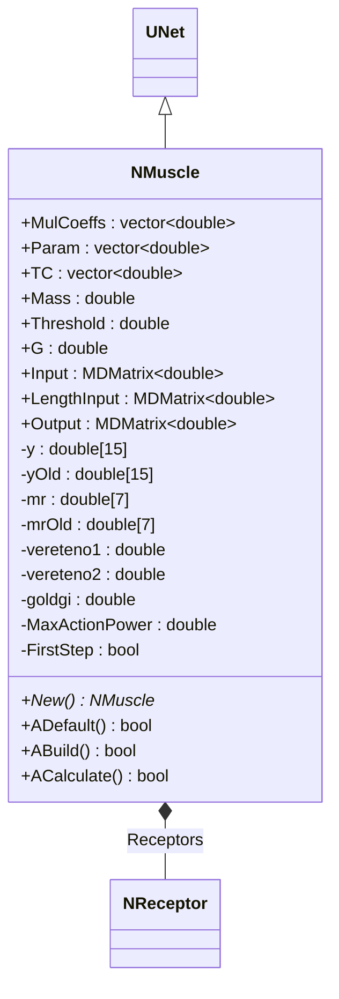
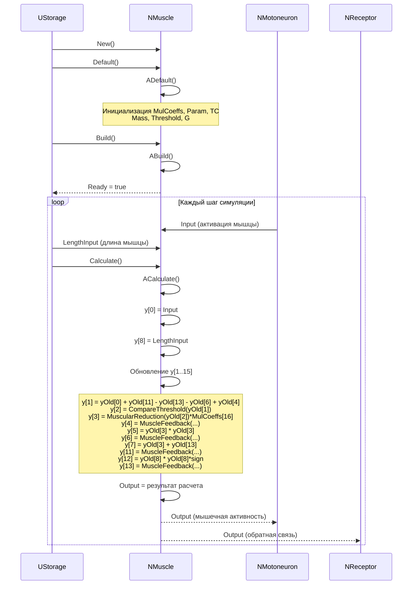
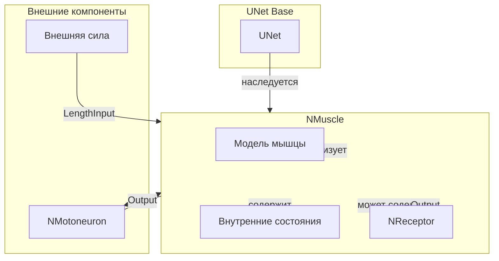
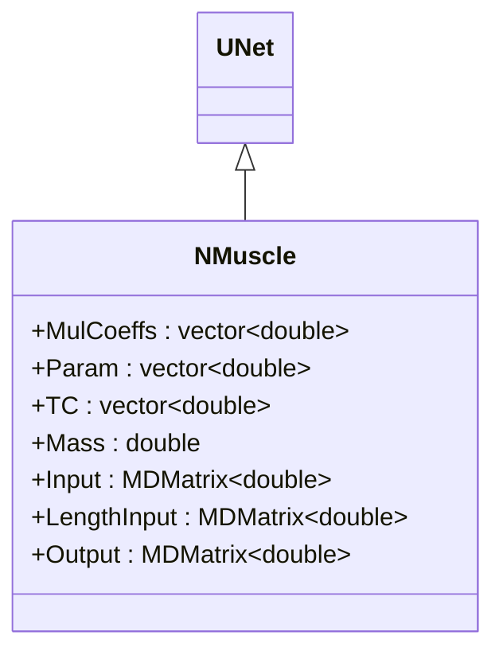
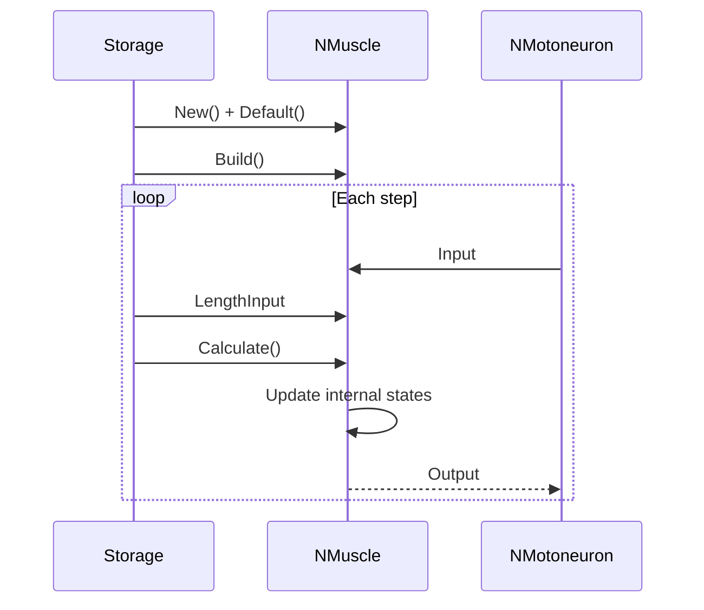
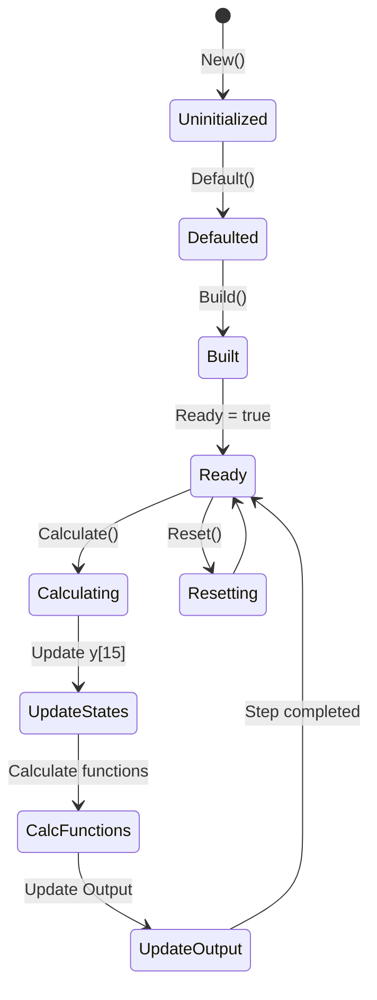

# NMuscle — мышца

## RU

### Назначение

**Класс**: `NMuscle` — компонент для моделирования мышечной активности.  
**Регистрация**: `NPulseLibrary.cpp` → `UploadClass("NMuscle", ...)`.  
**Storage-инстансы**: `ClassName = "NMuscle"` в `Bin/Configs/*/Model_*.xml`.

`NMuscle` реализует модель мышцы, которая обрабатывает входные сигналы и генерирует выходные сигналы, соответствующие мышечной активности (длина, скорость, ускорение). Компонент использует сложную модель с множеством параметров (`MulCoeffs`, `Param`, `TC`, `Mass`, `Threshold`, `G`) и внутренними состояниями для расчета динамики мышцы.

**Использование:** Моделирование мышечной активности, биомеханическое моделирование

### UML-диаграмма классов



**Иерархия наследования:**
- `UNet` — базовая сеть Rdk Framework
- `NMuscle` — мышца

**Связи:**
- Может содержать рецепторы (`NReceptor`) для обратной связи

### UML-диаграмма последовательности



**Жизненный цикл:**
1. **Инициализация**: Установка параметров модели мышцы (MulCoeffs, Param, TC, Mass, Threshold, G)
2. **Сброс**: Инициализация внутренних состояний (y[15], mr[7], vereteno1, vereteno2, goldgi)
3. **Расчет**: Обновление всех внутренних состояний на основе входных сигналов
4. **Выход**: Генерация выходного сигнала (мышечная активность)

### UML-диаграмма состояний

```mermaid
stateDiagram-v2
    [*] --> Uninitialized: New()
    Uninitialized --> Defaulted: Default()
    Note over Defaulted: Инициализация MulCoeffs[18]<br/>Param[4], TC[3]<br/>Mass, Threshold, G
    Defaulted --> Built: Build()
    Built --> Ready: Ready = true
    Ready --> Calculating: Calculate()
    Calculating --> UpdateStates: Обновление y[15]
    UpdateStates --> CalcMuscleReduction: MuscularReduction()
    CalcMuscleReduction --> CalcFeedback: MuscleFeedback()
    CalcFeedback --> CalcThreshold: CompareThreshold()
    CalcThreshold --> UpdateOutput: Обновление Output
    UpdateOutput --> Ready: Шаг завершен
    Ready --> Resetting: Reset()
    Resetting --> Ready: y[15]=0, mr[7]=0
```

**Состояния:**
- **Uninitialized** — создан, но не инициализирован
- **Defaulted** — параметры модели установлены по умолчанию
- **Built** — структура мышцы построена
- **Ready** — готов к выполнению расчетов
- **Calculating** — выполняется расчет мышцы
- **UpdateStates** — обновление внутренних состояний y[15]
- **CalcMuscleReduction** — расчет мышечного сокращения
- **CalcFeedback** — расчет обратной связи
- **CalcThreshold** — расчет пороговой функции
- **UpdateOutput** — обновление выходного сигнала
- **Resetting** — выполняется сброс состояний

### UML-диаграмма активности

```mermaid
flowchart TD
    Start([Start Calculate]) --> SaveOldStates[yOld[i] = y[i] для i=0..14]
    SaveOldStates --> SetInputs[y[0] = Input<br/>y[8] = LengthInput]
    SetInputs --> CalcY1[y[1] = yOld[0] + yOld[11] - yOld[13] - yOld[6] + yOld[4]]
    CalcY1 --> CalcY2[y[2] = CompareThreshold(yOld[1])]
    CalcY2 --> CalcY3[y[3] = MuscularReduction(yOld[2]) * MulCoeffs[16]]
    CalcY3 --> CalcY4[y[4] = MuscleFeedback(y[3], yOld[3], yOld[4], ...)]
    CalcY4 --> CalcY5[y[5] = yOld[3] * yOld[3]]
    CalcY5 --> CalcY6[y[6] = MuscleFeedback(y[5], yOld[5], yOld[6], ...)]
    CalcY6 --> CalcY7[y[7] = yOld[3] + yOld[13]]
    CalcY7 --> CalcY11[y[11] = MuscleFeedback(y[8], yOld[8], yOld[11], ...)]
    CalcY11 --> CalcY12[y[12] = yOld[8]² * sign(yOld[8])]
    CalcY12 --> CalcY13[y[13] = MuscleFeedback(y[12], yOld[12], yOld[13], ...)]
    CalcY13 --> UpdateOutput[Output = результат расчета]
    UpdateOutput --> End([End])
```

**Алгоритм расчета:**
1. Сохранение предыдущих состояний: `yOld[i] = y[i]` для всех i
2. Установка входных сигналов: `y[0] = Input`, `y[8] = LengthInput`
3. Обновление всех внутренних состояний y[1..15] через различные функции:
   - `CompareThreshold()` — пороговая функция
   - `MuscularReduction()` — мышечное сокращение
   - `MuscleFeedback()` — обратная связь мышцы
4. Расчет выходного сигнала на основе обновленных состояний

### UML-диаграмма компонентов



**Зависимости:**
- **Базовый класс**: `UNet`
- **Внутренние компоненты**: `NReceptor` (рецепторы для обратной связи, опционально)
- **Внешние компоненты**: мотонейрон (источник `Input`), внешняя сила (источник `LengthInput`)

### Свойства

#### Параметры (ptPubParameter)

- **`MulCoeffs`** (vector<double>) — коэффициенты умножения (18 элементов). Значение по умолчанию: зависит от реализации

- **`Param`** (vector<double>) — параметры модели (4 элемента). Значение по умолчанию: зависит от реализации

- **`TC`** (vector<double>) — временные константы (4 элемента). Значение по умолчанию: зависит от реализации

- **`Mass`** (double) — масса мышцы. Значение по умолчанию: зависит от реализации

- **`Threshold`** (double) — порог активации. Значение по умолчанию: зависит от реализации

- **`G`** (double) — параметр модели. Значение по умолчанию: зависит от реализации

#### Входные свойства (ptInput | ptPubState)

- **`Input`** (MDMatrix<double>) — входной сигнал активации мышцы. Значение по умолчанию: зависит от реализации

- **`LengthInput`** (MDMatrix<double>) — входной сигнал длины мышцы. Значение по умолчанию: зависит от реализации

#### Выходные свойства (ptOutput | ptPubState)

- **`Output`** (MDMatrix<double>) — выходной сигнал мышцы. Значение по умолчанию: зависит от реализации

### Методы

- **`ACalculate()`** → `bool` — выполняет расчет мышцы:
  1. Обрабатывает входные сигналы активации и длины
  2. Обновляет внутренние состояния (`y`, `mr`, `vereteno1`, `vereteno2`, `goldgi`)
  3. Вычисляет выходной сигнал на основе модели мышцы

### Использование в конфигурациях

`NMuscle` используется в экспериментах с двигательными системами:

- **Управление движением**: `Bin/Configs/!OldConfigs/OldExperiments/MotionControl/`
- **Мышцы**: `Bin/Configs/!OldConfigs/MC-Muscles/`

**Типичные значения параметров:**
- **MulCoeffs**: 18 элементов (коэффициенты умножения для различных компонентов модели)
- **Param**: 4 элемента (параметры модели: 0.039, 2.127, 0.153, 1.719)
- **TC**: 3 элемента (временные константы: 0.003, 0.0055, 0.0298)
- **Mass**: 1.0 (масса мышцы)
- **Threshold**: 0.2 (порог активации)
- **G**: 9.8 (ускорение свободного падения)

## Источники

См. [Literature-References.md](../Literature-References.md): **19**, **20**, **21**, **22**, **28**, **31**.

### См. также

- [`NEyeMuscle`](NEyeMuscle.md) — глазная мышца
- [`NMotoneuron`](NMotoneuron.md) — мотонейрон (источник входных сигналов)
- [`NReceptor`](NReceptor.md) — рецептор (для обратной связи)
- [Architecture.md](../Architecture.md) — архитектура библиотеки

---

## EN

### Purpose

**Class**: `NMuscle` — component for modeling muscle activity.  
**Registration**: `NPulseLibrary.cpp` → `UploadClass("NMuscle", ...)`.  
**Instances**: `ClassName = "NMuscle"` in `Bin/Configs/*/Model_*.xml`.

`NMuscle` implements muscle model that processes input signals and generates output signals corresponding to muscle activity (length, speed, acceleration). Component uses complex model with multiple parameters and internal states for muscle dynamics calculation.

**Usage:** Muscle activity modeling, biomechanical modeling

### UML Class Diagram



### UML Sequence Diagram



### UML State Diagram



### UML Activity Diagram

```mermaid
flowchart TD
    Start([Start Calculate]) --> SaveOld[Save old states]
    SaveOld --> SetInputs[Set Input and LengthInput]
    SetInputs --> CalcStates[Calculate y[1..15]]
    CalcStates --> CalcFunctions[Calculate functions]
    CalcFunctions --> UpdateOutput[Update Output]
    UpdateOutput --> End([End])
```

### UML Component Diagram

```mermaid
graph TB
    subgraph UNet["UNet Base"]
        BaseNet[UNet]
    end
    
    subgraph NMuscle["NMuscle"]
        Muscle[Muscle]
        Receptors["NReceptor<br/>Receptors"]
        InternalStates[Internal States<br/>y[15], mr[7], etc.]
    end
    
    subgraph External["External Components"]
        Motoneuron[NMotoneuron]
        LengthInput[Length Input]
        OutputTarget[Output Target]
    end
    
    BaseNet -->|inherits| NMuscle
    NMuscle -->|creates| Receptors
    NMuscle -->|uses| InternalStates
    Motoneuron -->|Input| NMuscle
    LengthInput -->|LengthInput| NMuscle
    NMuscle -->|Output| OutputTarget
    NMuscle -->|Output| Receptors
```

### Properties

- `MulCoeffs` — multiplication coefficient vector (18 elements)
- `Param` — parameter vector (4 elements)
- `TC` — time constant vector (3 elements)
- `Mass` — muscle mass
- `Threshold` — activation threshold
- `G` — gain coefficient
- `Input` — input signal (muscle activation)
- `LengthInput` — muscle length input signal
- `Output` — output signal (muscle activity)

### Methods

- `ADefault()` — setting default parameters
- `ABuild()` — building muscle structure
- `ACalculate()` — muscle dynamics calculation step
- `MuscularReduction(value)` — muscle contraction function
- `MuscleFeedback(...)` — muscle feedback function
- `CompareThreshold(value)` — threshold comparison

### Usage in configurations

`NMuscle` is used for muscle activity modeling:

- **Muscle modeling**: `Bin/Configs/*/Model_*.xml` (where muscle activity modeling is required)
- **Biomechanical modeling**: experiments with biomechanical muscle models
- **Motor control**: modeling motor control with muscle dynamics

**Features:**
- Complex dynamics: models complex muscle dynamics with multiple internal states
- Feedback receptors: supports feedback receptors for muscle control
- Flexible parameters: supports various muscle parameters
- Efficient computation: optimized for real-time muscle simulation

**Typical parameter values:**
- **Mass**: 0.1-10.0 (muscle mass)
- **Threshold**: 0.0-1.0 (activation threshold)
- **G**: 1.0-100.0 (gain coefficient)

### References

See [Literature-References.md](../Literature-References.md): **19**, **20**, **21**, **22**, **28**, **31**.

### See Also

- [`NEyeMuscle`](NEyeMuscle.md) — eye muscle
- [`NMotoneuron`](NMotoneuron.md) — motor neuron (input source)
- [`NReceptor`](NReceptor.md) — receptor (for feedback)
- [Architecture.md](../Architecture.md) — library architecture
