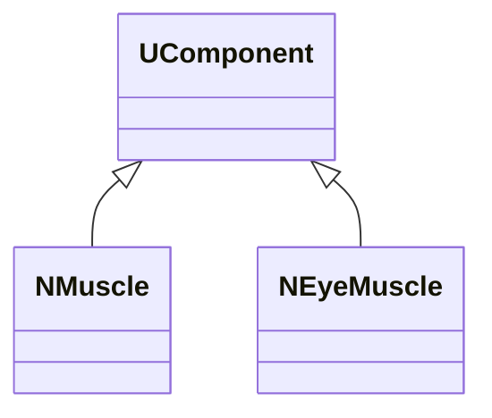
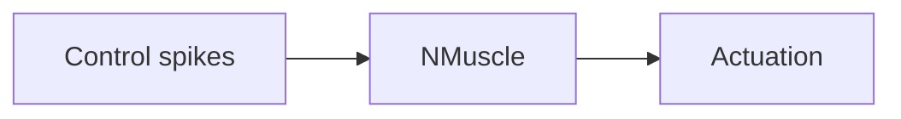
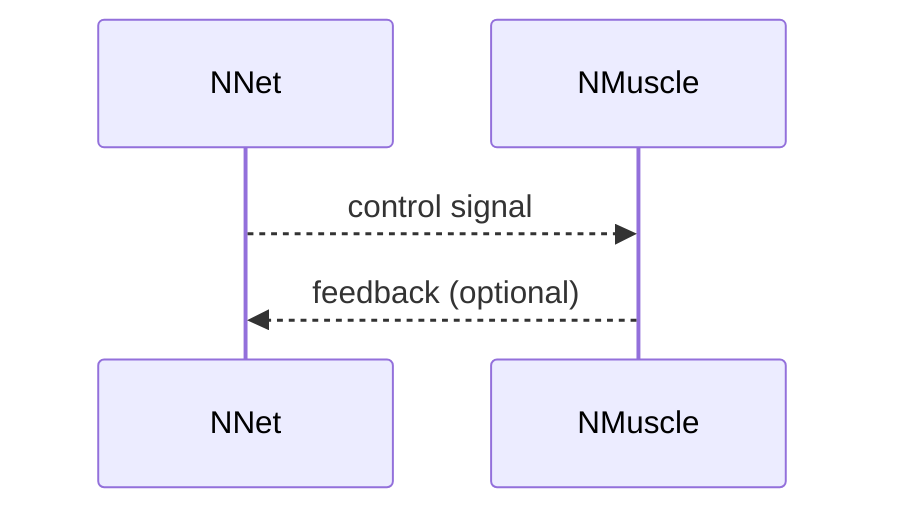

## NMuscle / NEyeMuscle — эффекторные компоненты

**Классы**: `NMuscle`, `NEyeMuscle` — эффекторные узлы, преобразующие активность сети в действие/движение.  
**Регистрация**: `NPulseLibrary.cpp` → `UploadClass("NMuscle", ...)`, `"NEyeMuscle"`.  
**Storage-инстансы**: `ClassName = "NMuscle"` / `"NEyeMuscle"`; параметры усиления/масштабов.

### Входы/выходы
- Вход: суммарная активность/спайки управляющих нейронов.
- Выход: управляющее воздействие (сила/угол/поворот).

Пояснение: блок-схема показывает поток данных/сигналов (входы → компонент → выходы).

Пояснение: диаграмма последовательности показывает типовой сценарий взаимодействия и порядок вызовов.

---

## NMuscle / NEyeMuscle — effectors

Effectors translating spike activity into actions (force/position); optional feedback to the network.
