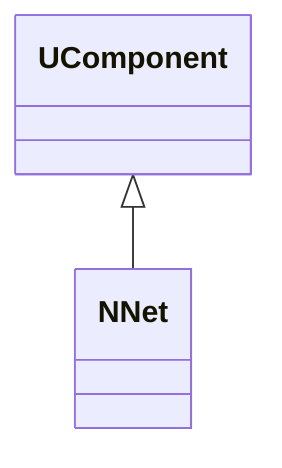
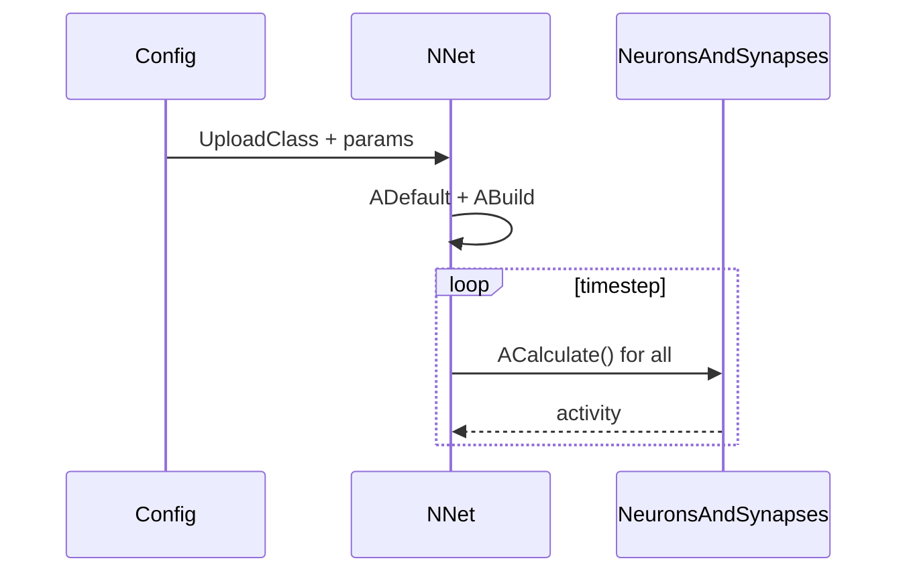
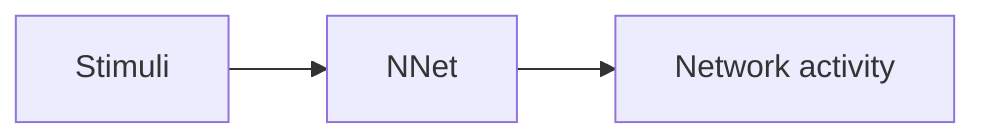
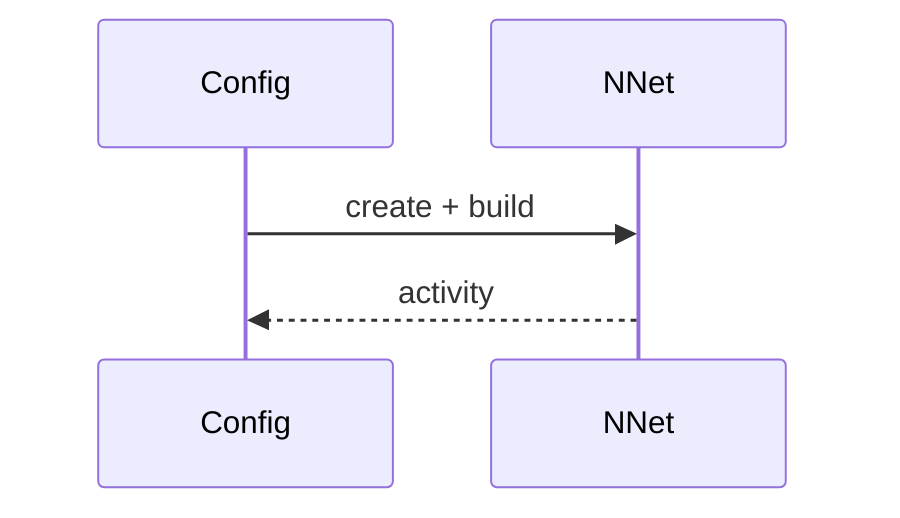

## NNet — базовая сеть (Nmsdk-PulseLib)

**Класс**: `NNet` — контейнер/организатор нейросети (узлы, связи, шаг симуляции).  
**Регистрация в UStorage**: `Libraries/Nmsdk-PulseLib/Core/NPulseLibrary.cpp` → `UploadClass("NNet", ...)`.  
**Storage-инстансы**: `ClassName = "NNet"` в `Bin/ClDesc`/`Bin/Configs`.

### Lifecycle
- **ADefault**: инициализация структуры сети и параметров по умолчанию.
- **ABuild**: построение связей, проверка совместимости входов/выходов.
- **AReset**: сброс состояний нейронов/синапсов.
- **ACalculate**: один шаг симуляции сети (обновление всех компонентов).

### I/O (UProperty)
- Вход: внешние стимулы/сигналы (через `NSource`/`NReceptor`/генераторы).
- Выход: активность/спайки/состояния слоёв (для `NReceiver`/классификаторов/эффекторов).

### classDiagram



Диаграмма показывает `NNet` как компонент верхнего уровня, управляющий шагом симуляции.

### sequenceDiagram



Диаграмма описывает цикл: конфигурация создаёт сеть, сеть строит связи, затем на каждом шаге вызывает расчёт узлов/связей.

### flowchart



Пояснение: блок-схема показывает поток данных/сигналов (входы → компонент → выходы).

### Config snippet

```ini
[Component]
ClassName = NNet
Name = Net1
```

### Родственные компоненты
- `NModel`: [`NModel`](NModel.md)
- `NSource`: [`NSource`](NSource.md)
- `NReceiver`: [`NReceiver`](NReceiver.md)

---

## NNet — network container (EN)

**Class**: `NNet` — top-level network container/orchestrator.  
**Registration**: `NPulseLibrary.cpp` → `UploadClass("NNet", ...)`.  
**Instances**: `ClassName = "NNet"`.

### Lifecycle
- **ADefault**: initialise network structure.
- **ABuild**: build/validate connections.
- **AReset**: reset states.
- **ACalculate**: run one simulation step.

### I/O
- **Inputs**: external stimuli via sources/generators.
- **Outputs**: network activity/spikes for receivers/classifiers/effectors.


Пояснение: диаграмма классов показывает место компонента в иерархии и ключевые связи.



Пояснение: диаграмма последовательности показывает типовой сценарий взаимодействия и порядок вызовов.


Пояснение: блок-схема показывает поток данных/сигналов (входы → компонент → выходы).
