# NNet — базовая сеть (Nmsdk-PulseLib)

## RU

### Назначение

**Класс**: `NNet` — контейнер/организатор нейросети (узлы, связи, шаг симуляции).  
**Регистрация в UStorage**: `Libraries/Nmsdk-PulseLib/Core/NPulseLibrary.cpp` → `UploadClass("NNet", ...)`.  
**Storage-инстансы**: `ClassName = "NNet"` в `Bin/ClDesc`/`Bin/Configs`.

`NNet` является базовым контейнером для организации импульсных нейронных сетей. Наследуется от `UNet` (базовый класс Rdk для сетей компонентов) и предоставляет дополнительные возможности для структурирования многослойных сетей с различными режимами организации связей.

### UML-диаграмма классов

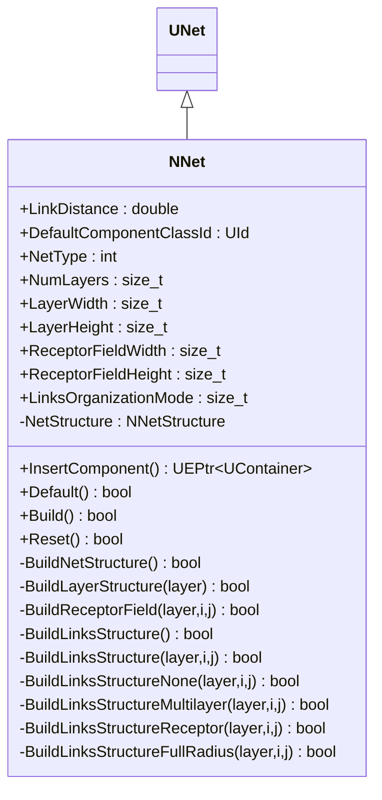

**Иерархия наследования:**
- `UNet` (Rdk) — базовый класс для сетей компонентов
- `NNet` — специализация для импульсных нейронных сетей

**Ключевые свойства:**
- `LinkDistance` (double) — расстояние для организации связей между компонентами
- `DefaultComponentClassId` (UId) — идентификатор класса компонентов по умолчанию для автоматического создания
- `NetType` (int) — тип сети (0 — простая, 1-2 — многослойная)
- `NumLayers` (size_t) — количество слоев в сети
- `LayerWidth`, `LayerHeight` (size_t) — размеры слоя
- `ReceptorFieldWidth`, `ReceptorFieldHeight` (size_t) — размеры рецептивного поля
- `LinksOrganizationMode` (size_t) — режим организации связей (0 — нет, 1 — межслойные, 2 — рецептивные поля, 3 — полный радиус)

### UML-диаграмма последовательности

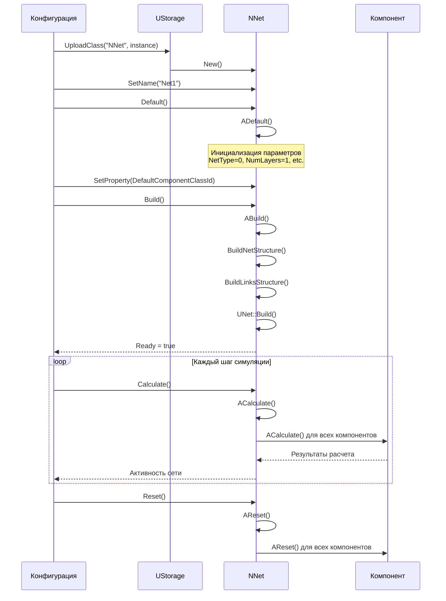

**Описание жизненного цикла:**
1. **Создание**: `New()` создает новый экземпляр `NNet`
2. **Инициализация**: `Default()` / `ADefault()` устанавливает параметры по умолчанию
3. **Сборка**: `Build()` / `ABuild()` строит структуру сети и связи между компонентами
4. **Сброс**: `Reset()` / `AReset()` сбрасывает состояния перед новым циклом расчета
5. **Расчет**: `Calculate()` / `ACalculate()` выполняет один шаг симуляции сети

### UML-диаграмма состояний

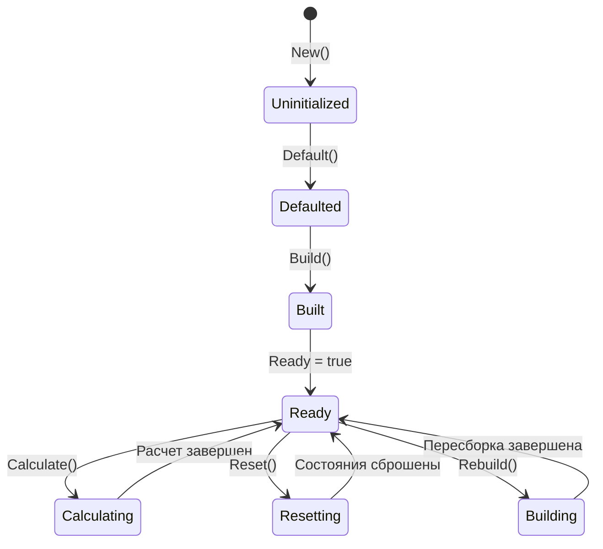

**Состояния:**
- **Uninitialized** — создан, но не инициализирован
- **Defaulted** — параметры установлены по умолчанию
- **Built** — структура сети построена
- **Ready** — готов к выполнению расчетов
- **Calculating** — выполняется расчет сети
- **Resetting** — выполняется сброс состояний

### UML-диаграмма активности

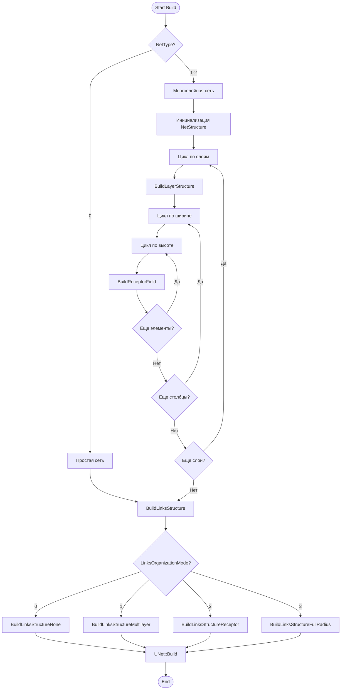

**Алгоритм сборки сети:**
1. Проверка типа сети (`NetType`)
2. Для многослойных сетей: построение структуры слоев и рецептивных полей
3. Организация связей в зависимости от `LinksOrganizationMode`
4. Вызов базового метода `UNet::Build()` для финальной сборки

### UML-диаграмма компонентов

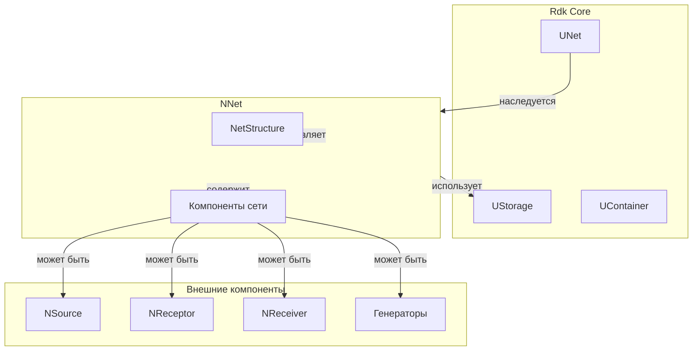

**Зависимости:**
- **Rdk Core**: `UNet` (базовый класс), `UStorage` (хранилище компонентов), `UContainer` (контейнер компонентов)
- **Внутренние компоненты**: нейроны, синапсы, каналы, мембраны, LT-зоны
- **Внешние компоненты**: источники сигналов (`NSource`, `NReceptor`), приемники (`NReceiver`), генераторы

### Свойства

#### Параметры (ptPubParameter)

- **`LinkDistance`** (double) — расстояние для организации связей между компонентами. Используется в режимах организации связей 1 и 3. Значение по умолчанию: 1.0

- **`DefaultComponentClassId`** (UId) — идентификатор класса компонентов по умолчанию. Используется методом `InsertComponent()` для автоматического создания компонентов. Значение по умолчанию: `ForbiddenId` (не установлен)

- **`NetType`** (int) — тип сети:
  - 0 — простая сеть (без автоматической структуры)
  - 1-2 — многослойная сеть с автоматической структурой
  Значение по умолчанию: 0

- **`NumLayers`** (size_t) — количество слоев в многослойной сети. Значение по умолчанию: 1

- **`LayerWidth`** (size_t) — ширина слоя (количество элементов по ширине). Значение по умолчанию: 1

- **`LayerHeight`** (size_t) — высота слоя (количество элементов по высоте). Значение по умолчанию: 1

- **`ReceptorFieldWidth`** (size_t) — ширина рецептивного поля. Значение по умолчанию: 1

- **`ReceptorFieldHeight`** (size_t) — высота рецептивного поля. Значение по умолчанию: 1

- **`LinksOrganizationMode`** (size_t) — режим организации связей:
  - 0 — нет автоматических связей
  - 1 — межслойные связи (все со всеми между слоями с расстоянием `LinkDistance`)
  - 2 — межслойные связи через рецептивные поля между соседними слоями
  - 3 — все со всеми в заданном радиусе `LinkDistance`
  Значение по умолчанию: 0

#### Состояния (ptPubState)

- **`NetStructure`** (NNetStructure) — внутренняя структура сети. Многомерный вектор идентификаторов компонентов: `vector<vector<vector<vector<vector<UId>>>>>`. Используется для хранения структуры многослойной сети с рецептивными полями.

### Методы

#### Публичные методы

- **`New()`** → `NNet*` — создает новый экземпляр класса. Используется системой Rdk для создания компонентов.

- **`InsertComponent()`** → `UEPtr<UContainer>` — создает новый компонент по умолчанию (используя `DefaultComponentClassId`) и добавляет его в сеть. Возвращает указатель на созданный компонент или `nullptr` в случае ошибки.

- **`Default()`** → `bool` — инициализирует параметры по умолчанию. Вызывает `ADefault()` и базовый `UNet::Default()`.

- **`Build()`** → `bool` — строит структуру сети и связи между компонентами. Вызывает `BuildNetStructure()`, `BuildLinksStructure()` и базовый `UNet::Build()`.

- **`Reset()`** → `bool` — сбрасывает состояния сети. Вызывает базовый `UNet::Reset()`.

#### Защищенные методы

- **`BuildNetStructure()`** → `bool` — строит структуру сети в зависимости от `NetType`. Для многослойных сетей создает структуру слоев.

- **`BuildLayerStructure(size_t layer)`** → `bool` — строит структуру указанного слоя. Вызывает `BuildReceptorField()` для каждого элемента слоя.

- **`BuildReceptorField(size_t layer, size_t i, size_t j)`** → `bool` — строит рецептивное поле для элемента слоя с координатами (i, j).

- **`BuildLinksStructure()`** → `bool` — организует связи между компонентами сети. Вызывает `BuildLinksStructure()` для каждого элемента каждого слоя.

- **`BuildLinksStructure(size_t layer, size_t i, size_t j)`** → `bool` — организует связи для конкретного элемента сети в зависимости от `LinksOrganizationMode`.

- **`BuildLinksStructureNone(size_t layer, size_t i, size_t j)`** → `bool` — режим 0: не создает автоматических связей.

- **`BuildLinksStructureMultilayer(size_t layer, size_t i, size_t j)`** → `bool` — режим 1: создает межслойные связи с расстоянием `LinkDistance`.

- **`BuildLinksStructureReceptor(size_t layer, size_t i, size_t j)`** → `bool` — режим 2: создает связи через рецептивные поля между соседними слоями.

- **`BuildLinksStructureFullRadius(size_t layer, size_t i, size_t j)`** → `bool` — режим 3: создает связи со всеми компонентами в радиусе `LinkDistance`.

### Примеры использования

#### Пример 1: Создание простой сети в коде C++

```cpp
// Создание сети
auto net = storage->CreateComponent<NNet>();
net->SetName("MyNetwork");

// Инициализация
net->Default();

// Установка класса компонентов по умолчанию
net->DefaultComponentClassId = storage->GetClassId("NPulseNeuronIzhikevich");

// Добавление компонентов вручную
auto neuron1 = storage->CreateComponent<NPulseNeuronIzhikevich>();
net->AddComponent(neuron1);

auto neuron2 = storage->CreateComponent<NPulseNeuronIzhikevich>();
net->AddComponent(neuron2);

// Создание связи между нейронами
auto synapse = storage->CreateComponent<NSynapseStdp>();
synapse->PreNeuron = neuron1;
synapse->PostNeuron = neuron2;
net->AddComponent(synapse);

// Сборка сети
net->Build();

// Использование
for (int step = 0; step < 1000; step++) {
    net->Calculate();
}
```

#### Пример 2: Конфигурация XML

```xml
<Model Class="NNet">
    <Parameters>
        <LinkDistance>1.0</LinkDistance>
        <NetType>0</NetType>
        <NumLayers>1</NumLayers>
        <LayerWidth>1</LayerWidth>
        <LayerHeight>1</LayerHeight>
        <LinksOrganizationMode>0</LinksOrganizationMode>
    </Parameters>
    <Components>
        <Neuron1 Class="NPulseNeuronIzhikevich">
            <!-- Параметры нейрона -->
        </Neuron1>
        <Neuron2 Class="NPulseNeuronIzhikevich">
            <!-- Параметры нейрона -->
        </Neuron2>
        <Synapse1 Class="NSynapseStdp">
            <!-- Параметры синапса -->
        </Synapse1>
    </Components>
    <Links>
        <elem>
            <Item>Neuron1.Output</Item>
            <Connector>Synapse1.Input</Connector>
        </elem>
        <elem>
            <Item>Synapse1.Output</Item>
            <Connector>Neuron2.Input</Connector>
        </elem>
    </Links>
</Model>
```

### Использование в конфигурациях

`NNet` используется как корневой компонент в некоторых конфигурационных проектах:

- Простые эксперименты с небольшими сетями
- Ручная организация структуры сети через XML-конфигурации

**Примечание**: В большинстве современных проектов используется `NModel` вместо `NNet` как корневой компонент, так как `NModel` предоставляет дополнительные возможности управления.

## Источники

См. [Literature-References.md](../Literature-References.md): **[A]**, **4**, **25**.

### См. также

- [`NModel`](NModel.md) — расширенная модель сети (рекомендуется для большинства случаев)
- [`NLifeNet`](NLifeNet.md) — сеть с жизненным циклом нейронов
- [Architecture.md](../Architecture.md) — архитектура библиотеки
- [Config-Overview.md](../Config-Overview.md) — описание конфигурационных проектов

### sequenceDiagram

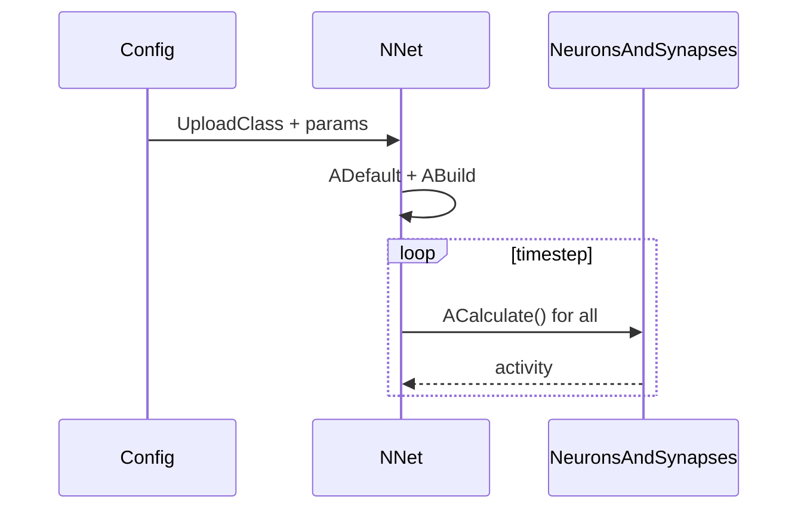

Диаграмма описывает цикл: конфигурация создаёт сеть, сеть строит связи, затем на каждом шаге вызывает расчёт узлов/связей.

### flowchart

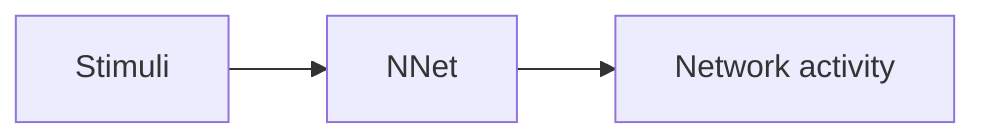

Пояснение: блок-схема показывает поток данных/сигналов (входы → компонент → выходы).

### Config snippet

```ini
[Component]
ClassName = NNet
Name = Net1
```

### Родственные компоненты
- `NModel`: [`NModel`](NModel.md)
- `NSource`: [`NSource`](NSource.md)
- `NReceiver`: [`NReceiver`](NReceiver.md)

---

## EN

### Purpose

**Class**: `NNet` — network container/organizer for spiking neural networks.  
**Registration**: `NPulseLibrary.cpp` → `UploadClass("NNet", ...)`.  
**Instances**: `ClassName = "NNet"` in `Bin/Configs/*/Model_*.xml`.

`NNet` is a base container for organizing spiking neural networks. Inherits from `UNet` (base Rdk class for component networks) and provides additional capabilities for structuring multi-layer networks with various link organization modes.

### UML Class Diagram

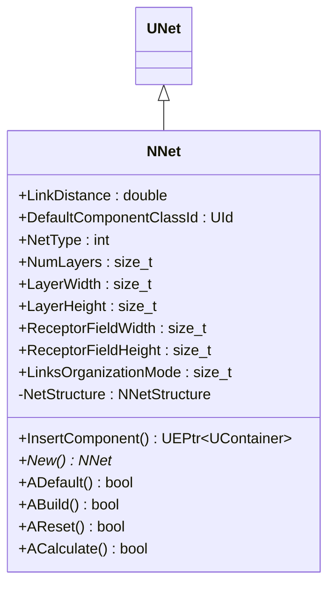

**Inheritance hierarchy:**
- `UNet` (Rdk) — base class for component networks
- `NNet` — specialization for spiking neural networks

**Key properties:**
- `LinkDistance` (double) — distance for organizing links between components
- `DefaultComponentClassId` (UId) — default component class identifier for automatic creation
- `NetType` (int) — network type (0 — simple, 1-2 — multi-layer)
- `NumLayers` (size_t) — number of layers in network
- `LayerWidth`, `LayerHeight` (size_t) — layer dimensions
- `ReceptorFieldWidth`, `ReceptorFieldHeight` (size_t) — receptive field dimensions
- `LinksOrganizationMode` (size_t) — link organization mode (0 — none, 1 — inter-layer, 2 — receptive fields, 3 — full radius)

### UML Sequence Diagram

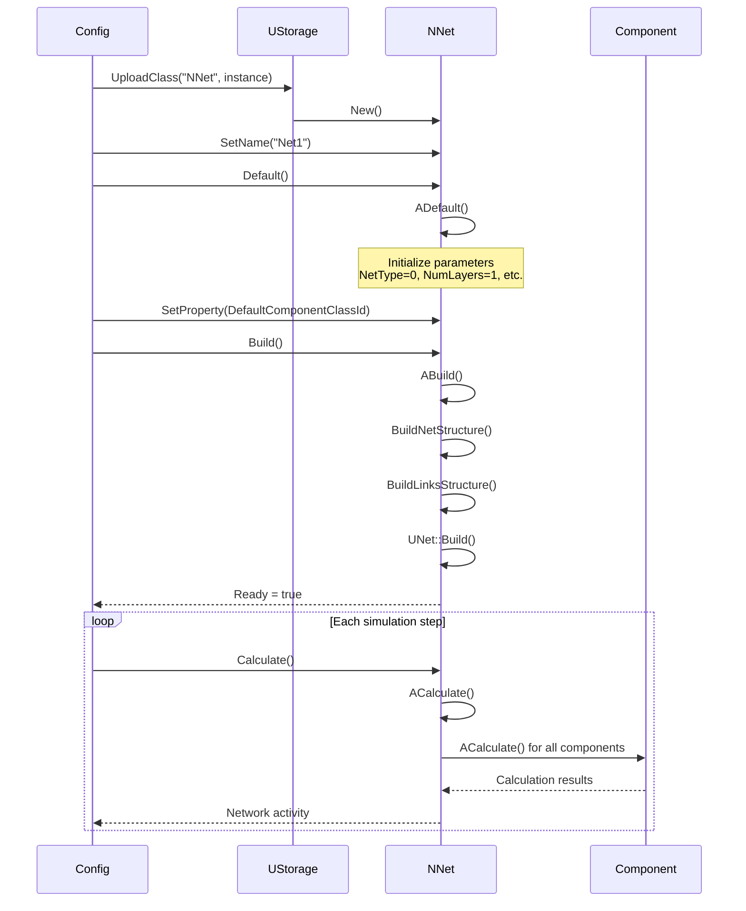

### UML State Diagram

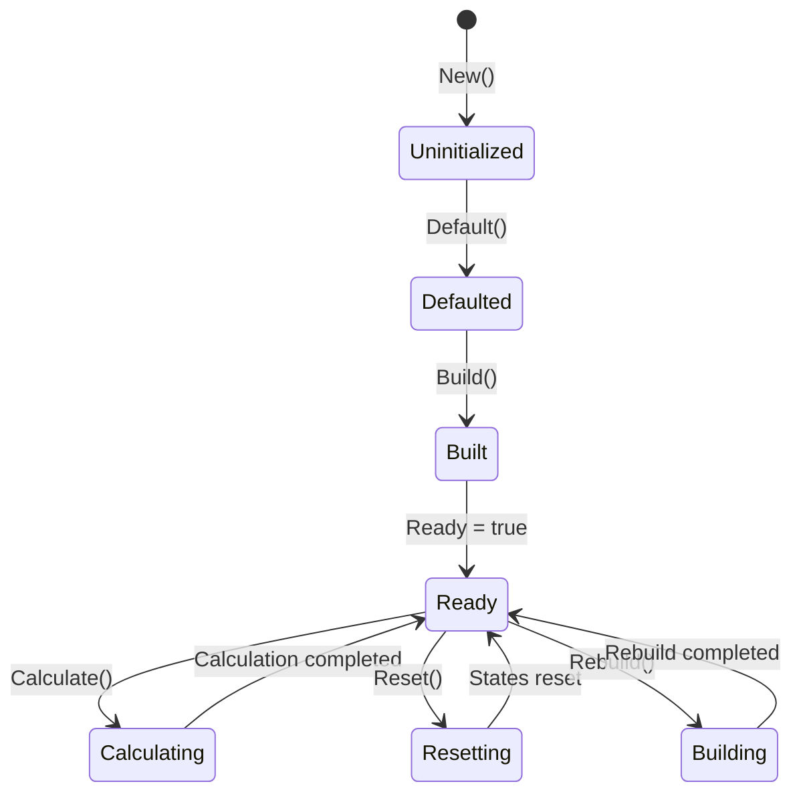

### UML Activity Diagram

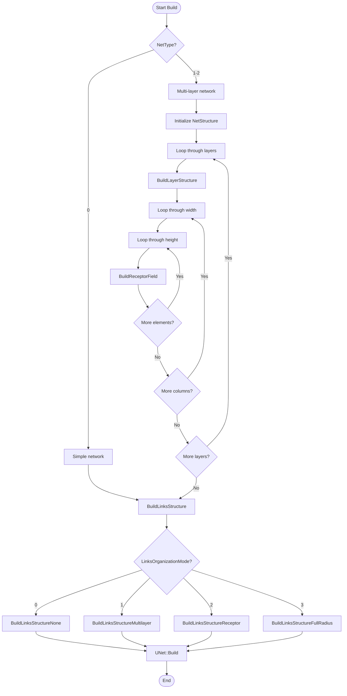

### UML Component Diagram

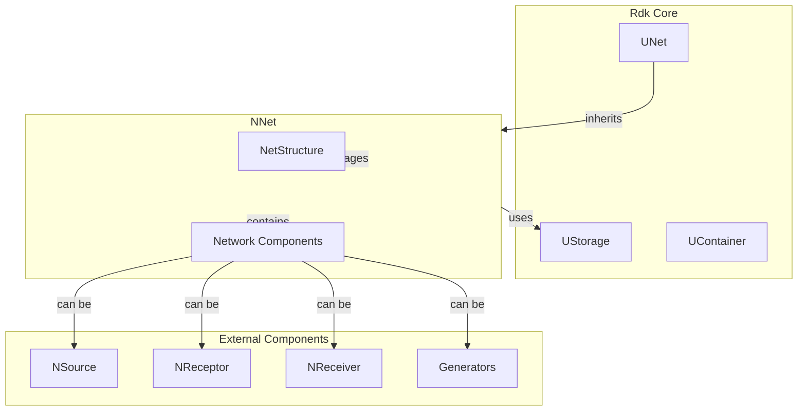

### Properties

- `LinkDistance` — distance for organizing links between components (used in modes 1 and 3)
- `DefaultComponentClassId` — default component class identifier for automatic creation
- `NetType` — network type (0 — simple, 1-2 — multi-layer)
- `NumLayers` — number of layers in multi-layer network
- `LayerWidth` — layer width (number of elements)
- `LayerHeight` — layer height (number of elements)
- `ReceptorFieldWidth` — receptive field width
- `ReceptorFieldHeight` — receptive field height
- `LinksOrganizationMode` — link organization mode (0 — none, 1 — inter-layer, 2 — receptive fields, 3 — full radius)
- `NetStructure` — internal network structure (multi-dimensional vector of component IDs)

### Methods

- `InsertComponent()` — creates new component using DefaultComponentClassId and adds it to network
- `ADefault()` — initializes default parameters
- `ABuild()` — builds network structure and links between components
- `AReset()` — resets network states
- `ACalculate()` — performs one simulation step
- `BuildNetStructure()` — builds network structure based on NetType
- `BuildLayerStructure(layer)` — builds structure for specified layer
- `BuildReceptorField(layer, i, j)` — builds receptive field for layer element
- `BuildLinksStructure()` — organizes links between network components

### Usage in configurations

`NNet` is used as root component in some configuration projects:

- **Simple experiments**: experiments with small networks
- **Manual structure**: manual network organization through XML configurations

**Note**: In most modern projects, `NModel` is used instead of `NNet` as root component, as `NModel` provides additional management capabilities.

**Features:**
- Multi-layer support: supports multi-layer network structures
- Automatic structure: can automatically build network structure
- Link organization: supports various link organization modes
- Flexible configuration: supports manual and automatic component creation

**Typical parameter values:**
- **NetType**: 0 (simple network) or 1-2 (multi-layer network)
- **NumLayers**: 1-10 (number of layers)
- **LayerWidth/LayerHeight**: 1-100 (layer dimensions)
- **LinksOrganizationMode**: 0 (no automatic links) to 3 (full radius)

### References

See [Literature-References.md](../Literature-References.md): **[A]**, **4**, **25**.

### See Also

- [`NModel`](NModel.md) — extended network model (recommended for most cases)
- [`NLifeNet`](NLifeNet.md) — network with neuron lifecycle
- [Architecture.md](../Architecture.md) — library architecture
- [Config-Overview.md](../Config-Overview.md) — configuration projects description
