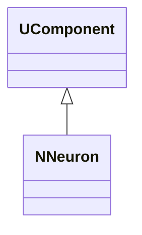
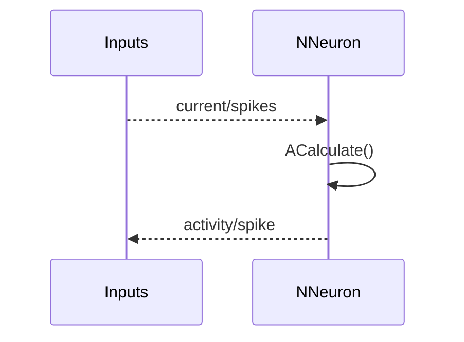
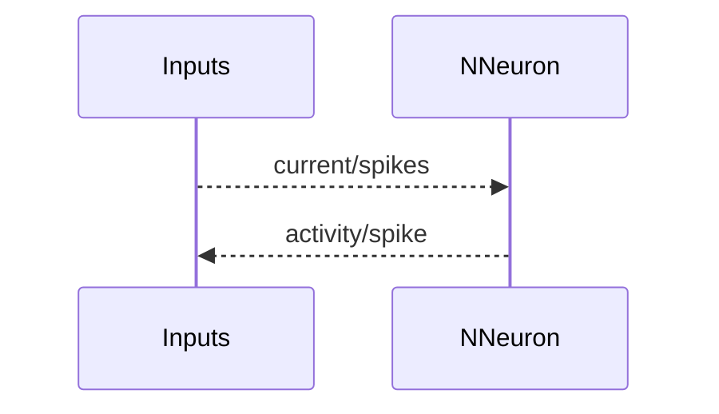

## NNeuron — базовый нейрон

**Класс**: `NNeuron` — базовый класс нейрона (абстрактная/общая логика).  
**Регистрация**: `NPulseLibrary.cpp` → `UploadClass("NNeuron", ...)`.  
**Storage-инстансы**: `ClassName = "NNeuron"` (обычно используется через наследников).

### Lifecycle
- **ADefault**: установка параметров нейрона по умолчанию.
- **ABuild**: подключение входных каналов/синапсов.
- **AReset**: сброс мембранного состояния/счётчиков.
- **ACalculate**: расчёт одного шага состояния/выхода.

### I/O
- Вход: токи/импульсы (через каналы/синапсы).
- Выход: активность/спайк/потенциал (в зависимости от реализации).



Диаграмма подчёркивает базовую роль `NNeuron` как компонента нейронной динамики.



Пояснение: диаграмма последовательности показывает типовой сценарий взаимодействия и порядок вызовов.


Пояснение: блок-схема показывает поток данных/сигналов (входы → компонент → выходы).

### Config snippet

```ini
[Component]
ClassName = NNeuron
Name = NeuronBase1
```

---

## NNeuron — base neuron (EN)

Base neuron component; typically used via derived neuron models.


Description: this class diagram shows the component position in the type hierarchy and key relations.



Description: this sequence diagram shows a typical runtime interaction and call order.


Description: this flowchart shows the data/signal flow (inputs → component → outputs).
