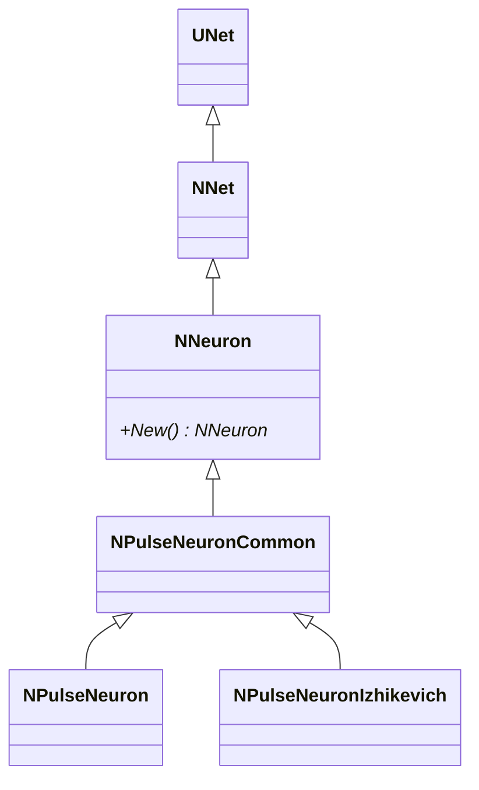
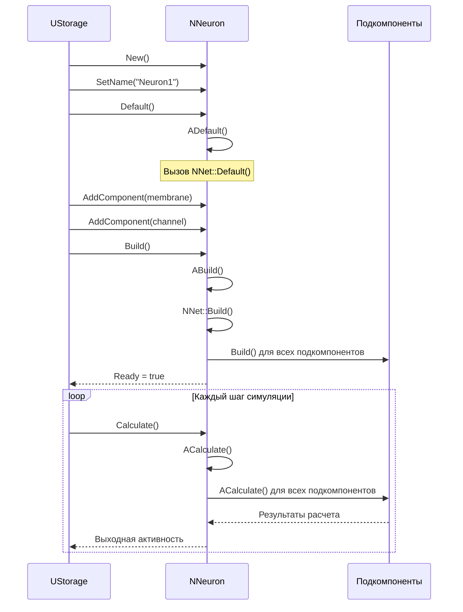
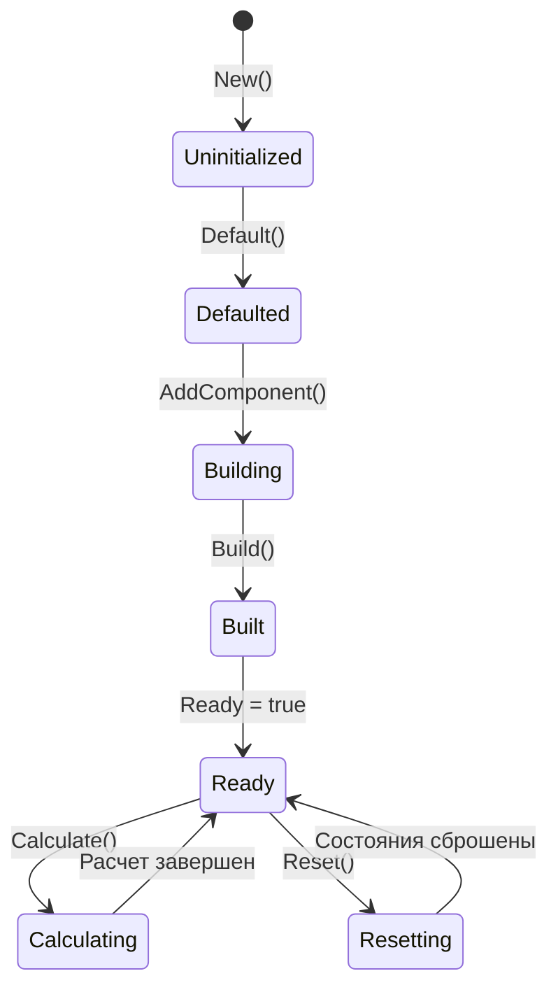
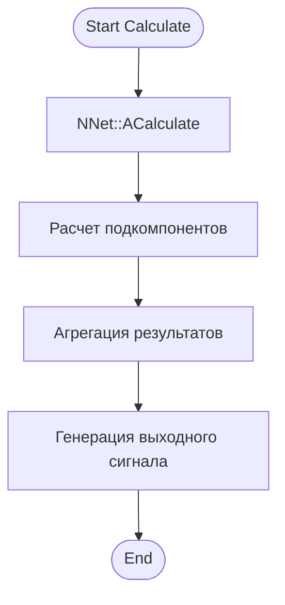
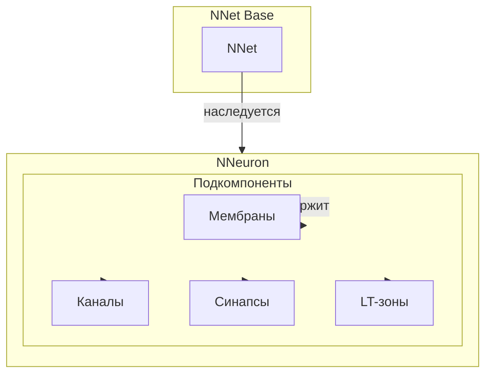
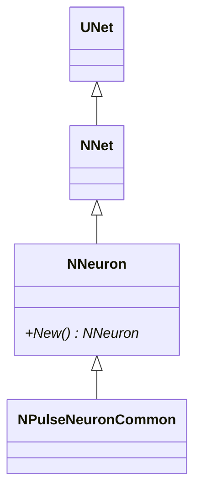
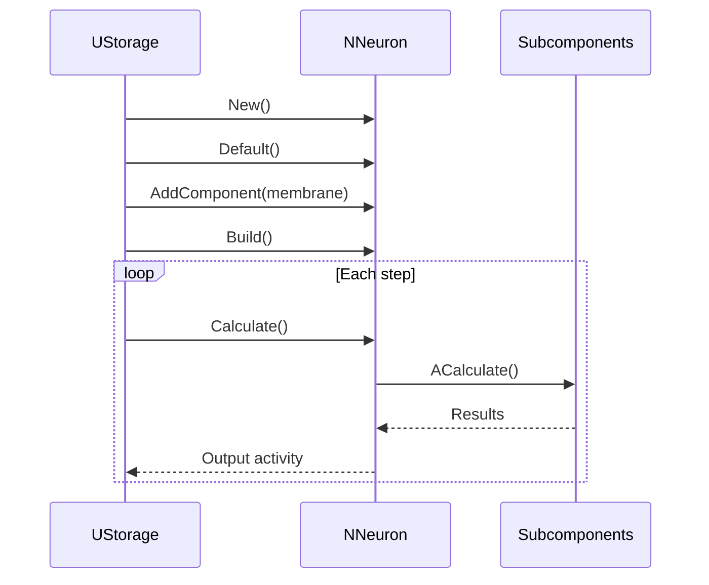
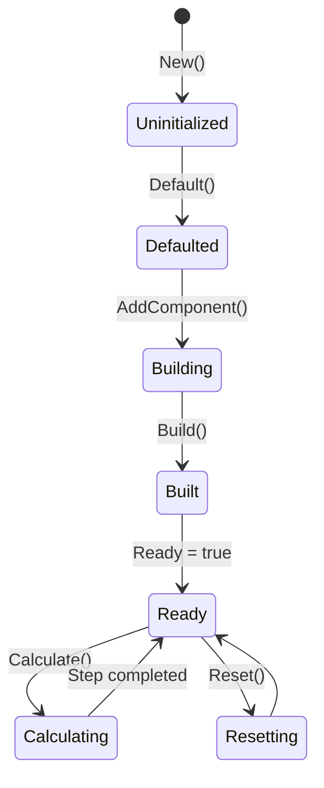
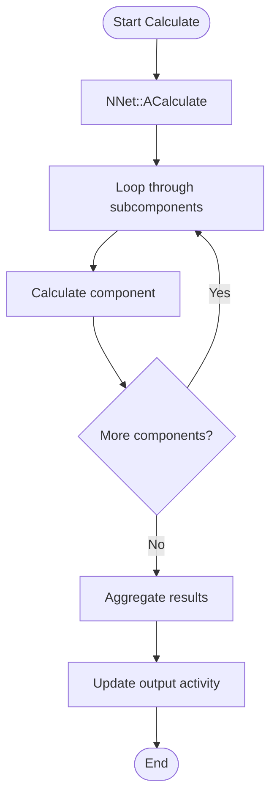
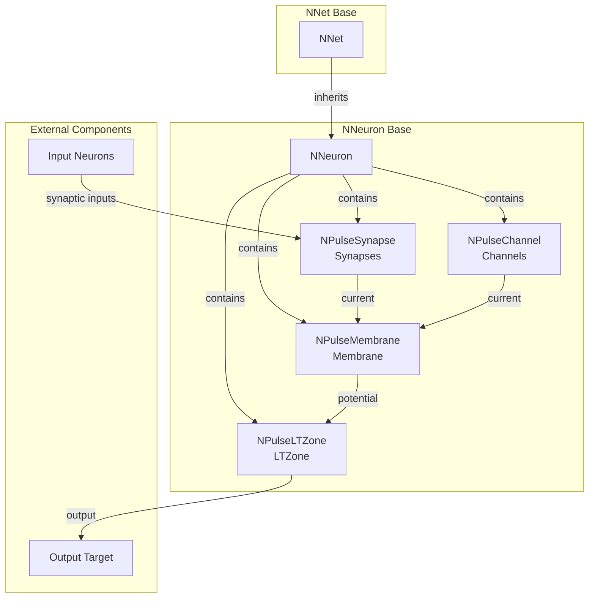

# NNeuron — базовый нейрон

## RU

### Назначение

**Класс**: `NNeuron` — базовый класс нейрона (абстрактная/общая логика).
**Регистрация**: `NPulseLibrary.cpp` → `UploadClass("NNeuron", ...)`.
**Storage-инстансы**: `ClassName = "NNeuron"` (обычно используется через наследников).

`NNeuron` является базовым классом для всех нейронов в библиотеке PulseLib. Наследуется от `NNet` и служит основой для более специализированных классов нейронов (`NPulseNeuronCommon`, `NPulseNeuronIzhikevich` и т.д.). Сам по себе не имеет дополнительных свойств или методов по сравнению с `NNet`, но определяет концептуальную иерархию для нейронов. В нейроморфных системах на основе импульсного нейрона со структурной адаптацией [A] модель нейрона может поддерживать структурную и параметрическую адаптацию, а пластичность обеспечивается изменением весов синапсов и параметров мембраны в процессе функционирования.

### UML-диаграмма классов

**Иерархия наследования:**
- `UNet` (Rdk) — базовый класс для сетей компонентов
- `NNet` — базовая сеть
- `NNeuron` — базовый нейрон (концептуальный базовый класс)
- `NPulseNeuronCommon` — общий импульсный нейрон
- `NPulseNeuron` — импульсный нейрон с параметрами структурирования
- `NPulseNeuronIzhikevich` и другие — специализированные нейроны

**Особенности:**
- `NNeuron` не добавляет новых свойств или методов к `NNet`
- Используется как маркер типа для идентификации нейронов в системе
- Все специализированные нейроны наследуются от `NNeuron` или его потомков

### UML-диаграмма последовательности

**Жизненный цикл:**
1. **Создание**: `New()` создает новый экземпляр `NNeuron`
2. **Инициализация**: `Default()` вызывает базовый `NNet::Default()`
3. **Добавление компонентов**: Мембраны, каналы, синапсы добавляются как подкомпоненты
4. **Сборка**: `Build()` вызывает базовый `NNet::Build()`
5. **Расчет**: `Calculate()` выполняет расчет нейрона и всех его подкомпонентов

### UML-диаграмма состояний

**Состояния:**
- **Uninitialized** — создан, но не инициализирован
- **Defaulted** — инициализирован базовыми параметрами
- **Building** — добавление подкомпонентов (мембран, каналов)
- **Built** — структура нейрона построена
- **Ready** — готов к выполнению расчетов
- **Calculating** — выполняется расчет нейрона
- **Resetting** — выполняется сброс состояний

### UML-диаграмма активности

**Алгоритм расчета:**
1. Вызов базового расчета сети (`NNet::ACalculate()`)
2. Расчет всех подкомпонентов (мембран, каналов, синапсов)
3. Агрегация результатов от подкомпонентов
4. Генерация выходного сигнала нейрона

### UML-диаграмма компонентов

**Зависимости:**
- **Базовый класс**: `NNet`
- **Подкомпоненты**: мембраны (`NPulseMembrane*`), каналы (`NPulseChannel*`), синапсы (`NPulseSynapse*`), LT-зоны (`NPulseLTZone*`)

### Свойства

`NNeuron` не имеет собственных публичных свойств (UProperty). Все свойства наследуются от базового класса `NNet`.

### Методы

#### Публичные методы

- **`New()`** → `NNeuron*` — создает новый экземпляр класса. Используется системой Rdk для создания компонентов.

**Наследуемые методы от NNet:**
- `AddComponent()` — добавление подкомпонента в нейрон
- `CreateLink()` — создание связи между компонентами
- `Default()` / `Build()` / `Reset()` / `Calculate()` — методы жизненного цикла

### Примеры использования

`NNeuron` обычно не используется напрямую. Вместо него используются специализированные классы:

- `NPulseNeuronCommon` — для базовых импульсных нейронов
- `NPulseNeuronIzhikevich` — для нейронов модели Ижикевича
- `NPulseNeuron` — для нейронов с параметрами структурирования

### Использование в конфигурациях

`NNeuron` редко используется напрямую в конфигурациях. Вместо него используются специализированные классы нейронов.

## Источники

См. [Literature-References.md](../Literature-References.md): **[A]**, **4**, **25**, **29**.

### См. также

- [`NPulseNeuronCommon`](NPulseNeuronCommon.md) — общий импульсный нейрон
- [`NPulseNeuron`](NPulseNeuron.md) — импульсный нейрон с параметрами структурирования
- [`NPulseNeuronIzhikevich`](NPulseNeuronIzhikevich.md) — нейрон модели Ижикевича
- [`NNet`](NNet.md) — базовая сеть
- [Architecture.md](../Architecture.md) — архитектура библиотеки

---

## EN

### Purpose

**Class**: `NNeuron` — base neuron class (abstract/general logic).
**Registration**: `NPulseLibrary.cpp` → `UploadClass("NNeuron", ...)`.
**Instances**: `ClassName = "NNeuron"` (typically used via derived classes).

`NNeuron` is the base class for all neurons in the PulseLib library. It inherits from `NNet` and serves as the foundation for more specialized neuron classes (`NPulseNeuronCommon`, `NPulseNeuronIzhikevich`, etc.). It does not add additional properties or methods compared to `NNet`, but defines the conceptual hierarchy for neurons. In neuromorphic systems based on the spiking neuron model with structural adaptation [A], the neuron model can support structural and parametric adaptation, and plasticity is provided by changing synapse weights and membrane parameters during operation.

### UML Class Diagram

### UML Sequence Diagram

### UML State Diagram

### UML Activity Diagram

### UML Component Diagram

### Properties

`NNeuron` inherits all properties from `NNet` base class. As a conceptual base class, it doesn't add new properties but serves as a type marker for neurons.

### Methods

`NNeuron` inherits all methods from `NNet` base class:
- `New()` — creates new neuron instance
- `ADefault()` — sets default parameters
- `ABuild()` — builds neuron structure
- `ACalculate()` — performs calculation step
- `AReset()` — resets neuron state

### Usage in configurations

`NNeuron` is used as a base class for all neurons:

- **Base class**: Used as conceptual base for all neuron types
- **Type marker**: Identifies components as neurons in the system
- **Inheritance**: All specialized neurons inherit from `NNeuron` or its descendants

**Features:**
- Conceptual base: serves as a type marker for neurons
- No additional properties: inherits all functionality from `NNet`
- Foundation: provides base for specialized neuron classes

### References

See [Literature-References.md](../Literature-References.md): **[A]**, **4**, **25**, **29**.

### See Also

- [`NPulseNeuronCommon`](NPulseNeuronCommon.md) — common spiking neuron
- [`NPulseNeuron`](NPulseNeuron.md) — spiking neuron with structuring parameters
- [`NPulseNeuronIzhikevich`](NPulseNeuronIzhikevich.md) — Izhikevich model neuron
- [`NNet`](NNet.md) — base network
- [Architecture.md](../Architecture.md) — library architecture
