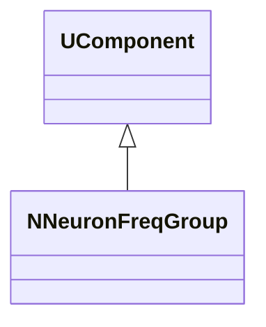
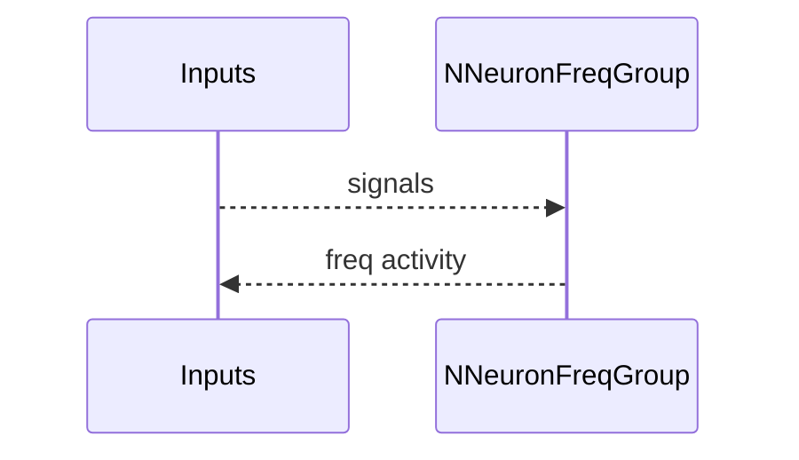
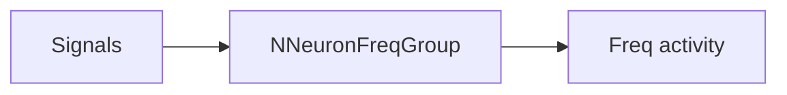
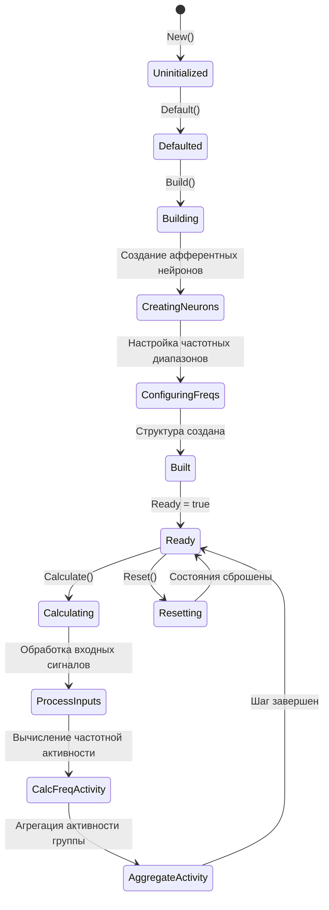
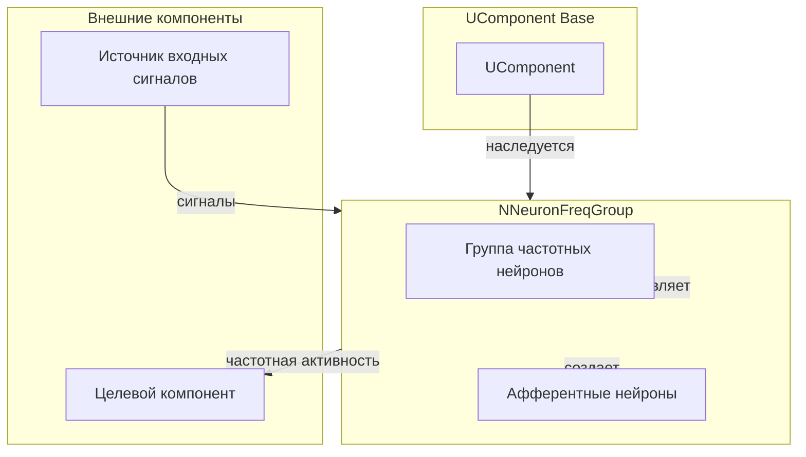
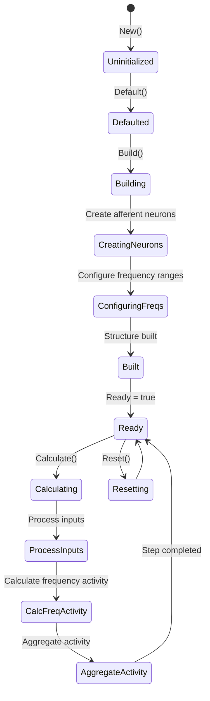
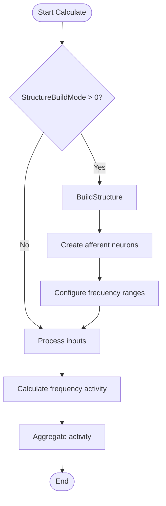
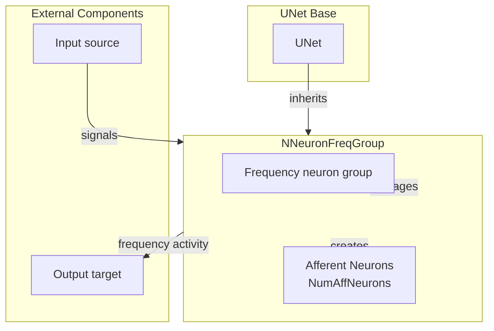

## NNeuronFreqGroup — группа частотных нейронов

**Класс**: `NNeuronFreqGroup` — группирует нейроны по частотным признакам.
**Регистрация**: `NPulseLibrary.cpp` → `UploadClass("NNeuronFreqGroup", ...)`.
**Storage**: `ClassName = "NNeuronFreqGroup"`.

### Lifecycle
- **ADefault**: параметры группировки/частот.
- **ABuild**: создание/подключение нейронов группы.
- **AReset**: сброс состояний.
- **ACalculate**: обновление частотной активности группы.

### I/O
- Вход: сигналы/стимулы.
- Выход: частотные признаки/активности.



Пояснение: диаграмма классов показывает место компонента в иерархии и ключевые связи.



Пояснение: диаграмма последовательности показывает типовой сценарий взаимодействия и порядок вызовов.



Пояснение: блок-схема показывает поток данных/сигналов (входы → компонент → выходы).

### UML-диаграмма состояний



**Состояния:**
- **Uninitialized** — создан, но не инициализирован
- **Defaulted** — параметры установлены по умолчанию
- **Building** — выполняется сборка структуры
- **CreatingNeurons** — создание афферентных нейронов
- **ConfiguringFreqs** — настройка частотных диапазонов
- **Built** — структура группы построена
- **Ready** — готов к выполнению расчетов
- **Calculating** — выполняется расчет группы
- **ProcessInputs** — обработка входных сигналов
- **CalcFreqActivity** — вычисление частотной активности
- **AggregateActivity** — агрегация активности группы
- **Resetting** — выполняется сброс состояний

### UML-диаграмма компонентов



**Зависимости:**
- **Базовый класс**: `UComponent`
- **Внутренние компоненты**: афферентные нейроны (создаются автоматически)
- **Внешние компоненты**: источник входных сигналов (источник данных), целевой компонент (получатель частотной активности)

### Config snippet

```ini
[Component]
ClassName = NNeuronFreqGroup
Name = FreqGroup1
```

---

## NNeuronFreqGroup — neuron frequency group (EN)

Groups neurons by frequency features and outputs frequency activity.


Description: this class diagram shows the component position in the type hierarchy and key relations.


Description: this sequence diagram shows a typical runtime interaction and call order.


Description: this flowchart shows the data/signal flow (inputs → component → outputs).

### UML State Diagram



### UML Activity Diagram



### UML Component Diagram



## Источники

См. [Literature-References.md](../Literature-References.md): **neuromodeler.ru**, **15**, **[A]**.

### Properties

- `StructureBuildMode` — режим пересборки структуры (0 — не пересобирать, 1 — пересобрать)
- `AffNeuronClassName` — имя класса афферентных нейронов
- `NumAffNeurons` — количество афферентных нейронов
- `MinInputFreq` — минимальная входная частота
- `MaxInputFreq` — максимальная входная частота

### Methods

- `SetStructureBuildMode(value)` — установка режима пересборки структуры
- `SetAffNeuronClassName(value)` — установка имени класса афферентных нейронов
- `SetNumAffNeurons(value)` — установка количества афферентных нейронов
- `SetMinInputFreq(value)` — установка минимальной входной частоты
- `SetMaxInputFreq(value)` — установка максимальной входной частоты
- `ADefault()` — установка параметров по умолчанию
- `ABuild()` — сборка структуры группы
- `ACalculate()` — выполнение шага расчета частотной активности
- `BuildStructure()` — построение структуры афферентных нейронов

### Usage in configurations

`NNeuronFreqGroup` is used for grouping neurons by frequency features:

- **Frequency grouping**: `Bin/Configs/*/Model_*.xml` (where frequency-based neuron grouping is required)
- **Frequency analysis**: experiments with frequency-based signal analysis
- **Afferent processing**: processing afferent signals with frequency characteristics

**Features:**
- Automatic structure building: creates afferent neurons for frequency analysis
- Frequency ranges: configures frequency ranges for neurons
- Activity aggregation: aggregates frequency activity from neurons

**Typical parameter values:**
- **AffNeuronClassName**: "NAfferentNeuron" (afferent neuron)
- **NumAffNeurons**: 5-20 (number of afferent neurons)
- **MinInputFreq**: 1-10 (minimum input frequency)
- **MaxInputFreq**: 10-100 (maximum input frequency)

### References

See [Literature-References.md](../Literature-References.md): **neuromodeler.ru**, **15**, **[A]**.
