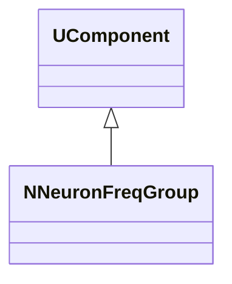
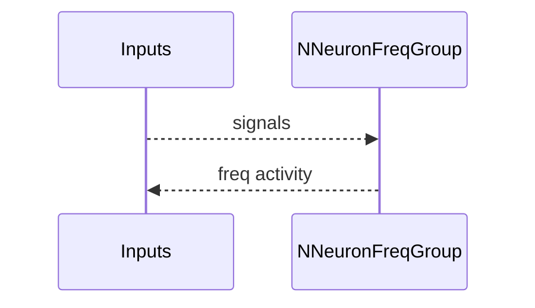
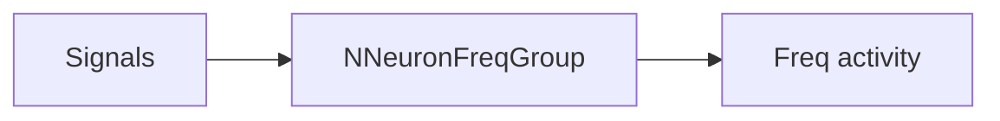

## NNeuronFreqGroup — группа частотных нейронов

**Класс**: `NNeuronFreqGroup` — группирует нейроны по частотным признакам.  
**Регистрация**: `NPulseLibrary.cpp` → `UploadClass("NNeuronFreqGroup", ...)`.  
**Storage**: `ClassName = "NNeuronFreqGroup"`.

### Lifecycle
- **ADefault**: параметры группировки/частот.
- **ABuild**: создание/подключение нейронов группы.
- **AReset**: сброс состояний.
- **ACalculate**: обновление частотной активности группы.

### I/O
- Вход: сигналы/стимулы.
- Выход: частотные признаки/активности.



Пояснение: диаграмма классов показывает место компонента в иерархии и ключевые связи.



Пояснение: диаграмма последовательности показывает типовой сценарий взаимодействия и порядок вызовов.



Пояснение: блок-схема показывает поток данных/сигналов (входы → компонент → выходы).

### Config snippet

```ini
[Component]
ClassName = NNeuronFreqGroup
Name = FreqGroup1
```

---

## NNeuronFreqGroup — neuron frequency group (EN)

Groups neurons by frequency features and outputs frequency activity.


Description: this class diagram shows the component position in the type hierarchy and key relations.


Description: this sequence diagram shows a typical runtime interaction and call order.


Description: this flowchart shows the data/signal flow (inputs → component → outputs).
