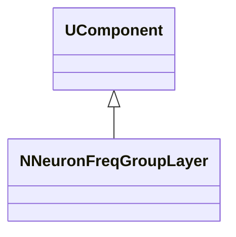
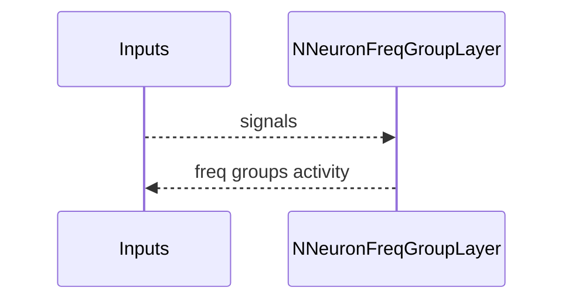
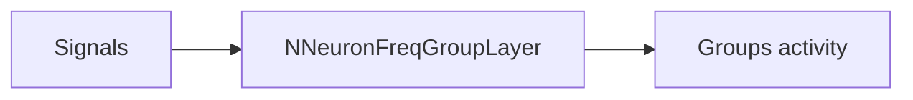
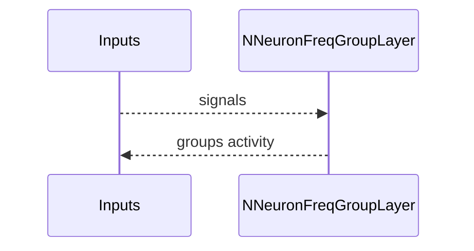

## NNeuronFreqGroupLayer — слой частотных групп

**Класс**: `NNeuronFreqGroupLayer` — слой, состоящий из нескольких `NNeuronFreqGroup`.  
**Регистрация**: `NPulseLibrary.cpp` → `UploadClass("NNeuronFreqGroupLayer", ...)`.  
**Storage**: `ClassName = "NNeuronFreqGroupLayer"`.

### Lifecycle
- **ADefault**: параметры групп/слоя.
- **ABuild**: создание и связывание групп.
- **AReset**: сброс состояний групп.
- **ACalculate**: обновление всех групп слоя.

### I/O
- Вход: сигналы/стимулы.
- Выход: совокупная частотная активность по группам.



Пояснение: диаграмма классов показывает место компонента в иерархии и ключевые связи.



Пояснение: диаграмма последовательности показывает типовой сценарий взаимодействия и порядок вызовов.



Пояснение: блок-схема показывает поток данных/сигналов (входы → компонент → выходы).

### Config snippet

```ini
[Component]
ClassName = NNeuronFreqGroupLayer
Name = FreqLayer1
```

---

## NNeuronFreqGroupLayer — frequency group layer (EN)

Layer of frequency groups aggregating activity across groups.


Description: this class diagram shows the component position in the type hierarchy and key relations.



Description: this sequence diagram shows a typical runtime interaction and call order.


Description: this flowchart shows the data/signal flow (inputs → component → outputs).
