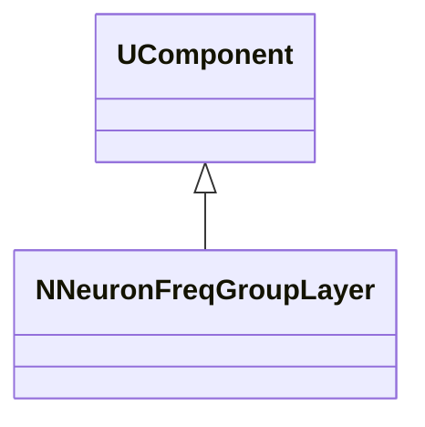
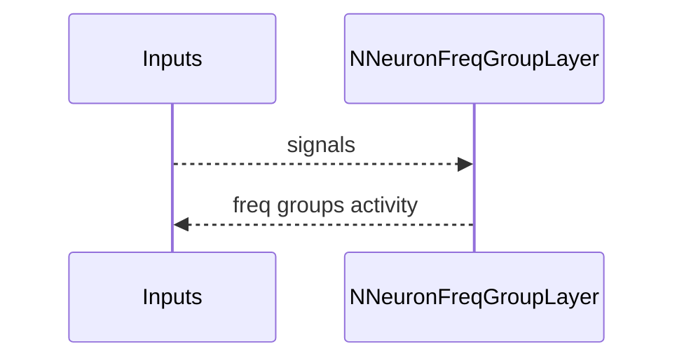
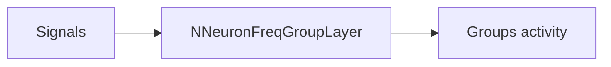
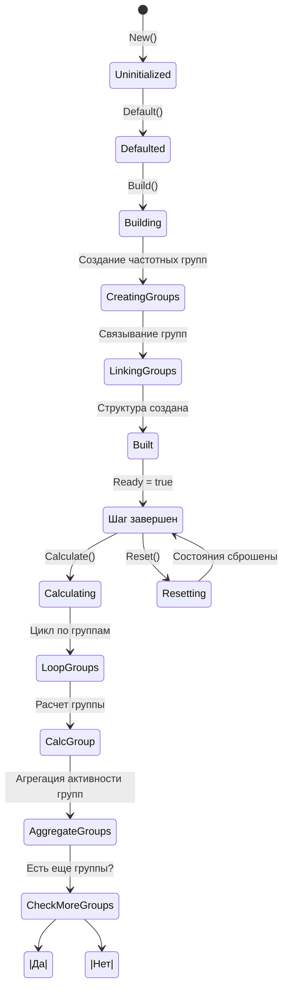
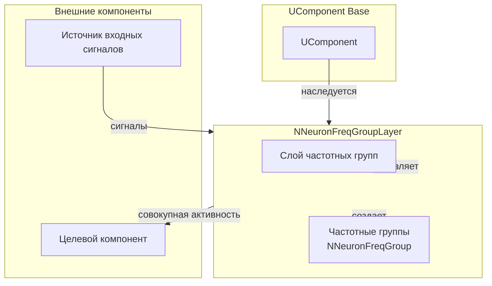
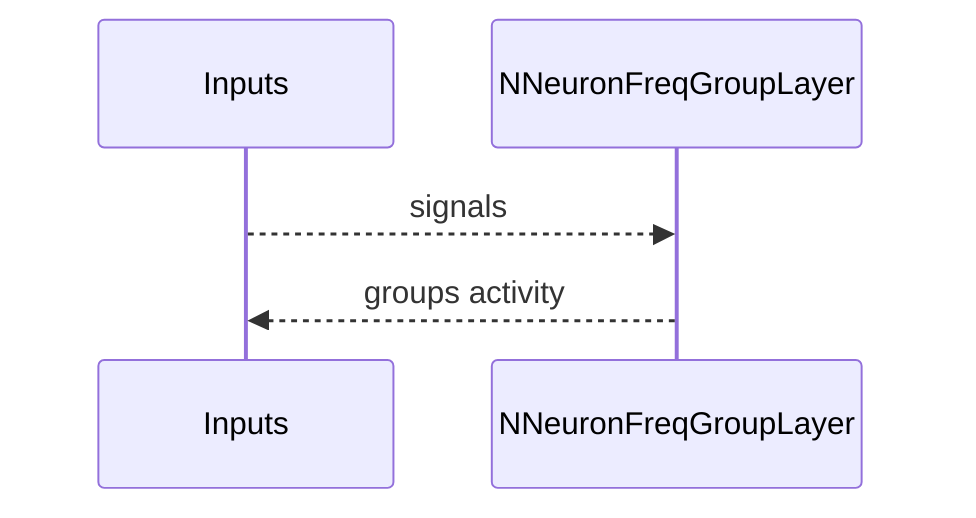
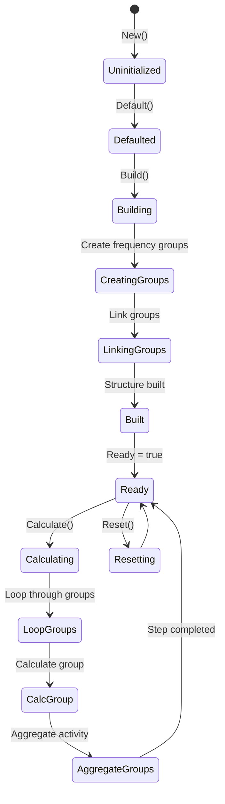
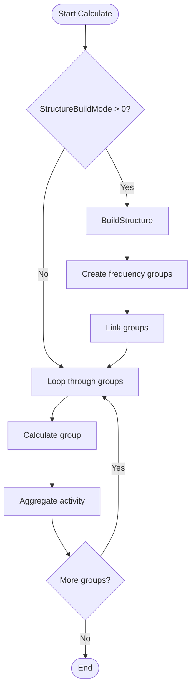
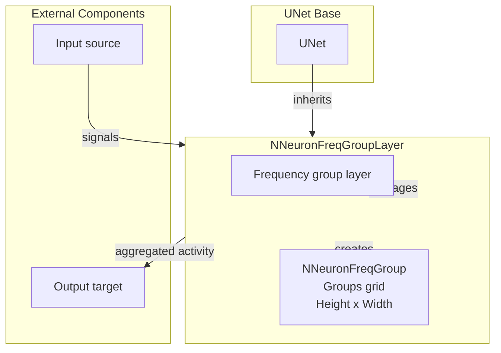

## RU

## NNeuronFreqGroupLayer — слой частотных групп

**Класс**: `NNeuronFreqGroupLayer` — слой, состоящий из нескольких `NNeuronFreqGroup`.
**Регистрация**: `NPulseLibrary.cpp` → `UploadClass("NNeuronFreqGroupLayer", ...)`.
**Storage**: `ClassName = "NNeuronFreqGroupLayer"`.

### Lifecycle
- **ADefault**: параметры групп/слоя.
- **ABuild**: создание и связывание групп.
- **AReset**: сброс состояний групп.
- **ACalculate**: обновление всех групп слоя.

### I/O
- Вход: сигналы/стимулы.
- Выход: совокупная частотная активность по группам.



Пояснение: диаграмма классов показывает место компонента в иерархии и ключевые связи.



Пояснение: диаграмма последовательности показывает типовой сценарий взаимодействия и порядок вызовов.



Пояснение: блок-схема показывает поток данных/сигналов (входы → компонент → выходы).

### UML-диаграмма состояний



**Состояния:**
- **Uninitialized** — создан, но не инициализирован
- **Defaulted** — параметры установлены по умолчанию
- **Building** — выполняется сборка структуры
- **CreatingGroups** — создание частотных групп
- **LinkingGroups** — связывание групп
- **Built** — структура слоя построена
- **Ready** — готов к выполнению расчетов
- **Calculating** — выполняется расчет слоя
- **LoopGroups** — цикл по группам
- **CalcGroup** — расчет группы
- **AggregateGroups** — агрегация активности групп
- **CheckMoreGroups** — проверка наличия еще групп
- **Resetting** — выполняется сброс состояний

### UML-диаграмма компонентов



**Зависимости:**
- **Базовый класс**: `UComponent`
- **Внутренние компоненты**: частотные группы (`NNeuronFreqGroup`, создаются автоматически)
- **Внешние компоненты**: источник входных сигналов (источник данных), целевой компонент (получатель совокупной активности)

### Config snippet

```ini
[Component]
ClassName = NNeuronFreqGroupLayer
Name = FreqLayer1
```

## Источники

См. [Literature-References.md](../Literature-References.md): **neuromodeler.ru**, **15**, **[A]**.

---

## EN

## NNeuronFreqGroupLayer — frequency group layer (EN)

Layer of frequency groups aggregating activity across groups.


Description: this class diagram shows the component position in the type hierarchy and key relations.



Description: this sequence diagram shows a typical runtime interaction and call order.


Description: this flowchart shows the data/signal flow (inputs → component → outputs).

### UML State Diagram



### UML Activity Diagram



### UML Component Diagram



### Properties

- `StructureBuildMode` — structure rebuild mode (0 — do not rebuild, 1 — rebuild)
- `AffNeuronGroupClassName` — afferent neuron group class name (default "NNeuronFreqGroup")
- `AffNeuronsGroupHeight` — group layer height (row count)
- `AffNeuronsGroupWidth` — group layer width (column count)
- `NumAffNeuronsInGroup` — number of afferent neurons in group

### Methods

- `SetStructureBuildMode(value)` — setting structure rebuild mode
- `SetAffNeuronGroupClassName(value)` — setting group class name
- `SetAffNeuronsGroupHeight(value)` — setting group layer height
- `SetAffNeuronsGroupWidth(value)` — setting group layer width
- `SetNumAffNeuronsInGroup(value)` — setting number of neurons in group
- `ADefault()` — setting default parameters
- `ABuild()` — building group layer structure
- `ACalculate()` — calculation step for all groups
- `BuildStructure()` — building frequency group grid

### Usage in configurations

`NNeuronFreqGroupLayer` is used for creating layers of frequency groups:

- **Frequency group layers**: `Bin/Configs/*/Model_*.xml` (where frequency group layers are required)
- **Multi-layer frequency analysis**: experiments with multi-layer frequency-based analysis
- **Frequency processing**: processing signals with frequency characteristics in layers

**Features:**
- Automatic structure building: creates frequency groups in a grid (Height × Width)
- Flexible configuration: supports various group types
- Activity aggregation: aggregates activity from all groups in the layer

**Typical parameter values:**
- **AffNeuronGroupClassName**: "NNeuronFreqGroup" (frequency neuron group)
- **AffNeuronsGroupHeight**: 1-5 (number of rows)
- **AffNeuronsGroupWidth**: 1-10 (number of columns)
- **NumAffNeuronsInGroup**: 5-20 (number of afferent neurons per group)

### References

See [Literature-References.md](../Literature-References.md): **neuromodeler.ru**, **15**, **[A]**.
