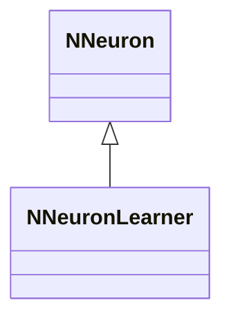
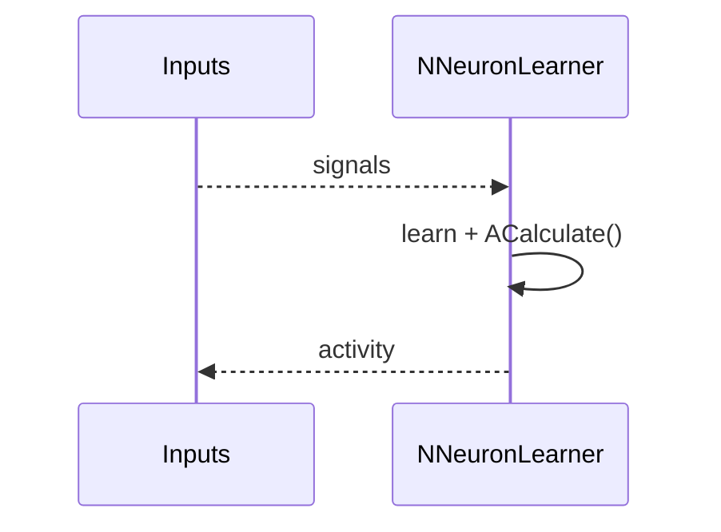
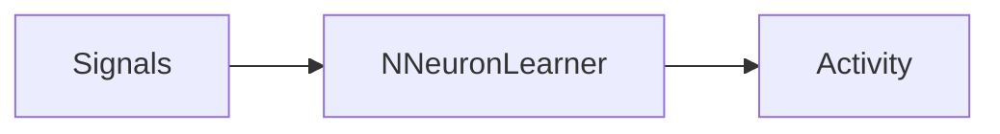
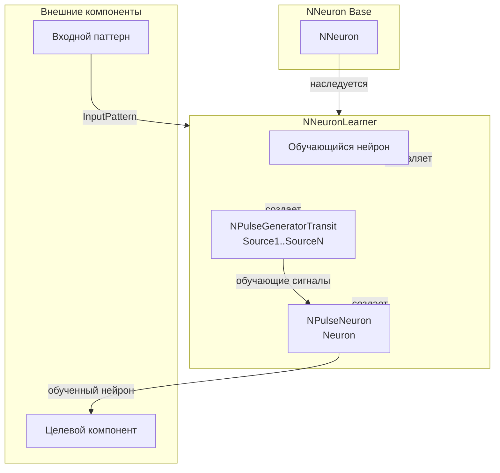
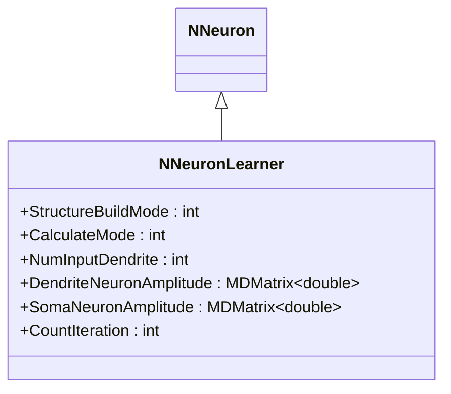
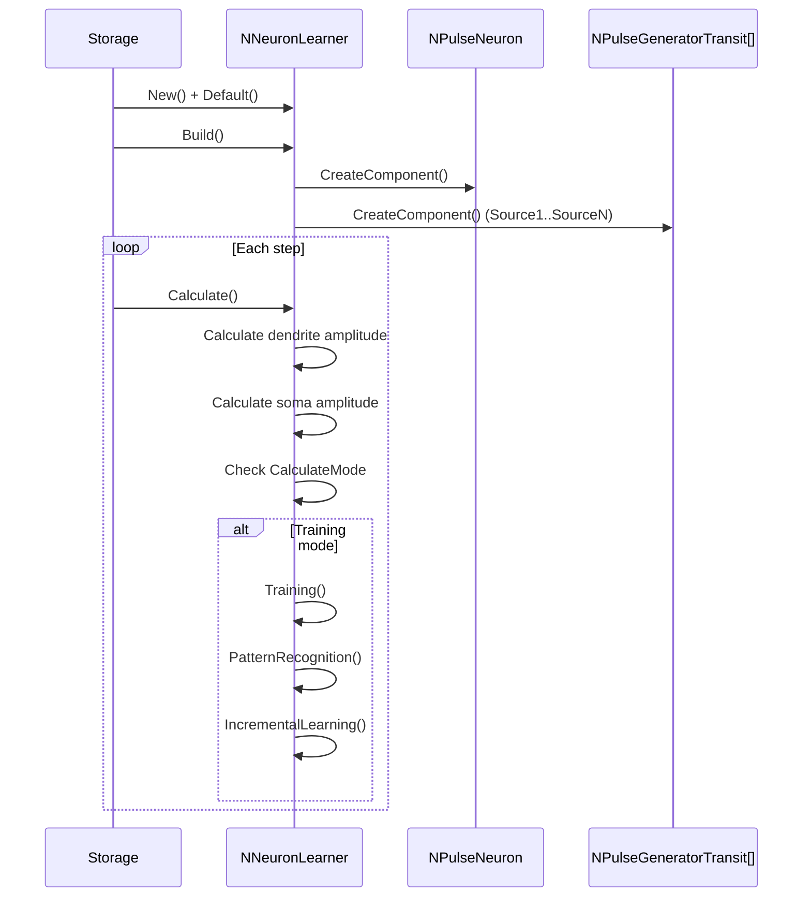
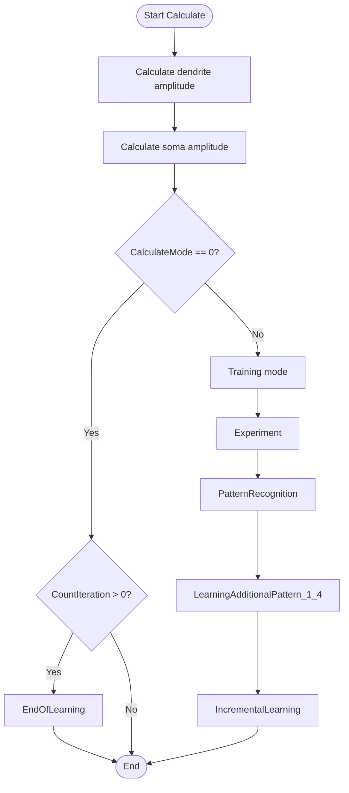
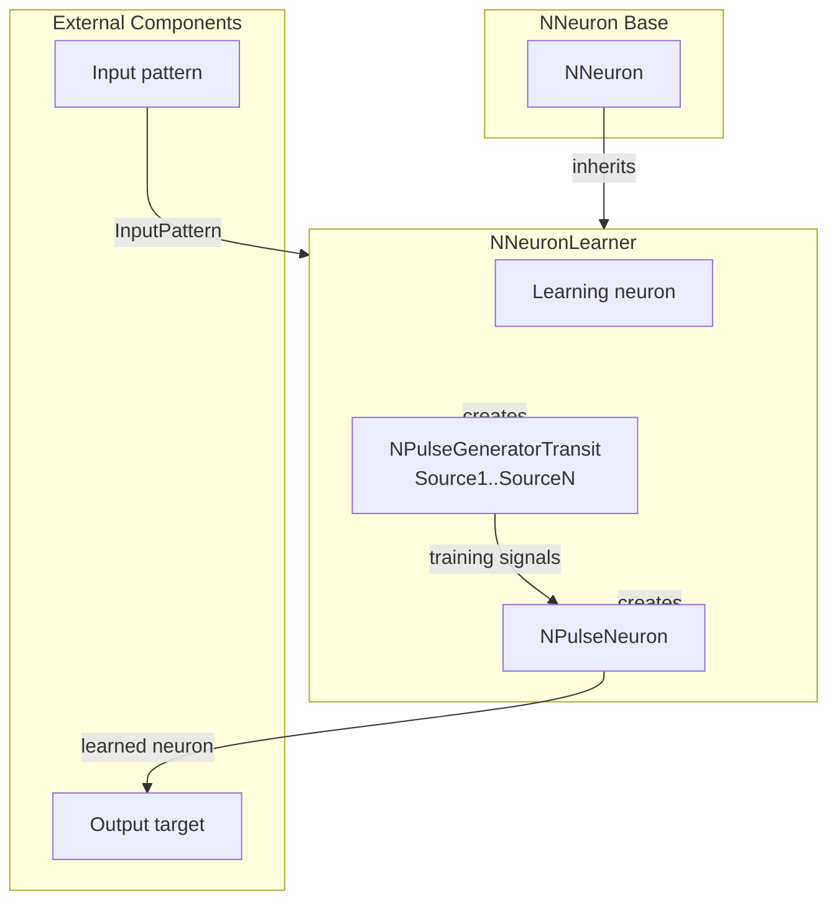

## RU

## NNeuronLearner — обучающийся нейрон

**Класс**: `NNeuronLearner` — нейрон с функциями самообучения.
**Регистрация**: `NPulseLibrary.cpp` → `UploadClass("NNeuronLearner", ...)`.
**Storage**: `ClassName = "NNeuronLearner"`.

### Lifecycle
- **ADefault**: параметры обучения.
- **ABuild**: подключение входов/синапсов.
- **AReset**: сброс состояния/весов.
- **ACalculate**: шаг расчёта + обновление по правилу обучения.

### I/O
- Вход: сигналы/ошибка (при наличии).
- Выход: активность/обновлённые веса (внутренне).



Пояснение: диаграмма классов показывает место компонента в иерархии и ключевые связи.



Пояснение: диаграмма последовательности показывает типовой сценарий взаимодействия и порядок вызовов.



Пояснение: блок-схема показывает поток данных/сигналов (входы → компонент → выходы).

### UML-диаграмма состояний

```mermaid
stateDiagram-v2
    [*] --> Uninitialized: New()
    Uninitialized --> Defaulted: Default()
    Defaulted --> Building: Build()
    Building --> CheckMode{StructureBuildMode == 1?}
    CheckMode -->|Да| BuildStructure: BuildStructure()
    CheckMode -->|Нет| Built: Структура не пересобирается
    BuildStructure --> CreateNeuron: Создание Neuron
    CreateNeuron --> SetSomaParts: NumSomaMembraneParts = NumInputDendrite
    SetSomaParts --> SetDendriteParts: Установка NumDendriteMembraneParts
    SetDendriteParts --> CreateGenerators: Создание генераторов Source1..SourceN
    CreateGenerators --> CreateSynapses: Установка количества синапсов на дендритах
    CreateSynapses --> Built: Структура построена
    Built --> Ready: Ready = true
    Ready --> Calculating: Calculate()
    Calculating --> CalcDendriteAmp: Вычисление DendriteNeuronAmplitude
    CalcDendriteAmp --> CalcSomaAmp: Вычисление SomaNeuronAmplitude
    CalcSomaAmp --> CheckMode{CalculateMode == 0?}
    CheckMode -->|Да| CheckIteration: Проверка CountIteration > 0
    CheckMode -->|Нет| Training: Training()
    CheckIteration -->|Да| EndOfLearning: EndOfLearning()
    CheckIteration -->|Нет| Ready: Шаг завершен
    Training --> Experiment: Experiment()
    Experiment --> PatternRecognition: PatternRecognition()
    PatternRecognition --> LearningAdditional: LearningAdditionalPattern_1_4()
    LearningAdditional --> IncrementalLearning: IncrementalLearning()
    IncrementalLearning --> Ready: Шаг завершен
    EndOfLearning --> Ready: Шаг завершен
    Ready --> Resetting: Reset()
    Resetting --> Ready: Состояния сброшены
```

**Состояния:**
- **Uninitialized** — создан, но не инициализирован
- **Defaulted** — параметры установлены по умолчанию
- **Building** — выполняется сборка структуры
- **CheckMode** — проверка необходимости пересборки структуры
- **BuildStructure** — выполнение пересборки структуры
- **CreateNeuron** — создание нейрона для обучения
- **SetSomaParts** — установка количества частей сомы
- **SetDendriteParts** — установка количества частей дендритов
- **CreateGenerators** — создание генераторов импульсов
- **CreateSynapses** — установка количества синапсов на дендритах
- **Built** — структура обучателя построена
- **Ready** — готов к выполнению расчетов
- **Calculating** — выполняется расчет обучателя
- **CalcDendriteAmp** — вычисление амплитуды дендритов
- **CalcSomaAmp** — вычисление амплитуды сомы
- **CheckMode** — проверка режима расчета
- **CheckIteration** — проверка количества итераций
- **Training** — режим обучения
- **Experiment** — выполнение эксперимента
- **PatternRecognition** — распознавание паттерна
- **LearningAdditional** — обучение дополнительному паттерну
- **IncrementalLearning** — инкрементальное обучение
- **EndOfLearning** — завершение обучения
- **Resetting** — выполняется сброс состояний

### UML-диаграмма компонентов



**Зависимости:**
- **Базовый класс**: `NNeuron`
- **Внутренние компоненты**: нейрон (`NPulseNeuron`), генераторы импульсов (`NPulseGeneratorTransit`)
- **Внешние компоненты**: входной паттерн (источник `InputPattern`), целевой компонент (получатель обученного нейрона)

### Config snippet

```ini
[Component]
ClassName = NNeuronLearner
Name = Learner1
```

### Подробная временная структура обучения

- **Итерация**: промежуток времени между двумя последовательными входными паттернами.
  - Начало итерации фиксируется в `StartIterTime`.
  - Длительность итерации \(`IterLength`\) вычисляется как \(1 / SpikesFrequency - 1 / TimeStep\).
  - Номер итерации хранится в `CountIteration`.
- **Такт**: один вызов `ACalculate()` внутри итерации.
  - На каждом такте обновляются потенциалы на дендритах и сомах, а также внутренние максимумы.

Упрощённый псевдокод цикла `ACalculate()`:

```mermaid
flowchart TD
    start[Start ACalculate] --> checkNeuron{Neuron exists?}
    checkNeuron -->|No| end[Return]
    checkNeuron -->|Yes| calcDend[Calc dendrite potentials]
    calcDend --> calcSoma[Calc soma potentials]
    calcSoma --> modeCheck{CalculateMode == 0 and CountIteration > 0?}
    modeCheck -->|Yes| endOfLearning[EndOfLearning()]
    endOfLearning --> afterTrain[Update TrainingPattern, DendriteLength, NumSynapse]
    afterTrain --> setOutput[Output = Neuron.Output]
    modeCheck -->|No| expCheck{ExperimentMode?}
    expCheck -->|Yes| doExp[Experiment()]
    expCheck -->|No| needTrain{IsNeedToTrain?}
    doExp --> needTrain
    needTrain -->|Yes| doTrain[Training()]
    needTrain -->|No| setOutput
    doTrain --> setOutput
    setOutput --> end
```

Ключевые шаги:

- **Расчёт потенциалов**:
  - Заполнение `DendriteNeuronAmplitude` и `SomaNeuronAmplitude` на основе компонент `NPulseMembrane` (`DendriteX_Y` и `SomaX`).
- **Переход к обучению**:
  - При `ExperimentMode == true` вызывается `Experiment()` (работа с файлами, специальные сценарии).
  - При `IsNeedToTrain == true` вызывается `Training()`, где выполняется рост/сжатие структуры.
- **Обновление выходов**:
  - Свойство `Output` просто копирует `Neuron->Output`.

### Правила роста дендритов и синапсов

Алгоритм роста реализован в методах `Training`, `MeasureMaxPotentialAndTime`, `ChangeDendriteStatus`, `ChangeDendriteLength`,
`ChangeSynapseStatus`, `ChangeSynapseNumber`.

#### Обучение по итерациям (`Training`)

```mermaid
flowchart TD
    tStart[Training()] --> firstBeat{IsFirstBeat?}
    firstBeat -->|Yes| initIter[Init iteration\n(StartIterTime, IterLength,\nreset MaxIterSomaAmp)]
    initIter --> loopGrow[For i = 0..NumInputDendrite-2]
    loopGrow --> growCheck{CanChangeDendLength?}
    growCheck -->|Yes| callChangeLen[ChangeDendriteLength(i)]
    growCheck -->|No| skipLen[Skip dendrite length change]
    callChangeLen --> callChangeSyn[ChangeSynapseNumber(i)]
    skipLen --> callChangeSyn
    callChangeSyn --> endFirst[IsFirstBeat=false, return]
    firstBeat -->|No| measure[MeasureMaxPotentialAndTime()]
    measure --> timeCheck{currentitertime >= IterLength?}
    timeCheck -->|No| endIter[Return]
    timeCheck -->|Yes| statusLoop[For i = 0..NumInputDendrite-1]
    statusLoop --> updateStatus[ChangeDendriteStatus(i),\nChangeSynapseStatus(i),\nPrevInputPattern[i] = InputPattern[i]]
    updateStatus --> doneStatus[IsFirstBeat=true,\nCountIteration++]
    doneStatus --> endTrain[Return]
```

Особенность: последний дендрит (\(i = NumInputDendrite - 1\)) обычно используется как **калибровочный**:
его длина не меняется в `Training()` (цикл роста идёт до `NumInputDendrite - 2`), но его временные характеристики
используются в `ChangeDendriteStatus` как опорные.

#### Измерение максимумов на сомах (`MeasureMaxPotentialAndTime`)

- На каждом такте:
  - Для каждой сомы `SomaX` вычисляется текущий потенциал `currentsomaamp = soma->SumPotential(0,0)`.
  - Если `currentsomaamp >= MaxIterSomaAmp[i]`, обновляются:
    - `MaxIterSomaAmp[i] = currentsomaamp`.
    - `TimeOfMaxIterSomaAmp[i] = Environment->GetTime().GetDoubleTime()`.
  - Для начального сегмента (`DendriteLength[i] == 1`) при наличии синапсов обновляется `InitialSomaPotential[i]`.

Именно `TimeOfMaxIterSomaAmp` и `MaxIterSomaAmp` затем определяют, как будут меняться длины дендритов и число синапсов.

#### Статусы дендритов (`ChangeDendriteStatus`)

- Для дендрита с индексом `num`:
  - Рассинхронизация по времени:
    - `dt = TimeOfMaxIterSomaAmp[last] - TimeOfMaxIterSomaAmp[num]`,
      где `last = NumInputDendrite - 1` — калибровочный дендрит.
  - Если `dt == 0.0`, длина считается оптимальной → `DendStatus[num] = 0`.
  - При неизменном паттерне \(|PrevInputPattern[num] - InputPattern[num]| < eps\) и
    смене знака/уменьшении модуля рассинхронизации по сравнению с `Dissynchronization[num]` статус также обнуляется.
  - Иначе:
    - Если `dt > 0` → сигнал на текущей соме пришёл **раньше** калибровочной → нужно **растить дендрит** (`DendStatus[num] = 1`).
    - Если `dt < 0` → сигнал пришёл **позже** → нужно **укорачивать дендрит** (`DendStatus[num] = -1`).
- В конце функция обновляет `Dissynchronization[num] = dt`.

#### Изменение длины дендритов (`ChangeDendriteLength`)

- Если `DendStatus[num] == 0`, функция сразу выходит, длина не меняется.
- Если требуется удалить последний сегмент (`DendStatus[num] == -1` и `DendriteLength[num] < 2`), статус обнуляется, длина не меняется.
- При росте:
  - Проверяется ограничение `DendriteLength[num] < MaxDendriteLength`; при превышении статус обнуляется.
- При допустимом изменении:
  - `OldDendriteLength[num] = DendriteLength[num]`.
  - `DendriteLength[num] += DendStatus[num]`.
  - Все выходные связи соответствующего генератора разрываются.
  - Обновляется структура нейрона:
    - Для скалярного режима: `Neuron->NumDendriteMembraneParts = DendriteLength[num]`.
    - Для векторного режима: обновляется `Neuron->NumDendriteMembranePartsVec[num]`.
    - После изменений вызывается `Neuron->Reset()`.
  - Для нового последнего сегмента дендрита:
    - Устанавливается `NumExcitatorySynapses = NumSynapse[num]`.
    - Перестраивается структура сегмента (`Build()`).
    - Для всех синапсов создаются связи с соответствующим генератором `Source(num+1)`,
      для дополнительных синапсов устанавливается сопротивление `SynapseResistanceStep`.

#### Статусы синапсов (`ChangeSynapseStatus`) и изменение их числа

- Для каждого дендрита `num`:
  - Считается разность амплитуд на соме:
    - `dt = InitialSomaPotential[num] - MaxIterSomaAmp[num]`.
  - В экспериментах (`ExperimentNum == 2` и `!CanChangeDendLength`) временно фиксируется длина дендрита,
    чтобы корректно подобрать только число синапсов.
  - При неизменном паттерне и `DendStatus[num] == 0`:
    - Если `SynapseStatus[num] == 0`, либо \(|dt|` очень мало, либо знак `dt` сменился и модуль уменьшился,
      статус устанавливается в 0 (количество синапсов оптимально).
  - Иначе:
    - Если `dt > 0.0` → текущая амплитуда меньше исходной → **добавить синапсы** (`SynapseStatus[num] = 1`).
    - Если `dt < 0.0` → текущая амплитуда больше исходной → **убавить синапсы** (`SynapseStatus[num] = -1`).
  - Текущее значение `dt` сохраняется в `AmpDifference[num]`.

Изменение количества синапсов в `ChangeSynapseNumber`:

- Если `SynapseStatus[num] == 0`, функция выходит.
- При попытке удалить последний синапс (`SynapseStatus[num] == -1` и `NumSynapse[num] < 2`) статус обнуляется.
- В общем случае:
  - `NumSynapse[num] += SynapseStatus[num]`.
  - Находится последний сегмент дендрита (`Dendrite(num+1, DendriteLength[num])`).
  - При удалении синапса разрываются его связи, затем обновляется `NumExcitatorySynapses` и вызывается `Build()`.
  - При добавлении синапса:
    - Строится новый синапс в сегменте (через изменение `NumExcitatorySynapses` и `Build()`).
    - Устанавливается сопротивление `SynapseResistanceStep`.
    - Создаётся связь `Source(num+1).Output → synapse.Input`.
  - После изменений вызывается `Neuron->Reset()`.

### Режимы экспериментов и флаг CanChangeDendLength

- `ExperimentMode` — включает экспериментальные сценарии, реализованные в методе `Experiment()`:
  - `ExperimentNum = 1` → `PatternRecognition()` — распознавание выборки из файла.
  - `ExperimentNum = 2` → `LearningAdditionalPattern_1_4()` — обучение второму паттерну с промежуточными структурами.
  - `ExperimentNum = 3` → `IncrementalLearning()` — инкрементное обучение между двумя паттернами.
- Во время экспериментов:
  - Потоки управления через `Experiment()` и `Training()` переплетаются:
    - В `LearningAdditionalPattern_1_4` и `IncrementalLearning` самостоятельно управляются:
      - `IsNeedToTrain`, `CountIteration`, `EpochCur`, `IsFirstFileStep`.
      - Флаг `CanChangeDendLength` (например, после первой итерации часто ставится `false`,
        чтобы менять только число синапсов).
  - Это важно учитывать при анализе роста структуры:
    - Даже при выставленных статусах дендритов `DendStatus[num] = ±1` фактическое изменение длины
      может блокироваться через `CanChangeDendLength == false`.

В типичном сценарии **простого самообучения без файловых экспериментов** рекомендуется:

- Оставлять `ExperimentMode = false`.
- Управлять только `CalculateMode`, `IsNeedToTrain`, `InputPattern` и структурными параметрами.
- Явно задавать разумные значения `NumInputDendrite`, `MaxDendriteLength`, `NumSynapse`, чтобы алгоритм
  роста дендритов и синапсов мог отработать полностью.

## Источники

См. [Literature-References.md](../Literature-References.md): **[A]**, **[B]**, **1**, **6**.

---

## EN

## NNeuronLearner — learning neuron (EN)

### Purpose

**Class**: `NNeuronLearner` — self-learning neuron applying its learning rule during calculation.
**Registration**: `NPulseLibrary.cpp` → `UploadClass("NNeuronLearner", ...)`.
**Instances**: `ClassName = "NNeuronLearner"` in configs.

`NNeuronLearner` is a neuron with self-learning capabilities that applies learning rules during calculation. It supports pattern recognition, incremental learning, and additional pattern learning.

**Usage:** Self-learning neurons, pattern recognition, incremental learning experiments

### UML Class Diagram



### UML Sequence Diagram



### UML State Diagram

```mermaid
stateDiagram-v2
    [*] --> Uninitialized: New()
    Uninitialized --> Defaulted: Default()
    Defaulted --> Building: Build()
    Building --> CheckMode{StructureBuildMode == 1?}
    CheckMode -->|Yes| BuildStructure: BuildStructure()
    CheckMode -->|No| Built: Structure not rebuilt
    BuildStructure --> CreateNeuron: Create neuron
    CreateNeuron --> SetSomaParts: Set NumSomaMembraneParts
    SetSomaParts --> SetDendriteParts: Set NumDendriteMembraneParts
    SetDendriteParts --> CreateGenerators: Create generators
    CreateGenerators --> CreateSynapses: Set synapse count
    CreateSynapses --> Built: Structure built
    Built --> Ready: Ready = true
    Ready --> Calculating: Calculate()
    Calculating --> CalcDendriteAmp: Calculate dendrite amplitude
    CalcDendriteAmp --> CalcSomaAmp: Calculate soma amplitude
    CalcSomaAmp --> CheckMode{CalculateMode == 0?}
    CheckMode -->|Yes| CheckIteration: Check CountIteration > 0
    CheckMode -->|No| Training: Training()
    CheckIteration -->|Yes| EndOfLearning: EndOfLearning()
    CheckIteration -->|No| Ready: Step completed
    Training --> Experiment: Experiment()
    Experiment --> PatternRecognition: PatternRecognition()
    PatternRecognition --> LearningAdditional: LearningAdditionalPattern_1_4()
    LearningAdditional --> IncrementalLearning: IncrementalLearning()
    IncrementalLearning --> Ready: Step completed
    EndOfLearning --> Ready: Step completed
    Ready --> Resetting: Reset()
    Resetting --> Ready
```

### UML Activity Diagram



### UML Component Diagram



### Properties

- `StructureBuildMode` — режим пересборки структуры (1 — пересобрать)
- `CalculateMode` — режим расчета (0 — завершение обучения, другие — режим обучения)
- `NumInputDendrite` — количество входных дендритов
- `EnableDebug` — флаг включения подробного DEBUG‑логирования работы обучателя (подробные сообщения о шагах `Training`, изменениях `DendriteLength`/`NumSynapse`, переходах по режимам и итерациям обучения)
- `DendriteNeuronAmplitude` — амплитуда дендритов нейрона
- `SomaNeuronAmplitude` — амплитуда сомы нейрона
- `CountIteration` — счетчик итераций обучения

### Methods

- `ADefault()` — установка параметров по умолчанию
- `ABuild()` — сборка структуры обучателя
- `AReset()` — сброс состояния/весов
- `ACalculate()` — шаг расчета + обновление по правилу обучения
- `Training()` — выполнение обучения
- `PatternRecognition()` — распознавание паттерна
- `IncrementalLearning()` — инкрементальное обучение

### Usage in configurations

`NNeuronLearner` is used for self-learning neurons:

- **Self-learning**: `Bin/Configs/*/Model_*.xml` (where self-learning neurons are required)
- **Pattern recognition**: experiments with pattern recognition
- **Incremental learning**: experiments with incremental learning capabilities

#### Debug configuration example

To enable detailed debug logging for `NNeuronLearner` in a project configuration (for example, `Bin/Configs/Bakhshiev/TestTrain/Parameters_00.xml`), set:

```ini
<NeuronLearner Class="NNeuronLearner">
    <Parameters>
        ...
        <EnableDebug Type="bool" PType="257" IoType="17">1</EnableDebug>
        ...
    </Parameters>
    ...
</NeuronLearner>
```

When `EnableDebug` is `true` and a logger is available (`RDK::GetLogger()`), the component prints extended diagnostics about dendrite/synapse growth, iteration counters and experiment modes, which can be used together with integration tests and the interval tuner (`PulseLibIntervalTuner`) to analyse and tune temporal parameters of the training process.

### References

See [Literature-References.md](../Literature-References.md): **[A]**, **[B]**, **1**, **6**.
