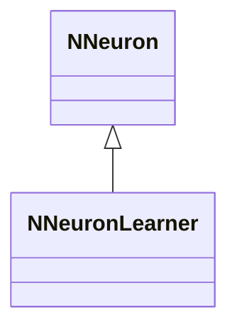
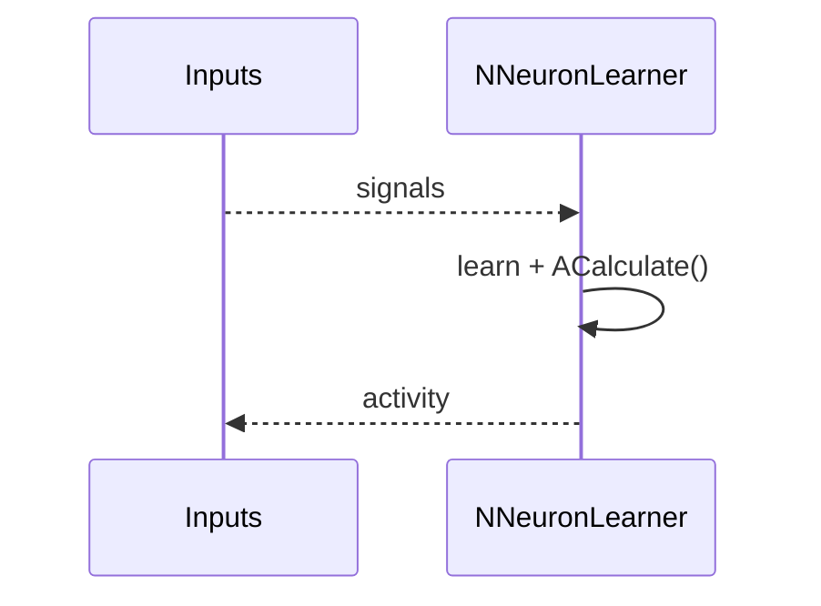
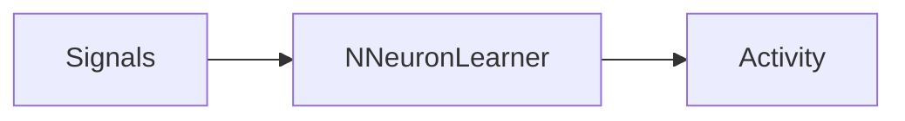
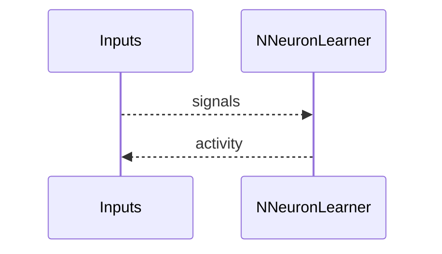

## NNeuronLearner — обучающийся нейрон

**Класс**: `NNeuronLearner` — нейрон с функциями самообучения.  
**Регистрация**: `NPulseLibrary.cpp` → `UploadClass("NNeuronLearner", ...)`.  
**Storage**: `ClassName = "NNeuronLearner"`.

### Lifecycle
- **ADefault**: параметры обучения.
- **ABuild**: подключение входов/синапсов.
- **AReset**: сброс состояния/весов.
- **ACalculate**: шаг расчёта + обновление по правилу обучения.

### I/O
- Вход: сигналы/ошибка (при наличии).
- Выход: активность/обновлённые веса (внутренне).



Пояснение: диаграмма классов показывает место компонента в иерархии и ключевые связи.



Пояснение: диаграмма последовательности показывает типовой сценарий взаимодействия и порядок вызовов.



Пояснение: блок-схема показывает поток данных/сигналов (входы → компонент → выходы).

### Config snippet

```ini
[Component]
ClassName = NNeuronLearner
Name = Learner1
```

---

## NNeuronLearner — learning neuron (EN)

Self-learning neuron applying its learning rule during calculation.


Description: this class diagram shows the component position in the type hierarchy and key relations.



Description: this sequence diagram shows a typical runtime interaction and call order.


Description: this flowchart shows the data/signal flow (inputs → component → outputs).
