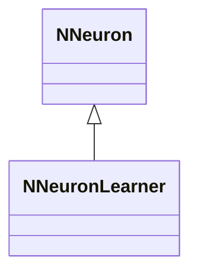
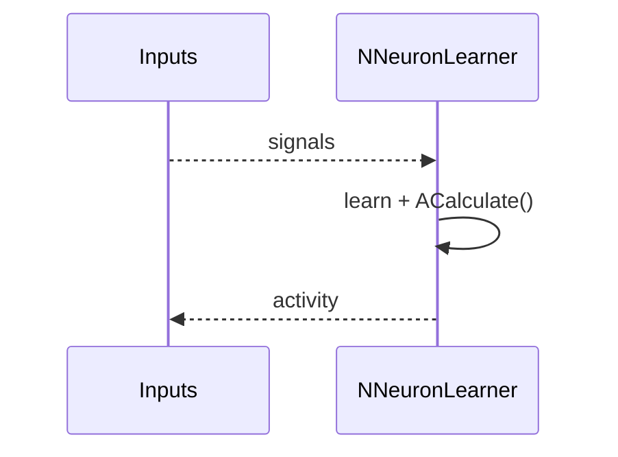
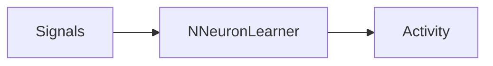
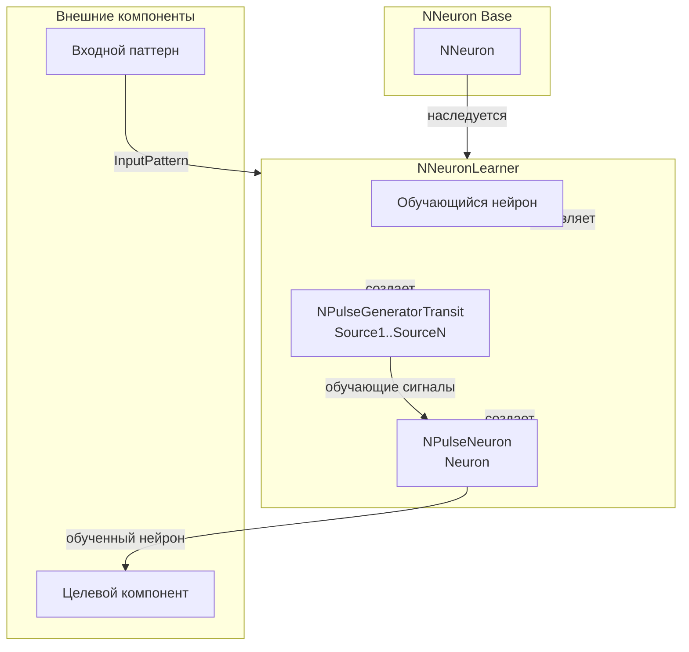
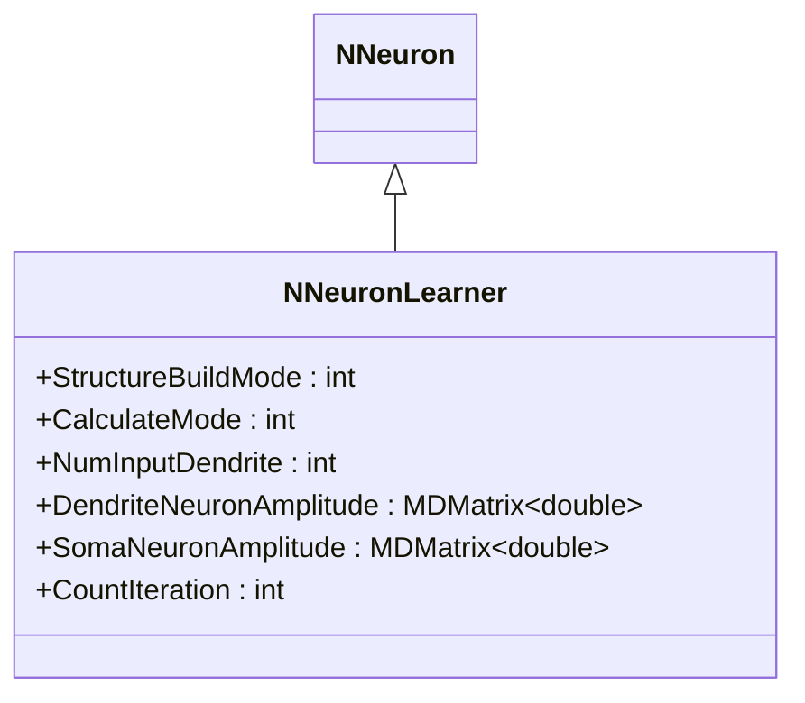
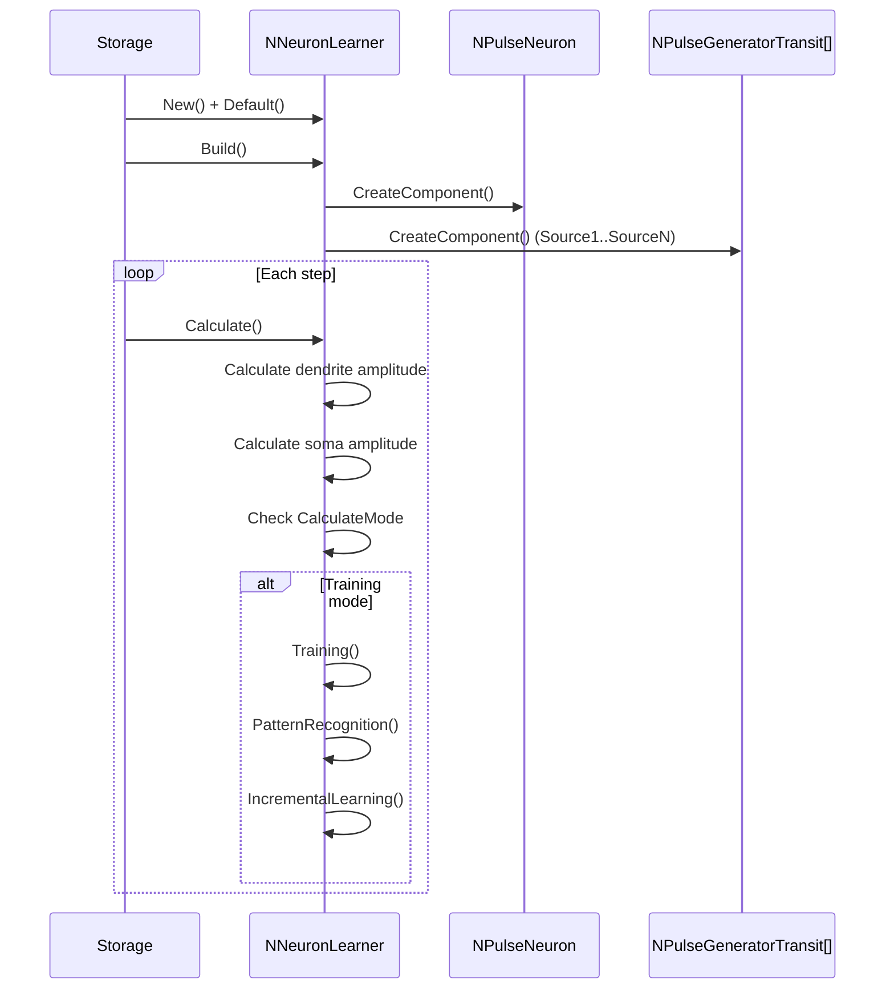
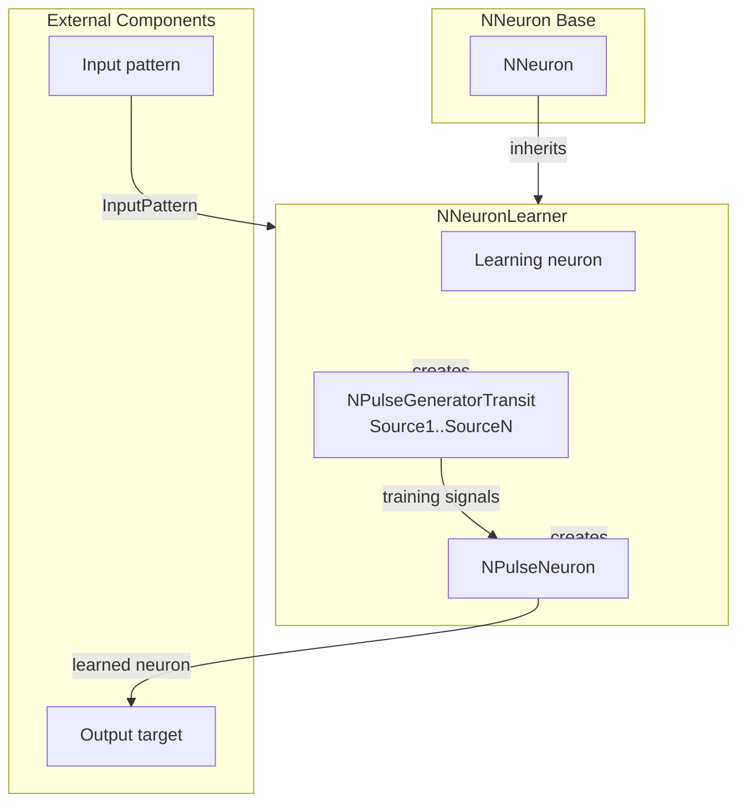

## NNeuronLearner — обучающийся нейрон

**Класс**: `NNeuronLearner` — нейрон с функциями самообучения.
**Регистрация**: `NPulseLibrary.cpp` → `UploadClass("NNeuronLearner", ...)`.
**Storage**: `ClassName = "NNeuronLearner"`.

### Lifecycle
- **ADefault**: параметры обучения.
- **ABuild**: подключение входов/синапсов.
- **AReset**: сброс состояния/весов.
- **ACalculate**: шаг расчёта + обновление по правилу обучения.

### I/O
- Вход: сигналы/ошибка (при наличии).
- Выход: активность/обновлённые веса (внутренне).



Пояснение: диаграмма классов показывает место компонента в иерархии и ключевые связи.



Пояснение: диаграмма последовательности показывает типовой сценарий взаимодействия и порядок вызовов.



Пояснение: блок-схема показывает поток данных/сигналов (входы → компонент → выходы).

### UML-диаграмма состояний

```mermaid
stateDiagram-v2
    [*] --> Uninitialized: New()
    Uninitialized --> Defaulted: Default()
    Defaulted --> Building: Build()
    Building --> CheckMode{StructureBuildMode == 1?}
    CheckMode -->|Да| BuildStructure: BuildStructure()
    CheckMode -->|Нет| Built: Структура не пересобирается
    BuildStructure --> CreateNeuron: Создание Neuron
    CreateNeuron --> SetSomaParts: NumSomaMembraneParts = NumInputDendrite
    SetSomaParts --> SetDendriteParts: Установка NumDendriteMembraneParts
    SetDendriteParts --> CreateGenerators: Создание генераторов Source1..SourceN
    CreateGenerators --> CreateSynapses: Установка количества синапсов на дендритах
    CreateSynapses --> Built: Структура построена
    Built --> Ready: Ready = true
    Ready --> Calculating: Calculate()
    Calculating --> CalcDendriteAmp: Вычисление DendriteNeuronAmplitude
    CalcDendriteAmp --> CalcSomaAmp: Вычисление SomaNeuronAmplitude
    CalcSomaAmp --> CheckMode{CalculateMode == 0?}
    CheckMode -->|Да| CheckIteration: Проверка CountIteration > 0
    CheckMode -->|Нет| Training: Training()
    CheckIteration -->|Да| EndOfLearning: EndOfLearning()
    CheckIteration -->|Нет| Ready: Шаг завершен
    Training --> Experiment: Experiment()
    Experiment --> PatternRecognition: PatternRecognition()
    PatternRecognition --> LearningAdditional: LearningAdditionalPattern_1_4()
    LearningAdditional --> IncrementalLearning: IncrementalLearning()
    IncrementalLearning --> Ready: Шаг завершен
    EndOfLearning --> Ready: Шаг завершен
    Ready --> Resetting: Reset()
    Resetting --> Ready: Состояния сброшены
```

**Состояния:**
- **Uninitialized** — создан, но не инициализирован
- **Defaulted** — параметры установлены по умолчанию
- **Building** — выполняется сборка структуры
- **CheckMode** — проверка необходимости пересборки структуры
- **BuildStructure** — выполнение пересборки структуры
- **CreateNeuron** — создание нейрона для обучения
- **SetSomaParts** — установка количества частей сомы
- **SetDendriteParts** — установка количества частей дендритов
- **CreateGenerators** — создание генераторов импульсов
- **CreateSynapses** — установка количества синапсов на дендритах
- **Built** — структура обучателя построена
- **Ready** — готов к выполнению расчетов
- **Calculating** — выполняется расчет обучателя
- **CalcDendriteAmp** — вычисление амплитуды дендритов
- **CalcSomaAmp** — вычисление амплитуды сомы
- **CheckMode** — проверка режима расчета
- **CheckIteration** — проверка количества итераций
- **Training** — режим обучения
- **Experiment** — выполнение эксперимента
- **PatternRecognition** — распознавание паттерна
- **LearningAdditional** — обучение дополнительному паттерну
- **IncrementalLearning** — инкрементальное обучение
- **EndOfLearning** — завершение обучения
- **Resetting** — выполняется сброс состояний

### UML-диаграмма компонентов



**Зависимости:**
- **Базовый класс**: `NNeuron`
- **Внутренние компоненты**: нейрон (`NPulseNeuron`), генераторы импульсов (`NPulseGeneratorTransit`)
- **Внешние компоненты**: входной паттерн (источник `InputPattern`), целевой компонент (получатель обученного нейрона)

### Config snippet

```ini
[Component]
ClassName = NNeuronLearner
Name = Learner1
```

## Источники

См. [Literature-References.md](../Literature-References.md): **[A]**, **[B]**, **1**, **6**.

---

## NNeuronLearner — learning neuron (EN)

### Purpose

**Class**: `NNeuronLearner` — self-learning neuron applying its learning rule during calculation.
**Registration**: `NPulseLibrary.cpp` → `UploadClass("NNeuronLearner", ...)`.
**Instances**: `ClassName = "NNeuronLearner"` in configs.

`NNeuronLearner` is a neuron with self-learning capabilities that applies learning rules during calculation. It supports pattern recognition, incremental learning, and additional pattern learning.

**Usage:** Self-learning neurons, pattern recognition, incremental learning experiments

### UML Class Diagram



### UML Sequence Diagram



### UML State Diagram

```mermaid
stateDiagram-v2
    [*] --> Uninitialized: New()
    Uninitialized --> Defaulted: Default()
    Defaulted --> Building: Build()
    Building --> CheckMode{StructureBuildMode == 1?}
    CheckMode -->|Yes| BuildStructure: BuildStructure()
    CheckMode -->|No| Built: Structure not rebuilt
    BuildStructure --> CreateNeuron: Create neuron
    CreateNeuron --> SetSomaParts: Set NumSomaMembraneParts
    SetSomaParts --> SetDendriteParts: Set NumDendriteMembraneParts
    SetDendriteParts --> CreateGenerators: Create generators
    CreateGenerators --> CreateSynapses: Set synapse count
    CreateSynapses --> Built: Structure built
    Built --> Ready: Ready = true
    Ready --> Calculating: Calculate()
    Calculating --> CalcDendriteAmp: Calculate dendrite amplitude
    CalcDendriteAmp --> CalcSomaAmp: Calculate soma amplitude
    CalcSomaAmp --> CheckMode{CalculateMode == 0?}
    CheckMode -->|Yes| CheckIteration: Check CountIteration > 0
    CheckMode -->|No| Training: Training()
    CheckIteration -->|Yes| EndOfLearning: EndOfLearning()
    CheckIteration -->|No| Ready: Step completed
    Training --> Experiment: Experiment()
    Experiment --> PatternRecognition: PatternRecognition()
    PatternRecognition --> LearningAdditional: LearningAdditionalPattern_1_4()
    LearningAdditional --> IncrementalLearning: IncrementalLearning()
    IncrementalLearning --> Ready: Step completed
    EndOfLearning --> Ready: Step completed
    Ready --> Resetting: Reset()
    Resetting --> Ready
```

### UML Activity Diagram


### UML Component Diagram



### Properties

- `StructureBuildMode` — режим пересборки структуры (1 — пересобрать)
- `CalculateMode` — режим расчета (0 — завершение обучения, другие — режим обучения)
- `NumInputDendrite` — количество входных дендритов
- `DendriteNeuronAmplitude` — амплитуда дендритов нейрона
- `SomaNeuronAmplitude` — амплитуда сомы нейрона
- `CountIteration` — счетчик итераций обучения

### Methods

- `ADefault()` — установка параметров по умолчанию
- `ABuild()` — сборка структуры обучателя
- `AReset()` — сброс состояния/весов
- `ACalculate()` — шаг расчета + обновление по правилу обучения
- `Training()` — выполнение обучения
- `PatternRecognition()` — распознавание паттерна
- `IncrementalLearning()` — инкрементальное обучение

### Usage in configurations

`NNeuronLearner` is used for self-learning neurons:

- **Self-learning**: `Bin/Configs/*/Model_*.xml` (where self-learning neurons are required)
- **Pattern recognition**: experiments with pattern recognition
- **Incremental learning**: experiments with incremental learning capabilities

### References

See [Literature-References.md](../Literature-References.md): **[A]**, **[B]**, **1**, **6**.
