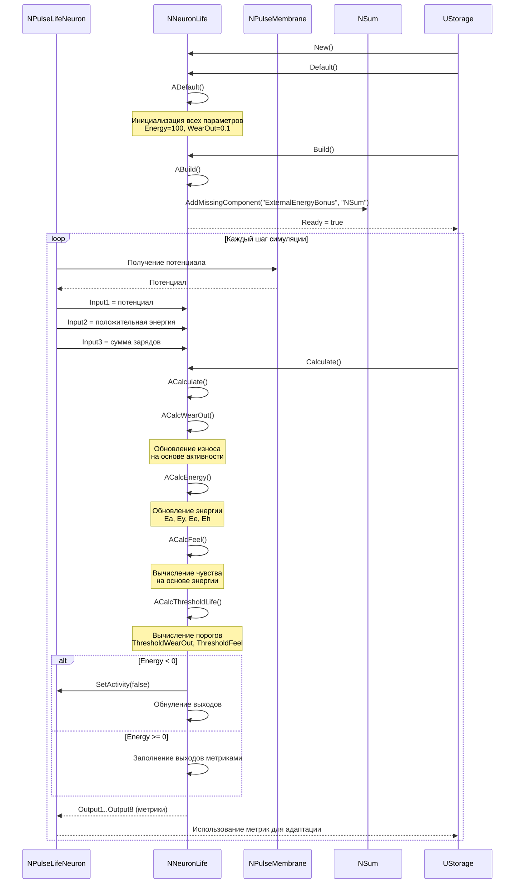
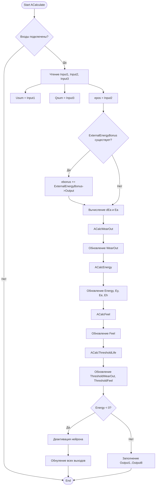
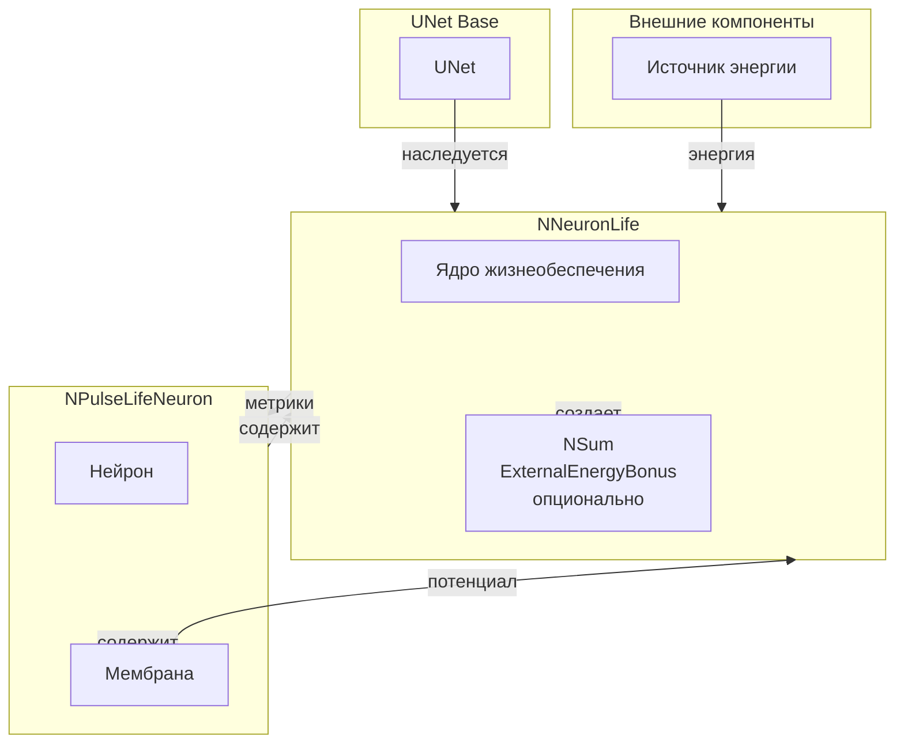
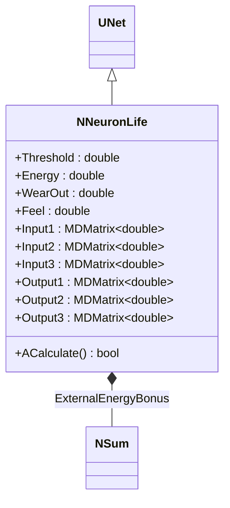
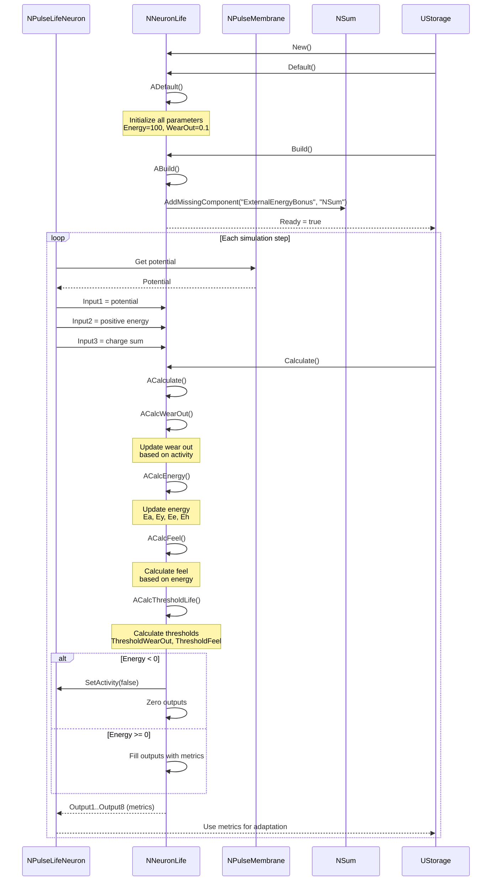
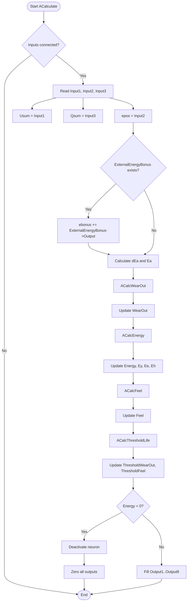
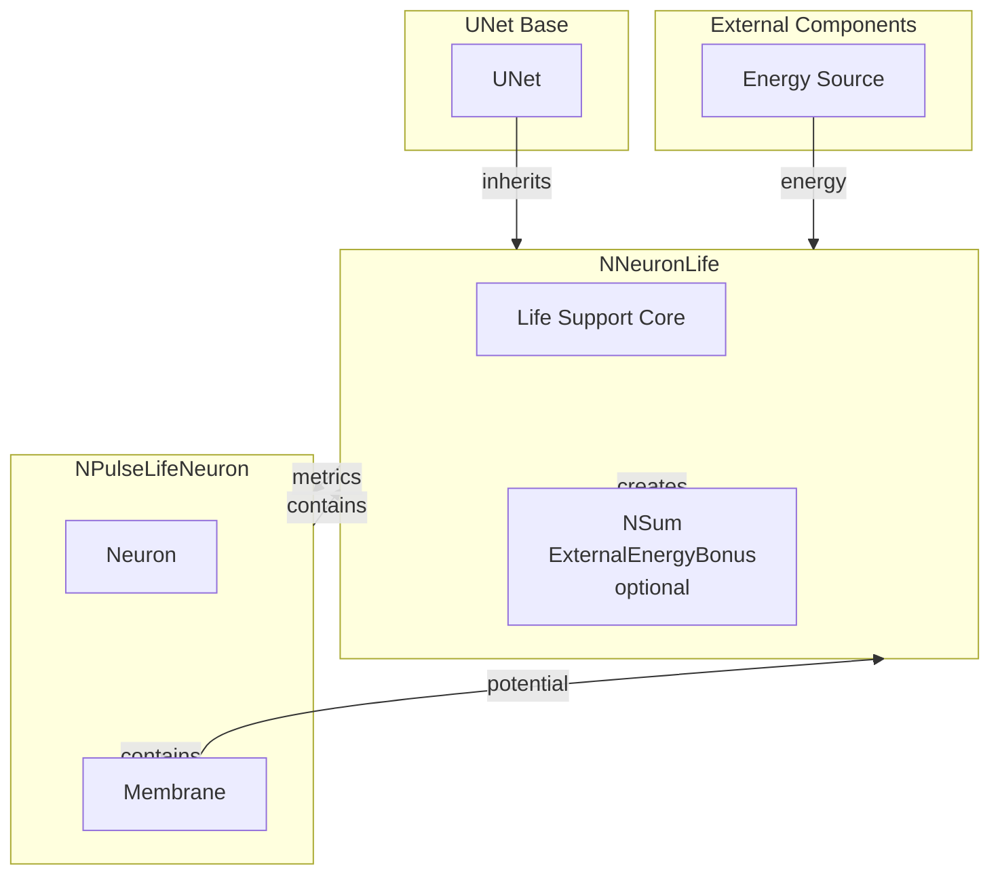

# NNeuronLife — нейрон с метриками жизнеобеспечения

**Каталог компонентов:** [Component-Catalog.md](../Component-Catalog.md).

## RU

### Назначение

**Класс**: `NNeuronLife` — компонент модели жизнеобеспечения нейрона с метриками энергии, износа и чувства.
**Регистрация**: `NPulseLibrary.cpp` → `UploadClass("NNeuronLife", ...)`.
**Storage-инстансы**: `ClassName = "NNeuronLife"` в `Bin/Configs/*/Model_*.xml`.

`NNeuronLife` реализует модель жизнеобеспечения нейрона, которая отслеживает метрики энергии, износа (wear out), чувства (feel) и вычисляет пороги активации на основе этих метрик. Компонент используется в составе `NPulseLifeNeuron` для моделирования "живых" нейронов с метриками жизнеобеспечения. В контексте нейроморфных систем [A] модель жизнеобеспечения поддерживает структурную и параметрическую адаптацию нейрона (ресурсы, износ, пороги) и согласуется с описанием пластичности и моторной памяти в диссертации Бахшиева.

**Использование:** Моделирование жизнеобеспечения нейронов, эксперименты с метриками энергии и износа, моделирование адаптации нейронов

### UML-диаграмма классов

```mermaid
classDiagram
    UNet <|-- NNeuronLife
    NNeuronLife *-- NSum : ExternalEnergyBonus
    class NNeuronLife {
        +Threshold : double
        +CriticalEnergy : double
        +MaxPotentialGradient : double
        +WearOutConstPositive : double
        +WearOutConstNegative : double
        +Kw : double
        +Emax : double
        +En : double
        +Kq : double
        +Ee0 : double
        +Es : double
        +Eh0 : double
        +Econst : double
        +Ecr : double
        +WearOutcr : double
        +EnergyWearOutCritical : double
        +EyConst : double
        +EyBonusPos : double
        +EyBonusNeg : double
        +EnergyComprehensibility : double
        +Kdp : double
        +Pdmax : double
        +Qd : double
        +Khp0 : double
        +Khp1 : double
        +Qsummax : double
        +EnergyBonus : double
        +Energy : double
        +Input1 : MDMatrix~double~
        +Input2 : MDMatrix~double~
        +Input3 : MDMatrix~double~
        +Output1 : MDMatrix~double~
        +Output2 : MDMatrix~double~
        +Output3 : MDMatrix~double~
        +OutputThreshold : MDMatrix~double~
        +Output5 : MDMatrix~double~
        +Output6 : MDMatrix~double~
        +Output7 : MDMatrix~double~
        +Output8 : MDMatrix~double~
        -WearOut : double
        -ThresholdLife : double
        -ThresholdWearOut : double
        -ThresholdFeel : double
        -Feel : double
        -Qsum : double
        -Esum : double
        -EsumOld : double
        -EsumProizv : double
        -Ea : double
        -Ey : double
        -Ee : double
        -Eh : double
        -dEa : double
        -dEy : double
        -dEe : double
        -dEh : double
        -dE : double
        -Usum : double
        +SetThreshold(value) bool
        +SetMaxPotentialGradient(value) bool
        +SetEmax(value) bool
        +SetEn(value) bool
        +SetPdmax(value) bool
        +SetQsummax(value) bool
        +New() NNeuronLife*
        +ADefault() bool
        +ABuild() bool
        +AReset() bool
        +ACalculate() bool
        -ACalcWearOut() bool
        -ACalcEnergy() bool
        -ACalcFeel() bool
        -ACalcThresholdLife() bool
        -FeelDiff(kq, ediff, en) double
    }
    class NSum {
        +Output : MDMatrix~double~
    }
```



**Иерархия наследования:**
- `UNet` — базовая сеть Rdk Framework
- `NNeuronLife` — модель жизнеобеспечения нейрона

**Внутренняя структура:**
- **ExternalEnergyBonus** (`NSum`) — опциональный компонент для внешнего бонуса энергии

**Входы:**
- **Input1** — потенциал нейрона (Usum)
- **Input2** — положительная энергия (epos)
- **Input3** — сумма зарядов (qsum)

**Выходы:**
- **Output1** — пороги [Threshold, ThresholdWearOut, ThresholdFeel, ThresholdLife]
- **Output2** — чувство (Feel)
- **Output3** — износ (WearOut)
- **OutputThreshold** — компоненты энергии [Ey, Ee, Eh, Ey+Ee+Eh]
- **Output5** — энергия (Energy)
- **Output6** — мотивация для возбуждающих синапсов [dEa*TimeStep, -dEy, -dEe*TimeStep, dEh*TimeStep, 0]
- **Output7** — мотивация для тормозных синапсов
- **Output8** — дополнительные метрики

### UML-диаграмма последовательности



**Жизненный цикл:**
1. **Инициализация**: Установка параметров по умолчанию (Energy=100, WearOut=0.1)
2. **Сборка**: Создание опционального компонента `ExternalEnergyBonus`
3. **Расчет на каждом шаге**:
   - Получение входных данных (потенциал, энергия, заряды)
   - Вычисление износа (`ACalcWearOut`)
   - Вычисление энергии (`ACalcEnergy`)
   - Вычисление чувства (`ACalcFeel`)
   - Вычисление порогов (`ACalcThresholdLife`)
   - Деактивация нейрона при недостатке энергии (если Energy < 0)

### UML-диаграмма состояний

```mermaid
stateDiagram-v2
    [*] --> Uninitialized: New()
    Uninitialized --> Defaulted: Default()
    Defaulted --> Building: Build()
    Building --> CreateExternalBonus: Создание ExternalEnergyBonus (опционально)
    CreateExternalBonus --> Built: Структура создана
    Built --> Ready: Ready = true
    Ready --> Calculating: Calculate()
    Calculating --> ReadInputs: Чтение Input1, Input2, Input3
    ReadInputs --> CalcWearOut: ACalcWearOut()
    CalcWearOut --> CalcEnergy: ACalcEnergy()
    CalcEnergy --> CalcFeel: ACalcFeel()
    CalcFeel --> CalcThresholds: ACalcThresholdLife()
    CalcThresholds --> CheckEnergy{Energy < 0?}
    CheckEnergy -->|Да| Deactivate: Деактивация нейрона
    CheckEnergy -->|Нет| FillOutputs: Заполнение выходов
    Deactivate --> ZeroOutputs: Обнуление выходов
    ZeroOutputs --> Ready: Шаг завершен
    FillOutputs --> Ready: Шаг завершен
    Ready --> Resetting: Reset()
    Resetting --> ResetStates: Сброс состояний
    ResetStates --> Ready: Energy=100, WearOut=0.1
```

**Состояния:**
- **Uninitialized** — создан, но не инициализирован
- **Defaulted** — параметры установлены по умолчанию
- **Building** — выполняется сборка структуры
- **CreateExternalBonus** — создание опционального компонента для внешнего бонуса энергии
- **Built** — структура построена
- **Ready** — готов к выполнению расчетов
- **Calculating** — выполняется расчет метрик
- **ReadInputs** — чтение входных данных
- **CalcWearOut** — вычисление износа
- **CalcEnergy** — вычисление энергии
- **CalcFeel** — вычисление чувства
- **CalcThresholds** — вычисление порогов
- **CheckEnergy** — проверка уровня энергии
- **Deactivate** — деактивация нейрона при недостатке энергии
- **ZeroOutputs** — обнуление выходов
- **FillOutputs** — заполнение выходов метриками
- **Resetting** — выполняется сброс состояний
- **ResetStates** — сброс всех метрик к начальным значениям

### UML-диаграмма активности



**Алгоритм расчета:**
1. Проверка подключения входов
2. Чтение входных данных (потенциал, энергия, заряды)
3. Получение внешнего бонуса энергии (если есть)
4. Вычисление износа на основе активности
5. Вычисление энергии (Ea, Ey, Ee, Eh)
6. Вычисление чувства на основе энергии
7. Вычисление порогов (ThresholdWearOut, ThresholdFeel)
8. Проверка уровня энергии и деактивация при необходимости
9. Заполнение выходов метриками

### UML-диаграмма компонентов



**Зависимости:**
- **Базовый класс**: `UNet`
- **Внутренние компоненты**: `NSum` (опционально, для внешнего бонуса энергии)
- **Используется в**: `NPulseLifeNeuron` (живой импульсный нейрон)
- **Внешние компоненты**: источник энергии, мембрана нейрона (для получения потенциала)

### Свойства

#### Параметры (ptPubParameter)

**Основные параметры:**
- **`Threshold`** (double) — базовый порог активации. Значение по умолчанию: 0.001

- **`CriticalEnergy`** (double) — критическая энергия. Значение по умолчанию: 0.5

- **`MaxPotentialGradient`** (double) — максимальный градиент потенциала. Значение по умолчанию: 1

**Параметры износа:**
- **`WearOutConstPositive`** (double) — константа положительного износа (прибавка к износу). Значение по умолчанию: 100

- **`WearOutConstNegative`** (double) — константа отрицательного износа (уменьшение износа при активности). Значение по умолчанию: 1

- **`WearOutcr`** (double) — критический износ. Значение по умолчанию: 10000

**Параметры энергии:**
- **`Emax`** (double) — максимальная энергия. Значение по умолчанию: 1

- **`En`** (double) — нормальная энергия. Значение по умолчанию: 0.1

- **`Ee0`** (double) — начальная энергия расходования. Значение по умолчанию: 10

- **`Eh0`** (double) — начальная энергия износа. Значение по умолчанию: 180

- **`Es`** (double) — энергия чувства. Значение по умолчанию: 1

- **`Econst`** (double) — константа энергии. Значение по умолчанию: 1

- **`Ecr`** (double) — критическая энергия расходования. Значение по умолчанию: 500

- **`EnergyWearOutCritical`** (double) — критическая энергия износа. Значение по умолчанию: 5000

- **`EyConst`** (double) — константа энергии активности. Значение по умолчанию: 10000

- **`EyBonusPos`** (double) — положительный бонус энергии. Значение по умолчанию: 1

- **`EyBonusNeg`** (double) — отрицательный бонус энергии. Значение по умолчанию: 0.1

- **`EnergyComprehensibility`** (double) — постижимость энергии. Значение по умолчанию: 1000

- **`EnergyBonus`** (double) — бонус энергии. Значение по умолчанию: 0

**Параметры чувства:**
- **`Kq`** (double) — константа чувства. Значение по умолчанию: 1

- **`Qsummax`** (double) — максимальная сумма зарядов. Значение по умолчанию: 2

**Параметры порогов:**
- **`Kdp`** (double) — константа порога чувства. Значение по умолчанию: 1.0/1000

- **`Pdmax`** (double) — максимальная вероятность деления. Значение по умолчанию: 0.001

- **`Qd`** (double) — параметр деления. Значение по умолчанию: 1

- **`Khp0`** (double) — константа порога износа 0. Значение по умолчанию: 0.1e-3

- **`Khp1`** (double) — константа порога износа 1. Значение по умолчанию: Threshold/1000

**Параметры вычислений:**
- **`Kw`** (double) — константа износа. Вычисляется как `log(2)/MaxPotentialGradient`. Значение по умолчанию: вычисляется автоматически

#### Состояния (ptPubState)

- **`Energy`** (double) — текущая энергия нейрона. Значение по умолчанию: 100

- **`WearOut`** (double) — текущий износ нейрона. Значение по умолчанию: 0.1

- **`Feel`** (double) — текущее чувство нейрона. Значение по умолчанию: 0

- **`ThresholdLife`** (double) — порог жизнеобеспечения. Вычисляется динамически

- **`ThresholdWearOut`** (double) — порог износа. Вычисляется динамически

- **`ThresholdFeel`** (double) — порог чувства. Вычисляется динамически

- **`Qsum`** (double) — сумма зарядов. Значение по умолчанию: 0

- **`Esum`** (double) — сумма энергии. Значение по умолчанию: 1

- **`EsumOld`** (double) — старая сумма энергии. Значение по умолчанию: 100

- **`EsumProizv`** (double) — производная суммы энергии. Значение по умолчанию: 0

- **`Ea`** (double) — энергия активности. Значение по умолчанию: 0

- **`Ey`** (double) — энергия активности (компонент). Значение по умолчанию: 0

- **`Ee`** (double) — энергия расходования. Значение по умолчанию: 0

- **`Eh`** (double) — энергия износа. Значение по умолчанию: 0

- **`dEa`** (double) — производная энергии активности. Значение по умолчанию: 0

- **`dEy`** (double) — производная энергии активности. Значение по умолчанию: 0

- **`dEe`** (double) — производная энергии расходования. Значение по умолчанию: 0

- **`dEh`** (double) — производная энергии износа. Значение по умолчанию: 0

- **`dE`** (double) — производная энергии. Значение по умолчанию: 0

- **`Usum`** (double) — суммарный потенциал. Значение по умолчанию: 0

#### Входы (ptInput | ptPubState)

- **`Input1`** (MDMatrix<double>) — входной потенциал нейрона (Usum)

- **`Input2`** (MDMatrix<double>) — положительная энергия (epos)

- **`Input3`** (MDMatrix<double>) — сумма зарядов (qsum)

#### Выходы (ptOutput | ptPubState)

- **`Output1`** (MDMatrix<double>) — пороги [Threshold, ThresholdWearOut, ThresholdFeel, ThresholdLife]

- **`Output2`** (MDMatrix<double>) — чувство (Feel)

- **`Output3`** (MDMatrix<double>) — износ (WearOut)

- **`OutputThreshold`** (MDMatrix<double>) — компоненты энергии [Ey, Ee, Eh, Ey+Ee+Eh]

- **`Output5`** (MDMatrix<double>) — энергия (Energy)

- **`Output6`** (MDMatrix<double>) — мотивация для возбуждающих синапсов [dEa*TimeStep, -dEy, -dEe*TimeStep, dEh*TimeStep, 0]

- **`Output7`** (MDMatrix<double>) — мотивация для тормозных синапсов

- **`Output8`** (MDMatrix<double>) — дополнительные метрики

### Методы

#### Публичные методы

- **`New()`** → `NNeuronLife*` — создает новый экземпляр класса.

#### Защищенные методы жизненного цикла

- **`ADefault()`** → `bool` — инициализирует параметры по умолчанию:
  - Устанавливает все параметры в начальные значения
  - Инициализирует выходы
  - Вычисляет константы (Kw, Kq)

- **`ABuild()`** → `bool` — строит структуру компонента:
  - Создает опциональный компонент `ExternalEnergyBonus` (NSum)

- **`AReset()`** → `bool` — сбрасывает состояния компонента:
  - Сбрасывает Energy=100, WearOut=0.1
  - Сбрасывает все производные и метрики

- **`ACalculate()`** → `bool` — выполняет расчет метрик жизнеобеспечения:
  1. Читает входные данные (Input1, Input2, Input3)
  2. Вызывает `ACalcWearOut()` — вычисление износа
  3. Вызывает `ACalcEnergy()` — вычисление энергии
  4. Вызывает `ACalcFeel()` — вычисление чувства
  5. Вызывает `ACalcThresholdLife()` — вычисление порогов
  6. Деактивирует нейрон при недостатке энергии (если Energy < 0)
  7. Заполняет выходы метриками

#### Защищенные методы вычислений

- **`ACalcWearOut()`** → `bool` — вычисляет износ нейрона:
  - Добавляет фиксированную прибавку к износу: `WearOut += WearOutConstPositive/TimeStep`
  - Уменьшает износ при активности: `WearOut -= WearOut * fabs(Usum) * WearOutConstNegative/TimeStep`

- **`ACalcEnergy()`** → `bool` — вычисляет энергию нейрона:
  - Обновляет бонус энергии: `EnergyBonus += fabs(Usum)*EyBonusPos - EnergyBonus*EyBonusNeg`
  - Обновляет энергию активности: `Energy += Ea`
  - Обновляет компоненты энергии: `Ey`, `Ee`, `Eh`
  - Вычисляет общую энергию: `Energy -= (Ey + Ee + Eh)`

- **`ACalcFeel()`** → `bool` — вычисляет чувство нейрона:
  - Вычисляет производную энергии: `EsumProizv = (Energy - EsumOld) * TimeStep`
  - Обновляет чувство: `Feel = (Energy - En) + FeelDiff(Kq, EsumProizv, En)`

- **`ACalcThresholdLife()`** → `bool` — вычисляет пороги жизнеобеспечения:
  - Вычисляет порог чувства: `ThresholdFeel = Pdmax/(1+exp(-Kdp*(Feel-Qd)))`
  - Вычисляет порог износа: зависит от уровня износа
  - Вычисляет порог жизнеобеспечения: `ThresholdLife = ThresholdWearOut + ThresholdFeel + Threshold`

- **`FeelDiff(double kq, double ediff, double en)`** → `double` — вспомогательная функция для вычисления разности чувства:
  - Возвращает `en` если `ediff > 1e2`
  - Возвращает `0` если `ediff < -1e2`
  - Иначе возвращает `(1.0/(1.0+exp(-kq*ediff))-0.5)*en*2.0`

#### Методы установки параметров

- **`SetThreshold(const double &value)`** → `bool` — устанавливает базовый порог

- **`SetMaxPotentialGradient(const double &value)`** → `bool` — устанавливает максимальный градиент потенциала. Если `value <= 0`, возвращает `false`. Сбрасывает `Ready = false`.

- **`SetEmax(const double &value)`** → `bool` — устанавливает максимальную энергию. Если `value <= 0`, возвращает `false`. Сбрасывает `Ready = false`.

- **`SetEn(const double &value)`** → `bool` — устанавливает нормальную энергию. Если `value <= 0`, возвращает `false`. Сбрасывает `Ready = false`.

- **`SetPdmax(const double &value)`** → `bool` — устанавливает максимальную вероятность деления. Если `value <= 0`, возвращает `false`. Сбрасывает `Ready = false`.

- **`SetQsummax(const double &value)`** → `bool` — устанавливает максимальную сумму зарядов. Если `value <= 1`, возвращает `false`. Сбрасывает `Ready = false`.

### Примеры использования

#### Пример 1: Создание компонента жизнеобеспечения в коде C++

```cpp
// Создание компонента жизнеобеспечения
auto neuronLife = storage->CreateComponent<NNeuronLife>();
neuronLife->SetName("NeuronLife");

// Инициализация
neuronLife->Default();

// Настройка параметров
neuronLife->Threshold = 0.001;
neuronLife->CriticalEnergy = 0.5;
neuronLife->MaxPotentialGradient = 1.0;
neuronLife->WearOutConstPositive = 100.0;
neuronLife->WearOutConstNegative = 1.0;

// Сборка
neuronLife->Build();

// Подключение входов (из нейрона)
// neuronLife->Input1.Connect(...); // потенциал
// neuronLife->Input2.Connect(...); // положительная энергия
// neuronLife->Input3.Connect(...); // сумма зарядов

// Использование
for (int step = 0; step < 1000; step++) {
    neuronLife->Calculate();
    // Получение метрик
    double energy = neuronLife->Output5(0, 0);
    double wearOut = neuronLife->Output3(0, 0);
    double feel = neuronLife->Output2(0, 0);
    // Использование метрик для адаптации нейрона
}
```

#### Пример 2: Конфигурация XML

```xml
<NeuronLife1 Class="NNeuronLife">
    <Parameters>
        <Threshold>0.001</Threshold>
        <CriticalEnergy>0.5</CriticalEnergy>
        <MaxPotentialGradient>1.0</MaxPotentialGradient>
        <WearOutConstPositive>100.0</WearOutConstPositive>
        <WearOutConstNegative>1.0</WearOutConstNegative>
        <Emax>1.0</Emax>
        <En>0.1</En>
        <Ee0>10.0</Ee0>
        <Eh0>180.0</Eh0>
    </Parameters>
</NeuronLife1>
```

### Использование в конфигурациях

`NNeuronLife` используется в экспериментах с "живыми" нейронами:

- **Моделирование жизнеобеспечения**: `Bin/Configs/!OldConfigs/*/Model_*.xml` (где используются `NPulseLifeNeuron`)
- **Эксперименты с метриками**: моделирование адаптации нейронов на основе энергии и износа

**Типичные значения параметров:**
- **Threshold**: 0.001 (базовый порог)
- **CriticalEnergy**: 0.5 (критическая энергия)
- **WearOutConstPositive**: 100 (прибавка к износу)
- **WearOutConstNegative**: 1 (уменьшение износа при активности)
- **Emax**: 1.0 (максимальная энергия)
- **En**: 0.1 (нормальная энергия)

**Особенности:**
- Автоматическая деактивация: нейрон деактивируется при недостатке энергии (Energy < 0)
- Множество метрик: компонент вычисляет множество метрик жизнеобеспечения
- Адаптация: метрики используются для адаптации нейрона к условиям работы

## Источники

См. [Literature-References.md](../Literature-References.md): **[A]** (структурная/параметрическая адаптация, пластичность); **neuromodeler.ru** (жизнеобеспечение), **15**.

### См. также

- [`NPulseLifeNeuron`](NPLifeNeuron.md) — живой импульсный нейрон (использует NNeuronLife)
- [`NLifeNet`](NLifeNet.md) — сеть живых нейронов
- [`NSPLifeNeuron`](NSPLifeNeuron.md) — живой SP-нейрон
- [`NLPLifeNeuron`](NLPLifeNeuron.md) — живой LP-нейрон
- [Architecture.md](../Architecture.md) — архитектура библиотеки

---

## EN

### Purpose

**Component catalog:** [Component-Catalog.md](../Component-Catalog.md).

**Class**: `NNeuronLife` — neuron life support model component with energy, wear out, and feel metrics.
**Registration**: `NPulseLibrary.cpp` → `UploadClass("NNeuronLife", ...)`.
**Storage instances**: `ClassName = "NNeuronLife"` in `Bin/Configs/*/Model_*.xml`.

`NNeuronLife` implements a neuron life support model that tracks energy, wear out (wear), feel, and activation thresholds derived from these metrics. The component is used within `NPulseLifeNeuron` to model "living" neurons with life support metrics. In neuromorphic systems [A], the life support model supports structural and parametric neuron adaptation (resources, wear, thresholds) and aligns with plasticity and motor memory described in Bakhshiev's thesis.

**Usage:** Modeling neuron life support, experiments with energy and wear out metrics, modeling neuron adaptation

### UML Class Diagram



**Inheritance hierarchy:**
- `UNet` — Rdk Framework base network
- `NNeuronLife` — neuron life support model

**Internal structure:**
- **ExternalEnergyBonus** (`NSum`) — optional component for external energy bonus

**Inputs:**
- **Input1** — neuron potential (Usum)
- **Input2** — positive energy (epos)
- **Input3** — charge sum (qsum)

**Outputs:**
- **Output1** — thresholds [Threshold, ThresholdWearOut, ThresholdFeel, ThresholdLife]
- **Output2** — feel (Feel)
- **Output3** — wear out (WearOut)
- **OutputThreshold** — energy components [Ey, Ee, Eh, Ey+Ee+Eh]
- **Output5** — energy (Energy)
- **Output6** — excitatory synapse motivation [dEa*TimeStep, -dEy, -dEe*TimeStep, dEh*TimeStep, 0]
- **Output7** — inhibitory synapse motivation
- **Output8** — additional metrics

### UML Sequence Diagram



**Lifecycle:**
1. **Initialization**: Set default parameters (Energy=100, WearOut=0.1)
2. **Build**: Create optional `ExternalEnergyBonus` component
3. **Calculation on each step**:
   - Read inputs (potential, energy, charges)
   - Calculate wear out (`ACalcWearOut`)
   - Calculate energy (`ACalcEnergy`)
   - Calculate feel (`ACalcFeel`)
   - Calculate thresholds (`ACalcThresholdLife`)
   - Deactivate neuron on insufficient energy (if Energy < 0)

### UML State Diagram

```mermaid
stateDiagram-v2
    [*] --> Uninitialized: New()
    Uninitialized --> Defaulted: Default()
    Defaulted --> Building: Build()
    Building --> CreateExternalBonus: Create ExternalEnergyBonus (optional)
    CreateExternalBonus --> Built: Structure created
    Built --> Ready: Ready = true
    Ready --> Calculating: Calculate()
    Calculating --> ReadInputs: Read Input1, Input2, Input3
    ReadInputs --> CalcWearOut: ACalcWearOut()
    CalcWearOut --> CalcEnergy: ACalcEnergy()
    CalcEnergy --> CalcFeel: ACalcFeel()
    CalcFeel --> CalcThresholds: ACalcThresholdLife()
    CalcThresholds --> CheckEnergy{Energy < 0?}
    CheckEnergy -->|Yes| Deactivate: Deactivate neuron
    CheckEnergy -->|No| FillOutputs: Fill outputs
    Deactivate --> ZeroOutputs: Zero outputs
    ZeroOutputs --> Ready: Step completed
    FillOutputs --> Ready: Step completed
    Ready --> Resetting: Reset()
    Resetting --> ResetStates: Reset states
    ResetStates --> Ready: Energy=100, WearOut=0.1
```

**States:**
- **Uninitialized** — created but not initialized
- **Defaulted** — default parameters set
- **Building** — structure build in progress
- **CreateExternalBonus** — creating optional external energy bonus component
- **Built** — structure built
- **Ready** — ready for calculations
- **Calculating** — metrics calculation in progress
- **ReadInputs** — reading input data
- **CalcWearOut** — calculating wear out
- **CalcEnergy** — calculating energy
- **CalcFeel** — calculating feel
- **CalcThresholds** — calculating thresholds
- **CheckEnergy** — checking energy level
- **Deactivate** — deactivating neuron on insufficient energy
- **ZeroOutputs** — zeroing outputs
- **FillOutputs** — filling outputs with metrics
- **Resetting** — state reset in progress
- **ResetStates** — resetting all metrics to initial values

### UML Activity Diagram



**Calculation algorithm:**
1. Check input connections
2. Read input data (potential, energy, charges)
3. Get external energy bonus (if present)
4. Calculate wear out based on activity
5. Calculate energy (Ea, Ey, Ee, Eh)
6. Calculate feel based on energy
7. Calculate thresholds (ThresholdWearOut, ThresholdFeel)
8. Check energy level and deactivate if necessary
9. Fill outputs with metrics

### UML Component Diagram



**Dependencies:**
- **Base class**: `UNet`
- **Internal components**: `NSum` (optional, for external energy bonus)
- **Used in**: `NPulseLifeNeuron` (living spiking neuron)
- **External components**: energy source, neuron membrane (for potential)

### Properties

#### Parameters (ptPubParameter)

**Main parameters:**
- **`Threshold`** (double) — base activation threshold. Default: 0.001
- **`CriticalEnergy`** (double) — critical energy. Default: 0.5
- **`MaxPotentialGradient`** (double) — maximum potential gradient. Default: 1

**Wear out parameters:**
- **`WearOutConstPositive`** (double) — positive wear out constant (wear increase). Default: 100
- **`WearOutConstNegative`** (double) — negative wear out constant (wear decrease with activity). Default: 1
- **`WearOutcr`** (double) — critical wear out. Default: 10000

**Energy parameters:**
- **`Emax`** (double) — maximum energy. Default: 1
- **`En`** (double) — normal energy. Default: 0.1
- **`Ee0`** (double) — initial consumption energy. Default: 10
- **`Eh0`** (double) — initial wear energy. Default: 180
- **`Es`** (double) — feel energy. Default: 1
- **`Econst`** (double) — energy constant. Default: 1
- **`Ecr`** (double) — critical consumption energy. Default: 500
- **`EnergyWearOutCritical`** (double) — critical wear energy. Default: 5000
- **`EyConst`** (double) — activity energy constant. Default: 10000
- **`EyBonusPos`** (double) — positive energy bonus. Default: 1
- **`EyBonusNeg`** (double) — negative energy bonus. Default: 0.1
- **`EnergyComprehensibility`** (double) — energy comprehensibility. Default: 1000
- **`EnergyBonus`** (double) — energy bonus. Default: 0

**Feel parameters:**
- **`Kq`** (double) — feel constant. Default: 1
- **`Qsummax`** (double) — maximum charge sum. Default: 2

**Threshold parameters:**
- **`Kdp`** (double) — feel threshold constant. Default: 1.0/1000
- **`Pdmax`** (double) — maximum division probability. Default: 0.001
- **`Qd`** (double) — division parameter. Default: 1
- **`Khp0`** (double) — wear threshold constant 0. Default: 0.1e-3
- **`Khp1`** (double) — wear threshold constant 1. Default: Threshold/1000

**Computation parameters:**
- **`Kw`** (double) — wear constant. Computed as `log(2)/MaxPotentialGradient`. Default: computed automatically

#### States (ptPubState)

- **`Energy`** (double) — current neuron energy. Default: 100
- **`WearOut`** (double) — current neuron wear out. Default: 0.1
- **`Feel`** (double) — current neuron feel. Default: 0
- **`ThresholdLife`** (double) — life support threshold. Computed dynamically
- **`ThresholdWearOut`** (double) — wear out threshold. Computed dynamically
- **`ThresholdFeel`** (double) — feel threshold. Computed dynamically
- **`Qsum`** (double) — charge sum. Default: 0
- **`Esum`** (double) — energy sum. Default: 1
- **`EsumOld`** (double) — previous energy sum. Default: 100
- **`EsumProizv`** (double) — energy sum derivative. Default: 0
- **`Ea`** (double) — activity energy. Default: 0
- **`Ey`** (double) — activity energy component. Default: 0
- **`Ee`** (double) — consumption energy. Default: 0
- **`Eh`** (double) — wear energy. Default: 0
- **`dEa`** (double) — activity energy derivative. Default: 0
- **`dEy`** (double) — activity energy derivative. Default: 0
- **`dEe`** (double) — consumption energy derivative. Default: 0
- **`dEh`** (double) — wear energy derivative. Default: 0
- **`dE`** (double) — energy derivative. Default: 0
- **`Usum`** (double) — total potential. Default: 0

#### Inputs (ptInput | ptPubState)

- **`Input1`** (MDMatrix<double>) — input neuron potential (Usum)
- **`Input2`** (MDMatrix<double>) — positive energy (epos)
- **`Input3`** (MDMatrix<double>) — charge sum (qsum)

#### Outputs (ptOutput | ptPubState)

- **`Output1`** (MDMatrix<double>) — thresholds [Threshold, ThresholdWearOut, ThresholdFeel, ThresholdLife]
- **`Output2`** (MDMatrix<double>) — feel (Feel)
- **`Output3`** (MDMatrix<double>) — wear out (WearOut)
- **`OutputThreshold`** (MDMatrix<double>) — energy components [Ey, Ee, Eh, Ey+Ee+Eh]
- **`Output5`** (MDMatrix<double>) — energy (Energy)
- **`Output6`** (MDMatrix<double>) — excitatory synapse motivation [dEa*TimeStep, -dEy, -dEe*TimeStep, dEh*TimeStep, 0]
- **`Output7`** (MDMatrix<double>) — inhibitory synapse motivation
- **`Output8`** (MDMatrix<double>) — additional metrics

### Methods

#### Public methods

- **`New()`** → `NNeuronLife*` — creates a new class instance.

#### Protected lifecycle methods

- **`ADefault()`** → `bool` — initializes default parameters:
  - Sets all parameters to initial values
  - Initializes outputs
  - Computes constants (Kw, Kq)

- **`ABuild()`** → `bool` — builds component structure:
  - Creates optional `ExternalEnergyBonus` component (NSum)

- **`AReset()`** → `bool` — resets component states:
  - Resets Energy=100, WearOut=0.1
  - Resets all derivatives and metrics

- **`ACalculate()`** → `bool` — performs life support metrics calculation:
  1. Reads inputs (Input1, Input2, Input3)
  2. Calls `ACalcWearOut()` — wear out calculation
  3. Calls `ACalcEnergy()` — energy calculation
  4. Calls `ACalcFeel()` — feel calculation
  5. Calls `ACalcThresholdLife()` — threshold calculation
  6. Deactivates neuron on insufficient energy (if Energy < 0)
  7. Fills outputs with metrics

#### Protected computation methods

- **`ACalcWearOut()`** → `bool` — calculates neuron wear out:
  - Adds fixed wear increment: `WearOut += WearOutConstPositive/TimeStep`
  - Reduces wear with activity: `WearOut -= WearOut * fabs(Usum) * WearOutConstNegative/TimeStep`

- **`ACalcEnergy()`** → `bool` — calculates neuron energy:
  - Updates energy bonus: `EnergyBonus += fabs(Usum)*EyBonusPos - EnergyBonus*EyBonusNeg`
  - Updates activity energy: `Energy += Ea`
  - Updates energy components: `Ey`, `Ee`, `Eh`
  - Computes total energy: `Energy -= (Ey + Ee + Eh)`

- **`ACalcFeel()`** → `bool` — calculates neuron feel:
  - Computes energy derivative: `EsumProizv = (Energy - EsumOld) * TimeStep`
  - Updates feel: `Feel = (Energy - En) + FeelDiff(Kq, EsumProizv, En)`

- **`ACalcThresholdLife()`** → `bool` — calculates life support thresholds:
  - Computes feel threshold: `ThresholdFeel = Pdmax/(1+exp(-Kdp*(Feel-Qd)))`
  - Computes wear threshold: depends on wear level
  - Computes life support threshold: `ThresholdLife = ThresholdWearOut + ThresholdFeel + Threshold`

- **`FeelDiff(double kq, double ediff, double en)`** → `double` — helper for feel difference:
  - Returns `en` if `ediff > 1e2`
  - Returns `0` if `ediff < -1e2`
  - Otherwise returns `(1.0/(1.0+exp(-kq*ediff))-0.5)*en*2.0`

#### Parameter setter methods

- **`SetThreshold(const double &value)`** → `bool` — sets base threshold
- **`SetMaxPotentialGradient(const double &value)`** → `bool` — sets maximum potential gradient. Returns `false` if `value <= 0`. Resets `Ready = false`.
- **`SetEmax(const double &value)`** → `bool` — sets maximum energy. Returns `false` if `value <= 0`. Resets `Ready = false`.
- **`SetEn(const double &value)`** → `bool` — sets normal energy. Returns `false` if `value <= 0`. Resets `Ready = false`.
- **`SetPdmax(const double &value)`** → `bool` — sets maximum division probability. Returns `false` if `value <= 0`. Resets `Ready = false`.
- **`SetQsummax(const double &value)`** → `bool` — sets maximum charge sum. Returns `false` if `value <= 1`. Resets `Ready = false`.

### Usage Examples

#### Example 1: Creating a life support component in C++

```cpp
auto neuronLife = storage->CreateComponent<NNeuronLife>();
neuronLife->SetName("NeuronLife");
neuronLife->Default();
neuronLife->Threshold = 0.001;
neuronLife->CriticalEnergy = 0.5;
neuronLife->MaxPotentialGradient = 1.0;
neuronLife->WearOutConstPositive = 100.0;
neuronLife->WearOutConstNegative = 1.0;
neuronLife->Build();

for (int step = 0; step < 1000; step++) {
    neuronLife->Calculate();
    double energy = neuronLife->Output5(0, 0);
    double wearOut = neuronLife->Output3(0, 0);
    double feel = neuronLife->Output2(0, 0);
}
```

#### Example 2: XML configuration

```xml
<NeuronLife1 Class="NNeuronLife">
    <Parameters>
        <Threshold>0.001</Threshold>
        <CriticalEnergy>0.5</CriticalEnergy>
        <MaxPotentialGradient>1.0</MaxPotentialGradient>
        <WearOutConstPositive>100.0</WearOutConstPositive>
        <WearOutConstNegative>1.0</WearOutConstNegative>
        <Emax>1.0</Emax>
        <En>0.1</En>
        <Ee0>10.0</Ee0>
        <Eh0>180.0</Eh0>
    </Parameters>
</NeuronLife1>
```

### Usage in configurations

`NNeuronLife` is used in "living" neuron experiments:

- **Life support modeling**: `Bin/Configs/!OldConfigs/*/Model_*.xml` (where `NPulseLifeNeuron` is used)
- **Metrics experiments**: modeling neuron adaptation based on energy and wear out

**Typical parameter values:**
- **Threshold**: 0.001 (base threshold)
- **CriticalEnergy**: 0.5 (critical energy)
- **WearOutConstPositive**: 100 (wear increase)
- **WearOutConstNegative**: 1 (wear decrease with activity)
- **Emax**: 1.0 (maximum energy)
- **En**: 0.1 (normal energy)

**Features:**
- Automatic deactivation: neuron deactivates on insufficient energy (Energy < 0)
- Multiple metrics: component computes many life support metrics
- Adaptation: metrics are used to adapt the neuron to operating conditions

### References

See [Literature-References.md](../Literature-References.md): **[A]** (structural/parametric adaptation, plasticity); **neuromodeler.ru** (life support), **15**.

### See Also

- [`NPulseLifeNeuron`](NPLifeNeuron.md) — living spiking neuron (uses NNeuronLife)
- [`NLifeNet`](NLifeNet.md) — living neuron network
- [`NSPLifeNeuron`](NSPLifeNeuron.md) — living SP neuron
- [`NLPLifeNeuron`](NLPLifeNeuron.md) — living LP neuron
- [Architecture.md](../Architecture.md) — library architecture

---
