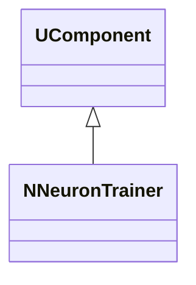
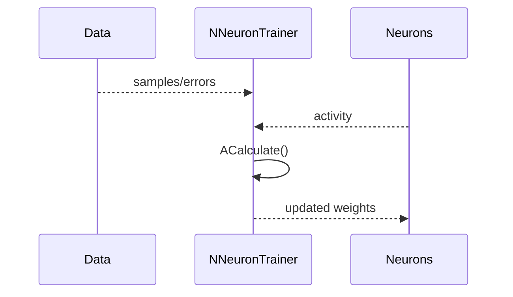
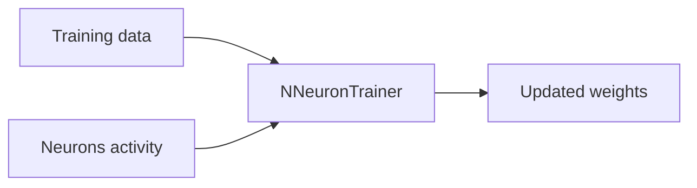
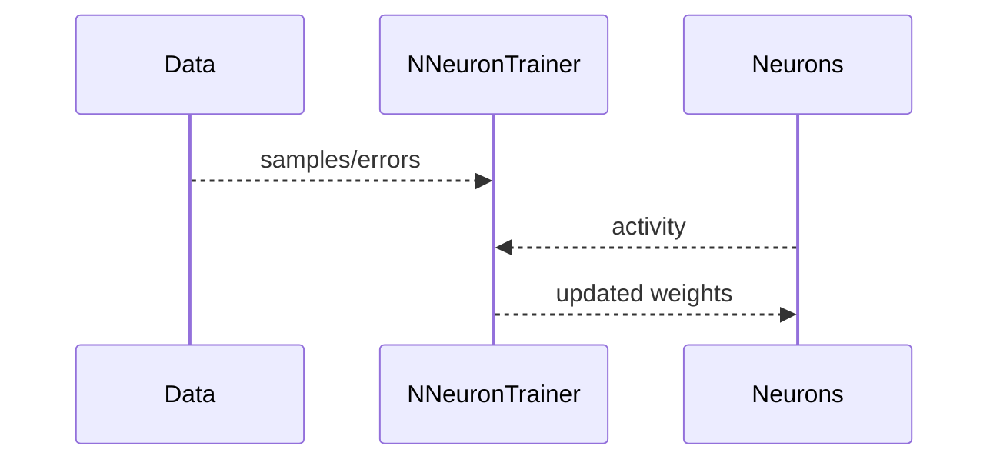

## NNeuronTrainer — тренер нейронов

**Класс**: `NNeuronTrainer` — обучает нейроны по заданному правилу/данным.  
**Регистрация**: `NPulseLibrary.cpp` → `UploadClass("NNeuronTrainer", ...)`.  
**Storage**: `ClassName = "NNeuronTrainer"`.

### Lifecycle
- **ADefault**: параметры обучения.
- **ABuild**: подключение целевых нейронов/данных.
- **AReset**: сброс состояния обучения.
- **ACalculate**: обновление нейронов по правилу.

### I/O
- Вход: данные/ошибки/активность нейронов.
- Выход: обновлённые веса/состояния (внутренне), метрики обучения.



Пояснение: диаграмма классов показывает место компонента в иерархии и ключевые связи.



Пояснение: диаграмма последовательности показывает типовой сценарий взаимодействия и порядок вызовов.



Пояснение: блок-схема показывает поток данных/сигналов (входы → компонент → выходы).

### Config snippet

```ini
[Component]
ClassName = NNeuronTrainer
Name = NeuronTrainer1
```

---

## NNeuronTrainer — neuron trainer (EN)

Updates neurons using provided training data/errors.


Description: this class diagram shows the component position in the type hierarchy and key relations.



Description: this sequence diagram shows a typical runtime interaction and call order.


Description: this flowchart shows the data/signal flow (inputs → component → outputs).
