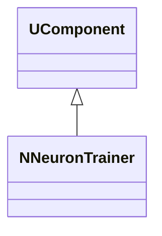
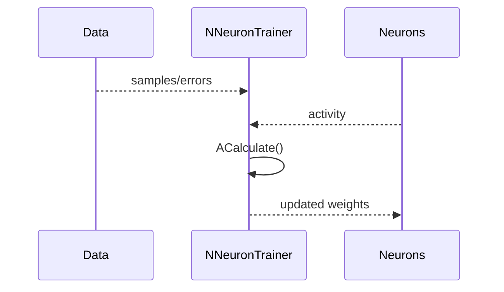
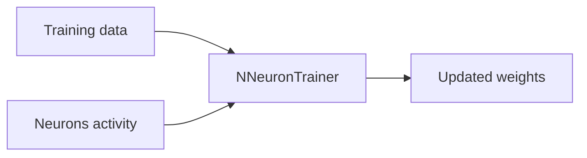
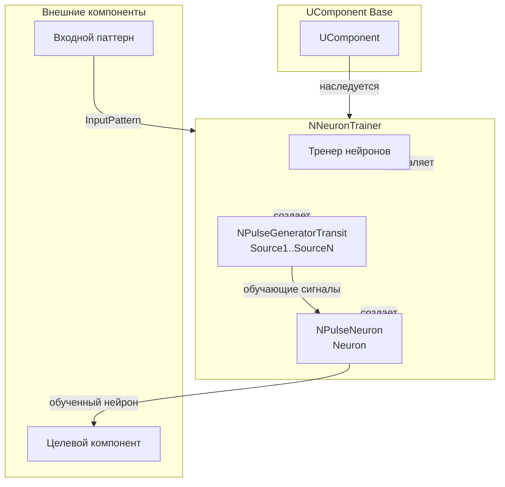
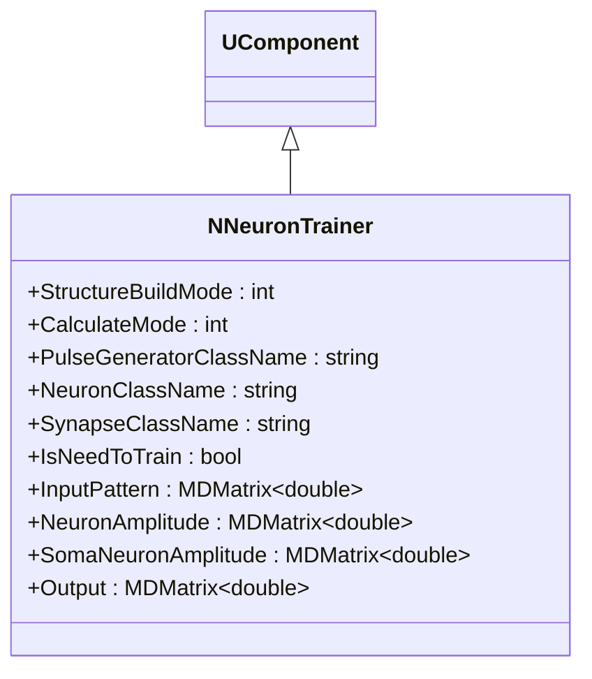
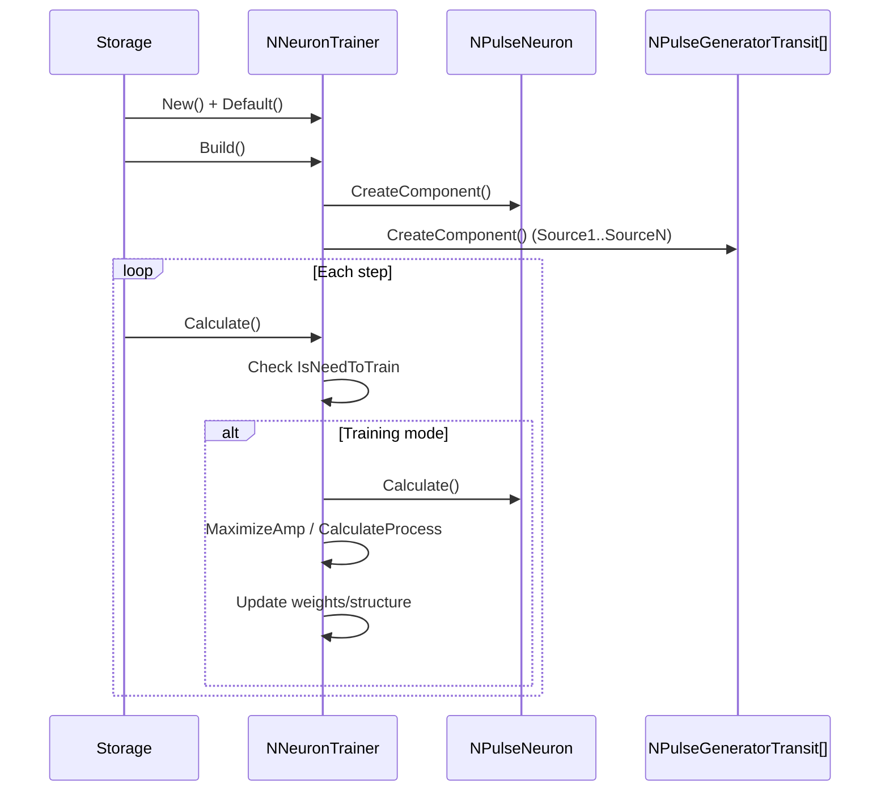
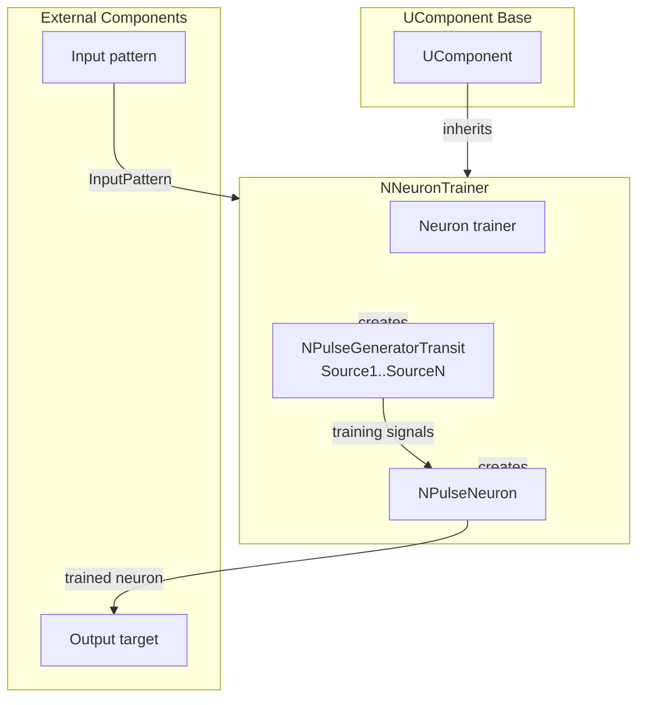

## NNeuronTrainer — тренер нейронов

**Класс**: `NNeuronTrainer` — обучает нейроны по заданному правилу/данным.
**Регистрация**: `NPulseLibrary.cpp` → `UploadClass("NNeuronTrainer", ...)`.
**Storage**: `ClassName = "NNeuronTrainer"`.

### Lifecycle
- **ADefault**: параметры обучения.
- **ABuild**: подключение целевых нейронов/данных.
- **AReset**: сброс состояния обучения.
- **ACalculate**: обновление нейронов по правилу.

### I/O
- Вход: данные/ошибки/активность нейронов.
- Выход: обновлённые веса/состояния (внутренне), метрики обучения.



Пояснение: диаграмма классов показывает место компонента в иерархии и ключевые связи.



Пояснение: диаграмма последовательности показывает типовой сценарий взаимодействия и порядок вызовов.



Пояснение: блок-схема показывает поток данных/сигналов (входы → компонент → выходы).

### UML-диаграмма состояний

```mermaid
stateDiagram-v2
    [*] --> Uninitialized: New()
    Uninitialized --> Defaulted: Default()
    Defaulted --> Building: Build()
    Building --> CheckMode{StructureBuildMode > 0?}
    CheckMode -->|Да| BuildStructure: BuildStructure()
    CheckMode -->|Нет| Built: Структура не пересобирается
    BuildStructure --> CreateNeuron: Создание Neuron
    CreateNeuron --> CreateGenerators: Создание генераторов Source1..SourceN
    CreateGenerators --> CreateLinks: Создание связей
    CreateLinks --> Built: Структура построена
    Built --> Ready: Ready = true
    Ready --> Calculating: Calculate()
    Calculating --> CheckTrain{IsNeedToTrain?}
    CheckTrain -->|Да| Training: Режим обучения
    CheckTrain -->|Нет| Ready: Обучение завершено
    Training --> CheckMode{CalculateMode?}
    CheckMode -->|0| MaximizeAmp: Максимизация амплитуды
    CheckMode -->|6| CalculateProcess: CalculateProcess()
    MaximizeAmp --> CheckNewDend{is_new_dend?}
    CheckNewDend -->|Да| SelectDendrite: Выбор следующего дендрита
    CheckNewDend -->|Нет| CheckNewIter{is_new_iteration?}
    CheckNewIter -->|Да| GrowDendrite: Наращивание дендрита
    CheckNewIter -->|Нет| MeasureAmp: Измерение амплитуды
    SelectDendrite --> MeasureAmp
    GrowDendrite --> MeasureAmp
    MeasureAmp --> CheckIterTime: Проверка времени итерации
    CheckIterTime --> CheckAmpIncrease: Проверка увеличения амплитуды
    CheckAmpIncrease -->|Да| GrowDendrite: Продолжить рост
    CheckAmpIncrease -->|Нет| SelectDendrite: Перейти к следующему дендриту
    CalculateProcess --> Ready: Шаг завершен
    Ready --> Resetting: Reset()
    Resetting --> Ready: Состояния сброшены
```

**Состояния:**
- **Uninitialized** — создан, но не инициализирован
- **Defaulted** — параметры установлены по умолчанию
- **Building** — выполняется сборка структуры
- **CheckMode** — проверка необходимости пересборки структуры
- **BuildStructure** — выполнение пересборки структуры
- **CreateNeuron** — создание нейрона для обучения
- **CreateGenerators** — создание генераторов импульсов
- **CreateLinks** — создание связей между генераторами и нейроном
- **Built** — структура тренера построена
- **Ready** — готов к выполнению расчетов
- **Calculating** — выполняется расчет тренера
- **Training** — режим обучения
- **MaximizeAmp** — максимизация амплитуды нейрона
- **CalculateProcess** — процесс расчета (режим 6)
- **CheckNewDend** — проверка необходимости нового дендрита
- **SelectDendrite** — выбор следующего дендрита для обучения
- **CheckNewIter** — проверка необходимости новой итерации
- **GrowDendrite** — наращивание длины дендрита
- **MeasureAmp** — измерение амплитуды нейрона
- **CheckIterTime** — проверка времени итерации
- **CheckAmpIncrease** — проверка увеличения амплитуды
- **Resetting** — выполняется сброс состояний

### UML-диаграмма компонентов



**Зависимости:**
- **Базовый класс**: `UComponent`
- **Внутренние компоненты**: нейрон (`NPulseNeuron`), генераторы импульсов (`NPulseGeneratorTransit`)
- **Внешние компоненты**: входной паттерн (источник `InputPattern`), целевой компонент (получатель обученного нейрона)

### Config snippet

```ini
[Component]
ClassName = NNeuronTrainer
Name = NeuronTrainer1
```

## Источники

См. [Literature-References.md](../Literature-References.md): **[A]**, **[B]**, **1**, **6**.

---

## NNeuronTrainer — neuron trainer (EN)

### Purpose

**Class**: `NNeuronTrainer` — trains neurons using provided training data/errors.
**Registration**: `NPulseLibrary.cpp` → `UploadClass("NNeuronTrainer", ...)`.
**Instances**: `ClassName = "NNeuronTrainer"` in configs.

`NNeuronTrainer` updates neurons using provided training data/errors and neuron activity. It supports various training modes including amplitude maximization and dendrite growth.

**Usage:** Training neurons with specific patterns, optimizing neuron responses

### UML Class Diagram



### UML Sequence Diagram



### UML State Diagram

```mermaid
stateDiagram-v2
    [*] --> Uninitialized: New()
    Uninitialized --> Defaulted: Default()
    Defaulted --> Building: Build()
    Building --> CheckMode{StructureBuildMode > 0?}
    CheckMode -->|Yes| BuildStructure: BuildStructure()
    CheckMode -->|No| Built: Structure not rebuilt
    BuildStructure --> CreateNeuron: Create neuron
    CreateNeuron --> CreateGenerators: Create generators
    CreateGenerators --> Built: Structure built
    Built --> Ready: Ready = true
    Ready --> Calculating: Calculate()
    Calculating --> CheckTrain{IsNeedToTrain?}
    CheckTrain -->|Yes| Training: Training mode
    CheckTrain -->|No| Ready: Training completed
    Training --> CheckMode{CalculateMode?}
    CheckMode -->|0| MaximizeAmp: Maximize amplitude
    CheckMode -->|6| CalculateProcess: CalculateProcess()
    MaximizeAmp --> CheckNewDend{is_new_dend?}
    CheckNewDend -->|Yes| SelectDendrite: Select next dendrite
    CheckNewDend -->|No| CheckNewIter{is_new_iteration?}
    CheckNewIter -->|Yes| GrowDendrite: Grow dendrite
    CheckNewIter -->|No| MeasureAmp: Measure amplitude
    SelectDendrite --> MeasureAmp
    GrowDendrite --> MeasureAmp
    MeasureAmp --> CheckAmpIncrease: Check amplitude increase
    CheckAmpIncrease -->|Yes| GrowDendrite: Continue growth
    CheckAmpIncrease -->|No| SelectDendrite: Next dendrite
    CalculateProcess --> Ready: Step completed
    Ready --> Resetting: Reset()
    Resetting --> Ready
```

### UML Activity Diagram


### UML Component Diagram



### Properties

- `StructureBuildMode` — режим пересборки структуры (0 — не пересобирать, 1 — пересобрать)
- `CalculateMode` — режим расчета (0 — максимизация амплитуды, 6 — CalculateProcess)
- `PulseGeneratorClassName` — имя класса генератора импульсов
- `NeuronClassName` — имя класса нейрона
- `SynapseClassName` — имя класса синапса
- `IsNeedToTrain` — необходимость обучения
- `InputPattern` — входной паттерн для обучения
- `NeuronAmplitude` — амплитуда нейрона
- `SomaNeuronAmplitude` — амплитуда сомы нейрона
- `Output` — выходной сигнал

### Methods

- `ADefault()` — установка параметров по умолчанию
- `ABuild()` — сборка структуры тренера
- `AReset()` — сброс состояния обучения
- `ACalculate()` — выполнение шага обучения

### Подробная временная структура обучения

- **Итерация** в `NNeuronTrainer` — это временной промежуток, в течение которого
  измеряются максимальные амплитуды на дендритах/сомах и принимается решение
  о росте/сжатии дендритов и изменении числа синапсов.
  - Начало итерации фиксируется в `start_iter_time`.
  - Длительность итерации \(`iter_length`\) вычисляется внутри конкретного алгоритма
    как \(1 / SpikesFrequency - 1 / TimeStep\).
- **Такт** — один вызов `ACalculate()` тренера в общем цикле расчёта модели.

Упрощённый поток вызываемых методов:

```mermaid
flowchart TD
    start[Start ACalculate] --> calcProc[CalculateProcess()]
    calcProc --> updateOut{neuron exists?}
    updateOut -->|No| end[Return]
    updateOut -->|Yes| ltZone[Read LTZone->Output]
    ltZone --> end
```

Внутри `CalculateProcess()`:

```mermaid
flowchart TD
    cpStart[CalculateProcess] --> threshCheck{IsNeedToTrain && thresh_first_iter?}
    threshCheck -->|Yes| setTrainThresh[Set LTZThreshold = TrainingLTZThreshold]
    threshCheck -->|No| afterThresh
    setTrainThresh --> afterThresh[Update Neuron/Soma amplitudes]
    afterThresh --> modeCheck{CalculateMode}
    modeCheck -->|0| cpReturn[Return (no training)]
    modeCheck -->|6| somaSync[SomaSynchronizePattern()]
    somaSync --> somaNorm[SomaSynapseNormalization()]
    somaNorm --> cpReturn
    modeCheck -->|1,2,3,4,5| legacy[Legacy/disabled modes]
    legacy --> cpReturn
```

Таким образом:

- При `CalculateMode = 0` тренер фактически ничего не делает (режим «выключен»).
- При `CalculateMode = 6` используется двухэтапный алгоритм:
  1. `SomaSynchronizePattern()` — подбирает длины дендритов, чтобы синхронизировать времена максимумов сигналов на сомах.
  2. `SomaSynapseNormalization()` — подбирает число синапсов, чтобы компенсировать потери амплитуды и зафиксировать структуру.

Режимы `1–5` либо закомментированы, либо используются для старых экспериментальных алгоритмов и в текущей реализации
могут рассматриваться как устаревшие.

### Структура состояния и параметров

Ключевые публичные свойства `NNeuronTrainer`:

- **Структура и режимы**:
  - `StructureBuildMode` — режим пересборки структуры (0 — не пересобирать, 1 — пересобрать по `BuildStructure`).
  - `CalculateMode` — режим расчёта/обучения:
    - 0 — ранний выход без обучения (используется только чтение амплитуд),
    - 6 — активный режим `SomaSynchronizePattern` + `SomaSynapseNormalization`.
  - `IsNeedToTrain` — флаг необходимости обучения; при его опускании тренер прекращает менять структуру и только считает.
- **Классы и компоненты**:
  - `PulseGeneratorClassName` — имя класса генераторов импульсов (`NPulseGeneratorTransit`).
  - `NeuronClassName` — имя класса целевого нейрона (`NSPNeuronGen` и др.).
  - `SynapseClassName` — имя класса синапсов (`NPSynapseBio` и др.).
- **Входы и тайминг**:
  - `NumInputDendrite` — число входных дендритов.
  - `MaxDendriteLength` — максимальная разрешённая длина дендритов (число сегментов).
  - `InputPattern` — паттерн задержек входных импульсов (TTFS) для каждого дендрита.
  - `Delay` — общая задержка начала обучения относительно старта системы.
  - `SpikesFrequency` — частота генераторов (определяет период итерации).
- **Пороги LT‑зоны**:
  - `LTZThreshold` — текущий порог низкопороговой зоны.
  - `FixedLTZThreshold` — фиксированный (рабочий) порог.
  - `TrainingLTZThreshold` — порог, используемый на этапе обучения (выставляется в начале обучения).
  - `UseFixedLTZThreshold` — признак использования фиксированного порога.
- **Амплитуды и выход**:
  - `NeuronAmplitude` — амплитуды на дендритах (суммарный потенциал и по дендритам отдельно).
  - `SomaNeuronAmplitude` — амплитуды на сомах.
  - `Output` — выход `LTZone->Output` целевого нейрона.
- **Синапсы**:
  - `SynapseResistanceStep` — сопротивление добавляемых в процессе обучения синапсов.

Внутренние поля, управляющие обучением:

- Геометрия и синапсы:
  - `DendriteLength` — вектор текущих длин дендритов (число сегментов на каждом входе).
  - `SynapseNum` — вектор числа возбуждающих синапсов на входных сегментах дендритов.
  - `InitialDendritePotential` — максимальные исходные потенциалы при единичной длине дендритов.
- Временная структура:
  - `is_first_iter` — флаг первого такта внутри итерации (инициализация максимумов и времени начала).
  - `start_iter_time` — время начала текущей итерации.
  - `max_iter_neuron_amp`, `max_neuron_amp`, `max_neuron_amp_time` — метрики для старых режимов максимизации амплитуды нейрона.
- Управление ростом:
  - `dend_counter`, `dend_index` — индексы текущих дендритов в старых алгоритмах; в режиме 6 `dend_index` задаёт калибровочный дендрит.
  - `is_new_dend`, `is_new_iteration` — флаги необходимости перейти к следующему дендриту / итерации роста.
  - `syn_counter` — индекс дендрита, на котором растут синапсы в устаревших режимах.
- Для режимов синхронизации (особенно `CalculateMode = 6`):
  - `is_need_to_build` — флаг необходимости первоначальной досборки структуры (подключения генераторов, инициализации длины).
  - `max_iter_dend_amp` — максимальные амплитуды на сомах или дендритах за итерацию.
  - `max_dend_amp_time` — времена, когда наблюдались максимумы.
  - `dissynchronization` — текущая оценка рассинхронизации по времени относительно калибровочного дендрита.
  - `dend_status` — статусы дендритов:
    - 0 — без изменений,
    - 1/−1 — нужно удлинить/укоротить дендрит,
    - 2/−2 — нужно добавить/убавить синапсы (в `SomaSynapseNormalization`).
  - `is_synchronizated` — флаг завершения процесса синхронизации (подбора длин).

Эти структуры данных используются двумя основными алгоритмами: `SomaSynchronizePattern` (подбор длины) и
`SomaSynapseNormalization` (нормализация числа синапсов при фиксированной длине).

### Usage in configurations

`NNeuronTrainer` is used for training neurons with specific patterns:

- **Neuron training**: `Bin/Configs/*/Model_*.xml` (where neuron training is required)
- **Amplitude maximization**: experiments with optimizing neuron responses
- **Dendrite growth**: experiments with structural plasticity

### Детальный разбор алгоритмов роста дендритов и синапсов

#### Режим 6: `SomaSynchronizePattern` (рост дендритов по времени на соме)

```mermaid
flowchart TD
    sStart[SomaSynchronizePattern] --> buildCheck{is_need_to_build?}
    buildCheck -->|Yes| initBuild[Подключить SourceX к DendriteX_1.ExcSynapse1,\nDendriteLength=1,\nинициализировать массивы]
    initBuild --> returnEarly[Return]
    buildCheck -->|No| trainCheck{Все dend_status == 0?}
    trainCheck -->|Yes| markSynced[is_synchronizated = true\n(и опционально IsNeedToTrain=false при mode 3)]
    markSynced --> returnEarly
    trainCheck -->|No| iterCheck{is_new_iteration?}
    iterCheck -->|Yes| growShrink[Рост/сжатие дендритов\nпо dend_status]
    growShrink --> clearNewIter[is_new_iteration=false]
    clearNewIter --> returnEarly
    iterCheck -->|No| firstBeat{is_first_iter?}
    firstBeat -->|Yes| initIter[Запомнить start_iter_time,\nобнулить max_iter_dend_amp]
    firstBeat -->|No| measure[Измерение амплитуд сомы,\nобновление максимумов и InitialDendritePotential]
    initIter --> measure
    measure --> timeCheck{iter_time >= iter_length?}
    timeCheck -->|No| returnEarly
    timeCheck -->|Yes| decideStatus[Рассчитать dt,\nобновить dend_status,\nset is_new_iteration=true,\n is_first_iter=true]
    decideStatus --> returnEarly
```

- **Первичный билд (`is_need_to_build`)**:
  - Все генераторы `SourceX` подключаются к `DendriteX_1.ExcSynapse1`.
  - Для всех входов `DendriteLength[i] = 1`.
  - Инициализируются:
    - `max_dend_amp_time[i] = 0`,
    - `dissynchronization[i] = period` (кроме калибровочного дендрита `dend_index`, где 0),
    - `dend_status[i] = 1` (растим), а для калибровочного `dend_status[dend_index] = 0`,
    - `is_synchronizated = false`.

- **Рост/сжатие при `is_new_iteration == true`**:
  - Для каждого дендрита `i`:
    - Если `dend_status[i] == 1` и `DendriteLength[i] < MaxDendriteLength`:
      - `DendriteLength[i]++`.
      - Обновляется структура нейрона (`NumDendriteMembraneParts` или `NumDendriteMembranePartsVec`),
        выполняется `Reset()`.
      - Переключаются связи генератора:
        - создаётся линк `Source(i+1).Output -> Dendrite(i+1)_(new).ExcSynapse1.Input`,
        - разрывается линк со старым сегментом.
    - Если `dend_status[i] == -1`:
      - `DendriteLength[i]--` (при необходимости уменьшается и вектор длины мембран в нейроне),
      - `dend_status[i] = 0`,
      - связи генератора возвращаются на более короткий сегмент.
  - После обхода всех входов `is_new_iteration = false`.

- **Измерение максимумов сомы**:
  - В каждом такте:
    - Для каждой сомы `Soma(i+1)` снимается `soma_amp = soma->SumPotential(0,0)`.
    - Если `soma_amp` больше сохранённого максимума для текущей итерации:
      - обновляются `max_iter_dend_amp[i]` и `max_dend_amp_time[i]`.
      - при `DendriteLength[i] == 1` `InitialDendritePotential[i] = soma_amp`.

- **Окончание итерации**:
  - Когда `iter_time >= iter_length`, для каждого `i` с `dend_status[i] != 0`:
    - вычисляется `dt = |max_dend_amp_time[dend_index] - max_dend_amp_time[i]|`;
    - если `dt < dissynchronization[i]` → рассинхронизация уменьшилась, продолжаем рост (`dend_status[i] = 1`);
    - иначе → ухудшение, укорачиваем (`dend_status[i] = -1`);
    - `is_new_iteration = true`, `is_first_iter = true` для следующего цикла.

- **Завершение синхронизации**:
  - Если в начале вызова обнаружено, что все `dend_status[i] == 0`:
    - `is_synchronizated = true`,
    - при `CalculateMode == 3` дополнительно `IsNeedToTrain = false`.

Если `dend_status` быстро обнуляются без заметного изменения `DendriteLength`, обучение может завершиться
без реального роста дендритов.

#### Режим 6: `SomaSynapseNormalization` (рост числа синапсов по амплитуде на соме)

```mermaid
flowchart TD
    snStart[SomaSynapseNormalization] --> trainedCheck{Все dend_status == 0?}
    trainedCheck -->|Yes| finalize[IsNeedToTrain=false,\nзапомнить TrainingPattern,\nTrainingDendIndexes,\nTrainingSynapsisNum,\nLTZThreshold=FixedLTZThreshold]
    finalize --> snReturn[Return]
    trainedCheck -->|No| iterFlagCheck{is_new_iteration?}
    iterFlagCheck -->|Yes| applySyn[Добавление/удаление синапсов\nпо dend_status==2/-2]
    applySyn --> clearIter[is_new_iteration=false]
    clearIter --> snReturn
    iterFlagCheck -->|No| firstBeatSn{is_first_iter?}
    firstBeatSn -->|Yes| initIterSn[init max_iter_dend_amp,\nstart_iter_time]
    firstBeatSn -->|No| measureSn[Измерение максимумов на сомах]
    initIterSn --> measureSn
    measureSn --> timeCheckSn{iter_time >= iter_length?}
    timeCheckSn -->|No| snReturn
    timeCheckSn -->|Yes| decideSyn[Сравнить max_iter_dend_amp[i]\nи InitialDendritePotential[i],\nвыставить dend_status=2/-2,\nset is_new_iteration=true,\n is_first_iter=true]
    decideSyn --> snReturn
```

- **Определение завершения обучения**:
  - Если `dend_status[i] == 0` для всех входов, считаем нейрон обученным:
    - `IsNeedToTrain = false`.
    - В `neuron` записывается:
      - `TrainingPattern = InputPattern`,
      - `TrainingDendIndexes(i,0) = DendriteLength[i]`,
      - `TrainingSynapsisNum(i,0) = SynapseNum[i]`.
    - LT‑порог переводится на фиксированное значение `FixedLTZThreshold`.

- **Изменение числа синапсов при `is_new_iteration == true`**:
  - Для `dend_status[i] == 2`:
    - `SynapseNum[i]++`.
    - На последнем сегменте дендрита `Dendrite(i+1)_(DendriteLength[i])` увеличивается `NumExcitatorySynapses`,
      выполняется `Build()`, берётся последний возбуждающий синапс, создаётся линк от `Source(i+1)`,
      сопротивление синапса устанавливается в `SynapseResistanceStep`.
  - Для `dend_status[i] == -2`:
    - `SynapseNum[i]--`,
    - уменьшается `NumExcitatorySynapses` на том же сегменте, выполняется `Build()` и `neuron->Reset()`,
    - `dend_status[i] = 0`.

- **Сравнение амплитуд и выставление статусов**:
  - В течение итерации:
    - для каждой сомы `Soma(i+1)` вычисляется `soma_amp = soma->SumPotential(0,0)`,
      максимум за итерацию сохраняется в `max_iter_dend_amp[i]`.
  - По завершении итерации:
    - если `max_iter_dend_amp[i] < InitialDendritePotential[i] + 0.000005` → **амплитуда меньше исходной**, нужно
      **увеличивать число синапсов**: `dend_status[i] = 2`;
    - иначе → амплитуда выросла или не ухудшилась — можно уменьшать число синапсов:
      `dend_status[i] = -2`.
    - После этого `is_new_iteration = true`, `is_first_iter = true`.

Вместе `SomaSynchronizePattern` и `SomaSynapseNormalization` реализуют двухэтапное структурное обучение:
сначала подбор длины дендритов по времени максимума на сомах, затем подбор числа синапсов по амплитуде выхода сом.

### References

See [Literature-References.md](../Literature-References.md): **[A]**, **[B]**, **1**, **6**.
