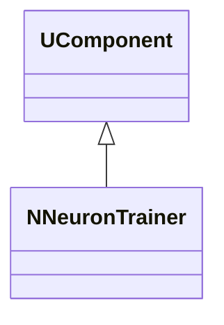
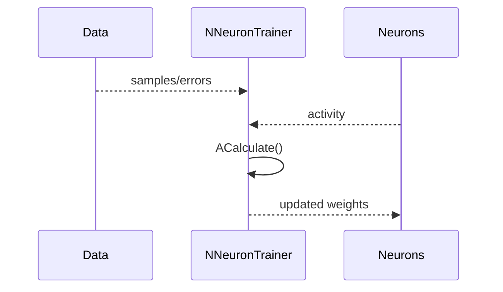
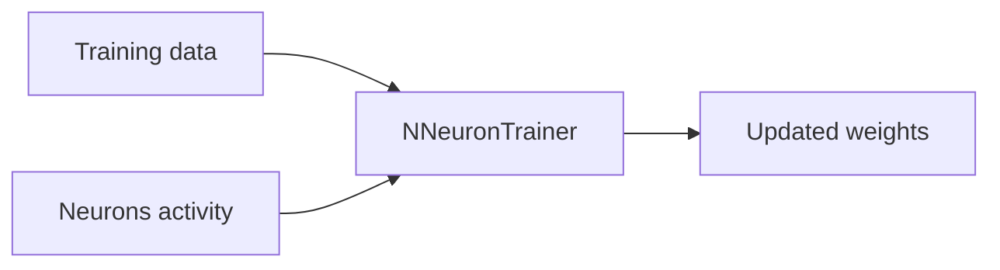
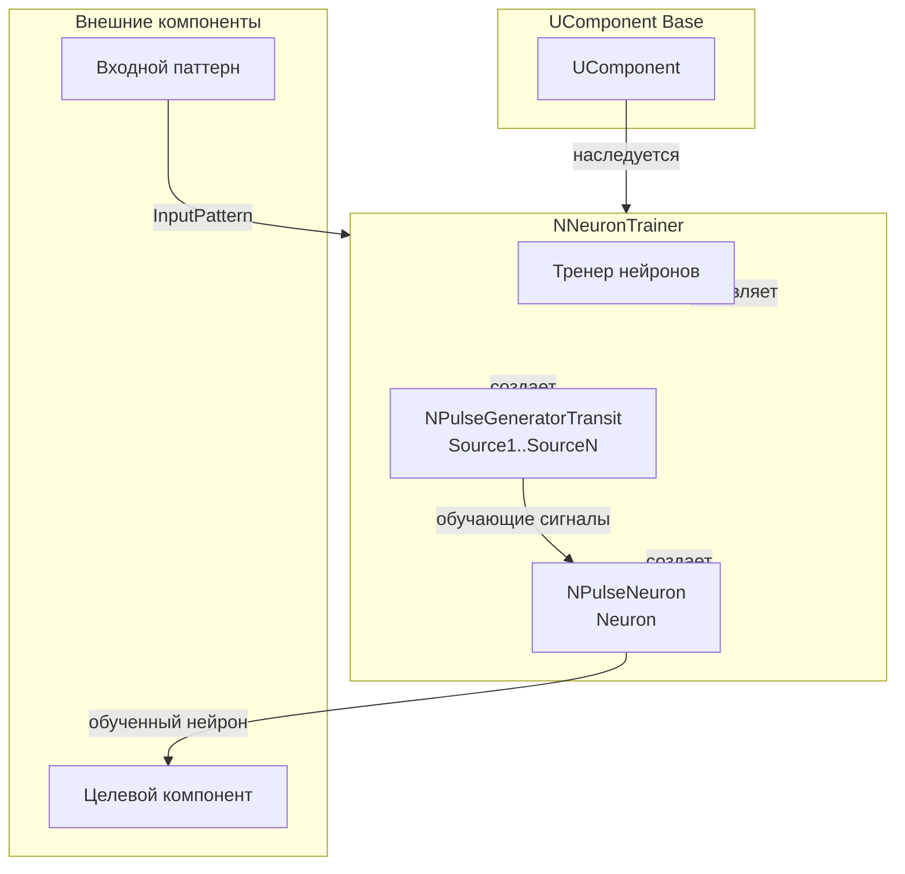
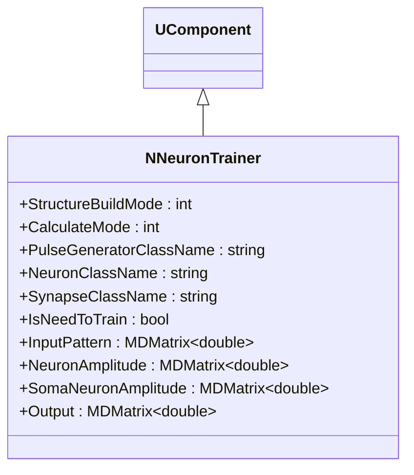
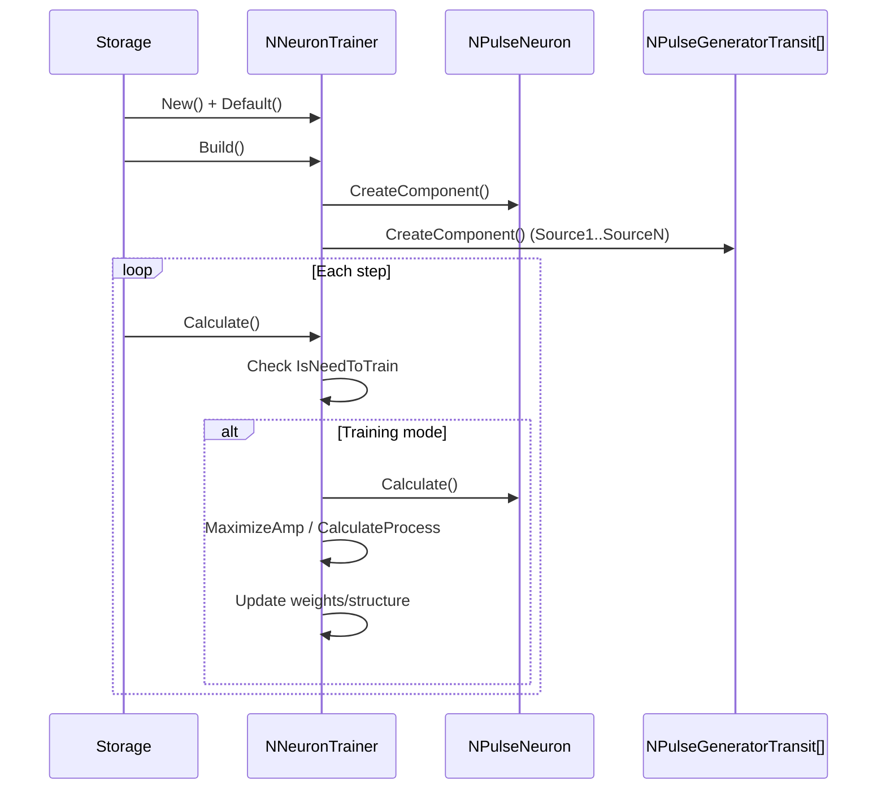
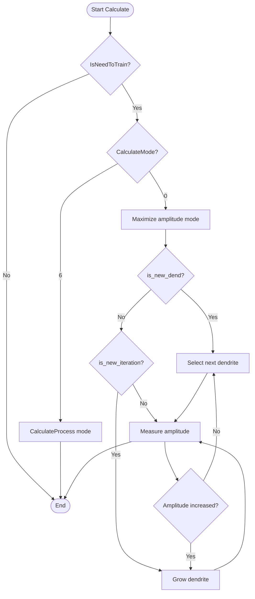
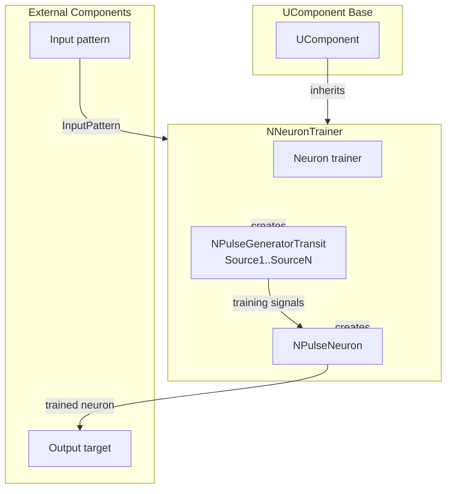

## RU

## NNeuronTrainer — тренер нейронов

**Класс**: `NNeuronTrainer` — обучает нейроны по заданному правилу/данным.
**Регистрация**: `NPulseLibrary.cpp` → `UploadClass("NNeuronTrainer", ...)`.
**Storage**: `ClassName = "NNeuronTrainer"`.

### Lifecycle
- **ADefault**: параметры обучения.
- **ABuild**: подключение целевых нейронов/данных.
- **AReset**: сброс состояния обучения.
- **ACalculate**: обновление нейронов по правилу.

### I/O
- Вход: данные/ошибки/активность нейронов.
- Выход: обновлённые веса/состояния (внутренне), метрики обучения.



Пояснение: диаграмма классов показывает место компонента в иерархии и ключевые связи.



Пояснение: диаграмма последовательности показывает типовой сценарий взаимодействия и порядок вызовов.



Пояснение: блок-схема показывает поток данных/сигналов (входы → компонент → выходы).

### UML-диаграмма состояний

```mermaid
stateDiagram-v2
    [*] --> Uninitialized: New()
    Uninitialized --> Defaulted: Default()
    Defaulted --> Building: Build()
    Building --> CheckMode{StructureBuildMode > 0?}
    CheckMode -->|Да| BuildStructure: BuildStructure()
    CheckMode -->|Нет| Built: Структура не пересобирается
    BuildStructure --> CreateNeuron: Создание Neuron
    CreateNeuron --> CreateGenerators: Создание генераторов Source1..SourceN
    CreateGenerators --> CreateLinks: Создание связей
    CreateLinks --> Built: Структура построена
    Built --> Ready: Ready = true
    Ready --> Calculating: Calculate()
    Calculating --> CheckTrain{IsNeedToTrain?}
    CheckTrain -->|Да| Training: Режим обучения
    CheckTrain -->|Нет| Ready: Обучение завершено
    Training --> CheckMode{CalculateMode?}
    CheckMode -->|0| MaximizeAmp: Максимизация амплитуды
    CheckMode -->|6| CalculateProcess: CalculateProcess()
    MaximizeAmp --> CheckNewDend{is_new_dend?}
    CheckNewDend -->|Да| SelectDendrite: Выбор следующего дендрита
    CheckNewDend -->|Нет| CheckNewIter{is_new_iteration?}
    CheckNewIter -->|Да| GrowDendrite: Наращивание дендрита
    CheckNewIter -->|Нет| MeasureAmp: Измерение амплитуды
    SelectDendrite --> MeasureAmp
    GrowDendrite --> MeasureAmp
    MeasureAmp --> CheckIterTime: Проверка времени итерации
    CheckIterTime --> CheckAmpIncrease: Проверка увеличения амплитуды
    CheckAmpIncrease -->|Да| GrowDendrite: Продолжить рост
    CheckAmpIncrease -->|Нет| SelectDendrite: Перейти к следующему дендриту
    CalculateProcess --> Ready: Шаг завершен
    Ready --> Resetting: Reset()
    Resetting --> Ready: Состояния сброшены
```

**Состояния:**
- **Uninitialized** — создан, но не инициализирован
- **Defaulted** — параметры установлены по умолчанию
- **Building** — выполняется сборка структуры
- **CheckMode** — проверка необходимости пересборки структуры
- **BuildStructure** — выполнение пересборки структуры
- **CreateNeuron** — создание нейрона для обучения
- **CreateGenerators** — создание генераторов импульсов
- **CreateLinks** — создание связей между генераторами и нейроном
- **Built** — структура тренера построена
- **Ready** — готов к выполнению расчетов
- **Calculating** — выполняется расчет тренера
- **Training** — режим обучения
- **MaximizeAmp** — максимизация амплитуды нейрона
- **CalculateProcess** — процесс расчета (режим 6)
- **CheckNewDend** — проверка необходимости нового дендрита
- **SelectDendrite** — выбор следующего дендрита для обучения
- **CheckNewIter** — проверка необходимости новой итерации
- **GrowDendrite** — наращивание длины дендрита
- **MeasureAmp** — измерение амплитуды нейрона
- **CheckIterTime** — проверка времени итерации
- **CheckAmpIncrease** — проверка увеличения амплитуды
- **Resetting** — выполняется сброс состояний

### UML-диаграмма компонентов



**Зависимости:**
- **Базовый класс**: `UComponent`
- **Внутренние компоненты**: нейрон (`NPulseNeuron`), генераторы импульсов (`NPulseGeneratorTransit`)
- **Внешние компоненты**: входной паттерн (источник `InputPattern`), целевой компонент (получатель обученного нейрона)

### Config snippet

```ini
[Component]
ClassName = NNeuronTrainer
Name = NeuronTrainer1
```

## Источники

См. [Literature-References.md](../Literature-References.md): **[A]**, **[B]**, **1**, **6**.

---

## EN

## NNeuronTrainer — neuron trainer (EN)

### Purpose

**Class**: `NNeuronTrainer` — trains neurons using provided training data/errors.
**Registration**: `NPulseLibrary.cpp` → `UploadClass("NNeuronTrainer", ...)`.
**Instances**: `ClassName = "NNeuronTrainer"` in configs.

`NNeuronTrainer` updates neurons using provided training data/errors and neuron activity. It supports various training modes including amplitude maximization and dendrite growth.

**Usage:** Training neurons with specific patterns, optimizing neuron responses

### UML Class Diagram



### UML Sequence Diagram



### UML State Diagram

```mermaid
stateDiagram-v2
    [*] --> Uninitialized: New()
    Uninitialized --> Defaulted: Default()
    Defaulted --> Building: Build()
    Building --> CheckMode{StructureBuildMode > 0?}
    CheckMode -->|Yes| BuildStructure: BuildStructure()
    CheckMode -->|No| Built: Structure not rebuilt
    BuildStructure --> CreateNeuron: Create neuron
    CreateNeuron --> CreateGenerators: Create generators
    CreateGenerators --> Built: Structure built
    Built --> Ready: Ready = true
    Ready --> Calculating: Calculate()
    Calculating --> CheckTrain{IsNeedToTrain?}
    CheckTrain -->|Yes| Training: Training mode
    CheckTrain -->|No| Ready: Training completed
    Training --> CheckMode{CalculateMode?}
    CheckMode -->|0| MaximizeAmp: Maximize amplitude
    CheckMode -->|6| CalculateProcess: CalculateProcess()
    MaximizeAmp --> CheckNewDend{is_new_dend?}
    CheckNewDend -->|Yes| SelectDendrite: Select next dendrite
    CheckNewDend -->|No| CheckNewIter{is_new_iteration?}
    CheckNewIter -->|Yes| GrowDendrite: Grow dendrite
    CheckNewIter -->|No| MeasureAmp: Measure amplitude
    SelectDendrite --> MeasureAmp
    GrowDendrite --> MeasureAmp
    MeasureAmp --> CheckAmpIncrease: Check amplitude increase
    CheckAmpIncrease -->|Yes| GrowDendrite: Continue growth
    CheckAmpIncrease -->|No| SelectDendrite: Next dendrite
    CalculateProcess --> Ready: Step completed
    Ready --> Resetting: Reset()
    Resetting --> Ready
```

### UML Activity Diagram



### UML Component Diagram



### Properties

- `StructureBuildMode` — structure rebuild mode (0 — do not rebuild, 1 — rebuild)
- `CalculateMode` — calculation mode (0 — amplitude maximization, 6 — CalculateProcess)
- `PulseGeneratorClassName` — pulse generator class name
- `NeuronClassName` — neuron class name
- `SynapseClassName` — synapse class name
- `IsNeedToTrain` — training required flag
- `InputPattern` — input training pattern
- `NeuronAmplitude` — neuron amplitude
- `SomaNeuronAmplitude` — soma neuron amplitude
- `Output` — output signal

### Methods

- `ADefault()` — setting default parameters
- `ABuild()` — building trainer structure
- `AReset()` — resetting training state
- `ACalculate()` — training step

### Detailed Training Timeline

- **Iteration** in `NNeuronTrainer` is a time interval during which
  maximum amplitudes on dendrites/somas are measured and a decision is made
  about dendrite growth/shrinkage and changing the number of synapses.
  - Iteration start is recorded in `start_iter_time`.
  - Iteration duration \(`iter_length`\) is computed inside the specific algorithm
    as \(1 / SpikesFrequency - 1 / TimeStep\).
- **Step** — one call to the trainer's `ACalculate()` in the model calculation loop.

Simplified call flow:

```mermaid
flowchart TD
    start[Start ACalculate] --> calcProc[CalculateProcess()]
    calcProc --> updateOut{neuron exists?}
    updateOut -->|No| end[Return]
    updateOut -->|Yes| ltZone[Read LTZone->Output]
    ltZone --> end
```

Inside `CalculateProcess()`:

```mermaid
flowchart TD
    cpStart[CalculateProcess] --> threshCheck{IsNeedToTrain && thresh_first_iter?}
    threshCheck -->|Yes| setTrainThresh[Set LTZThreshold = TrainingLTZThreshold]
    threshCheck -->|No| afterThresh
    setTrainThresh --> afterThresh[Update Neuron/Soma amplitudes]
    afterThresh --> modeCheck{CalculateMode}
    modeCheck -->|0| cpReturn[Return (no training)]
    modeCheck -->|6| somaSync[SomaSynchronizePattern()]
    somaSync --> somaNorm[SomaSynapseNormalization()]
    somaNorm --> cpReturn
    modeCheck -->|1,2,3,4,5| legacy[Legacy/disabled modes]
    legacy --> cpReturn
```

Thus:

- With `CalculateMode = 0` the trainer effectively does nothing (disabled mode).
- With `CalculateMode = 6` a two-stage algorithm is used:
  1. `SomaSynchronizePattern()` — adjusts dendrite lengths to synchronize soma signal peak times.
  2. `SomaSynapseNormalization()` — adjusts synapse count to compensate amplitude loss and fix the structure.

Modes `1–5` are either commented out or used for legacy experimental algorithms and in the current implementation
may be considered obsolete.

### State and Parameter Structure

Key public properties of `NNeuronTrainer`:

- **Structure and modes**:
  - `StructureBuildMode` — structure rebuild mode (0 — do not rebuild, 1 — rebuild via `BuildStructure`).
  - `CalculateMode` — calculation/training mode:
    - 0 — early exit without training (amplitude readout only),
    - 6 — active mode `SomaSynchronizePattern` + `SomaSynapseNormalization`.
  - `IsNeedToTrain` — training-required flag; when cleared the trainer stops changing structure and only computes.
- **Classes and components**:
  - `PulseGeneratorClassName` — pulse generator class name (`NPulseGeneratorTransit`).
  - `NeuronClassName` — target neuron class name (`NSPNeuronGen`, etc.).
  - `SynapseClassName` — synapse class name (`NPSynapseBio`, etc.).
- **Inputs and timing**:
  - `NumInputDendrite` — number of input dendrites.
  - `MaxDendriteLength` — maximum allowed dendrite length (number of segments).
  - `InputPattern` — input pulse delay pattern (TTFS) for each dendrite.
  - `Delay` — overall training start delay relative to system start.
  - `SpikesFrequency` — generator frequency (defines iteration period).
- **LT-zone thresholds**:
  - `LTZThreshold` — current low-threshold zone threshold.
  - `FixedLTZThreshold` — fixed (operating) threshold.
  - `TrainingLTZThreshold` — threshold used during training (set at training start).
  - `UseFixedLTZThreshold` — flag to use fixed threshold.
- **Amplitudes and output**:
  - `NeuronAmplitude` — dendrite amplitudes (total potential and per-dendrite).
  - `SomaNeuronAmplitude` — soma amplitudes.
  - `Output` — target neuron `LTZone->Output`.
- **Synapses**:
  - `SynapseResistanceStep` — resistance of synapses added during training.

Internal fields controlling training:

- Geometry and synapses:
  - `DendriteLength` — vector of current dendrite lengths (segments per input).
  - `SynapseNum` — vector of excitatory synapse counts on input dendrite segments.
  - `InitialDendritePotential` — initial maximum potentials at unit dendrite length.
- Temporal structure:
  - `is_first_iter` — flag of first step within iteration (initialize maxima and start time).
  - `start_iter_time` — current iteration start time.
  - `max_iter_neuron_amp`, `max_neuron_amp`, `max_neuron_amp_time` — metrics for legacy neuron amplitude maximization modes.
- Growth control:
  - `dend_counter`, `dend_index` — current dendrite indices in legacy algorithms; in mode 6 `dend_index` is the calibration dendrite.
  - `is_new_dend`, `is_new_iteration` — flags to move to next dendrite / growth iteration.
  - `syn_counter` — dendrite index where synapses grow in legacy modes.
- For synchronization modes (especially `CalculateMode = 6`):
  - `is_need_to_build` — flag for initial structure assembly (connect generators, initialize length).
  - `max_iter_dend_amp` — maximum soma or dendrite amplitudes per iteration.
  - `max_dend_amp_time` — times when maxima were observed.
  - `dissynchronization` — current time desynchronization estimate relative to calibration dendrite.
  - `dend_status` — dendrite statuses:
    - 0 — no change,
    - 1/−1 — lengthen/shorten dendrite,
    - 2/−2 — add/remove synapses (in `SomaSynapseNormalization`).
  - `is_synchronizated` — flag that synchronization (length tuning) is complete.

These data structures are used by two main algorithms: `SomaSynchronizePattern` (length tuning) and
`SomaSynapseNormalization` (synapse count normalization at fixed length).

### Usage in configurations

`NNeuronTrainer` is used for training neurons with specific patterns:

- **Neuron training**: `Bin/Configs/*/Model_*.xml` (where neuron training is required)
- **Amplitude maximization**: experiments with optimizing neuron responses
- **Dendrite growth**: experiments with structural plasticity

### Detailed Analysis of Dendrite and Synapse Growth Algorithms

#### Mode 6: `SomaSynchronizePattern` (dendrite growth by soma peak time)

```mermaid
flowchart TD
    sStart[SomaSynchronizePattern] --> buildCheck{is_need_to_build?}
    buildCheck -->|Yes| initBuild[Подключить SourceX к DendriteX_1.ExcSynapse1,\nDendriteLength=1,\nинициализировать массивы]
    initBuild --> returnEarly[Return]
    buildCheck -->|No| trainCheck{Все dend_status == 0?}
    trainCheck -->|Yes| markSynced[is_synchronizated = true\n(и опционально IsNeedToTrain=false при mode 3)]
    markSynced --> returnEarly
    trainCheck -->|No| iterCheck{is_new_iteration?}
    iterCheck -->|Yes| growShrink[Рост/сжатие дендритов\nпо dend_status]
    growShrink --> clearNewIter[is_new_iteration=false]
    clearNewIter --> returnEarly
    iterCheck -->|No| firstBeat{is_first_iter?}
    firstBeat -->|Yes| initIter[Запомнить start_iter_time,\nобнулить max_iter_dend_amp]
    firstBeat -->|No| measure[Измерение амплитуд сомы,\nобновление максимумов и InitialDendritePotential]
    initIter --> measure
    measure --> timeCheck{iter_time >= iter_length?}
    timeCheck -->|No| returnEarly
    timeCheck -->|Yes| decideStatus[Рассчитать dt,\nобновить dend_status,\nset is_new_iteration=true,\n is_first_iter=true]
    decideStatus --> returnEarly
```

- **Initial build (`is_need_to_build`)**:
  - All `SourceX` generators connect to `DendriteX_1.ExcSynapse1`.
  - For all inputs `DendriteLength[i] = 1`.
  - Initialized:
    - `max_dend_amp_time[i] = 0`,
    - `dissynchronization[i] = period` (except calibration dendrite `dend_index`, where 0),
    - `dend_status[i] = 1` (grow), calibration `dend_status[dend_index] = 0`,
    - `is_synchronizated = false`.

- **Growth/shrinkage when `is_new_iteration == true`**:
  - For each dendrite `i`:
    - If `dend_status[i] == 1` and `DendriteLength[i] < MaxDendriteLength`:
      - `DendriteLength[i]++`.
      - Neuron structure updated (`NumDendriteMembraneParts` or `NumDendriteMembranePartsVec`),
        `Reset()` is called.
      - Generator links are switched:
        - link created `Source(i+1).Output -> Dendrite(i+1)_(new).ExcSynapse1.Input`,
        - link to old segment removed.
    - If `dend_status[i] == -1`:
      - `DendriteLength[i]--` (membrane length vector in neuron reduced if needed),
      - `dend_status[i] = 0`,
      - generator links moved back to shorter segment.
  - After all inputs `is_new_iteration = false`.

- **Soma maximum measurement**:
  - Each step:
    - For each soma `Soma(i+1)` read `soma_amp = soma->SumPotential(0,0)`.
    - If `soma_amp` exceeds stored maximum for current iteration:
      - update `max_iter_dend_amp[i]` and `max_dend_amp_time[i]`.
      - at `DendriteLength[i] == 1` set `InitialDendritePotential[i] = soma_amp`.

- **End of iteration**:
  - When `iter_time >= iter_length`, for each `i` with `dend_status[i] != 0`:
    - compute `dt = |max_dend_amp_time[dend_index] - max_dend_amp_time[i]|`;
    - if `dt < dissynchronization[i]` → desynchronization decreased, continue growth (`dend_status[i] = 1`);
    - else → worsened, shorten (`dend_status[i] = -1`);
    - `is_new_iteration = true`, `is_first_iter = true` for next cycle.

- **Synchronization completion**:
  - If at call start all `dend_status[i] == 0`:
    - `is_synchronizated = true`,
    - with `CalculateMode == 3` also set `IsNeedToTrain = false`.

If `dend_status` zero out quickly without noticeable `DendriteLength` change, training may finish
without actual dendrite growth.

#### Mode 6: `SomaSynapseNormalization` (synapse count growth by soma amplitude)

```mermaid
flowchart TD
    snStart[SomaSynapseNormalization] --> trainedCheck{Все dend_status == 0?}
    trainedCheck -->|Yes| finalize[IsNeedToTrain=false,\nзапомнить TrainingPattern,\nTrainingDendIndexes,\nTrainingSynapsisNum,\nLTZThreshold=FixedLTZThreshold]
    finalize --> snReturn[Return]
    trainedCheck -->|No| iterFlagCheck{is_new_iteration?}
    iterFlagCheck -->|Yes| applySyn[Добавление/удаление синапсов\nпо dend_status==2/-2]
    applySyn --> clearIter[is_new_iteration=false]
    clearIter --> snReturn
    iterFlagCheck -->|No| firstBeatSn{is_first_iter?}
    firstBeatSn -->|Yes| initIterSn[init max_iter_dend_amp,\nstart_iter_time]
    firstBeatSn -->|No| measureSn[Измерение максимумов на сомах]
    initIterSn --> measureSn
    measureSn --> timeCheckSn{iter_time >= iter_length?}
    timeCheckSn -->|No| snReturn
    timeCheckSn -->|Yes| decideSyn[Сравнить max_iter_dend_amp[i]\nи InitialDendritePotential[i],\nвыставить dend_status=2/-2,\nset is_new_iteration=true,\n is_first_iter=true]
    decideSyn --> snReturn
```

- **Training completion detection**:
  - If `dend_status[i] == 0` for all inputs, neuron is considered trained:
    - `IsNeedToTrain = false`.
    - Written to `neuron`:
      - `TrainingPattern = InputPattern`,
      - `TrainingDendIndexes(i,0) = DendriteLength[i]`,
      - `TrainingSynapsisNum(i,0) = SynapseNum[i]`.
    - LT threshold set to fixed value `FixedLTZThreshold`.

- **Synapse count change when `is_new_iteration == true`**:
  - For `dend_status[i] == 2`:
    - `SynapseNum[i]++`.
    - On last dendrite segment `Dendrite(i+1)_(DendriteLength[i])` increase `NumExcitatorySynapses`,
      call `Build()`, take last excitatory synapse, link from `Source(i+1)`,
      synapse resistance set to `SynapseResistanceStep`.
  - For `dend_status[i] == -2`:
    - `SynapseNum[i]--`,
    - decrease `NumExcitatorySynapses` on same segment, `Build()` and `neuron->Reset()`,
    - `dend_status[i] = 0`.

- **Amplitude comparison and status assignment**:
  - During iteration:
    - for each soma `Soma(i+1)` compute `soma_amp = soma->SumPotential(0,0)`,
      iteration maximum stored in `max_iter_dend_amp[i]`.
  - At iteration end:
    - if `max_iter_dend_amp[i] < InitialDendritePotential[i] + 0.000005` → **amplitude below initial**, need to
      **increase synapse count**: `dend_status[i] = 2`;
    - else → amplitude increased or did not worsen — may decrease synapse count:
      `dend_status[i] = -2`.
    - Then `is_new_iteration = true`, `is_first_iter = true`.

Together `SomaSynchronizePattern` and `SomaSynapseNormalization` implement two-stage structural training:
first dendrite length tuning by soma peak time, then synapse count tuning by soma output amplitude.

### References

See [Literature-References.md](../Literature-References.md): **[A]**, **[B]**, **1**, **6**.
