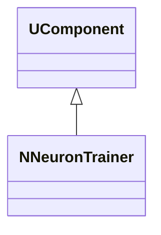
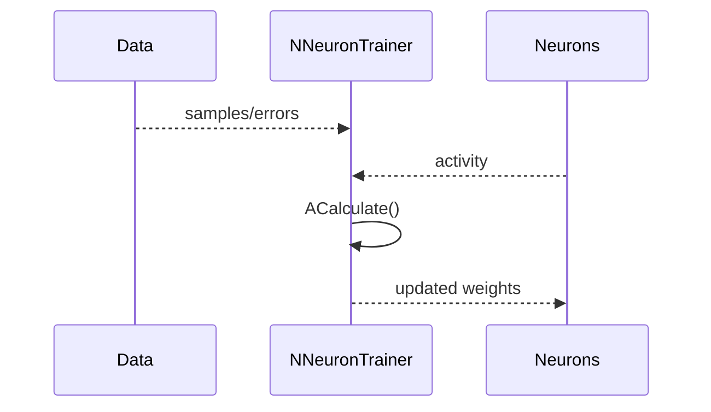
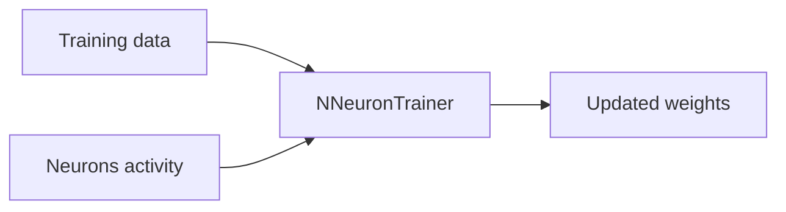
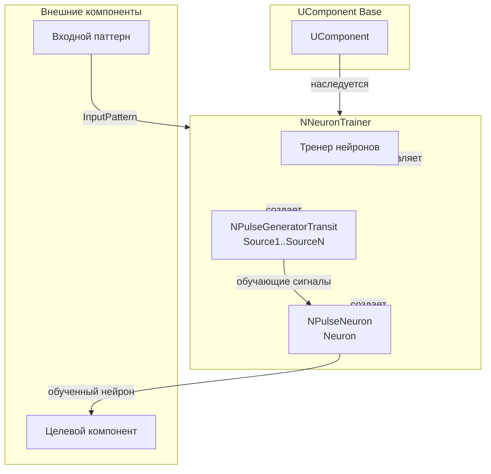
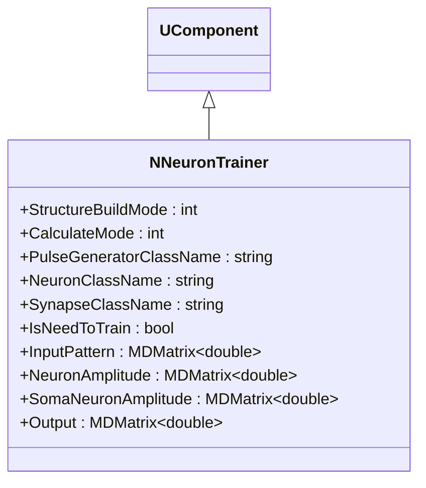
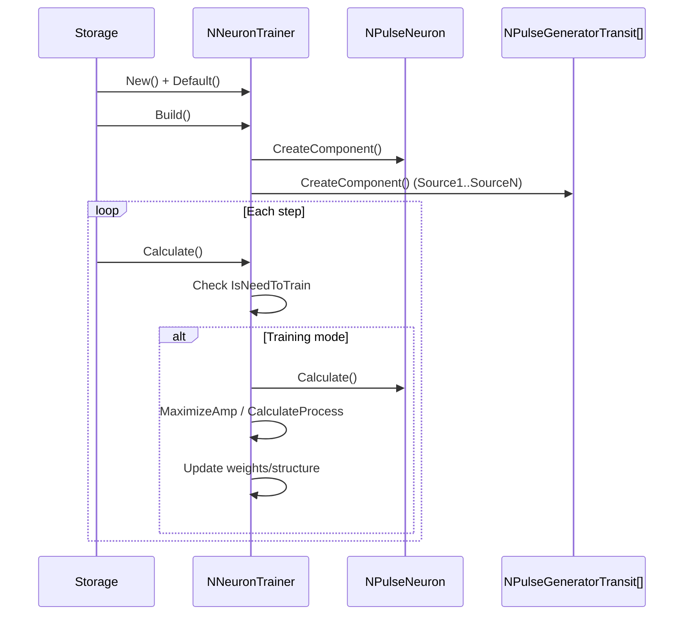
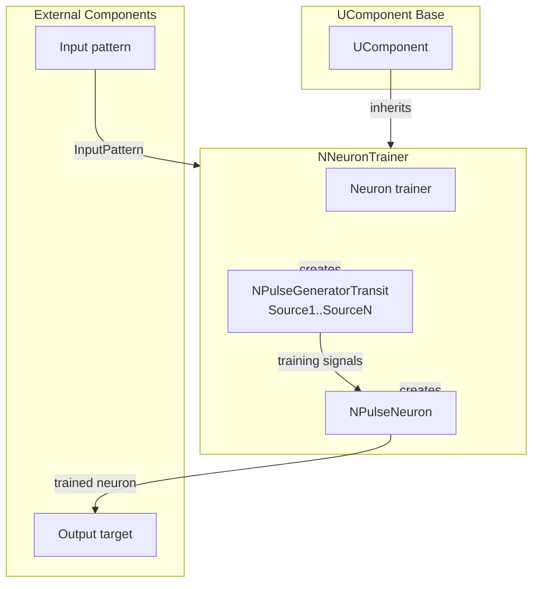

## NNeuronTrainer — тренер нейронов

**Класс**: `NNeuronTrainer` — обучает нейроны по заданному правилу/данным.
**Регистрация**: `NPulseLibrary.cpp` → `UploadClass("NNeuronTrainer", ...)`.
**Storage**: `ClassName = "NNeuronTrainer"`.

### Lifecycle
- **ADefault**: параметры обучения.
- **ABuild**: подключение целевых нейронов/данных.
- **AReset**: сброс состояния обучения.
- **ACalculate**: обновление нейронов по правилу.

### I/O
- Вход: данные/ошибки/активность нейронов.
- Выход: обновлённые веса/состояния (внутренне), метрики обучения.



Пояснение: диаграмма классов показывает место компонента в иерархии и ключевые связи.



Пояснение: диаграмма последовательности показывает типовой сценарий взаимодействия и порядок вызовов.



Пояснение: блок-схема показывает поток данных/сигналов (входы → компонент → выходы).

### UML-диаграмма состояний

```mermaid
stateDiagram-v2
    [*] --> Uninitialized: New()
    Uninitialized --> Defaulted: Default()
    Defaulted --> Building: Build()
    Building --> CheckMode{StructureBuildMode > 0?}
    CheckMode -->|Да| BuildStructure: BuildStructure()
    CheckMode -->|Нет| Built: Структура не пересобирается
    BuildStructure --> CreateNeuron: Создание Neuron
    CreateNeuron --> CreateGenerators: Создание генераторов Source1..SourceN
    CreateGenerators --> CreateLinks: Создание связей
    CreateLinks --> Built: Структура построена
    Built --> Ready: Ready = true
    Ready --> Calculating: Calculate()
    Calculating --> CheckTrain{IsNeedToTrain?}
    CheckTrain -->|Да| Training: Режим обучения
    CheckTrain -->|Нет| Ready: Обучение завершено
    Training --> CheckMode{CalculateMode?}
    CheckMode -->|0| MaximizeAmp: Максимизация амплитуды
    CheckMode -->|6| CalculateProcess: CalculateProcess()
    MaximizeAmp --> CheckNewDend{is_new_dend?}
    CheckNewDend -->|Да| SelectDendrite: Выбор следующего дендрита
    CheckNewDend -->|Нет| CheckNewIter{is_new_iteration?}
    CheckNewIter -->|Да| GrowDendrite: Наращивание дендрита
    CheckNewIter -->|Нет| MeasureAmp: Измерение амплитуды
    SelectDendrite --> MeasureAmp
    GrowDendrite --> MeasureAmp
    MeasureAmp --> CheckIterTime: Проверка времени итерации
    CheckIterTime --> CheckAmpIncrease: Проверка увеличения амплитуды
    CheckAmpIncrease -->|Да| GrowDendrite: Продолжить рост
    CheckAmpIncrease -->|Нет| SelectDendrite: Перейти к следующему дендриту
    CalculateProcess --> Ready: Шаг завершен
    Ready --> Resetting: Reset()
    Resetting --> Ready: Состояния сброшены
```

**Состояния:**
- **Uninitialized** — создан, но не инициализирован
- **Defaulted** — параметры установлены по умолчанию
- **Building** — выполняется сборка структуры
- **CheckMode** — проверка необходимости пересборки структуры
- **BuildStructure** — выполнение пересборки структуры
- **CreateNeuron** — создание нейрона для обучения
- **CreateGenerators** — создание генераторов импульсов
- **CreateLinks** — создание связей между генераторами и нейроном
- **Built** — структура тренера построена
- **Ready** — готов к выполнению расчетов
- **Calculating** — выполняется расчет тренера
- **Training** — режим обучения
- **MaximizeAmp** — максимизация амплитуды нейрона
- **CalculateProcess** — процесс расчета (режим 6)
- **CheckNewDend** — проверка необходимости нового дендрита
- **SelectDendrite** — выбор следующего дендрита для обучения
- **CheckNewIter** — проверка необходимости новой итерации
- **GrowDendrite** — наращивание длины дендрита
- **MeasureAmp** — измерение амплитуды нейрона
- **CheckIterTime** — проверка времени итерации
- **CheckAmpIncrease** — проверка увеличения амплитуды
- **Resetting** — выполняется сброс состояний

### UML-диаграмма компонентов



**Зависимости:**
- **Базовый класс**: `UComponent`
- **Внутренние компоненты**: нейрон (`NPulseNeuron`), генераторы импульсов (`NPulseGeneratorTransit`)
- **Внешние компоненты**: входной паттерн (источник `InputPattern`), целевой компонент (получатель обученного нейрона)

### Config snippet

```ini
[Component]
ClassName = NNeuronTrainer
Name = NeuronTrainer1
```

## Источники

См. [Literature-References.md](../Literature-References.md): **[A]**, **[B]**, **1**, **6**.

---

## NNeuronTrainer — neuron trainer (EN)

### Purpose

**Class**: `NNeuronTrainer` — trains neurons using provided training data/errors.
**Registration**: `NPulseLibrary.cpp` → `UploadClass("NNeuronTrainer", ...)`.
**Instances**: `ClassName = "NNeuronTrainer"` in configs.

`NNeuronTrainer` updates neurons using provided training data/errors and neuron activity. It supports various training modes including amplitude maximization and dendrite growth.

**Usage:** Training neurons with specific patterns, optimizing neuron responses

### UML Class Diagram



### UML Sequence Diagram



### UML State Diagram

```mermaid
stateDiagram-v2
    [*] --> Uninitialized: New()
    Uninitialized --> Defaulted: Default()
    Defaulted --> Building: Build()
    Building --> CheckMode{StructureBuildMode > 0?}
    CheckMode -->|Yes| BuildStructure: BuildStructure()
    CheckMode -->|No| Built: Structure not rebuilt
    BuildStructure --> CreateNeuron: Create neuron
    CreateNeuron --> CreateGenerators: Create generators
    CreateGenerators --> Built: Structure built
    Built --> Ready: Ready = true
    Ready --> Calculating: Calculate()
    Calculating --> CheckTrain{IsNeedToTrain?}
    CheckTrain -->|Yes| Training: Training mode
    CheckTrain -->|No| Ready: Training completed
    Training --> CheckMode{CalculateMode?}
    CheckMode -->|0| MaximizeAmp: Maximize amplitude
    CheckMode -->|6| CalculateProcess: CalculateProcess()
    MaximizeAmp --> CheckNewDend{is_new_dend?}
    CheckNewDend -->|Yes| SelectDendrite: Select next dendrite
    CheckNewDend -->|No| CheckNewIter{is_new_iteration?}
    CheckNewIter -->|Yes| GrowDendrite: Grow dendrite
    CheckNewIter -->|No| MeasureAmp: Measure amplitude
    SelectDendrite --> MeasureAmp
    GrowDendrite --> MeasureAmp
    MeasureAmp --> CheckAmpIncrease: Check amplitude increase
    CheckAmpIncrease -->|Yes| GrowDendrite: Continue growth
    CheckAmpIncrease -->|No| SelectDendrite: Next dendrite
    CalculateProcess --> Ready: Step completed
    Ready --> Resetting: Reset()
    Resetting --> Ready
```

### UML Activity Diagram


### UML Component Diagram



### Properties

- `StructureBuildMode` — режим пересборки структуры (0 — не пересобирать, 1 — пересобрать)
- `CalculateMode` — режим расчета (0 — максимизация амплитуды, 6 — CalculateProcess)
- `PulseGeneratorClassName` — имя класса генератора импульсов
- `NeuronClassName` — имя класса нейрона
- `SynapseClassName` — имя класса синапса
- `IsNeedToTrain` — необходимость обучения
- `InputPattern` — входной паттерн для обучения
- `NeuronAmplitude` — амплитуда нейрона
- `SomaNeuronAmplitude` — амплитуда сомы нейрона
- `Output` — выходной сигнал

### Methods

- `ADefault()` — установка параметров по умолчанию
- `ABuild()` — сборка структуры тренера
- `AReset()` — сброс состояния обучения
- `ACalculate()` — выполнение шага обучения

### Usage in configurations

`NNeuronTrainer` is used for training neurons with specific patterns:

- **Neuron training**: `Bin/Configs/*/Model_*.xml` (where neuron training is required)
- **Amplitude maximization**: experiments with optimizing neuron responses
- **Dendrite growth**: experiments with structural plasticity

### References

See [Literature-References.md](../Literature-References.md): **[A]**, **[B]**, **1**, **6**.
