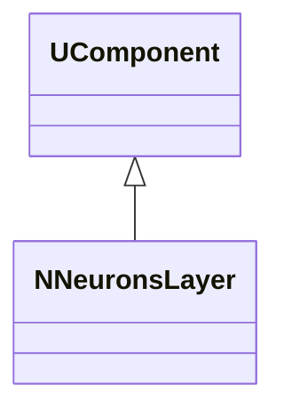
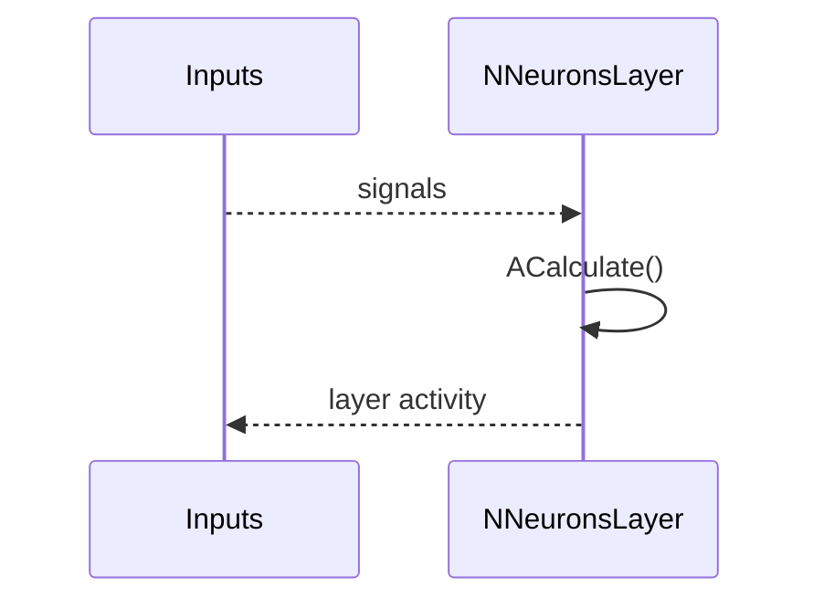
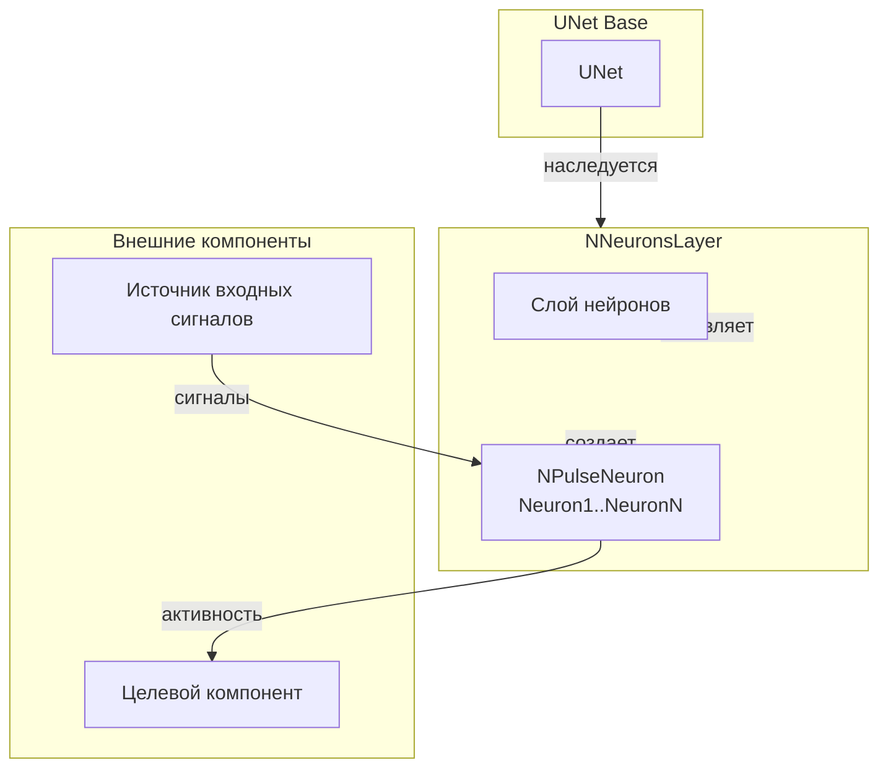
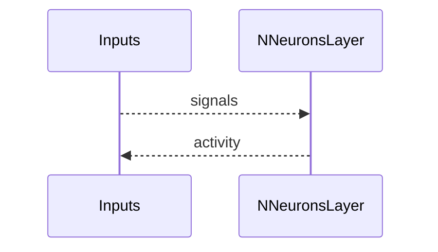
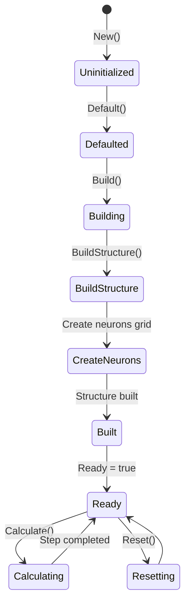
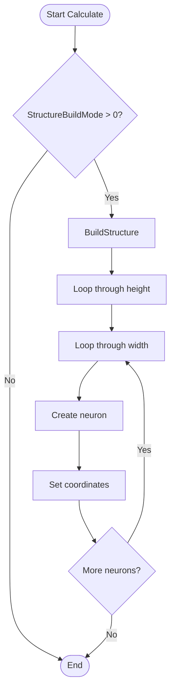
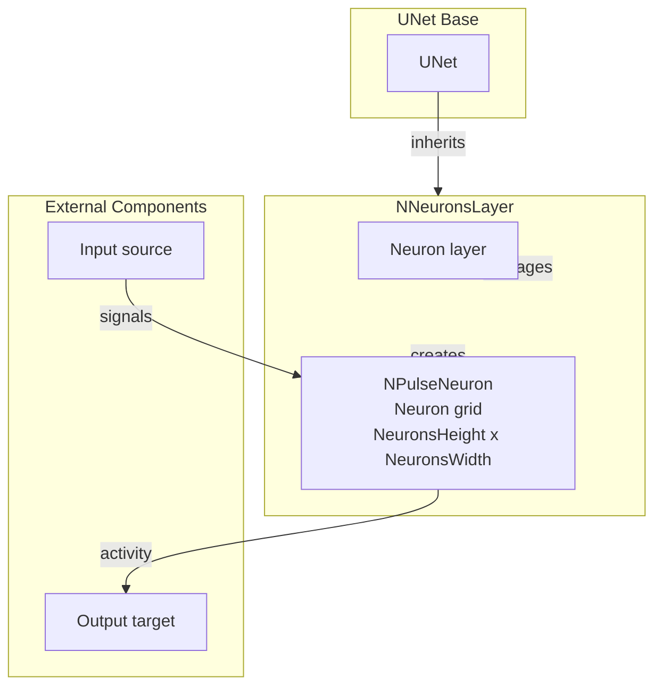

## RU

## NNeuronsLayer — слой нейронов (Nmsdk-PulseLib)

**Класс**: `NNeuronsLayer` — слой нейронов (базовая версия).
**Регистрация**: `NPulseLibrary.cpp` → `UploadClass("NNeuronsLayer", ...)`.
**Storage**: `ClassName = "NNeuronsLayer"`.

### Lifecycle
- **ADefault**: параметры слоя (размер, тип нейронов).
- **ABuild**: создание/подключение нейронов.
- **AReset**: сброс состояний слоя.
- **ACalculate**: шаг обновления всех нейронов слоя.

### I/O
- Вход: входные сигналы слоя.
- Выход: активности/спайки слоя.



Пояснение: диаграмма классов показывает место компонента в иерархии и ключевые связи.



Пояснение: диаграмма последовательности показывает типовой сценарий взаимодействия и порядок вызовов.


Пояснение: блок-схема показывает поток данных/сигналов (входы → компонент → выходы).

### UML-диаграмма состояний

```mermaid
stateDiagram-v2
    [*] --> Uninitialized: New()
    Uninitialized --> Defaulted: Default()
    Defaulted --> Building: Build()
    Building --> CheckMode{StructureBuildMode > 0?}
    CheckMode -->|Да| BuildStructure: BuildStructure()
    CheckMode -->|Нет| Built: Структура не пересобирается
    BuildStructure --> DeleteOld: Удаление старых нейронов
    DeleteOld --> LoopHeight: Цикл по высоте i = 0..NeuronsHeight-1
    LoopHeight --> LoopWidth: Цикл по ширине j = 0..NeuronsWidth-1
    LoopWidth --> CreateNeuron: Создание Neuron(i*NeuronsWidth+j+1)
    CreateNeuron --> SetCoord: SetCoord(8.7+j*7, 1.67+i*2, 0)
    SetCoord --> CheckMoreWidth: Есть еще столбцы?
    CheckMoreWidth -->|Да| LoopWidth
    CheckMoreWidth -->|Нет| CheckMoreHeight: Есть еще строки?
    CheckMoreHeight -->|Да| LoopHeight
    CheckMoreHeight -->|Нет| Built: Структура создана
    Built --> Ready: Ready = true
    Ready --> Calculating: Calculate()
    Calculating --> Ready: Шаг завершен (ACalculate пустой)
    Ready --> Resetting: Reset()
    Resetting --> Ready: Состояния сброшены
```

**Состояния:**
- **Uninitialized** — создан, но не инициализирован
- **Defaulted** — параметры установлены по умолчанию (`NeuronsClassName="NSPNeuron"`, `NeuronsHeight=1`, `NeuronsWidth=1`)
- **Building** — выполняется сборка структуры
- **CheckMode** — проверка необходимости пересборки структуры
- **BuildStructure** — выполнение пересборки структуры
- **DeleteOld** — удаление старых нейронов
- **LoopHeight** — цикл по высоте слоя
- **LoopWidth** — цикл по ширине слоя
- **CreateNeuron** — создание нейрона
- **SetCoord** — установка координат нейрона
- **CheckMoreWidth** — проверка наличия еще столбцов
- **CheckMoreHeight** — проверка наличия еще строк
- **Built** — структура слоя построена
- **Ready** — готов к выполнению расчетов
- **Calculating** — выполняется расчет слоя (пустой метод)
- **Resetting** — выполняется сброс состояний

### UML-диаграмма компонентов



**Зависимости:**
- **Базовый класс**: `UNet`
- **Внутренние компоненты**: нейроны (`NPulseNeuron`, создаются автоматически в сетке `NeuronsHeight x NeuronsWidth`)
- **Внешние компоненты**: источник входных сигналов (источник данных), целевой компонент (получатель активности слоя)

### Config snippet

```ini
[Component]
ClassName = NNeuronsLayer
Name = Layer1
```

## Источники

См. [Literature-References.md](../Literature-References.md): **[A]**, **4**, **17**.

---

## EN

## NNeuronsLayer — neurons layer (EN)

Neuron layer that updates all contained neurons.


Description: this class diagram shows the component position in the type hierarchy and key relations.



Description: this sequence diagram shows a typical runtime interaction and call order.


Description: this flowchart shows the data/signal flow (inputs → component → outputs).

### UML State Diagram



### UML Activity Diagram



### UML Component Diagram



### Properties

- `StructureBuildMode` — режим пересборки структуры (0 — не пересобирать, 1 — пересобрать)
- `NeuronsClassName` — имя класса нейронов (по умолчанию "NSPNeuron")
- `NeuronsHeight` — высота слоя (количество строк)
- `NeuronsWidth` — ширина слоя (количество столбцов)

### Methods

- `SetStructureBuildMode(value)` — установка режима пересборки структуры
- `SetNeuronsClassName(value)` — установка имени класса нейронов
- `SetNeuronsHeight(value)` — установка высоты слоя
- `SetNeuronsWidth(value)` — установка ширины слоя
- `ADefault()` — установка параметров по умолчанию
- `ABuild()` — сборка структуры слоя
- `ACalculate()` — выполнение шага расчета (пустой метод)
- `BuildStructure()` — построение сетки нейронов

### Usage in configurations

`NNeuronsLayer` is used for creating layers of neurons:

- **Neuron layers**: `Bin/Configs/*/Model_*.xml` (where neuron layers are required)
- **Multi-layer networks**: experiments with multi-layer spiking neural networks
- **Pattern classification**: creating layers for pattern classification

**Features:**
- Automatic structure building: creates neurons in a grid (Height × Width)
- Flexible configuration: supports various neuron types
- Coordinate management: automatically sets neuron coordinates

**Typical parameter values:**
- **NeuronsClassName**: "NSPNeuron" (small pulse neuron)
- **NeuronsHeight**: 1-10 (number of rows)
- **NeuronsWidth**: 1-20 (number of columns)

### References

See [Literature-References.md](../Literature-References.md): **[A]**, **4**, **17**.
