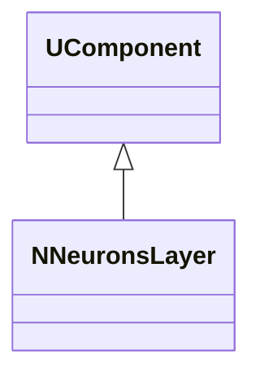
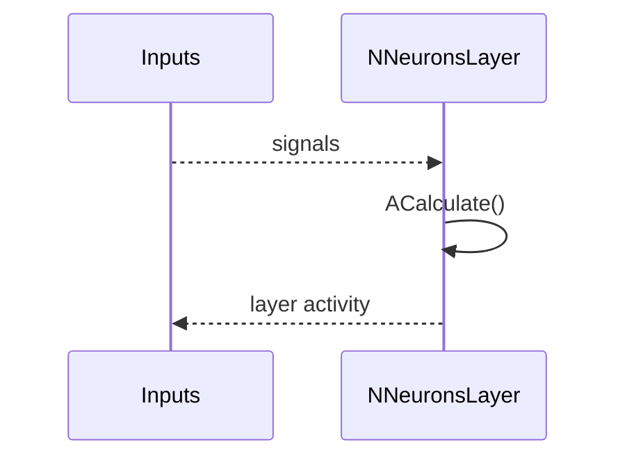
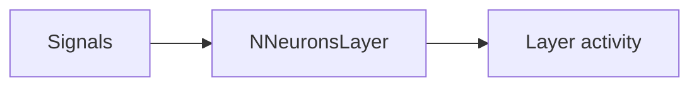
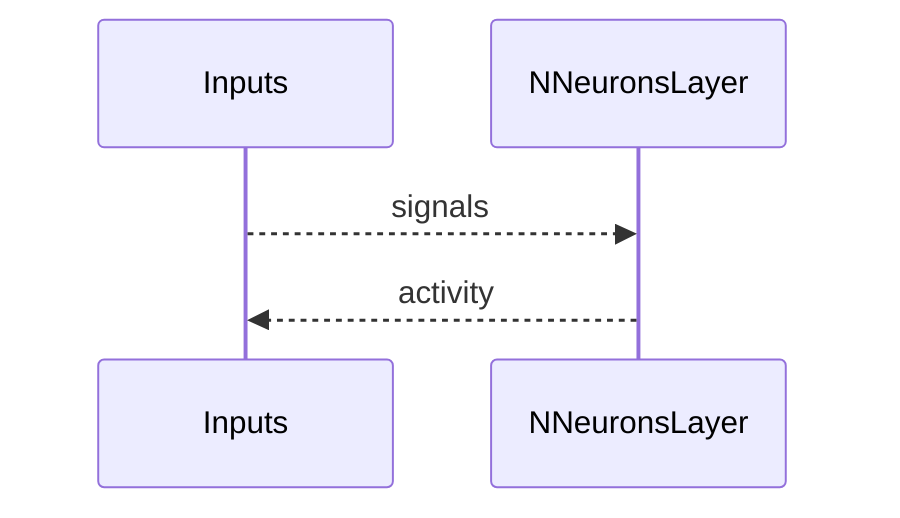

## NNeuronsLayer — слой нейронов (Nmsdk-PulseLib)

**Класс**: `NNeuronsLayer` — слой нейронов (базовая версия).  
**Регистрация**: `NPulseLibrary.cpp` → `UploadClass("NNeuronsLayer", ...)`.  
**Storage**: `ClassName = "NNeuronsLayer"`.

### Lifecycle
- **ADefault**: параметры слоя (размер, тип нейронов).
- **ABuild**: создание/подключение нейронов.
- **AReset**: сброс состояний слоя.
- **ACalculate**: шаг обновления всех нейронов слоя.

### I/O
- Вход: входные сигналы слоя.
- Выход: активности/спайки слоя.



Пояснение: диаграмма классов показывает место компонента в иерархии и ключевые связи.



Пояснение: диаграмма последовательности показывает типовой сценарий взаимодействия и порядок вызовов.



Пояснение: блок-схема показывает поток данных/сигналов (входы → компонент → выходы).

### Config snippet

```ini
[Component]
ClassName = NNeuronsLayer
Name = Layer1
```

---

## NNeuronsLayer — neurons layer (EN)

Neuron layer that updates all contained neurons.


Description: this class diagram shows the component position in the type hierarchy and key relations.



Description: this sequence diagram shows a typical runtime interaction and call order.


Description: this flowchart shows the data/signal flow (inputs → component → outputs).
