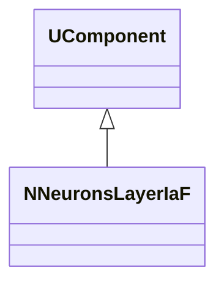
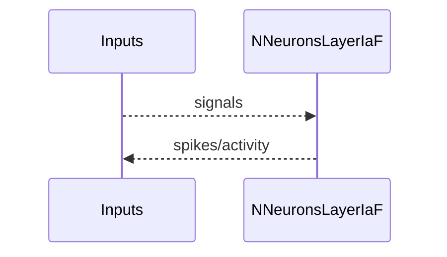
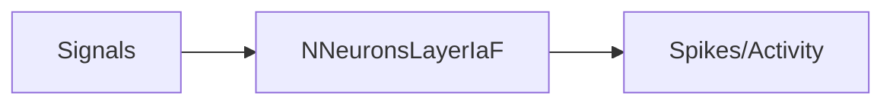

## NNeuronsLayerIaF — слой нейронов IaF

**Класс**: `NNeuronsLayerIaF` — слой integrate-and-fire нейронов.  
**Регистрация**: `NPulseLibrary.cpp` → `UploadClass("NNeuronsLayerIaF", ...)`.  
**Storage**: `ClassName = "NNeuronsLayerIaF"`.

### Lifecycle
- **ADefault**: параметры слоя IaF.
- **ABuild**: создание и подключение нейронов IaF.
- **AReset**: сброс состояний.
- **ACalculate**: шаг обновления всех нейронов слоя.

### I/O
- Вход: сигналы/токи.
- Выход: спайки/активность слоя.



Пояснение: диаграмма классов показывает место компонента в иерархии и ключевые связи.



Пояснение: диаграмма последовательности показывает типовой сценарий взаимодействия и порядок вызовов.



Пояснение: блок-схема показывает поток данных/сигналов (входы → компонент → выходы).

### Config snippet

```ini
[Component]
ClassName = NNeuronsLayerIaF
Name = LayerIaF1
```

---

## NNeuronsLayerIaF — IaF neuron layer (EN)

Layer of integrate-and-fire neurons.


Description: this class diagram shows the component position in the type hierarchy and key relations.


Description: this sequence diagram shows a typical runtime interaction and call order.


Description: this flowchart shows the data/signal flow (inputs → component → outputs).
