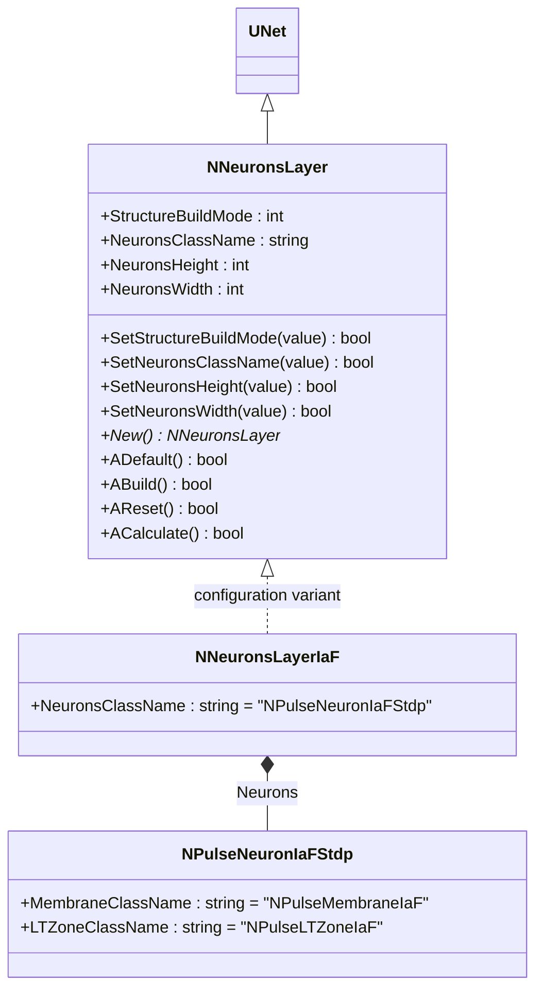
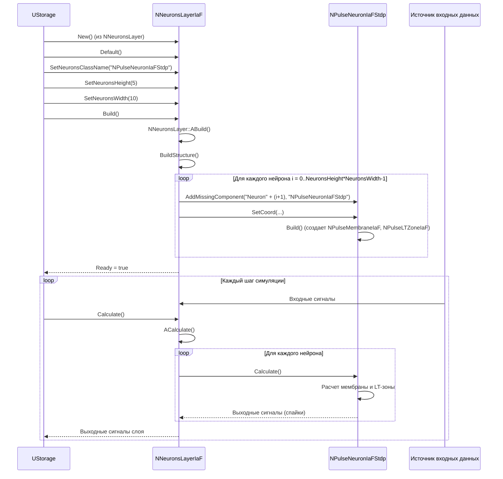
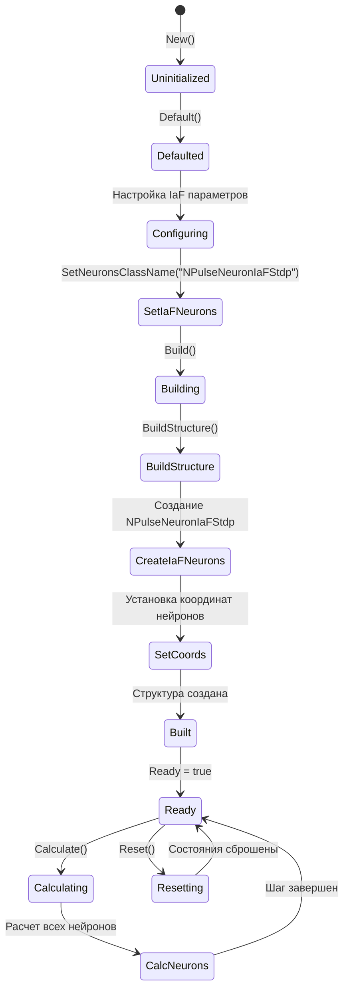
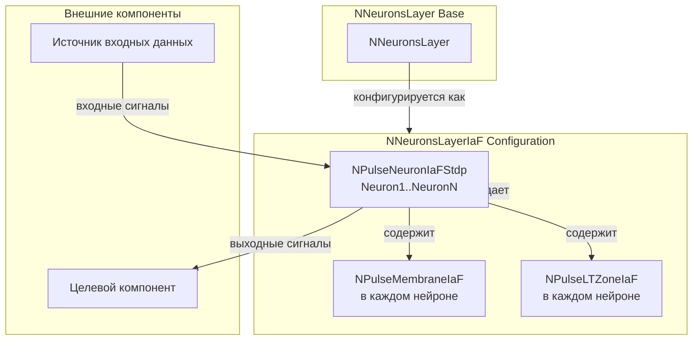
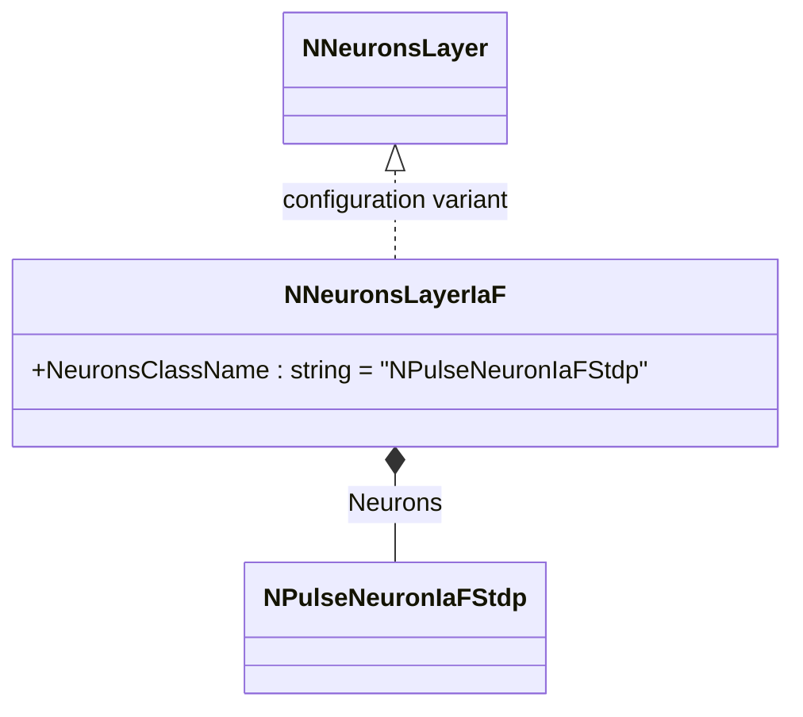
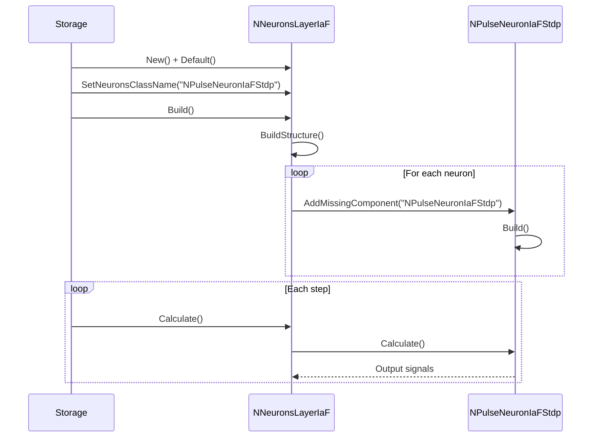
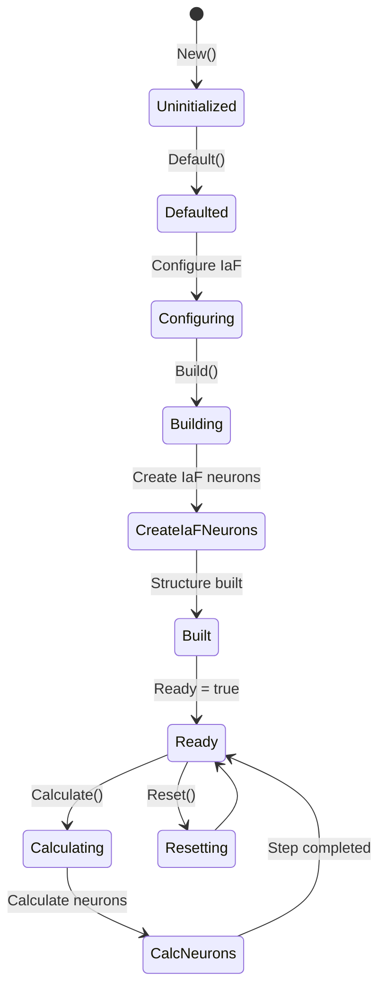
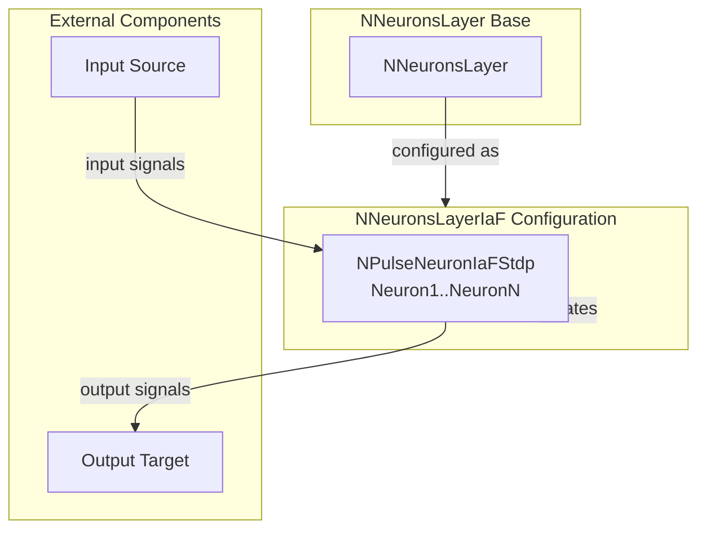

# NNeuronsLayerIaF — слой нейронов модели IaF

## RU

### Назначение

**Класс**: `NNeuronsLayerIaF` — конфигурационный вариант слоя нейронов с нейронами модели Integrate-and-Fire (IaF).  
**Регистрация**: `NPulseLibrary.cpp` → `UploadClass("NNeuronsLayerIaF", ...)`.  
**Storage-инстансы**: `ClassName = "NNeuronsLayerIaF"` в `Bin/Configs/*/Model_*.xml`.

`NNeuronsLayerIaF` является конфигурационным вариантом класса `NNeuronsLayer` с параметрами для модели IaF. При создании компонента с `ClassName = "NNeuronsLayerIaF"` создается экземпляр `NNeuronsLayer` с параметром:
- `NeuronsClassName = "NPulseNeuronIaFStdp"` — нейроны модели IaF с поддержкой STDP

**Использование:** Создание слоев нейронов модели IaF для многослойных импульсных нейронных сетей, классификация паттернов с использованием модели IaF

### UML-диаграмма классов



**Иерархия наследования:**
- `UNet` — базовая сеть Rdk Framework
- `NNeuronsLayer` — базовый слой нейронов
- `NNeuronsLayerIaF` — конфигурационный вариант для модели IaF

**Внутренняя структура:**
- **Neurons** (`NPulseNeuronIaFStdp`) — нейроны модели IaF с поддержкой STDP, создаются автоматически в сетке `NeuronsHeight × NeuronsWidth`

### UML-диаграмма последовательности



**Жизненный цикл:**
1. **Создание**: `NNeuronsLayerIaF` создается из `NNeuronsLayer` с настройкой параметров
2. **Настройка**: Устанавливается `NeuronsClassName = "NPulseNeuronIaFStdp"`
3. **Сборка**: Автоматически создаются нейроны `NPulseNeuronIaFStdp` в сетке заданного размера
4. **Расчет**: На каждом шаге рассчитываются все нейроны слоя, сигналы передаются на выход

### UML-диаграмма состояний



**Состояния:**
- **Uninitialized** — создан, но не инициализирован
- **Defaulted** — параметры установлены по умолчанию
- **Configuring** — настройка параметров для IaF
- **SetIaFNeurons** — установка имени класса нейронов IaF
- **Building** — выполняется сборка структуры
- **BuildStructure** — выполнение пересборки структуры
- **CreateIaFNeurons** — создание нейронов IaF
- **SetCoords** — установка координат нейронов
- **Built** — структура слоя построена
- **Ready** — готов к выполнению расчетов
- **Calculating** — выполняется расчет слоя
- **CalcNeurons** — расчет всех нейронов слоя
- **Resetting** — выполняется сброс состояний

### UML-диаграмма активности

```mermaid
flowchart TD
    Start([Start Build]) --> SetIaFClass[SetNeuronsClassName = "NPulseNeuronIaFStdp"]
    SetIaFClass --> BuildStructure[NNeuronsLayer::BuildStructure]
    BuildStructure --> LoopHeight[Цикл по высоте i = 0..NeuronsHeight-1]
    LoopHeight --> LoopWidth[Цикл по ширине j = 0..NeuronsWidth-1]
    LoopWidth --> CreateNeuron[Создание NPulseNeuronIaFStdp]
    CreateNeuron --> SetCoord[SetCoord(8.7+j*7, 1.67+i*2, 0)]
    SetCoord --> BuildNeuron[Build() нейрона]
    BuildNeuron --> CheckMoreWidth{Есть еще столбцы?}
    CheckMoreWidth -->|Да| LoopWidth
    CheckMoreWidth -->|Нет| CheckMoreHeight{Есть еще строки?}
    CheckMoreHeight -->|Да| LoopHeight
    CheckMoreHeight -->|Нет| End([End])
```

**Алгоритм сборки:**
1. Установка `NeuronsClassName = "NPulseNeuronIaFStdp"`
2. Вызов `BuildStructure()` базового класса
3. Создание нейронов `NPulseNeuronIaFStdp` в сетке `NeuronsHeight × NeuronsWidth`
4. Каждый нейрон автоматически создает мембрану `NPulseMembraneIaF` и LT-зону `NPulseLTZoneIaF`

### UML-диаграмма компонентов



**Зависимости:**
- **Базовый класс**: `NNeuronsLayer` (конфигурационный вариант)
- **Внутренние компоненты**: `NPulseNeuronIaFStdp` (нейроны в слое), `NPulseMembraneIaF` (мембраны), `NPulseLTZoneIaF` (LT-зоны)
- **Внешние компоненты**: источник входных данных (для нейронов), целевой компонент (получатель выходных сигналов)

### Свойства

`NNeuronsLayerIaF` использует все свойства базового класса `NNeuronsLayer` с параметром:
- `NeuronsClassName = "NPulseNeuronIaFStdp"` — нейроны модели IaF с поддержкой STDP

**Наследуемые свойства от NNeuronsLayer:**
- `StructureBuildMode` (int) — режим сборки структуры (0 — не пересобирать, 1 — пересобрать)
- `NeuronsHeight` (int) — высота сетки нейронов
- `NeuronsWidth` (int) — ширина сетки нейронов

### Методы

`NNeuronsLayerIaF` использует все методы базового класса `NNeuronsLayer`.

### Примеры использования

#### Пример 1: Создание слоя IaF в коде C++

```cpp
// Создание слоя нейронов IaF
auto layer = storage->CreateComponent("NNeuronsLayerIaF");
layer->SetName("LayerIaF");

// Инициализация (использует параметры по умолчанию с NeuronsClassName="NPulseNeuronIaFStdp")
layer->Default();

// Настройка параметров
layer->StructureBuildMode = 1;  // Автоматическая пересборка
layer->NeuronsHeight = 5;        // 5 строк
layer->NeuronsWidth = 10;        // 10 столбцов

// Сборка (автоматически создает 50 нейронов NPulseNeuronIaFStdp)
layer->Build();

// Использование
for (int step = 0; step < 1000; step++) {
    layer->Calculate();
    // Выходные сигналы доступны через нейроны слоя
}
```

#### Пример 2: Конфигурация XML

```xml
<LayerIaF1 Class="NNeuronsLayerIaF">
    <Parameters>
        <StructureBuildMode>1</StructureBuildMode>
        <NeuronsHeight>5</NeuronsHeight>
        <NeuronsWidth>10</NeuronsWidth>
    </Parameters>
</LayerIaF1>
```

### Использование в конфигурациях

`NNeuronsLayerIaF` используется в экспериментах с многослойными импульсными нейронными сетями на основе модели IaF:

- **Классификация с IaF**: `Bin/Configs/!OldConfigs/*/Model_*.xml` (где требуется использование IaF-нейронов)
- **Обучение нейросетей**: эксперименты с обучением многослойных сетей с STDP

**Типичные значения параметров:**
- **NeuronsClassName**: автоматически устанавливается в "NPulseNeuronIaFStdp"
- **StructureBuildMode**: 1 (автоматическая пересборка структуры)
- **NeuronsHeight**: 1-100 (высота сетки нейронов)
- **NeuronsWidth**: 1-100 (ширина сетки нейронов)

**Особенности:**
- Автоматическое использование IaF-нейронов: все нейроны в слое имеют тип `NPulseNeuronIaFStdp`
- Поддержка STDP: нейроны поддерживают обучение по правилу STDP
- Простота настройки: достаточно указать `ClassName = "NNeuronsLayerIaF"`, и компонент автоматически использует IaF-модель

### См. также

- [`NNeuronsLayer`](NNeuronsLayer.md) — базовый слой нейронов (базовый класс)
- [`NPulseNeuronIaFStdp`](NPulseNeuronIaFStdp.md) — нейрон модели IaF с STDP
- [`NPulseNeuronIaF`](NPulseNeuronIaF.md) — нейрон модели IaF
- [`NPulseMembraneIaF`](NPulseMembraneIaF.md) — мембрана модели IaF
- [`NPulseLTZoneIaF`](NPulseLTZoneIaF.md) — LT-зона модели IaF
- [Architecture.md](../Architecture.md) — архитектура библиотеки

---

## EN

### Purpose

**Class**: `NNeuronsLayerIaF` — configuration variant of neuron layer with Integrate-and-Fire (IaF) model neurons.  
**Registration**: `NPulseLibrary.cpp` → `UploadClass("NNeuronsLayerIaF", ...)`.  
**Instances**: `ClassName = "NNeuronsLayerIaF"` in `Bin/Configs/*/Model_*.xml`.

`NNeuronsLayerIaF` is a configuration variant of `NNeuronsLayer` class with parameters for IaF model. When creating a component with `ClassName = "NNeuronsLayerIaF"`, an instance of `NNeuronsLayer` is created with parameter:
- `NeuronsClassName = "NPulseNeuronIaFStdp"` — IaF model neurons with STDP support

**Usage:** Creating IaF model neuron layers for multi-layer spiking neural networks, pattern classification using IaF model

### UML Class Diagram



### UML Sequence Diagram



### UML State Diagram



### UML Activity Diagram

```mermaid
flowchart TD
    Start([Start Build]) --> SetIaFClass[Set NeuronsClassName = "NPulseNeuronIaFStdp"]
    SetIaFClass --> BuildStructure[BuildStructure]
    BuildStructure --> LoopNeurons[Loop through neurons]
    LoopNeurons --> CreateNeuron[Create NPulseNeuronIaFStdp]
    CreateNeuron --> SetCoord[Set coordinates]
    SetCoord --> BuildNeuron[Build neuron]
    BuildNeuron --> CheckMore{More neurons?}
    CheckMore -->|Yes| LoopNeurons
    CheckMore -->|No| End([End])
```

### UML Component Diagram



### Properties

`NNeuronsLayerIaF` uses all properties of base class `NNeuronsLayer` with parameter:
- `NeuronsClassName = "NPulseNeuronIaFStdp"` — IaF model neurons with STDP support

### Methods

`NNeuronsLayerIaF` uses all methods of base class `NNeuronsLayer`.

### Usage in configurations

`NNeuronsLayerIaF` is used in multi-layer spiking neural network experiments with IaF model:

- **Classification with IaF**: `Bin/Configs/!OldConfigs/*/Model_*.xml`
- **Neural network training**: experiments with multi-layer network training with STDP

**Typical parameter values:**
- **NeuronsClassName**: automatically set to "NPulseNeuronIaFStdp"
- **StructureBuildMode**: 1 (automatic structure rebuild)
- **NeuronsHeight**: 1-100 (neuron grid height)
- **NeuronsWidth**: 1-100 (neuron grid width)

### See Also

- [`NNeuronsLayer`](NNeuronsLayer.md) — neuron layer (base class)
- [`NPulseNeuronIaFStdp`](NPulseNeuronIaFStdp.md) — IaF model neuron with STDP
- [`NPulseNeuronIaF`](NPulseNeuronIaF.md) — IaF model neuron
- [Architecture.md](../Architecture.md) — library architecture
