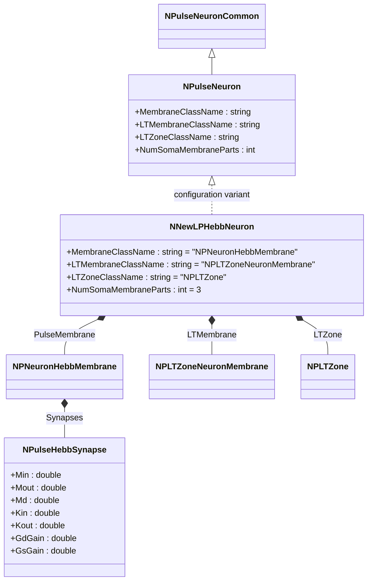
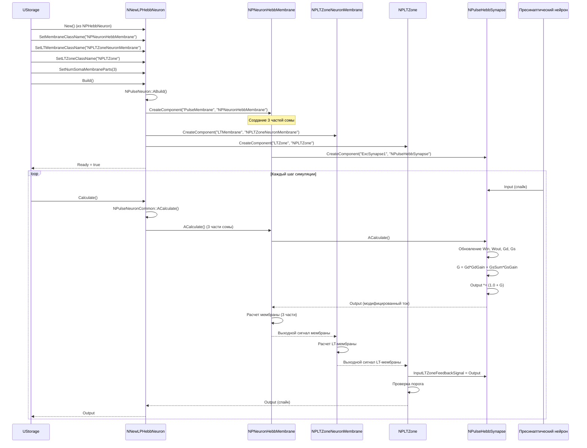
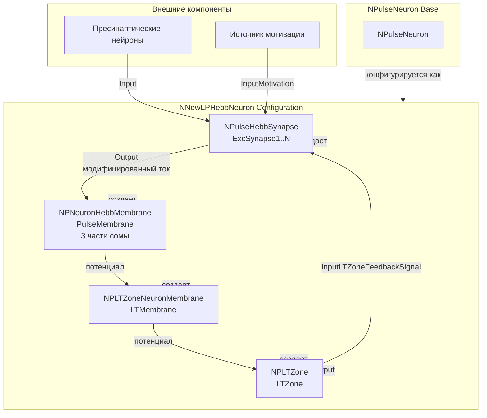
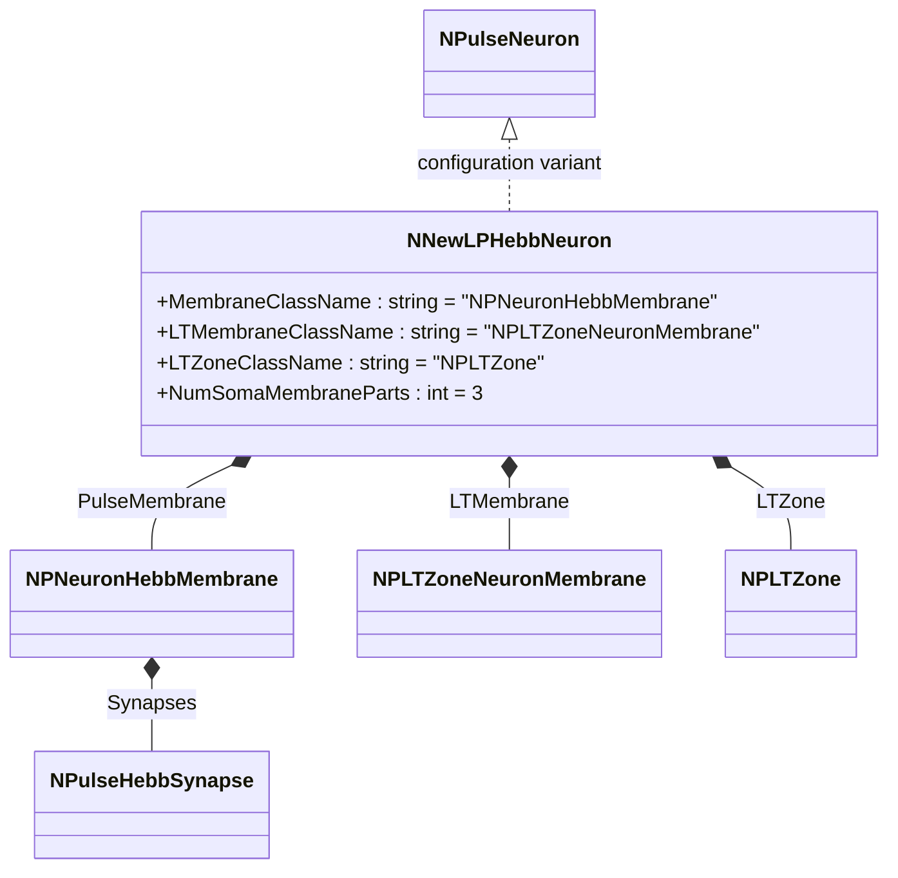
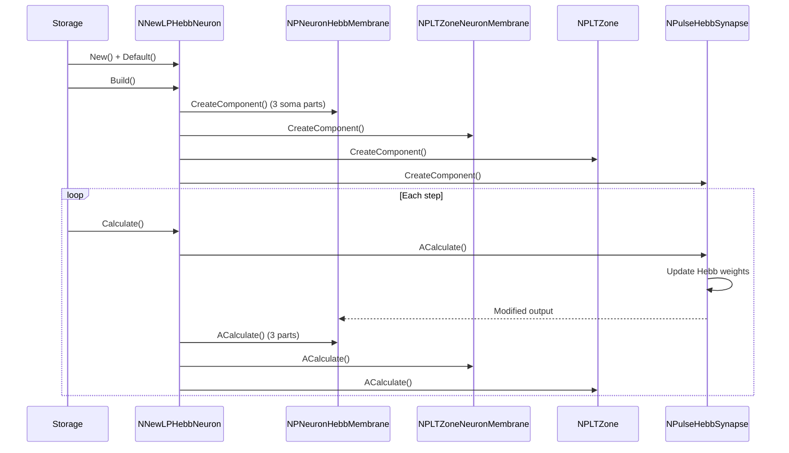
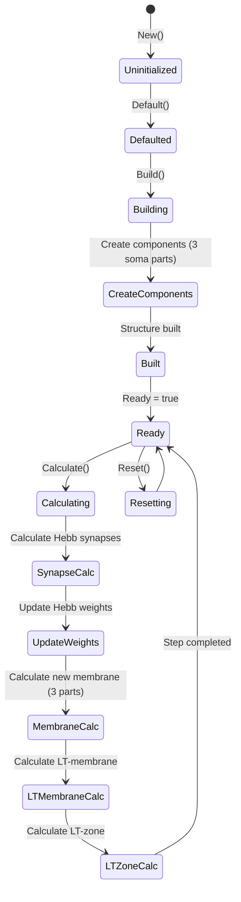
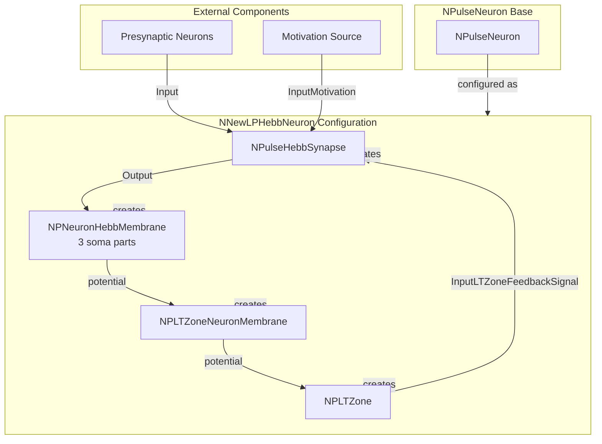

# NNewLPHebbNeuron — новый крупный импульсный нейрон с синапсами Хебба

## RU

### Назначение

**Класс**: `NNewLPHebbNeuron` — конфигурационный вариант нового крупного импульсного нейрона с синапсами Хебба и улучшенной архитектурой.  
**Аббревиатура**: `Hebb` — **Hebb**ian (геббовская пластичность, обучение по правилу Хебба).  
**Регистрация**: `NPulseLibrary.cpp` → `UploadClass("NNewLPHebbNeuron", ...)`.  
**Storage-инстансы**: `ClassName = "NNewLPHebbNeuron"` в `Bin/Configs/*/Model_*.xml`.

`NNewLPHebbNeuron` является конфигурационным вариантом базового класса `NPulseNeuron` с мембраной, поддерживающей синапсы Хебба, и новой архитектурой. Создается из `NPHebbNeuron` с настройками:
- `NumSomaMembraneParts = 3` — три части сомы
- `MembraneClassName = "NPNeuronHebbMembrane"` — мембрана с поддержкой синапсов Хебба
- `LTMembraneClassName = "NPLTZoneNeuronMembrane"` — новая LT-мембрана нейрона
- `LTZoneClassName = "NPLTZone"` — стандартная LT-зона

Комбинирует возможности новой архитектуры (улучшенные мембраны) и обучения Хебба (пластичность синапсов) для крупных нейронов.

**Использование:** Эксперименты с новыми крупными нейронами и обучением Хебба

### UML-диаграмма классов



**Иерархия наследования:**
- `NPulseNeuronCommon` — общий импульсный нейрон
- `NPulseNeuron` — импульсный нейрон с параметрами структурирования
- `NNewLPHebbNeuron` — конфигурационный вариант с новой архитектурой и синапсами Хебба

**Внутренняя структура:**
- **PulseMembrane** (`NPNeuronHebbMembrane`) — мембрана с поддержкой синапсов Хебба (3 части сомы)
- **LTMembrane** (`NPLTZoneNeuronMembrane`) — новая LT-мембрана нейрона
- **LTZone** (`NPLTZone`) — стандартная LT-зона
- **Synapses** (`NPulseHebbSynapse[]`) — синапсы Хебба

### UML-диаграмма последовательности



**Жизненный цикл:**
1. **Создание**: `NNewLPHebbNeuron` создается из `NPHebbNeuron` с настройкой параметров
2. **Настройка**: Устанавливается новая архитектура мембраны и LT-зоны, мембрана с поддержкой Хебба, три части сомы
3. **Сборка**: Автоматически создается структура нейрона с новой мембраной (3 части), LT-мембраной, LT-зоной и синапсами Хебба
4. **Расчет**: На каждом шаге рассчитываются синапсы Хебба (обновление весов), новая мембрана (3 части), LT-мембрана и LT-зона

### UML-диаграмма состояний

```mermaid
stateDiagram-v2
    [*] --> Uninitialized: New()
    Uninitialized --> Defaulted: Default()
    Defaulted --> Configuring: Настройка New + Hebb архитектуры
    Configuring --> SetNewHebbParams: SetMembraneClassName("NPNeuronHebbMembrane")<br/>SetLTMembraneClassName("NPLTZoneNeuronMembrane")<br/>SetNumSomaMembraneParts(3)
    SetNewHebbParams --> Building: Build()
    Building --> BuildBase: NPulseNeuron::ABuild()
    BuildBase --> CreateMembrane: Создание NPNeuronHebbMembrane (3 части)
    CreateMembrane --> CreateLTMembrane: Создание NPLTZoneNeuronMembrane
    CreateLTMembrane --> CreateLTZone: Создание NPLTZone
    CreateLTZone --> CreateSynapses: Создание NPulseHebbSynapse
    CreateSynapses --> Built: Структура создана
    Built --> Ready: Ready = true
    Ready --> Calculating: Calculate()
    Calculating --> SynapseCalc: Расчет синапсов Хебба
    SynapseCalc --> UpdateHebbWeights: Обновление весов Хебба
    UpdateHebbWeights --> MembraneCalc: Расчет новой мембраны (3 части)
    MembraneCalc --> LTMembraneCalc: Расчет LT-мембраны
    LTMembraneCalc --> LTZoneCalc: Расчет LT-зоны
    LTZoneCalc --> Ready: Шаг завершен
    Ready --> Resetting: Reset()
    Resetting --> Ready: Состояния сброшены
```

**Состояния:**
- **Uninitialized** — создан, но не инициализирован
- **Defaulted** — параметры установлены по умолчанию
- **Configuring** — настройка параметров для новой архитектуры и Хебба
- **SetNewHebbParams** — установка параметров (мембрана с поддержкой Хебба, новая LT-мембрана, три части сомы)
- **Building** — выполняется сборка структуры
- **BuildBase** — сборка базовой структуры нейрона
- **CreateMembrane** — создание мембраны с тремя частями сомы
- **CreateLTMembrane** — создание LT-мембраны
- **CreateLTZone** — создание LT-зоны
- **CreateSynapses** — создание синапсов Хебба
- **Built** — структура нейрона построена
- **Ready** — готов к выполнению расчетов
- **Calculating** — выполняется расчет нейрона
- **SynapseCalc** — расчет синапсов Хебба
- **UpdateHebbWeights** — обновление весов по правилу Хебба
- **MembraneCalc** — расчет новой мембраны (три части сомы)
- **LTMembraneCalc** — расчет LT-мембраны
- **LTZoneCalc** — расчет LT-зоны
- **Resetting** — выполняется сброс состояний

### UML-диаграмма активности

```mermaid
flowchart TD
    Start([Start Calculate]) --> CallBase[NPulseNeuronCommon::ACalculate]
    CallBase --> LoopSynapses[Цикл по синапсам]
    LoopSynapses --> CalcSynapse[Расчет NPulseHebbSynapse]
    CalcSynapse --> UpdateWin[Win += Kin*input - Min*Win]
    UpdateWin --> UpdateWout[Wout += Kout*ltzoneoutput - Mout*Wout]
    UpdateWout --> UpdateGd[Gd += Win*Wout - Md*Gd]
    UpdateGd --> UpdateGs[Gs[i] += motivation[i]*Gd - Ms[i]*Gs[i]]
    UpdateGs --> CalcG[G = Gd*GdGain + GsSum*GsGain]
    CalcG --> ModifyOutput[Output *= 1.0 + G]
    ModifyOutput --> CheckMoreSynapses{Есть еще синапсы?}
    CheckMoreSynapses -->|Да| LoopSynapses
    CheckMoreSynapses -->|Нет| CalcMembrane[Расчет новой мембраны (3 части сомы)]
    CalcMembrane --> CalcLTMembrane[Расчет LT-мембраны]
    CalcLTMembrane --> CalcLTZone[Расчет LT-зоны]
    CalcLTZone --> End([End])
```

**Алгоритм расчета:**
1. Вызов базового расчета нейрона
2. Для каждого синапса Хебба:
   - Обновление пресинаптической активности (`Win`)
   - Обновление постсинаптической активности (`Wout`)
   - Обновление корреляции (`Gd`)
   - Обновление мотивационных компонентов (`Gs`)
   - Вычисление общего влияния (`G`)
   - Модификация выходного тока (`Output *= 1.0 + G`)
3. Расчет новой мембраны с тремя частями сомы и модифицированными токами
4. Расчет LT-мембраны
5. Расчет LT-зоны

### UML-диаграмма компонентов



**Зависимости:**
- **Базовый класс**: `NPulseNeuron` (конфигурационный вариант)
- **Внутренние компоненты**: `NPNeuronHebbMembrane` (мембрана с 3 частями сомы), `NPLTZoneNeuronMembrane` (LT-мембрана), `NPLTZone` (LT-зона), `NPulseHebbSynapse` (синапсы)
- **Внешние компоненты**: пресинаптические нейроны, источник мотивации

### Свойства

`NNewLPHebbNeuron` использует все свойства базового класса `NPulseNeuron` с параметрами:
- `MembraneClassName = "NPNeuronHebbMembrane"` — мембрана с поддержкой синапсов Хебба
- `LTMembraneClassName = "NPLTZoneNeuronMembrane"` — новая LT-мембрана нейрона
- `LTZoneClassName = "NPLTZone"` — стандартная LT-зона
- `NumSomaMembraneParts = 3` — три части сомы

**Параметры синапсов Хебба (в NPulseHebbSynapse):**
- `Min` (double) — константа забывания пресинаптической активности
- `Mout` (double) — константа забывания постсинаптической активности
- `Md` (double) — константа забывания корреляции
- `Kin` (double) — коэффициент пресинаптической активности
- `Kout` (double) — коэффициент постсинаптической активности
- `GdGain` (double) — коэффициент усиления корреляционного компонента
- `GsGain` (double) — коэффициент усиления мотивационного компонента

### Методы

`NNewLPHebbNeuron` использует все методы базового класса `NPulseNeuron`.

### Примеры использования

#### Пример 1: Создание нового крупного Hebb-нейрона в коде C++

```cpp
// Создание нового крупного нейрона с синапсами Хебба
auto neuron = storage->CreateComponent("NNewLPHebbNeuron");
neuron->SetName("NewLPHebbNeuron");

// Инициализация (использует параметры по умолчанию)
neuron->Default();

// Сборка (автоматически создает NPNeuronHebbMembrane с 3 частями сомы, NPLTZoneNeuronMembrane, NPLTZone, NPulseHebbSynapse)
neuron->Build();

// Использование
for (int step = 0; step < 1000; step++) {
    neuron->Calculate();
    // Веса синапсов Хебба обновляются автоматически
}
```

#### Пример 2: Конфигурация XML

```xml
<NewLPHebbNeuron1 Class="NNewLPHebbNeuron">
    <Parameters>
        <!-- Параметры наследуются от NPulseNeuron -->
    </Parameters>
</NewLPHebbNeuron1>
```

### Использование в конфигурациях

`NNewLPHebbNeuron` используется в экспериментах с новой архитектурой и обучением Хебба для крупных нейронов:

- **Новая архитектура + Хебб**: `Bin/Configs/!OldConfigs/*/Model_*.xml` (где используется комбинация новой архитектуры и обучения Хебба для крупных нейронов)
- **Улучшенное моделирование**: эксперименты с более точными мембранами и пластичностью синапсов в крупных нейронах

**Типичные значения параметров:**
- **MembraneClassName**: "NPNeuronHebbMembrane" (мембрана с поддержкой Хебба)
- **LTMembraneClassName**: "NPLTZoneNeuronMembrane" (новая LT-мембрана)
- **LTZoneClassName**: "NPLTZone" (стандартная LT-зона)
- **NumSomaMembraneParts**: 3 (три части сомы для крупных нейронов)

**Особенности:**
- Три части сомы: крупные нейроны имеют более сложную структуру с тремя частями сомы
- Новая архитектура: использует улучшенные мембраны для более точного моделирования
- LT-мембрана: отдельная мембрана для LT-зоны с оптимизированными каналами
- Обучение Хебба: синапсы автоматически обновляют веса на основе корреляции пре- и постсинаптической активности

## Источники

См. [Literature-References.md](../Literature-References.md): **25**, **29**.

### См. также

- [`NPulseNeuron`](NPulseNeuron.md) — импульсный нейрон с параметрами структурирования
- [`NNewLPNeuron`](NNewLPNeuron.md) — новый крупный нейрон
- [`NLPHebbNeuron`](NLPHebbNeuron.md) — крупный нейрон с синапсами Хебба
- [`NPulseHebbSynapse`](NPulseHebbSynapse.md) — синапс Хебба
- [`NPNeuronHebbMembrane`](NPNeuronHebbMembrane.md) — мембрана с поддержкой синапсов Хебба
- [`NPLTZoneNeuronMembrane`](NPLTZoneNeuronMembrane.md) — мембрана нейрона с LT-зоной
- [Architecture.md](../Architecture.md) — архитектура библиотеки

---

## EN

### Purpose

**Class**: `NNewLPHebbNeuron` — configuration variant of new large spiking neuron with Hebbian synapses and improved architecture.  
**Registration**: `NPulseLibrary.cpp` → `UploadClass("NNewLPHebbNeuron", ...)`.  
**Instances**: `ClassName = "NNewLPHebbNeuron"` in `Bin/Configs/*/Model_*.xml`.

`NNewLPHebbNeuron` is a configuration variant of the base class `NPulseNeuron` with membrane supporting Hebbian synapses and new architecture. Created from `NPHebbNeuron` with settings:
- `NumSomaMembraneParts = 3` — three soma parts
- `MembraneClassName = "NPNeuronHebbMembrane"` — membrane with Hebbian synapse support
- `LTMembraneClassName = "NPLTZoneNeuronMembrane"` — new neuron LT-membrane
- `LTZoneClassName = "NPLTZone"` — standard LT-zone

Combines capabilities of new architecture (improved membranes) and Hebbian learning (synaptic plasticity) for large neurons.

**Usage:** Experiments with new large neurons and Hebbian learning

### UML Class Diagram



### UML Sequence Diagram



### UML State Diagram



### UML Activity Diagram

```mermaid
flowchart TD
    Start([Start Calculate]) --> LoopSynapses[Loop through synapses]
    LoopSynapses --> UpdateWin[Update Win]
    UpdateWin --> UpdateWout[Update Wout]
    UpdateWout --> UpdateGd[Update Gd]
    UpdateGd --> UpdateGs[Update Gs]
    UpdateGs --> CalcG[Calculate G]
    CalcG --> ModifyOutput[Modify Output]
    ModifyOutput --> CheckMore{More synapses?}
    CheckMore -->|Yes| LoopSynapses
    CheckMore -->|No| CalcMembrane[Calculate new membrane (3 soma parts)]
    CalcMembrane --> CalcLTMembrane[Calculate LT-membrane]
    CalcLTMembrane --> CalcLTZone[Calculate LT-zone]
    CalcLTZone --> End([End])
```

### UML Component Diagram



### Properties

`NNewLPHebbNeuron` uses all properties of base class `NPulseNeuron` with parameters:
- `MembraneClassName = "NPNeuronHebbMembrane"` — membrane with Hebbian synapse support
- `LTMembraneClassName = "NPLTZoneNeuronMembrane"` — new neuron LT-membrane
- `LTZoneClassName = "NPLTZone"` — standard LT-zone
- `NumSomaMembraneParts = 3` — three soma parts

### Methods

`NNewLPHebbNeuron` uses all methods of base class `NPulseNeuron`.

### Usage in configurations

`NNewLPHebbNeuron` is used in experiments with new architecture and Hebbian learning for large neurons:

- **New architecture + Hebb**: `Bin/Configs/!OldConfigs/*/Model_*.xml` (where combination of new architecture and Hebbian learning is used for large neurons)
- **Improved modeling**: experiments with more accurate membranes and synaptic plasticity in large neurons

**Typical parameter values:**
- **MembraneClassName**: "NPNeuronHebbMembrane" (membrane with Hebb support)
- **LTMembraneClassName**: "NPLTZoneNeuronMembrane" (new LT-membrane)
- **LTZoneClassName**: "NPLTZone" (standard LT-zone)
- **NumSomaMembraneParts**: 3 (three soma parts for large neurons)

**Features:**
- Three soma parts: large neurons have more complex structure with three soma parts
- New architecture: uses improved membranes for more accurate modeling
- LT-membrane: separate membrane for LT-zone with optimized channels
- Hebbian learning: synapses automatically update weights based on pre- and postsynaptic activity correlation

### References

See [Literature-References.md](../Literature-References.md): **25**, **29**.

### See Also

- [`NPulseNeuron`](NPulseNeuron.md) — spiking neuron with structuring parameters
- [`NNewLPNeuron`](NNewLPNeuron.md) — new large neuron
- [`NLPHebbNeuron`](NLPHebbNeuron.md) — large neuron with Hebbian synapses
- [`NPulseHebbSynapse`](NPulseHebbSynapse.md) — Hebbian synapse
- [`NPNeuronHebbMembrane`](NPNeuronHebbMembrane.md) — membrane with Hebbian synapse support
- [`NPLTZoneNeuronMembrane`](NPLTZoneNeuronMembrane.md) — neuron membrane with LT-zone
- [Architecture.md](../Architecture.md) — library architecture
