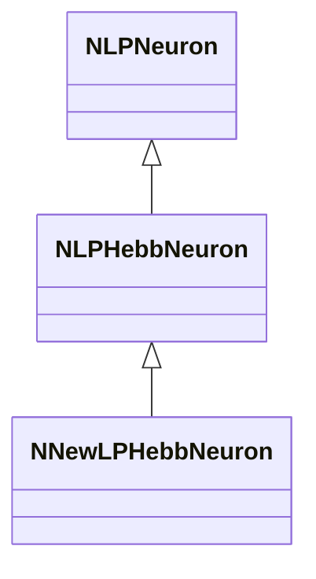
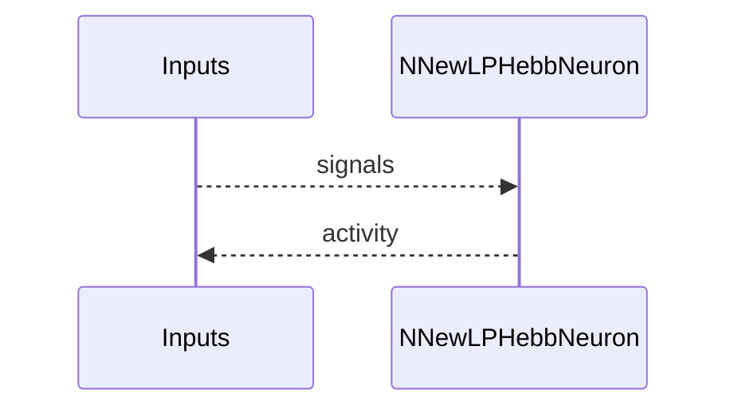
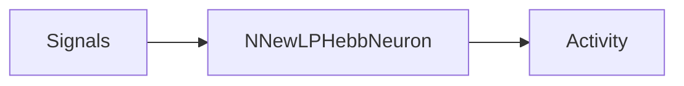

## NNewLPHebbNeuron — новая LP Hebb модель

**Класс**: `NNewLPHebbNeuron` — новая версия LP-нейрона с Hebb-пластичностью.  
**Регистрация**: `NPulseLibrary.cpp` → `UploadClass("NNewLPHebbNeuron", ...)`.  
**Storage**: `ClassName = "NNewLPHebbNeuron"`.

### Lifecycle
- **ADefault**: параметры LP + Hebb.
- **ABuild**: подключение входов/синапсов.
- **AReset**: сброс.
- **ACalculate**: LP-активация + Hebb-обновление (новая реализация).

### I/O
- Вход: сигналы/токи.
- Выход: активность/спайк.



Пояснение: диаграмма классов показывает место компонента в иерархии и ключевые связи.



Пояснение: диаграмма последовательности показывает типовой сценарий взаимодействия и порядок вызовов.



Пояснение: блок-схема показывает поток данных/сигналов (входы → компонент → выходы).

### Config snippet

```ini
[Component]
ClassName = NNewLPHebbNeuron
Name = NewLPHebb1
```

---

## NNewLPHebbNeuron — new LP Hebbian neuron (EN)

New LP neuron with Hebbian plasticity.


Description: this class diagram shows the component position in the type hierarchy and key relations.


Description: this sequence diagram shows a typical runtime interaction and call order.


Description: this flowchart shows the data/signal flow (inputs → component → outputs).
