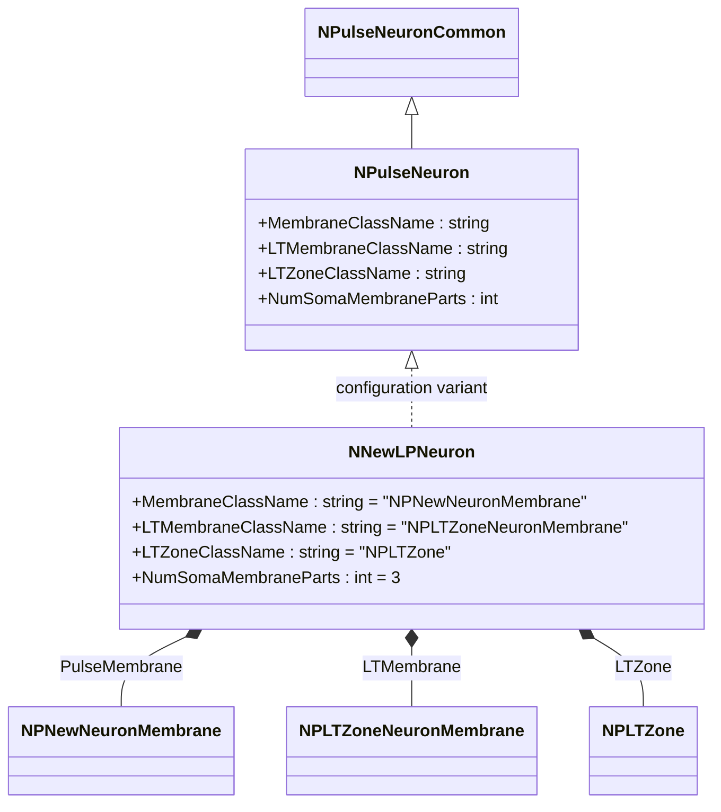
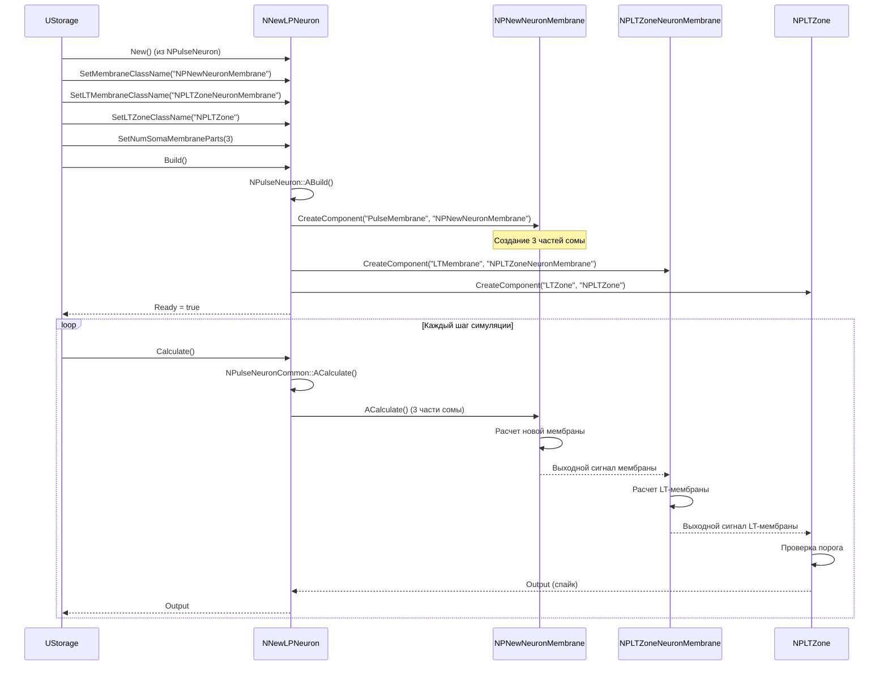
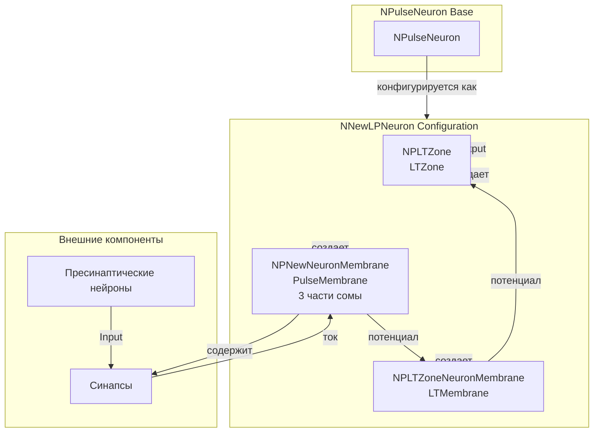
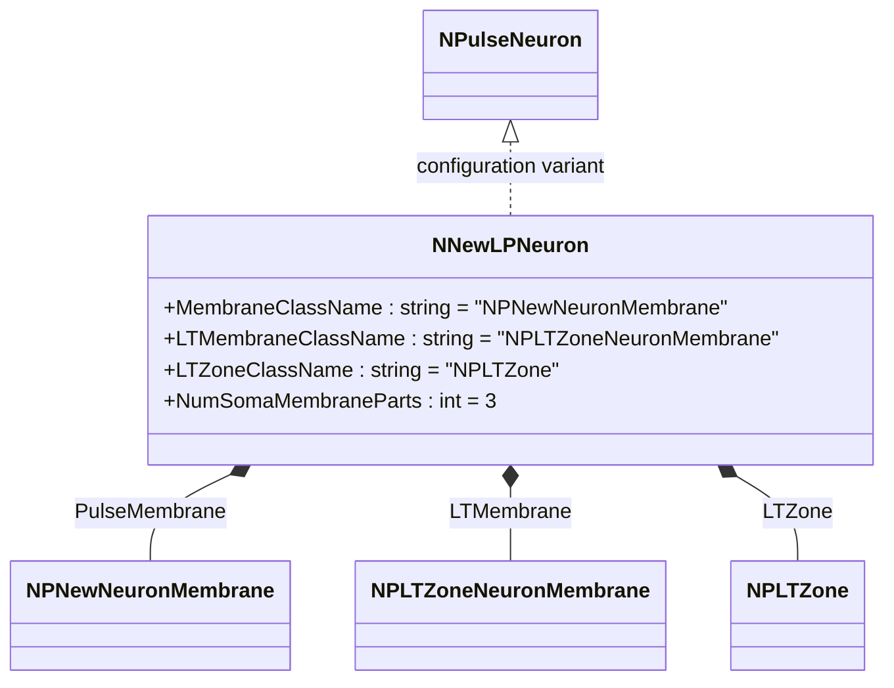
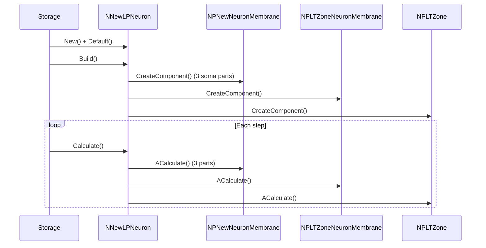
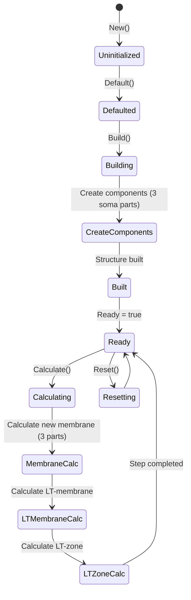
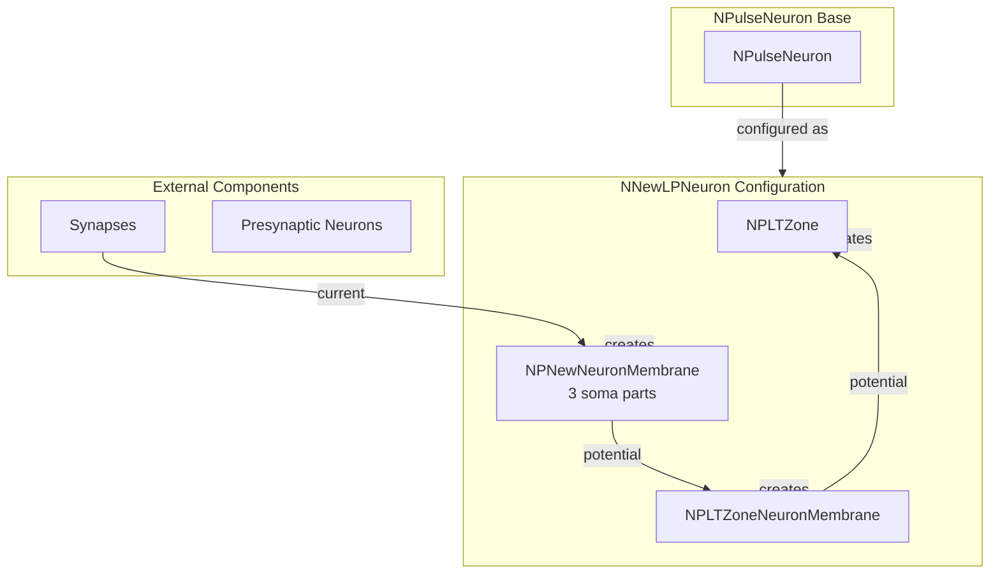

# NNewLPNeuron — новый крупный импульсный нейрон

## RU

### Назначение

**Класс**: `NNewLPNeuron` — конфигурационный вариант нового крупного импульсного нейрона с улучшенной архитектурой.  
**Регистрация**: `NPulseLibrary.cpp` → `UploadClass("NNewLPNeuron", ...)`.  
**Storage-инстансы**: `ClassName = "NNewLPNeuron"` в `Bin/Configs/*/Model_*.xml`.

`NNewLPNeuron` является конфигурационным вариантом базового класса `NPulseNeuron` с новой архитектурой мембраны и LT-зоны. Создается из `NPulseNeuron` с настройками:
- `NumSomaMembraneParts = 3` — три части сомы
- `MembraneClassName = "NPNewNeuronMembrane"` — новая мембрана нейрона
- `LTMembraneClassName = "NPLTZoneNeuronMembrane"` — новая LT-мембрана нейрона
- `LTZoneClassName = "NPLTZone"` — стандартная LT-зона

Новая архитектура использует улучшенные мембраны для более точного моделирования крупных нейронов.

**Использование:** Эксперименты с улучшенной архитектурой крупных нейронов

### UML-диаграмма классов



**Иерархия наследования:**
- `NPulseNeuronCommon` — общий импульсный нейрон
- `NPulseNeuron` — импульсный нейрон с параметрами структурирования
- `NNewLPNeuron` — конфигурационный вариант с новой архитектурой

**Внутренняя структура:**
- **PulseMembrane** (`NPNewNeuronMembrane`) — новая мембрана нейрона (3 части сомы)
- **LTMembrane** (`NPLTZoneNeuronMembrane`) — новая LT-мембрана нейрона
- **LTZone** (`NPLTZone`) — стандартная LT-зона

### UML-диаграмма последовательности



**Жизненный цикл:**
1. **Создание**: `NNewLPNeuron` создается из `NPulseNeuron` с настройкой параметров
2. **Настройка**: Устанавливается новая архитектура мембраны и LT-зоны, три части сомы
3. **Сборка**: Автоматически создается структура нейрона с новой мембраной (3 части), LT-мембраной и LT-зоной
4. **Расчет**: На каждом шаге рассчитываются новая мембрана (3 части), LT-мембрана и LT-зона

### UML-диаграмма состояний

```mermaid
stateDiagram-v2
    [*] --> Uninitialized: New()
    Uninitialized --> Defaulted: Default()
    Defaulted --> Configuring: Настройка New архитектуры
    Configuring --> SetNewParams: SetMembraneClassName("NPNewNeuronMembrane")<br/>SetLTMembraneClassName("NPLTZoneNeuronMembrane")<br/>SetNumSomaMembraneParts(3)
    SetNewParams --> Building: Build()
    Building --> BuildBase: NPulseNeuron::ABuild()
    BuildBase --> CreateMembrane: Создание NPNewNeuronMembrane (3 части)
    CreateMembrane --> CreateLTMembrane: Создание NPLTZoneNeuronMembrane
    CreateLTMembrane --> CreateLTZone: Создание NPLTZone
    CreateLTZone --> Built: Структура создана
    Built --> Ready: Ready = true
    Ready --> Calculating: Calculate()
    Calculating --> MembraneCalc: Расчет новой мембраны (3 части)
    MembraneCalc --> LTMembraneCalc: Расчет LT-мембраны
    LTMembraneCalc --> LTZoneCalc: Расчет LT-зоны
    LTZoneCalc --> Ready: Шаг завершен
    Ready --> Resetting: Reset()
    Resetting --> Ready: Состояния сброшены
```

**Состояния:**
- **Uninitialized** — создан, но не инициализирован
- **Defaulted** — параметры установлены по умолчанию
- **Configuring** — настройка параметров для новой архитектуры
- **SetNewParams** — установка параметров (новая мембрана, LT-мембрана, три части сомы)
- **Building** — выполняется сборка структуры
- **BuildBase** — сборка базовой структуры нейрона
- **CreateMembrane** — создание новой мембраны с тремя частями сомы
- **CreateLTMembrane** — создание LT-мембраны
- **CreateLTZone** — создание LT-зоны
- **Built** — структура нейрона построена
- **Ready** — готов к выполнению расчетов
- **Calculating** — выполняется расчет нейрона
- **MembraneCalc** — расчет новой мембраны (три части сомы)
- **LTMembraneCalc** — расчет LT-мембраны
- **LTZoneCalc** — расчет LT-зоны
- **Resetting** — выполняется сброс состояний

### UML-диаграмма активности

```mermaid
flowchart TD
    Start([Start Calculate]) --> CallBase[NPulseNeuronCommon::ACalculate]
    CallBase --> CalcMembrane[Расчет NPNewNeuronMembrane (3 части сомы)]
    CalcMembrane --> CalcChannels[Расчет каналов новой мембраны]
    CalcChannels --> CalcSynapses[Расчет синапсов]
    CalcSynapses --> CalcLTMembrane[Расчет NPLTZoneNeuronMembrane]
    CalcLTMembrane --> CalcLTChannels[Расчет LT-каналов]
    CalcLTChannels --> CalcLTZone[Расчет NPLTZone]
    CalcLTZone --> CheckThreshold{Порог достигнут?}
    CheckThreshold -->|Да| GenerateSpike[Генерация спайка]
    CheckThreshold -->|Нет| UpdateOutput[Обновление Output]
    GenerateSpike --> UpdateOutput
    UpdateOutput --> End([End])
```

**Алгоритм расчета:**
1. Вызов базового расчета нейрона (`NPulseNeuronCommon::ACalculate`)
2. Расчет новой мембраны (`NPNewNeuronMembrane`) с тремя частями сомы, каналами и синапсами
3. Расчет LT-мембраны (`NPLTZoneNeuronMembrane`) с LT-каналами
4. Расчет LT-зоны (`NPLTZone`) и проверка порога
5. Генерация спайка при достижении порога

### UML-диаграмма компонентов



**Зависимости:**
- **Базовый класс**: `NPulseNeuron` (конфигурационный вариант)
- **Внутренние компоненты**: `NPNewNeuronMembrane` (новая мембрана с 3 частями сомы), `NPLTZoneNeuronMembrane` (LT-мембрана), `NPLTZone` (LT-зона)
- **Внешние компоненты**: синапсы, пресинаптические нейроны

### Свойства

`NNewLPNeuron` использует все свойства базового класса `NPulseNeuron` с параметрами:
- `MembraneClassName = "NPNewNeuronMembrane"` — новая мембрана нейрона
- `LTMembraneClassName = "NPLTZoneNeuronMembrane"` — новая LT-мембрана нейрона
- `LTZoneClassName = "NPLTZone"` — стандартная LT-зона
- `NumSomaMembraneParts = 3` — три части сомы

### Методы

`NNewLPNeuron` использует все методы базового класса `NPulseNeuron`.

### Примеры использования

#### Пример 1: Создание нового LP-нейрона в коде C++

```cpp
// Создание нового крупного нейрона
auto neuron = storage->CreateComponent("NNewLPNeuron");
neuron->SetName("NewLPNeuron");

// Инициализация (использует параметры по умолчанию)
neuron->Default();

// Сборка (автоматически создает NPNewNeuronMembrane с 3 частями сомы, NPLTZoneNeuronMembrane, NPLTZone)
neuron->Build();

// Использование
for (int step = 0; step < 1000; step++) {
    neuron->Calculate();
}
```

#### Пример 2: Конфигурация XML

```xml
<NewLPNeuron1 Class="NNewLPNeuron">
    <Parameters>
        <!-- Параметры наследуются от NPulseNeuron -->
    </Parameters>
</NewLPNeuron1>
```

### Использование в конфигурациях

`NNewLPNeuron` используется в экспериментах с улучшенной архитектурой крупных нейронов:

- **Новая архитектура**: `Bin/Configs/!OldConfigs/*/Model_*.xml` (где используется новая архитектура мембран для крупных нейронов)
- **Улучшенное моделирование**: эксперименты с более точными мембранами для крупных нейронов

**Типичные значения параметров:**
- **MembraneClassName**: "NPNewNeuronMembrane" (новая мембрана)
- **LTMembraneClassName**: "NPLTZoneNeuronMembrane" (новая LT-мембрана)
- **LTZoneClassName**: "NPLTZone" (стандартная LT-зона)
- **NumSomaMembraneParts**: 3 (три части сомы для крупных нейронов)

**Особенности:**
- Три части сомы: крупные нейроны имеют более сложную структуру с тремя частями сомы
- Новая архитектура: использует улучшенные мембраны для более точного моделирования
- LT-мембрана: отдельная мембрана для LT-зоны с оптимизированными каналами

## Источники

См. [Literature-References.md](../Literature-References.md): **[A]**, **4**, **25**, **29**.

### См. также

- [`NPulseNeuron`](NPulseNeuron.md) — импульсный нейрон с параметрами структурирования
- [`NLPNeuron`](NLPNeuron.md) — базовый LP-нейрон
- [`NNewSPNeuron`](NNewSPNeuron.md) — новый мелкий нейрон
- [`NPNewNeuronMembrane`](NPNewNeuronMembrane.md) — новая мембрана нейрона
- [`NPLTZoneNeuronMembrane`](NPLTZoneNeuronMembrane.md) — мембрана нейрона с LT-зоной
- [Architecture.md](../Architecture.md) — архитектура библиотеки

---

## EN

### Purpose

**Class**: `NNewLPNeuron` — configuration variant of new large spiking neuron with improved architecture.  
**Registration**: `NPulseLibrary.cpp` → `UploadClass("NNewLPNeuron", ...)`.  
**Instances**: `ClassName = "NNewLPNeuron"` in `Bin/Configs/*/Model_*.xml`.

`NNewLPNeuron` is a configuration variant of the base class `NPulseNeuron` with new membrane and LT-zone architecture. Created from `NPulseNeuron` with settings:
- `NumSomaMembraneParts = 3` — three soma parts
- `MembraneClassName = "NPNewNeuronMembrane"` — new neuron membrane
- `LTMembraneClassName = "NPLTZoneNeuronMembrane"` — new neuron LT-membrane
- `LTZoneClassName = "NPLTZone"` — standard LT-zone

New architecture uses improved membranes for more accurate large neuron modeling.

**Usage:** Experiments with improved architecture of large neurons

### UML Class Diagram



### UML Sequence Diagram



### UML State Diagram



### UML Activity Diagram

```mermaid
flowchart TD
    Start([Start Calculate]) --> CalcMembrane[Calculate new membrane (3 soma parts)]
    CalcMembrane --> CalcLTMembrane[Calculate LT-membrane]
    CalcLTMembrane --> CalcLTZone[Calculate LT-zone]
    CalcLTZone --> CheckThreshold{Threshold reached?}
    CheckThreshold -->|Yes| GenerateSpike[Generate spike]
    CheckThreshold -->|No| UpdateOutput[Update Output]
    GenerateSpike --> UpdateOutput
    UpdateOutput --> End([End])
```

### UML Component Diagram



### Properties

`NNewLPNeuron` uses all properties of base class `NPulseNeuron` with parameters:
- `MembraneClassName = "NPNewNeuronMembrane"` — new neuron membrane
- `LTMembraneClassName = "NPLTZoneNeuronMembrane"` — new neuron LT-membrane
- `LTZoneClassName = "NPLTZone"` — standard LT-zone
- `NumSomaMembraneParts = 3` — three soma parts

### Methods

`NNewLPNeuron` uses all methods of base class `NPulseNeuron`.

### Usage in configurations

`NNewLPNeuron` is used in experiments with improved architecture of large neurons:

- **New architecture**: `Bin/Configs/!OldConfigs/*/Model_*.xml` (where new membrane architecture is used for large neurons)
- **Improved modeling**: experiments with more accurate membranes for large neurons

**Typical parameter values:**
- **MembraneClassName**: "NPNewNeuronMembrane" (new membrane)
- **LTMembraneClassName**: "NPLTZoneNeuronMembrane" (new LT-membrane)
- **LTZoneClassName**: "NPLTZone" (standard LT-zone)
- **NumSomaMembraneParts**: 3 (three soma parts for large neurons)

**Features:**
- Three soma parts: large neurons have more complex structure with three soma parts
- New architecture: uses improved membranes for more accurate modeling
- LT-membrane: separate membrane for LT-zone with optimized channels

### References

See [Literature-References.md](../Literature-References.md): **[A]**, **4**, **25**, **29**.

### See Also

- [`NPulseNeuron`](NPulseNeuron.md) — spiking neuron with structuring parameters
- [`NLPNeuron`](NLPNeuron.md) — base LP-neuron
- [`NNewSPNeuron`](NNewSPNeuron.md) — new small neuron
- [`NPNewNeuronMembrane`](NPNewNeuronMembrane.md) — new neuron membrane
- [`NPLTZoneNeuronMembrane`](NPLTZoneNeuronMembrane.md) — neuron membrane with LT-zone
- [Architecture.md](../Architecture.md) — library architecture
