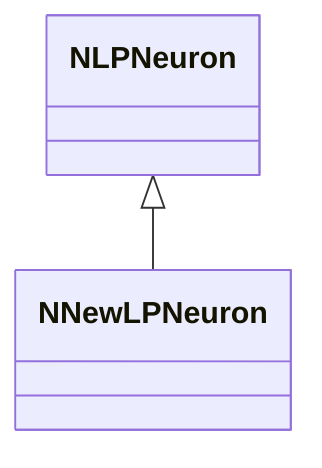
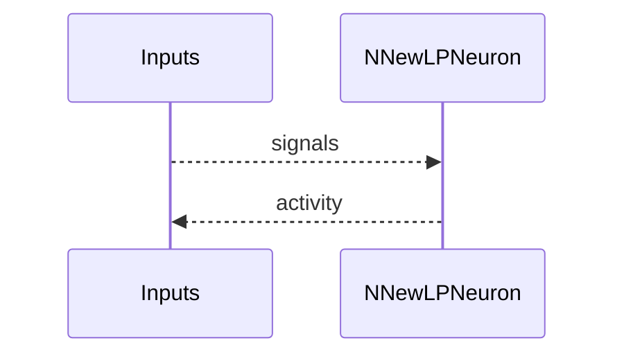
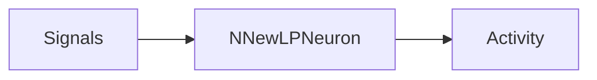

## NNewLPNeuron — новая LP модель

**Класс**: `NNewLPNeuron` — новая реализация LP-нейрона.  
**Регистрация**: `NPulseLibrary.cpp` → `UploadClass("NNewLPNeuron", ...)`.  
**Storage**: `ClassName = "NNewLPNeuron"`.

### Lifecycle
- **ADefault**: параметры LP.
- **ABuild**: подключение входов/синапсов.
- **AReset**: сброс.
- **ACalculate**: LP-активация (новая логика).

### I/O
- Вход: сигналы.
- Выход: активность/спайк.



Пояснение: диаграмма классов показывает место компонента в иерархии и ключевые связи.



Пояснение: диаграмма последовательности показывает типовой сценарий взаимодействия и порядок вызовов.



Пояснение: блок-схема показывает поток данных/сигналов (входы → компонент → выходы).

### Config snippet

```ini
[Component]
ClassName = NNewLPNeuron
Name = NewLP1
```

---

## NNewLPNeuron — new LP neuron (EN)

New LP neuron implementation.


Description: this class diagram shows the component position in the type hierarchy and key relations.


Description: this sequence diagram shows a typical runtime interaction and call order.


Description: this flowchart shows the data/signal flow (inputs → component → outputs).
